# Linux processes

Trước khi bắt đầu vào bài viết, chúng ta cùng điểm qua một số định nghĩa :

- CPU
- Socket
- Program
- Process
- Thread


# CPU 

- CPU( Central Processing Unit) là bộ xử lý trung tâm, là các mạch điện tử trong máy, nhiệm vụ của CPU là xử lý thông tin, tính toán các dữ liệu, nhận biết các thao tác của người dùng để điều khiển các hoạt động của máy tính.     

Hiện tại có 2 hãng công nghệ lớn chuyên sản xuất CPU cho máy tính để bàn và laptop lần lượt là Intel và AMD.
- Bên cạnh đó nhưng CPU dành cho điện thoại di động cũng thu hút sự đầu tư giữa các ông lớn công nghệ như Qualcom, SamSung, MediaTek, Intel..

- Từ sau 2010 đến nay, hằng năm Intel lẫn AMD đều cho ra đời nhiều sản phẩm mới đáp ứng nhu cầu hiệu năng ngày càng cao. Các dòng sản phẩm ngày càng đa dạng nhằm đáp ứng nhu cầu người dùng. Mới nhất có thể kể đến Coffee Lake, Skylake X của Intel và át chủ bài Ryzen của AMD.

## CPU gồm những gì?
- CPU được cấu thành từ hàng triệu transistor( bóng bán dẫn) được sắp xếp với nhau tạo thành một mạch điện tử.

- CPU chia làm 2 phần: Control Unit( khối điều khiển- CU) và Arithmethic Logic Unit( khối tính toàn – ALU)


- Control Unit có chức năng chính là “biên dịch” thao tác người dùng sang ngôn ngữ máy( machine language) từ đó giúp con người ra lệnh cho máy tính thông qua các thao tác.

- Arithmethic Logic Unit: giải quyết những bài toán với những con số hoặc nhưng bài toán logic. Kết quả sau đó sẽ được sử dụng để xử lý thông tin.

## Các thông số trên CPU

- Core( Nhân): các nhân của CPU sẽ đảm nhiệm những quá trình xử lý khác nhau, thông thường những CPU có càng nhiều nhân càng tốt vì điều đó sẽ giúp CPU xử lý các chương trình đa tác vụ. Tuy nhiên, chúng ta cũng nên quan tâm đến xung nhịp của mỗi nhân (GHZ ) vì nó thể hiện tốc độ xử lý của từng nhân riêng lẻ trên CPU, tất nhiên là xung càng cao CPU càng mạnh. Một điểm lưu ý rằng: tùy vào chương trình chúng ta sử dụng trên máy tính cho phép xài số lượng Core( nhân) nhất định. Với những chương trình chạy ít nhân thì các CPU ít nhân nhưng xung nhịp cao sẽ được ưu tiên hơn CPU nhiều nhân nhưng xung nhịp thấp và ngược lại.

- Thread( luồng): nếu ta tưởng tượng các core của CPU dùng để chia nhỏ công việc của 1 chương trình thì thread là dạng chia nhỏ công việc lần thứ 2.

- Cache( bộ nhớ đệm): dùng để lưu trữ các lệnh chuẩn bị được xử lý của CPU, ở đây các lệnh sẽ được xếp thành 1 hàng và tất nhiên bộ nhớ đệm càng lưu trữ được nhiều thì hiệu suất của CPU càng cao. 

Các bạn có thể xem thêm 8 lệnh hữu ích khi kiểm tra thông tin CPU trên Linux tại [đây](https://cuongquach.com/top-8-lenh-kiem-tra-thong-tin-cpu-tren-linux.html)


# Socket

- Socket CPU  là đế cắm của các CPU trên mainboard, tương thích với từng loại mainboard là các đế cắm khác nhau, từ đó sẽ phù hợp với các loại CPU khác nhau
- Socket có nhiệm vụ làm điểm tiếp xúc và cũng là giá đỡ CPU khi gắn vào Mainbaord.
- Sử dụng socket giảm thiểu được rất nhiều rủi ro trong việc làm vỡ hoặc cong các chân của CPU khi lắp đặt hoặc gỡ bỏ nó.

# Process 

- Tiến trình ( Process ) chỉ là sự thể hiện của một hoặc nhiều tác vụ liên quan đến sự thực thi trên máy tính của bạn. Nó không giống như một chương trình hoặc một lệnh. Một lệnh duy nhất thực sự có thể bắt đầu một số tiến trình cùng một lúc. Một số tiến trình độc lập với nhau và những tiến trình khác có liên quan. Lỗi của một tiến trình có thể ảnh hưởng hoặc không thể ảnh hưởng đến các tiến trình khác đang chạy trên hệ thống.

- Các tiến trình sử dụng nhiều tài nguyên hệ thống:bộ nhớ, CPU và các thiết bị ngoại vi, như máy in và màn hình,… Hệ điều hành (đặc biệt là nhân) chịu trách nhiệm phân bổ một phần thích hợp các tài nguyên này cho từng quy trình và đảm bảo việc sử dụng hệ thống được tối ưu hóa tổng thể.


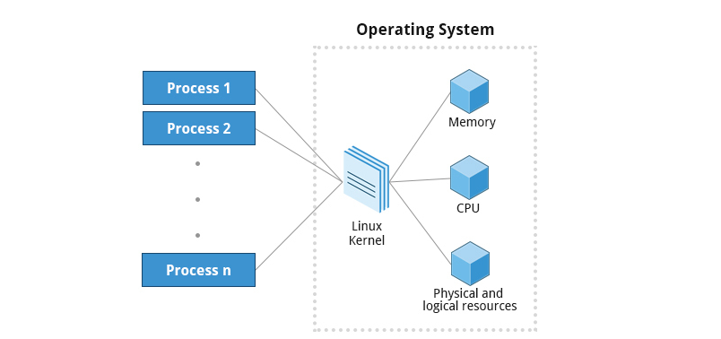

# Thread

- Thread là một đơn vị cơ bản trong CPU. Một luồng sẽ chia sẻ với các luồng khác trong cùng process về thông tin data, các dữ liệu của mình. Việc tạo ra thread giúp cho các chương trình có thể chạy được nhiều công việc cùng một lúc.

- Chúng ta có thể tham khảo khái niệm thread qua Video sau :

https://www.youtube.com/watch?v=YB5I2w-8YQ4

--------------------------


     Và sau đây chúng ta sẽ đi tìm hiểu chi tiết 


# Tổng quan tiến trình ( Process ) trong Linux


## Định nghĩa chi tiết

Những “công việc” mà hệ điều hành thực hiện gọi là tiến trình, dù tên gọi chúng khác nhau tùy vào cấu trúc hệ điều hành (batch system hay time-shared system).

Nhắc lại về định nghĩa, một process là một chương trình đang được thực thi (đang chạy). Nhưng, một chương trình không phải là một process. Vì chương trình là một file, hay một folder bị động nằm trên máy; Trong khi đó, một process là một chương trình đang hoạt động (đang chạy, đã được tải lên bộ nhớ chính để hoạt động).

Một chương trình có thể có hai (hay nhiều) process đang chạy, nhưng chúng được coi là hai (hay nhiều) quá trình độc lập với nhau.

Hơn những thế, một process có thể là môi trường thực thi (execution environment) cho những dòng code khác. Ví dụ: các chương trình của Java cần được chạy trong Java Virtual Machine (JVM).

## Các trạng thái của một tiến trình ( process )

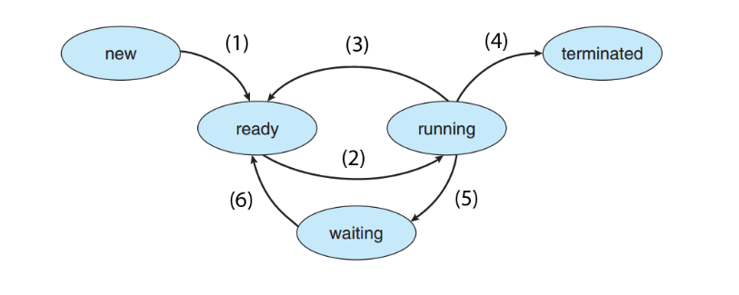

Trong đó : 
- New: process mới được tạo.
- Running: process đang được thực thi/ chạy.
- Waiting: process đợi I/O hoặc tín hiệu nào đó.
- Ready: process sẵn sàng được CPU chạy.
- Terminated: process hoàn thành việc.

***Note***: Những process của một chương trình cần phải tải lên bộ nhớ chính (cụ thể là RAM) trước khi được CPU nhận và thực hiện những yêu cầu của chương trình.


Các bước chuyển quá trình của process:

- (1): Những process được chương trình tạo ra, được sắp vào “hàng chờ” (hay còn gọi là stack).

- (2): Process được CPU thấy và thực thi.

- (3): Khi process quá bự, CPU phải nhả để thực hiện process khác. (bạn có thể tìm hiểu các thuật toán xử lý process của CPU)

- (4): Khi process đã được thực hiện xong.

- (5): Khi process đang thực hiện và yêu cầu I/O hay các tín hiệu khác. (ví dụ bạn cần file word in ra, process sẽ phải nói cho CPU, CPU gửi tín hiệu cho máy in, máy in in ra rồi báo lại CPU. Trong thời gian đó, để tiết kiệm thời gian, process này sẽ được chuyển qua trạng thái chờ, cho process khác vào thực hiện)

- (6): Sau khi I/O hay tín hiệu đã đến, process được sắp lại vào “hàng chờ”, chờ thực thi.

## PROCESS CONTROL BLOCK (PCB) ( NÂNG CAO )

Mỗi process khi tạo ra sẽ được lưu thông tin tại một PCB tương ứng.

Những thông tin được chứa trong PCB:

- Trạng thái của process: 1 trong 5 trạng thái được liệt kê bên trên
- Bộ đếm (program counter): chứa địa chỉ (hay trong ngôn ngữ lập trình C, ta gọi nó là con trỏ/ pointer) đến lệnh cần thực thi tiếp theo
- Thanh ghi CPU: có kiểu khác nhau tùy vào kiến trúc máy tính
- Thông tin định thời CPU: độ ưu tiên của các process, quy định process nào thì thực thi trước
- Thông tin quản lý bộ nhớ: tùy hệ thống bộ nhớ của từng hệ điều hành
- Trạng thái của các tín hiệu I/O: danh sách các I/O được sử dụng bởi các process
- Thông tin về số lượng CPU, thời gian sử dụng thực tế, thời gian process được giữ CPU tối đa

Đã nhắc đến quá trình (process), bạn nên tìm hiểu thêm về định thời, khả năng CPU của chúng ta kiểm soát các process ấy `bộ định thời` .

[Link tham khảo](https://stream-hub.com/ipc-la-gi#mcetoc_1c5gr0hunk)
[Nguồn](https://stream-hub.com/process-la-gi#mcetoc_1c5gpok5qf)

## Các loại tiến trình

Một cửa sổ terminal là một quá trình. Nó cho phép chúng ta thực thi các chương trình và truy cập tài nguyên trong môi trường.

Các quy trình có thể có nhiều loại khác nhau tùy theo nhiệm vụ đang được thực hiện. Dưới đây là một số loại quy trình khác nhau, cùng với các mô tả và ví dụ của chúng:

| Loại tiến trình | Mô tả |
|-----------------|-------|
|Tiến trình tương tác|Được bắt đầu bởi người dùng, tại một dòng lệnh hoặc thông qua giao diện đồ hoạ như biểu tượng hay lựa chọn trong menu. Ví dụ: bash,firefox top,...|
|Tiến trình batch | Các tiến trình tự động được lên lịch bắt đầu kết nối và sau đó ngắt kết nối khỏi terminal. Các tác dụ này được sắp xếp và hoạt động trên cơ sở FIFO. Ví dụ: updatedb
|Daemons|Máy chủ sử lý chạy liên tục. Nhiều người được khởi chạy trong quá trình khởi động hệ thống. Sau đó, chờ người dùng hoặc yêu cầu hệ thống cho biết rằng dịch vụ nào là bắt buộc. Ví dụ: http,sshd,...
|Threads|Các tiến trình nhẹ là các tác vụ chạy dưới tiến trình chính nhằm chia sẻ bộ nhớ và các tài nguyên khác, được hệ thống lên lịch và chạy trên cơ sở cá nhân. Một luồng có thể kết thúc mà không kết thúc toàn bộ tiến trình và một tiến trình có thể tạo các luồng mới bất cứ lúc nào. Ví dụ: firefox,gnome-terminal-server,...|
|Kernel threads|Các tác vụ nhân mà người dùng không bắt đầu cũng không chấm dứt và có ít quyền kiểm soát. Chúng có thể thực hiện các hành động như di chuyển một luồng từ CPU này sang CPU khác hoặc đảm bảo các hoạt động đầu vào / đầu ra vào đĩa được hoàn thành. Ví dụ: kthreadd,migration,ksoftirqd,...|


## Tiến trình Scheduling và States

Một nhân quan trọng được gọi là bộ Scheduler liên tục thay đổi các quá trình bật và tắt CPU, chia sẻ thời gian theo mức độ ưu tiên tương đối, cần bao nhiêu thời gian và bao nhiêu đã được cấp cho một tác vụ.

Khi một tiến trình ở trạng thái đang chạy, có nghĩa nó đang thực thi các hướng dẫn trên CPU hoặc đang chờ để được cấp một phần thời gian để nó có thể thực thi. Tất cả các tiến trình trong trạng thái này nằm trên hàng đợi chạy và trên máy tính có nhiều CPU hoặc lõi, có một hàng đợi chạy trên mỗi máy.Tuy nhiên, tiến tình ở trạng thái ngủ. Tất cả các tiến trình trong trạng thái này đang ngồi trên hàng đợi chờ người dùng thực hiện một lệnh nào đó.

Có một số trạng thái tiến trình ít thường xuyên hơn, khi một quá trình đang kết thúc. Đôi khi, một quá trình con hoàn thành, nhưng quá trình mẹ của nó không hỏi về trạng thái của nó. Một tiến trình như vậy được cho là ở trạng thái zombie; nó không thực sự sống nhưng vẫn xuất hiện trong danh sách các quy trình của hệ thống.

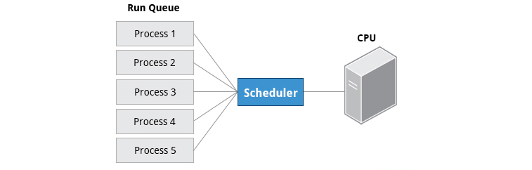

## Tiến trình và Thread ID

Hệ điều hành Linux theo dõi các tiến trình bằng cách gán cho mỗi số ID tiến tình (PID) duy nhất. Bộ vi xử lý được sử dụng để theo dõi trạng thái tiến trình, sử dụng CPU, sử dụng bộ nhớ… Các bộ vi xử lý mới thường được chỉ định theo thứ tự tăng dần khi các quy trình được sinh ra. Do đó, PID 1 biểu thị quá trình init (quá trình khởi tạo) và các tiến trình dần dần được gán số cao hơn.

Bảng các loại PID:

| Loại ID | Miêu tả |
|---------|---------|
|ID tiến trình (PID)|Số ID tiến trình là duy nhất|
|Mẹ của tiến tình ID (PPID) | Tiến trình Paren nếu tiến trình mẹ chết thì PPID sẽ tìm đến tiến trình mẹ khác |
| Thread ID (TID) | Số ID thread giống như PID cho các tiến trình đơn luồng. Đối với một tiến trình đa luồng thì mỗi luồng chia sẻ cùng một PID nhưng TID là duy nhất |

## ID người dùng và ID nhóm

Nhiều người dùng có thể truy vào một hệ thống cùng một lúc và mỗi người dùng có thể chạy nhiều tiến trình khác nhau. Hệ điều hành Linux sẽ xác định người dùng bắt đầu tiến trình bằng ID người dùng (RUID) được gán riêng cho mỗi người dùng.

Mỗi người dùng được xác định quyền truy cập bằng UID hiệu quả (EUID). EUID có thể hoặc không thể giống như RUID.

Người dùng có thể được phân loại thành các nhóm khác nhau. Mỗi nhóm được xác định bởi ID nhóm (RGID). Quyền truy cập của nhóm được xác định bởi ID nhóm hiệu quả (EGID). Mỗi người dùng có thể là thành viên của một hoặc nhiều nhóm.

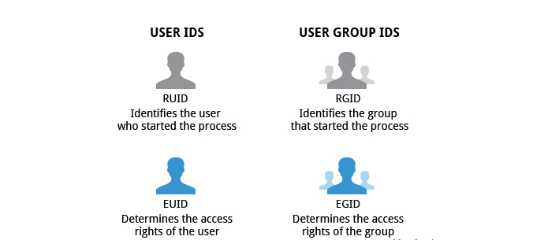


## Ưu tiên trong Linux ( nice )

Tại một thời điểm, nhiều tiến trình đang chạy trong một hệ thống. Tuy nhiên, CPU thực sự chỉ có thể chứa một nhiệm vụ tại một thời điểm. Một số tiến trình quan trọng hơn các tiến trình khác, vì vậy hệ điều hành Linux cho phép chúng ta thiết lập và thao tác ưu tiên tiến trình. Các tiến trình ưu tiên cao hơn được cấp nhiều thời gian hơn trên CPU.

Mức độ ưu tiên cho một tiến trình có thể đặt bằng cách chỉ định một giá trị cho tiến trình. Giá trị càng thấp, mức độ ưu tiên càng cao. Giá trị thấp được dùng gán cho các tiến trình quan trọng, các giá trị cao được gán cho các tiến trình có thể chờ lâu hơn. Một tiến trình có giá trị cao cho phép các quy trình khác được thực hiện trước. Trong trong hệ điều hành Linux, giá trị thấp là -20 đại diện cho mức ưu tiên cao nhất và 19 đại diện cho mức thấp nhất. Chúng ta có thể chỉ định ưu tiên thời gian cho các tác vụ quan trọng với thời gian.

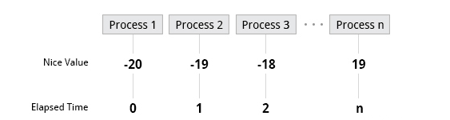


## Tiến trình vs Chương trình (Process vs Program)

Chương trình (program) là một file chứa những thông tin, mô tả cách tạo thành một tiến trình (process) ở runtime. Những thông tin này bao gồm :

- **Binary format identification** : Mô tả định dạng của file thực thi, cho phép kernel dịch những thông tin còn lại trong file. Trước đây, có 2 định dạng được sử dụng rộng rãi cho file thực thi UNIX là kiểu a.out ("assembler output"), và kiểu COFF (Common Object File Format). Ngày nay thì hầu hết các hệ UNIX ( gồm Linux) triển khai mô hình Executable and Linking Format (ELF).

- **Machine-language instructions** : Tập lệnh mã máy.

- **Program entry-point address** : Chỉ ra vị trí của lệnh chương trình bắt đầu chạy.

- **Data**: Chứa những giá trị dùng cho khởi tạo biến, hằng cho chương trình.

- **Symbol and relocation tables** : Mô tả các vị trí, tên của hàm và biến trong chương trình. Những bảng ngày được sử dụng cho nhiều mục đích, bao gồm dynamic linking, debug...

- **Shared-library and dynamic-linking information** : Danh sách cách shared library mà chương trình cần để chạy và đường dẫn của dynamic linker sử dụng để load những thư viện này.

- **Other information**: Những thông tin khác...

Một program có thể sử dụng để tạo thành nhiều process nhưng những process được tạo này chỉ chạy một chương trình giống nhau.

Có thể nói rằng một tiến trình (process) là một thực thể trừu tượng, được định nghĩa bởi kernel, được kernel cấp tài nguyên để thực thi chương trình (program).

***Bảng so sánh sự khác nhau*** :

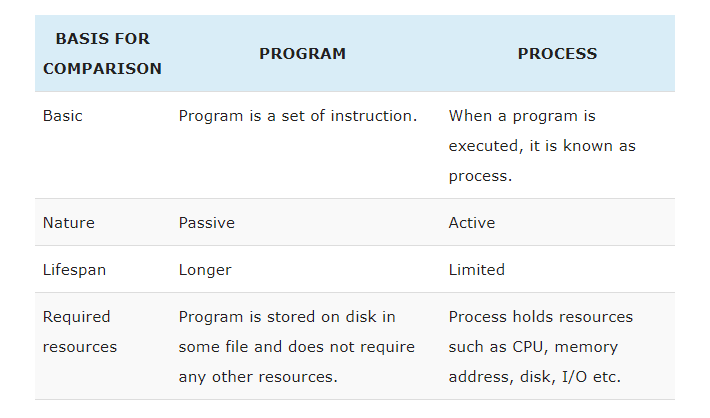

### Key Differences Between Program and Process
1. A program is a definite group of ordered operations that are to be performed. On the other hand, an instance of a program being executed is a process.
2. The nature of the program is passive as it does nothing until it gets executed whereas a process is dynamic or active in nature as it is an instance of executing program and perform the specific action.
3. A program has a longer lifespan because it is stored in the memory until it is not manually deleted while a process has a shorter and limited lifespan because it gets terminated after the completion of the task.
4. The resource requirement is much higher in case of a process; it could need processing, memory, I/O resources for the successful execution. In contrast, a program just requires memory for storage.


Các bạn có thể xem [tài liệu gốc](https://techdifferences.com/difference-between-program-and-process.html#KeyDifferences)

## Sự khác nhau giữa Process và Thread

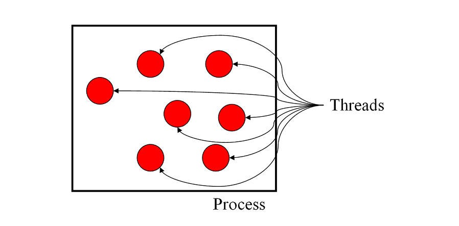

- Process là quá trình hoạt động của một ứng dụng. Điều đó nghĩa là gì? Có thể lấy một ví dụ như sau, khi bạn click đúp chuột vào biểu tượng MS Word, một process chạy ứng dụng Word được khởi tạo. Thread là một bước điều hành bên trong một process. Một process dĩ nhiên có thể chứa nhiều thread bên trong nó. Khi chúng ta chạy ứng dụng Word, hệ điều hành tạo ra một process  và bắt đầu chạy các thread chính của process đó.

- Điểm quan trọng nhất cần chú ý là một thread có thể làm bất cứ nhiệm vụ gì một process có thể làm. Tuy nhiên, vì một process có thể chứa nhiều thread, mỗi thread có thể coi như là một process nhỏ. Vậy, điểm khác biệt mấu chốt giữa thread và process là công việc mỗi cái thường phải làm. 

- Một điểm khác biệt nữa đó là nhiều thread nằm trong cùng một process dùng một không gian bộ nhớ giống nhau, trong khi process thì không. Điều này cho phép các thread đọc và viết cùng một kiểu cấu trúc và dữ liệu, giao tiếp dễ dàng giữa các thread với nhau. Giao thức giữa các process, hay còn gọi là IPC (inter-process communication) thì tương đối phức tạp bởi các dữ liệu có tính tập trung sâu hơn.

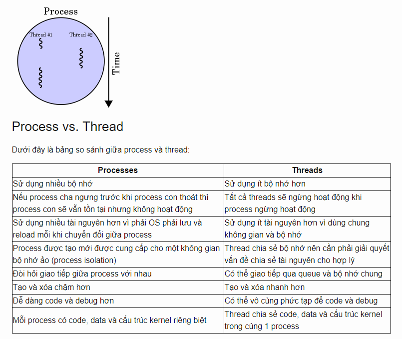

## Kết hợp Program + Process + Thread

Sau đây là cách một chương trình được sử lý :

Giả sử chúng ta có một chương trình đơn giản là lấy 3 cộng 4 và lưu kết quả vào bộ nhớ. Chương trình này bao gồm các bước như sau:

1. Lấy số 3
2. Lấy số 4
3. Thực hiện phép tính cộng 2 số trên
4. Lưu kết quả vào bộ nhớ

Mỗi bước này sẽ được chuyển thành ngôn ngữ máy hay là mã nhị phân (binary code) để máy có thể hiểu được và xử lý. Mỗi bước đã được chuyển thành binary code được gọi là một chỉ thị (instruction). Tập hợp những instruction này được gọi là một instruction set. Khi bạn bắt đầu chạy chương trình trên, việc đầu tiên là những dòng instruction này sẽ được load lên RAM. Các dòng instruction này được chuyển qua CPU thông qua một hệ thống phụ chuyển dữ liệu (bus). Một khi chương trình được chuyển vào CPU, các instruction này sẽ được đưa vào một hàng (queue) để CPU xử lý tuần tự.


Giờ chúng ta có thể tưởng tượng instruction set này tạo thành 1 chương trình (application) và tập hợp của instruction kết hợp với nhau tạo thành một tác vụ (task) cụ thể. Khi được thực thi thì tác vụ này là một process.

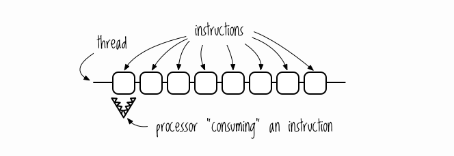


Nguồn và tham khảo của Process :

https://techmaster.vn/posts/33604/su-khac-nhau-giua-process-va-thread

https://kipalog.com/posts/Process-trong-Linux

https://blogd.net/linux/gioi-thieu-ve-tien-trinh-va-thuoc-tinh-cua-tien-trinh-tren-linux/

http://tech.zigexn.vn/infrastructure/2016/process-vs-thread


# Tổng quan về luồng (thread) trong Linux

Đa số chương trình ngày nay hỗ trợ đa luồng (multithread). Ví dụ như một process của chương trình Word có thể có 1 luồng (thread) để nhận chỉ thị từ người dùng qua bàn phím và hiển thị lên màn hình, 1 thread để thực hiện chức năng in tài liệu ở background, 1 thread được dùng để lưu xuống ổ cứng.

Có thể tưởng tượng thread là một phiên bản nhẹ hơn của process. Một thread có thể thực hiện bất cứ tác vụ gì mà một process có thể thực hiện. Tuy vậy, do thread nằm trong process, những tác vụ của thread thực hiện thường nhỏ hơn. Điểm khác biệt cơ bản giữa thread và process là nhiều thread nằm trong cùng một process dùng một không gian bộ nhớ giống nhau, trong khi process thì được phân bổ riêng biệt. Điều này cho phép các thread đọc và viết cùng một kiểu cấu trúc và dữ liệu, giao tiếp dễ dàng giữa các thread với nhau. Việc có nhiều thead chạy song song trong cùng một process giúp multitasking nhẹ và dễ dàng hơn.


## Sự khác nhau giữa single-threaded và multithreaded

***Overview***
- Phần lớn các phần mềm trong máy tính hiện đại đều có dạng multithreaded, tức đa luồng. Các ứng dụng trong máy tính đa phần đều chạy một process nhất định cùng với đó là nhiều luồng chạy bên trong. Bạn có thể hình dung thế này: trong một trang web, một thread sẽ đảm nhiệm việc chạy hình ảnh và bài viết, và một thread khác cùng lúc sẽ có nhiệm vụ nhận thêm các dữ liệu vào web.
- Các ứng dụng cũng có thể được thiết kế để tận dụng khả năng xử lý trên các hệ thống multicore, giúp thực hiện nhiều CPU task song song.
- Trong nhiều trường hợp nhất định, một ứng dụng có thể được yêu cầu thực hiện (request) nhiều nhiệm vụ giống nhau. Ví dụ: một web server nhận lệnh từ khách hàng nhấn vào trang web, hình ảnh, âm thanh… và tất nhiên, một web server có thể phải nhận rất nhiều (hàng nghìn, hàng triệu cho đến hàng trăm triệu) yêu cầu cùng một lúc. Vì thế, nếu web server đó chạy theo dạng single-threaded, tức là chỉ một khách hàng được giải quyết yêu cầu trong 1 khoảng thời gian, thì những khách hàng khác sẽ phải đợi rất lâu để mình có thể access vào trang web. Trước khi có multithreaded, một cách giải quyết cho vấn đề này đó là web server sẽ chạy một process nhận nhiều request cùng một lúc, và với một request được tiếp nhận, nó sẽ tạo ra một process khác để giải quyết request đó. Điều này sẽ tốn rất nhiều thời gian và nguồn lực. Multithreads giúp giải quyết vấn đề này. Thay vì tạo ra một process mới y chang process đang có, chúng ta chỉ cần một process duy nhất có nhiều luồng cùng chạy với nhau. Khi server nhận được một yêu cầu từ khách hàng, nó sẽ tạo ra một luồng mới để luồng đó giải quyết yêu cầu nhận được, trong khi đó, server sẽ quay lại với những yêu cầu tiếp theo.
- Bên cạnh đó, thread cũng rất quan trọng đối với hệ thống RPC (Remote Procedure Call – hệ thống cho phép quá trình truyền tin giữa các tiến trình IPC – interprocess communication được diễn ra). Và hiển nhiên, RPC servers cũng là một dạng multithreaded. Khi một server PRC nhận được một tin nhắn, nó sẽ tạo ra một thread để giải quyết tin nhắn đó. Multithreaded giúp RPC có thể giải quyết nhiều yêu cầu cùng một lúc.
- Và cuối cùng, multithreaded cũng được sử dụng rộng rãi trong nhân hệ hiều hành (operating system kernels). Có nhiều luồng hoạt động trong một kernel, và mỗi luồng đảm nhiệm một công việc riêng biệt, như quản lý thiết bị, quản lý bộ nhớ, quản lý ngắt… Một vài ví dụ có thể đưa ra như là: Solaris có một set những thread chuyên quản lý bộ xử lý ngắt; hay Linux có một kernel thread chuyên quản lý những vùng bộ nhớ trống trong hệ thống.

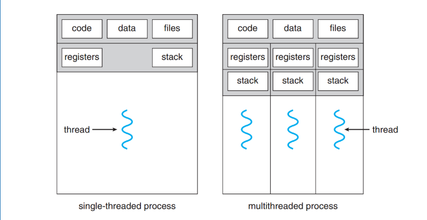

## Lợi ích của Multithreaded
- **Khả năng đáp ứng** : Multithread giúp các ứng dụng tương tác có thể hoạt động tốt hơn vì ngay cả khi một phần chương trình bị block hoặc cần một thời gian dài để hoạt động, chương trình nhìn chung vẫn có thể chạy. Và điều này giúp người dùng hài lòng hơn vì khả năng đáp ứng cao của ứng dụng. Điều này đặc biệt đúng với người dùng là các designer. Bạn có thể hình dung: khi một chương trình đang chạy, và người dùng nhấn vào một nút lệnh mà cần rất nhiều thời gian để process, thì một hệ thống dạng single-threaded sẽ không kích hoạt bất kì hoạt động nào khác cho tới khi hoàn thành bước lệnh vừa rồi. Ngược lại, ứng dụng dạng multithread sẽ không làm gián đoạn quá nhiều quá trình của người dùng vì trong khi một thread được kích hoạt để thực hiện bước lệnh kia, một thread khác sẽ được kích hoạt để thực hiện bất kì bước lệnh ít tốn thời gian hơn mà người dùng yêu cầu.
- **Khả năng chia sẻ tài nguyên** : các tiến trình chỉ có thể chia sẻ dữ liệu thông qua các kĩ thuật như shared memory (vùng bộ nhớ chung) và message sharing (chia sẻ tin). Các kĩ thuật này chỉ có thể được thiết lập bởi lập trình viên. Tuy nhiên, các luồng chia sẻ thông tin hoặc tài nguyên theo hệ thống được mặc định. Lợi ích của việc chia sẻ code và dữ liệu là nó giúp ứng dụng có nhiều threads hoạt động trong một vùng địa chỉ chung.
- **Tiết kiệm** : việc cung cấp tài nguyên và dữ liệu cho quá trình tạo process rất tốn kém. Và vì threads tự động chia sẻ data cho process mà nó thuộc về, việc tạo các thread cho việc context-switch sẽ giúp tiết kiệm chi phí rất nhiều. Không chỉ chi phí mà còn là thời gian, vì việc tạo một process mới sẽ lâu hơn nhiều so với tạo một thread mới. Như trong Solaris, tạo ra một process lâu hơn 30 lần so với tạo ra một thread trong process đó, và lâu hơn 5 lần so với tạo một context-switch.
- **Scalability** : Lợi ích của multithreaded thể hiện rõ hơn trong kiến trúc đa xử lý (multiprocessor architecture), vì multithread giúp các threads hoạt động song song trong các lõi xử lý khác nhau, trong khi đối với tiến trình dạng single-threaded, một thread chỉ có thể chạy trên một bộ xử lý, không quan trọng việc có bao nhiêu thread trong hệ thống hiện tại.

## Hyperthreading là gì

Hyperthreading là khi CPU có khả năng cho một core đơn thực thi nhiều hơn một luồng cùng một lúc. Hyperthreading có khả năng tăng mức độ xử lí/ tạo nhiều luồng hơn cho nhiều core, nhưng không phải tất cả core.. Tùy thuộc vào một nhiệm vụ đang làm, hyperthreading có thể giúp mang lại hiệu năng khác nhau trong từng core khác nhau, nhưng đôi khi tổng thể có thể hụt hiệu năng.

Kết luận, Hyperthreading là khi CPU có khả năng cho một core đơn thực thi nhiều hơn một luồng cùng một lúc.

[Bài viết đầy đủ](https://stream-hub.com/thread-la-gi#mcetoc_1c5gpns842f)

# Các lệnh để quản lý tiến trình 

## top

top – command top là đơn giản và phổ biến nhất để hiển thị những process chiếm nhiều tài nguyên máy tính nhất.  Khi thực hiện command  top trong terminal, chúng ta sẽ thấy cửa sổ tương tự như sau :

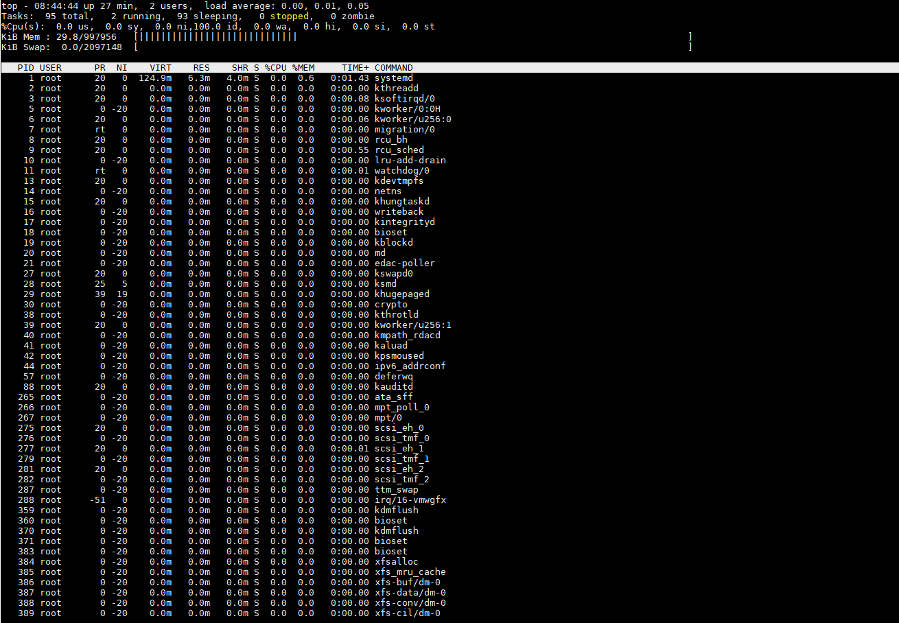

Hiển thị processes liên quan đến một user, bạn có thể dùng lệnh sau: top -u user

top là ứng dụng, sau khi thực hiện lệnh, một layout hiện lên và danh sách process đang liên tục được cập nhật mỗi giây. Layout mới này có thể tương tác với bàn phím. Ví dụ :
 
| Option                           | Description |
|----------------------------------|-------------|
| h hoặc ? | Hiện cửa sổ help với các câu lệnh hữu dụng |
| space |  Nhấn space trên bàn phím sẽ cập nhật bảng process ngay lập tức thay vì phải chờ vài giây
|f |  Thêm trường mới để hiển thị layout hoặc xóa những field nhất định vì vậy bạn sẽ không thấy nó hiển thị
| q | thoát ứng dụng top hoặc mở thêm cửa sổ mới của ứng dụng top. Ví dụ,sau khi dùng feature f
| l | Bật/tắt thông tin trung bình tải và thời gian uptime
| m | Bật/tắt thông tin bộ nhớ
|P (Shift + p) | Sắp xếp process bằng CPU usage.
|s | Đổi đột trễ giữa các lần refresh (Bạn sẽ được hỏi bao nhiêu giây).


Với command top, bạn có thể dùng các tùy chọn sau, ví dụ:


| Option                           | Description |
|----------------------------------|-------------|
| -d delay | xác định độ trễ
| -n number | refresh trang bao nhiêu lần, sau đó thoát.
| -p pid | chỉ hiển thị và giám sát process với đúng process ID được chọn
| -q | refresh mà không có delay.

## ps 

ps – Một command hữu ích khác để hiển thị processes trong Linux. Sau đây là một số tùy chọn thường được dùng với command ps :


| Option                           | Description |
|----------------------------------|-------------|
|-e | Hiện tất cả processes.
|-f | Toàn bộ danh sách được format.
|-r | Chỉ hiện những process đang chạy.
|-u | chỉ định username (hoặc nhiều usernames).
|–pid | lọc dựa trên PID.
|–ppid | lọc dựa trên parent PID.
|-C | lọc dựa trên tên và command.
|-o | Hiện thông tin liên quan đến từ khóa cách nhau bởi khoảng trắng hoặc dấu phẩy
|-l | hiển thị thông tin đầy đủ tiến trình.
| –aux | liệt kê danh sách các tiến trình đang chạy cùng các thông tin của nó.

Sau đây là một số ví dụ bạn có thể dùng với command `ps`:

| Option                           | Description |
|----------------------------------|-------------|
|ps -ef | Liệt kê process đang chạy bây giờ. (Một command tương tự là ps aux)
|ps -f -u user1,user2 | Sẽ hiển thị tất cả process dựa rên UID (user id hoặc username).
|ps -f –pid id | Hiển thị tất cả processes dựa trên process ID (pid). Điền PID hoặc PPID thay vào chỗ id. Có thể được dùng với PPID để lọc process dựa trên parent ID.
|ps -C command/name | Lọc Processes dựa trên tên của nó hoặc command
|ps aux –sort=-pcpu,+pmem | Hiển thị process đang dùng nhiều tài nguyên nhất của CPU.
|ps -e -o pid,uname,pcpu,pmem,comm | Được dùng để lọc column được chỉ định.
|ps -e -o pid,comm,etime | Việc này sẽ hiển thị thời gian đã được dùng của process.


- Muốn xem PID của tiến trình, ta dùng lệnh :

    pgrep <tiến trình>

## pstree

Pstree là một lệnh mạnh mẽ và hữu ích để hiển thị các tiến trình đang chạy trong Linux. Giống như lệnh ps, nó hiển thị tất cả các tiến trình hiện đang hoạt động trên hệ thống đăng nhập của bạn. Sự khác biệt chính là khi chạy lệnh pstree, các tiến trình được tổ chức thành kiểu sắp xếp dạng cây thay vì danh sách như sử dụng lệnh ps. Cây này sẽ hiển thị các quá trình trong mối quan hệ cha-con. Tiến trình cha là tiến trình tạo ra tất cả các tiến trình con bên dưới nó.

Cấu trúc `pstree` tương tự như các thư mục phân cấp trên hệ thống Unix giống như Linux và macOS. Sử dụng cấu trúc này, bạn có thể nhanh chóng điều hướng qua cây tiến trình để xem tiến trình nào tạo hoặc kiểm soát lẫn nhau, cho phép loại bỏ chính xác các tiến trình gây ra vấn đề hoặc không được kiểm soát bằng lệnh kill.


- Lệnh sau đây sẽ hiển thị danh sách tất cả các tiến trình đang chạy trên hệ thống. Tiến trình trên cùng (trong trường hợp này là systemd) là tiến trình cha. Các tiến trình bên dưới nó được tạo hoặc mở thông qua systemd. Và các nhánh từ các tiến trình này thể hiện mối quan hệ tương tự, giống như cây gia đình

     pstree

Dưới đây là cấu trúc cơ bản của pstree :

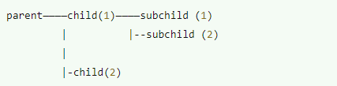


- Sử dụng pstree với option -p

     pstree -p

với option này, nó sẽ ghi ra PID của tiến trình

- Hiển thị các phần của cây tiến trình

     pstree -s <sổ PID>

- hiển thị bất cứ lệnh nào được thực thi theo tài khoản của người dùng đó, qua chương trình người dùng chạy hoặc qua lệnh họ thực hiện

     pstree <tên người dùng>

Bạn cũng có thể xem các tiến trình được sinh ra theo người dùng hiện tại. Nếu có nhiều người dùng trên hệ thống, bạn sẽ biết được ai đang làm gì trên hệ thống của mình. Để xem các tiến trình được sinh ra bởi người dùng, chỉ cần gõ tên người dùng sau lệnh chính.

## kill


Lệnh kill : Linux có lệnh kill để thực hiện gửi tín hiệu tới tiến trình.
Các tín hiệu có thể là:
| Tín hiệu | Ý nghĩa |Options|
|-------|---------------------|-------------|
| SIGHUP | Hangup (gọi lại tiến trình) |       kill -1
| SIGINT | Ngắt từ bàn phím (Ctrl+C) |        kill -2
|SIGKILL  | Hủy tiến trình        |                     kill -9
|SIGTERM  | Kết thúc tiến trình    |               kill -15      (mặc định với lệnh kill)
|SIGSTOP |  Dừng tiến trình.  |                    kill -17,19,23


Muốn hủy tiến trình gõ:

     kill -9 <PID của tiến trình>


Trước tiên bạn cần phải biết PID của tiến trình cần dừng thông qua lệnh ps. Xin nhắc lại chỉ có super-user mới có quyền dừng tất cả các tiến trình, còn người sử dụng chỉ được dừng các tiến trình của mình. Sau đó, ta sử dụng lệnh
Tham số –9 là gửi tín hiệu dừng không điều kiện chương trình.
Một tiến trình có thể sinh ra các tiến trình con trong quá trình hoạt động của mình. Nếu bạn dừng tiến trình
cha, các tiến trình con cũng sẽ dừng theo, nhưng không tức thì . Vì vậy phải đợi một khoảng thời gian và
sau đó kiểm tra lại xem tất cả các tiến trình con có dừng đúng hay không. Trong một số hãn hữu các trường
hợp, tiến trình có lỗi nặng không dừng được, phương pháp cuối cùng là khởi động lại máy.

## nice

Một câu lệnh hữu dụng khác để quản lý process là NICE. Cơ bản, nó cho bạn ưu tiên process nào quan trọng trong trường hợp bạn chạy nhiều. Bằng cách này, máy tính sẽ biết process nào quan trong hơn và sẽ chạy chúng trước. Process với độ ưu tiên thấp hơn sẽ chỉ chạy khi nó được yêu cầu (nếu CPU power hết mức sử dụng) Command này có thể cho gia trị từ -20 đến 19. Giá trị càng thấp, thì độ ưu tiên càng cao. Mặc định tất cả process là 0. Cấu trúc của lệnh sẽ như sau:

     nice -n ‘Nice value’ <process name>

Nếu có một vài process đang chạy trên hệ thống, bạn có thể cần giá trị khác hơn giá trị đang có, bạn có thể dùng lệnh:

     renice ‘Nice value’ -p <PID> 


# CRON - task scheduling

Cron là một tiện ích cho phép thực hiện các tác vụ một cách tự động theo định kỳ, ở chế độ nền của hệ thống. Crontab (CRON TABLE) là một file chứa đựng bảng biểu (schedule) của các entries được chạy.

## How Cron work

Một cron schedule đơn giản là một text file. Mỗi người dùng có một cron schedule riêng, file này thường nằm ở `/var/spool/cron`. Crontab files không cho phép bạn tạo hoặc chỉnh sửa trực tiếp với bất kỳ trình text editor nào, trừ phi bạn dùng lệnh crontab.

Một số lệnh thường dùng:

```
crontab -e: tạo hoặc chỉnh sửa file crontab 
crontab -l: hiển thị file crontab 
crontab -r: xóa file crontab
```


## Cấu trúc của crontab

Một crontab file có 5 trường xác định thời gian, cuối cùng là lệnh sẽ được chạy định kỳ, cấu trúc như sau:

Tổng quát về crontab
 Học VPS / Basics / Tổng quát về crontab
 23/03/2014  Luân Trần  Basics  33,121 Views  128 Comments
CHIA SẺ BÀI VIẾT:
FACEBOOK
GOOGLE+
EMAIL
1. Cron là gì?
Cron là một tiện ích cho phép thực hiện các tác vụ một cách tự động theo định kỳ, ở chế độ nền của hệ thống. Crontab (CRON TABle) là một file chứa đựng bảng biểu (schedule) của các entries được chạy.

Học VPS mới bổ sung công cụ tạo Crontab với giao diện trực quan, rất dễ sử dụng. Mời các bạn tham khảo.
2. Cron làm việc thế nào?
Một cron schedule đơn giản là một text file. Mỗi người dùng có một cron schedule riêng, file này thường nằm ở /var/spool/cron. Crontab files không cho phép bạn tạo hoặc chỉnh sửa trực tiếp với bất kỳ trình text editor nào, trừ phi bạn dùng lệnh crontab.

Một số lệnh thường dùng:

crontab -e: tạo hoặc chỉnh sửa file crontab 
crontab -l: hiển thị file crontab 
crontab -r: xóa file crontab
Hầu hết tất cả VPS đều được cài đặt sẵn crontab, tuy nhiên vẫn có trường hợp VPS không có. Nếu bạn sử dụng lệnh crontab -l mà thấy output trả lại -bash: crontab: command not found thì cần tự cài crontab thủ công.

Cài đặt crontab
Sử dụng lệnh:

yum install cronie
Start crontab và tự động chạy mỗi khi reboot:

service crond start
chkconfig crond on
3. Cấu trúc của crontab
Một crontab file có 5 trường xác định thời gian, cuối cùng là lệnh sẽ được chạy định kỳ, cấu trúc như sau:
```

*     *     *     *     *     command to be executed
-     -     -     -     -
|     |     |     |     |
|     |     |     |     +----- day of week (0 - 6) (Sunday=0)
|     |     |     +------- month (1 - 12)
|     |     +--------- day of month (1 - 31)
|     +----------- hour (0 - 23)
+------------- min (0 - 59)
```

Nếu một cột được gán ký tự *, nó có nghĩa là tác vụ sau đó sẽ được chạy ở mọi giá trị cho cột đó.

