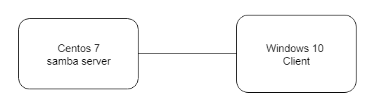
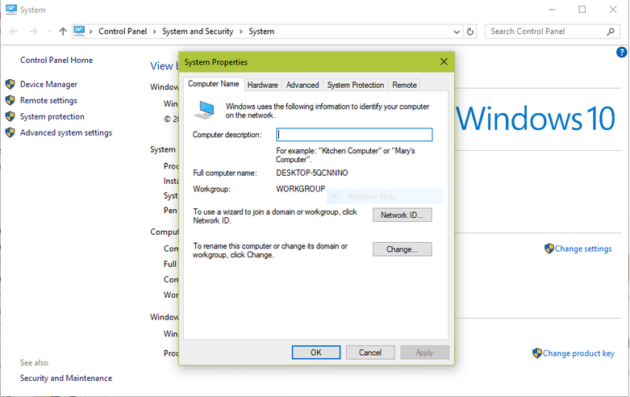
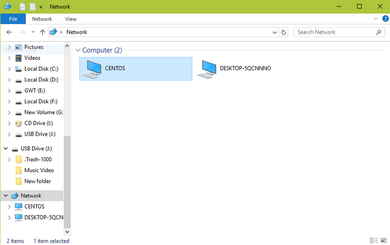
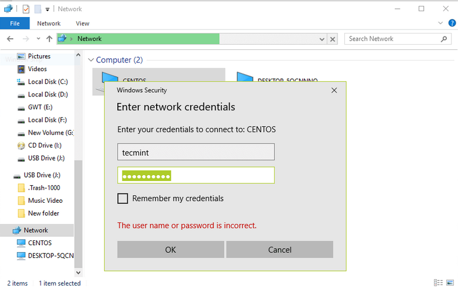

# Samba Server

## 1. Giới thiệu

Samba là dịch vụ của hệ điều hành Linux, chạy trên nền giao thức SMB (Server Message Block) cho phép chia sẻ file và máy in với các máy chạy Windows. SMB là giao thức được các hệ điều hành của Microsoft sử dụng để chia sẻ dữ liệu qua mạng. Linux Samba cũng dựa vào giao thức SMB để viết ra một số tiến trình điển hình như smbd, nmbd, để “nói chuyện “ với các hệ điều hành của Microsoft để người dùng có thể làm việc với máy Linux qua Network Neighborhood.

## 2. Mô hình




## 3. Hướng dẫn cấu hình Samba trên máy Centos

### Chuẩn bị 
- 1 máy centos 7, 1 máy win
- sử đụng chung dải mạng NAT

### Cấu hình Samba Sever

1. Tiến hành cài đặt các gói Samba:
```
# yum install samba samba-client samba-common
```

2. Cho phép Samba dùng tường lửa
```
# firewall-cmd --permanent --zone=public --add-service=samba
# firewall-cmd --reload
```

Hoặc mở port cho Samba kết nối :
```
firewall-cmd --permanent --add-port=137/tcp
firewall-cmd --permanent --add-port=138/tcp
firewall-cmd --permanent --add-port=139/tcp
firewall-cmd --permanent --add-port=445/tcp
firewall-cmd --permanent --add-port=901/tcp
firewall-cmd --reload
```


### Cấu hình máy Win

- Chuột phải vào

`This PC` hoặc `My Computer` → `Properties` → `Advanced system settings` → `Computer Name`.



Đổi workgroup của máy Win là WORKGROUP

- Tắt hết tường lửa trên máy win


## `A. Truy cập chế độ công khai`
## Cấu hình trên Centos

### 1. Chạy lệnh sau để lưu 1 bản config.
```
# cp /etc/samba/smb.conf /etc/samba/smb.conf.orig
```

### 2. Tạo một thư mục cần share và phân quyền cho thư mục
```
# mkdir -p /srv/samba/anonymous
# chmod -R 0775 /srv/samba/anonymous
# chown -R nobody:nobody /srv/samba/anonymous
```

### 3. Cho phép truy cập từ SELinux

Tắt SELinux.
```
vim /etc/sysconfig/selinux 
```
Đặt giá trị `SELINUX = disabled`.

Reset máy để thay đổi có hiệu lực.

Cách khác : 

Điểm lưu ý thêm là trong CentOS hệ thống bảo mật sử dụng bởi nhiều lớp, thư mục tuan hay public gì đó do ta tạo ra cũng cần phải báo cho SELinux biết rằng nó không phải là thư mục hệ thống được bảo vệ mà là thư mục quản lý bởi samba, điều này được thực hiện bằng lệnh
```
chcon –t samba_share_t  /<path-filename>
```

Ở demo này tôi làm như sau 

```
chcon -t samba_share_t /srv/samba/anonymous
```

### 4. Chỉnh sửa file config
```
# vim /etc/samba/smb.conf
```

Nội dung file config
```
[global]
	workgroup = WORKGROUP
	netbios name = centos
	security = user
[Anonymous]
	comment = Anonymous File Server Share
	path = /srv/samba/anonymous
	browsable =yes
	writable = yes
	guest ok = yes
	read only = no
	force user = nobody
```

### 5. Kiểm tra samba setting bằng câu lệnh sau
```
# testparm
```

Nó sẽ in ra nội dung tương tự như sau
```
Load smb config files from /etc/samba/smb.conf
rlimit_max: increasing rlimit_max (1024) to minimum Windows limit (16384)
Processing section "[homes]"
Processing section "[printers]"
Processing section "[print$]"
Processing section "[Anonymous]"
Loaded services file OK.
Server role: ROLE_STANDALONE

Press enter to see a dump of your service definitions

# Global parameters
[global]
	netbios name = centos
	printcap name = cups
	security = USER
	idmap config * : backend = tdb
	cups options = raw
[homes]
	comment = Home Directories
	browseable = No
	inherit acls = Yes
	read only = No
	valid users = %S %D%w%S
[printers]
	comment = All Printers
	path = /var/tmp
	browseable = No
	printable = Yes
	create mask = 0600
[print$]
	comment = Printer Drivers
	path = /var/lib/samba/drivers
	create mask = 0664
	directory mask = 0775
	write list = root
[Anonymous]
 	comment = Anonymous File Server Share
	path = /srv/samba/anonymous
	force user = nobody
	guest ok = Yes
	read only = No
```

### 6. Bật và khởi động Samba Services để nó chạy tự động sau mỗi lần khởi động máy 
```
# systemctl enable smb.service
# systemctl enable nmb.service
# systemctl start smb.service
# systemctl start nmb.service
```

# Test thử trên máy win

- Bấm tổ hợp phím `Win + R`

- Nhập địa chỉ IP của Sever
```
\\192.168.43.168
```




Và chúng ta sẽ tìm thấy máy Centos như trong ảnh. Truy cập và thử tạo file

## `B. Truy cập chế độ bảo mật`
## Cấu hình trên Centos

Đầu tiên tạo người dùng và group muốn để bảo mật, sau đó đặt mật khẩu truy cập cho từng người dùng
```
# groupadd smbgrp
# usermod tecmint -aG smbgrp
# smbpasswd -a tecmint
```

Sau đó tạo và phân quyền thư mục cho file 
```
# mkdir -p /srv/samba/secure
# chmod -R 0770 /srv/samba/secure
# chown -R root:smbgrp /srv/samba/secure
# chcon -t samba_share_t /srv/samba/secure
```

Sau đó chỉnh sửa file config
```
# vim /etc/samba/smb.conf
```
Nội dung file config
```
[Secure]
	comment = Secure File Server Share
	path =  /srv/samba/secure
	valid users = @smbgrp
	guest ok = no
	writable = yes
	browsable = yes
```

Kiểm tra
``` 
testparm
```

Khởi động lại dịch vụ
```
# systemctl restart smb.service
# systemctl restart nmb.service
```
Kiểm tra xem kết nối trên Win đã hoạt động

- Bấm tổ hợp phím `Win + R`

- Nhập địa chỉ IP của Sever
```
\\192.168.43.168
```




Và chúng ta đã bảo mât được thư mục Secure.


Nguồn tham khảo:

https://github.com/thanh474/thuc-tap/blob/master/tim-hieu-va-lab-samba/samba.md


https://uet.vnu.edu.vn/~thanhld/lects/netos/Tuan%2015%20-%20SMB.html


https://www.tecmint.com/install-samba4-on-centos-7-for-file-sharing-on-windows/


https://www.tecmint.com/install-samba4-on-centos-7-for-file-sharing-on-windows/


https://sites.google.com/site/anhtt01/bai-viet/centos/samba-server


https://www.youtube.com/watch?v=oRHSrnQueak


https://www.youtube.com/watch?v=dxUWco22_uk


