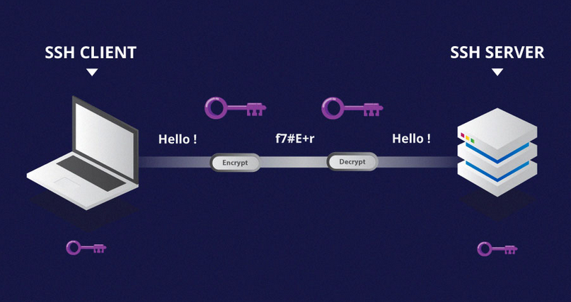
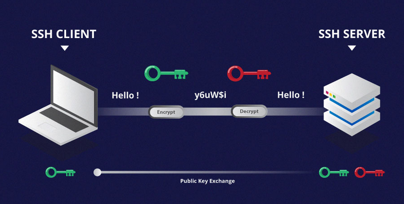
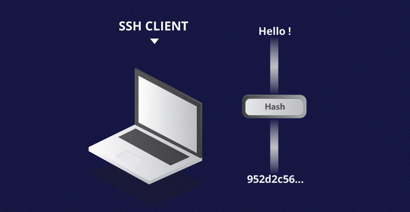
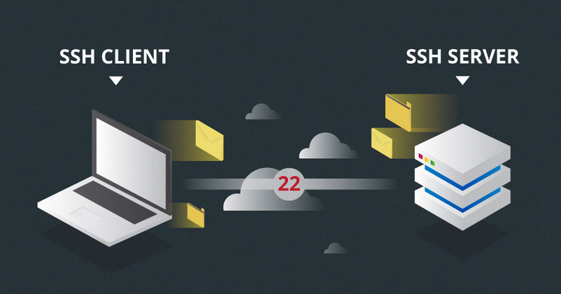
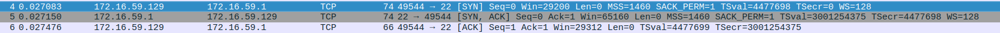
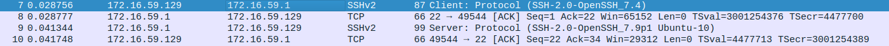
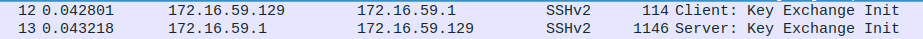
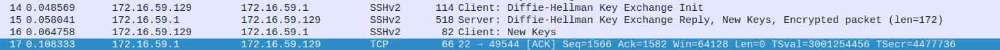
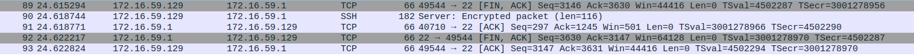

# Security

By default, Linux has several account types in order to isolate processes and workloads:

1. root
2. system
3. normal
4. network

For a safe environment, it is advised to grant the minimum privileges possible and necessary to accounts, and remove inactive accounts. The `last` command, which shows the last time each user logged into the system, can be used to help identify potentially inactive accounts which are candidates for system removal.
```
[root@localhost ~]# last
root     pts/0        172.16.59.1      Tue Jul  2 22:14   still logged in   
reboot   system boot  3.10.0-957.el7.x Tue Jul  2 22:05 - 22:15  (00:10)    
root     pts/0        172.16.59.1      Tue Jul  2 11:00 - crash  (11:04)    
root     tty1                          Tue Jul  2 10:58 - 11:53  (00:55)    
reboot   system boot  3.10.0-957.el7.x Tue Jul  2 10:55 - 22:15  (11:20)    
root     pts/1        172.16.59.1      Tue Jul  2 00:32 - down   (00:47)    
root     pts/0        172.16.59.1      Mon Jul  1 23:32 - down   (01:48)    
root     tty1                          Mon Jul  1 23:31 - 01:20  (01:48)    
reboot   system boot  3.10.0-957.el7.x Mon Jul  1 23:31 - 01:20  (01:48)    
root     pts/0        172.16.59.1      Mon Jul  1 22:09 - crash  (01:21)    
root     tty1                          Mon Jul  1 22:08 - 23:30  (01:21)    
reboot   system boot  3.10.0-957.el7.x Mon Jul  1 22:07 - 01:20  (03:12)    
root     pts/0        172.16.59.1      Sun Jun 30 23:34 - 23:41  (00:07)    
root     tty1                          Sun Jun 30 23:32 - 23:50  (00:18)    
reboot   system boot  3.10.0-957.el7.x Sun Jun 30 23:31 - 23:51  (00:19)    
reboot   system boot  3.10.0-957.el7.x Sun Jun 30 23:29 - 23:51  (00:21)    
root     tty1                          Sun Jun 30 22:45 - 23:08  (00:23)    
reboot   system boot  3.10.0-957.el7.x Sun Jun 30 22:45 - 23:08  (00:23)    

wtmp begins Sun Jun 30 22:45:18 2019
```

The *`root`* account is the most privileged account on a Linux/UNIX system. This account has the ability to carry out all facets of system administration, including adding accounts, changing user passwords, examining log files, installing software, etc.

A regular account user can perform some operations requiring special permissions; however, the system configuration must allow such abilities to be exercised. Running a network client or sharing a file over the network are operations that do not require a root account.

In Linux you can use either `su` or `sudo` commands to temporarily grant root access to a normal user; these methods are actually quite different. 


## When using the su command:

- to elevate the privilege, you need to enter the root password. Giving the root password to a normal user should never, ever be done
- once a user elevates to the root account, the normal user can do anything that the root user can do for as long as the user wants, without being asked again for a password
- there are limited logging features

## When using the sudo command:

- you need to enter the user’s password and not the root password
    
- what the user is allowed to do can be precisely controlled and limited; by default the
    user will either always have to keep giving their password to do further operations with sudo, or can avoid doing so for a configurable time interval
- detailed logging features are available


## The sudo command

Granting privileges using the `sudo` command is less dangerous than `su` and it should be preferred. By default, `sudo` must be enabled on a per-user basis. However, some distributions (such as Ubuntu) enable it by default for at least one main user, or give this as an installation option. To execute just one command with root privilege type `sudo <command>`. When the command is complete you will return to being a normal unprivileged user. The `sudo` configuration files are stored in the `/etc/sudoers` file and in the `/etc/sudoers.d/` directory. By default, that directory is empty.

The `sudo` command has the ability to keep track of unsuccessful attempts at gaining root access. An authentication failure message would appear in the `/var/log/secure` log file when trying to execute sudo bash without successfully authenticating the user
```
[root@localhost ~]# tail /var/log/secure
Jul  2 11:53:21 localhost polkitd[5960]: Registered Authentication Agent for unix-process:7682:346172 (system bus name :1.29 [/usr/bin/pkttyagent --notify-fd 5 --fallback], object path /org/freedesktop/PolicyKit1/AuthenticationAgent, locale en_US.UTF-8)
Jul  2 22:05:23 localhost polkitd[6039]: Loading rules from directory /etc/polkit-1/rules.d
Jul  2 22:05:23 localhost polkitd[6039]: Loading rules from directory /usr/share/polkit-1/rules.d
Jul  2 22:05:23 localhost polkitd[6039]: Finished loading, compiling and executing 2 rules
Jul  2 22:05:23 localhost polkitd[6039]: Acquired the name org.freedesktop.PolicyKit1 on the system bus
Jul  2 22:05:27 localhost sshd[7107]: Server listening on 0.0.0.0 port 22.
Jul  2 22:05:27 localhost sshd[7107]: Server listening on :: port 22.
Jul  2 22:14:25 localhost sshd[7432]: Address 172.16.59.1 maps to whoami, but this does not map back to the address - POSSIBLE BREAK-IN ATTEMPT!
Jul  2 22:14:28 localhost sshd[7432]: Accepted password for root from 172.16.59.1 port 57966 ssh2
Jul  2 22:14:28 localhost sshd[7432]: pam_unix(sshd:session): session opened for user root by (uid=0)
[root@localhost ~]# 
```


# SSH

## SSH là gì
SSH, hoặc được gọi là Secure Shell, là một giao thức điều khiển từ xa cho phép người dùng kiểm soát và chỉnh sửa server từ xa qua Internet. Dịch vụ được tạo ra nhằm thay thế cho trình Telnet vốn không có mã hóa và sử dụng kỹ thuật cryptographic để đảm bảo tất cả giao tiếp gửi tới và gửi từ server từ xa diễn ra trong tình trạng mã hóa. Nó cung cấp thuật toán để chứng thực người dùng từ xa, chuyển input từ client tới host, và relay kết quả trả về tới khách hàng


## SSH hoạt động như thế nào
Lệnh SSH có 3 phần:
```
ssh {user}@{host}
```
SSH key command cho hệ thống biết là bạn muốn mở một kết nối được mã hóa Secure Shell Connection. {user} đại diện cho tài khoản người dùng bạn muốn dùng để truy cập. Ví dụ, bạn muốn truy cập user root, thì thay root tại đây. User root là user quản trị hệ thống với toàn quyền để chỉnh sửa bất kỳ điều gì trên hệ thống. {host} đại diện cho máy tính bạn muốn dùng để truy cập. Nó có thể là một địa chỉ IP (ví dụ 244.235.23.19) hoặc một tên miền (ví dụ, www.xyzdomain.com).

Khi bạn nhấn enter, nó sẽ hỏi bạn nhập mật khẩu tương ứng cho tài khoản. Khi bạn gõ, bạn sẽ không thấy bất kỳ dấu hiệu nào trên màn hình, nhưng nếu bạn gõ đúng mật khẩu và nhấn enter, bạn sẽ vào được hệ thống và nhận thông báo đăng nhập thành công.

## Hiểu về nhiều kỹ thuật mã hóa khác nhau
Lợi điểm khiến SSH hơn hẵn những giao thức cũ là khả năng mã hóa và truyền tải dữ liệu an toàn giữa host và client. Host đại diện cho máy chủ  từ xa bạn muốn kết nối tới và client là máy tính của bạn dùng để truy cập tới host. Có 3 cách khác nhau để mã hóa qua SSH:

1. Symmetrical encryption
2. Asymmetrical encryption
3. Hashing.

### Symmetric Encryption
Symmetric encryption là một dạng mã hóa sử dụng secret key ở cả 2 chiều mã hóa và giải mã tin nhắnb bởi cả host và client. Có nghĩa là ai nắm được khóa đều có thể giải mã tin nhắn trong quá trình chuyền.




Symmetrical encryption thường được gọi là `shared key` hoặc `shared secret` encryption. Vì có một khóa được sử dụng, hoặc một cặp khóa (pair key) mà một khóa có thể được tính ra từ khóa kia.

Symmetric keys được sử dụng để mã hóa toàn bộ liên lạc trong phiên giao dịch SSH. Cả client và server tạo chung một key bí mật như là một phương thức thỏa thuận, và key đó không được tiết lộ cho bên thứ ba. Quá trình tạo symmetric key được thực hiện bởi `key exchange algorithm`.

Điều khiến cho thuật toán an toàn là vì key không được truyền giữa client và host. Thay vào đó, cả 2 máy tính chia sẽ thông tin chung và sau đó sử dụng chúng để tính ra khóa bí mật.Kể cả có máy khác bắt được thông tin chung, nó cũng không thể tính ra key bí mật vì không biết được thuật toán tạo key.

Cũng phải lưu ý rằng, tuy nhiên secret token được sử dụng cho một phiên SSH nhất định, và được tạo bởi chứng thực của client. Khi key đã được tạo, tất cả packets truyền giữa 2 máy phải được mã hóa bởi private key. Việc này bao gồm cả mật khẩu điền vào bởi user, vì vậy mật khẩu cũng có thể được bảo vệ khỏi những “lính bắn tỉa packet” trên mạng.

Một số loại symmetrical encryption ciphers đã tồn tại, bao gồm, những không giới hạn AES (Advanced Encryption Standard), CAST128, Blowfish etc. Trước khi thiết lập kết nối an toàn client và host sẽ đồng ý loại cipher nào được sử dụng, bằng cách xuất bản danh sách cyphers được hỗ trợ để tham khảo. Cypher thích hợp nhất ở phía client sẽ hiển thị trong danh sách của host như là một bidirectional cypher.

Ví dụ, nếu 2 máy Ubuntu 14.04 LTS liên lạc với nhau qua SSH, nó sẽ sử dụng `aes128-ctr` làm cipher mặc định.

### Asymmetric Encryption

Không giống với symmetrical encryption, asymmetrical encryption sử dụng 2 khóa khác nhau để mã hóa và giải mã. 2 khóa này được gọi là `public key` và `private key`. Cả 2 hình thành nên một cặp khóa là `public-private key pair`.



Khóa public, như tên gọi của nó sẽ được công khai cho tất cả các bên liên quan. Mặc dù nó liên quan mật thiết đến private key về chức năng, nhưng private key không thể được tính toán ra từ một public key. Sự liên quan này rất phức tạp: thư được mã hóa bởi public key của một máy, và chỉ có thể được giải mã bởi private key của chính máy đó. Sự liên quan một chiều này có nghĩa là public key không thể giải mã chính thư của nó, hoặc không thể giải mã bất kỳ thứ gì được mã hóa bằng private key.

Private key phải luôn luôn được đảm bảo an toàn, ví dụ, kết nối an toàn, không có bên thứ 3 biết. Sức mạnh của cả chu trình kết nối phụ thuộc vào việc private key có bị tiết lộ hay không, vì chỉ có nó mới có khả năng giải mã thư được truyền đi mà được mã hóa bởi public key. Vì vậy, bất kỳ bên nào có thể giải mã thư được ký bởi public key có nghĩa là bên đó đang sở hữu private key tương ứng.

Không giống với quan niệm thông thường, asymmetrical encryption không được dùng để mã hóa toàn bộ phiên SSH. Thay vào đó, nó chỉ được sử dụng trong quá trình trao đổi thuật toán của khóa của symmetric encryption. trước khi bắt đầu một phiên giao dịch an toàn, cả 2 đồng ý tạo ra một cặp public-private key tạm, chia sẽ private keys để tạo một khóa secret key chung.

Khi kết nối symmetrict an toàn đã được thiết lập, server sử dụng public key của client để tạo và challenge và truyền nó tới client để chứng thực. Nếu client có thể giải mã tin nhắn, có nghĩa là nó đang giữa đúng private key cần thiết cho kết nối. Phiên giao dịch SSH bắt đầu.

### Hashing 

Hashing một chiều là một dạng mã hóa khác sử dụng trong Secure Shell Connections. Hash một chiều khác với cả 2 phương thức mã hóa trên ở chỗ nó không được sinh ra để giải mã. Chúng tạo ra một giá trị duy nhất với độ dài nhất định cho mỗi lần nhập liệu mà không có hướng nào khác để khai thác. Điều này khiến nó dường như không thể quay ngược lại giải mã.



Rất dễ để tạo một cryptographic hash từ một lần input, nhưng không thể tạo ra lần input đó từ một hash. Có nghĩa là nếu client giữ đúng input đó, client có thể tạo ra một crypto-graphic hash giống như vậy và so sánh nó với giá trị ở đầu bên kia để xác định cả 2 bên nhập giống input.

SSH sử dụng hashes để xác nhận tính xác thực của tin nhắn. Nó được thực hiện bởi HMACs, hoặc Hash-based Message Authentication Codes. Việc này đảm bảo lệnh không bị giả mạo bởi bất kỳ phương thức nào.

Trong khi thuật toán symmetrical encryption được chọn, một thuật toán xác thực tin nhắn phù hợp cũng được chọn. Nó hoạt động tương tự việc cipher được chọn như thế nào, như bên trên mình đã giải thích trong phần symmetric encryption.

Mỗi tin nhắn được truyền đi phải chứa MAC, được tính bởi symetric key, packet sequence number, và nội dung tin nhắn. Nó truyền ra ngoài một gói dữ liệu được mã hóa symmetric như là một phần của communication packet.

## SSH xử lý như thế nào với những kỹ thuật này

Sau khi bạn đã biết SSH là gì và biết các loại mã hóa, chúng ta đi tiếp về việc nó hoạt động như thế nào. SSH hoạt động bằng mô hình client-server cho phép chứng thực an toàn giữa 2 máy từ xa và mã hóa dữ liệu được truyền giữa chúng.

SSH vận hành trên TCP port 22 mặc định (có thể được thay đổi nếu cần). Host (server) nghe port 22 (hoặc bất kỳ port nào SSH được gán vào) cho nhưng kết nối tới. Nó sẽ thiết lập kết nối an toàn khi chứng thực giữa client và môi trường shell đang mở thành công.



Client phải bắt đầu kết nối SSH bằng cách tạo ra TCP handshake với server, đảm bảo có thể thiết lập kết nối symmetric, xác thực thông tin của server có khớp dữ liệu cũ không (thông thường được trong RSA key store file), và so sánh thông tin đăng nhập của user kết nối để xác thực đúng kết nối.

Có 2 giai đoạn để thiết lập kết nối: trước tiên cả 2 bên đồng ý chuẩn mã hóa để bảo vệ giao tiếp trong tương, thừ 2, user phải được xác thực. Nếu thông tin đăng nhập khớp, user có quyền truy cập.

## Session Encryption Negotiation

Khi client cố kết nối tới server qua TCP, server sẽ trình ra encrytpion protocal và những phiên bản liên quan nó hỗ trợ. Nếu client cũng có protocol tương ứng và phiên bản đúng như vậy, một thỏa thuật sẽ được đặt ra và kết nối bát đầu tiếp nhận protocol. Server cũng sử dụng một symmetric public key mà client có thể dùng để xác thực tính chính xác của server.

Khi đã được thiết lập, cả 2 bên sử dụng một thuật toán được biết là [Diffie-Hellman Key Exchange Algorithm](https://en.wikipedia.org/wiki/Diffie%E2%80%93Hellman_key_exchange) để tạo symmetrical key. Thuật toán này cho phép cả client và server có cùng một key chung được dùng để mã hóa toàn bộ liên lạc sau này.

Đây là cách thuật oán hoạt động về cơ bản:

1. Cả client và server đồng ý dựa trên một số nguyên lớn, dĩ nhiên là không có bất kỳ tính chất chung nào. Số này được gọi là seed value.
    
2. Tiếp theo, cả 2 bên đồng ý một cách mã hóa được tạo ra từ seed value bằng một dạng thuật toán nhất định. Những cơ chế này là nguồn tạo mã hóa, hoạt đông lớn trên seed value. Ví dụ như là generator llà AES (Advanced Encryption Standard).
    
3. Cả 2 bên độc lập tạo một số khác. Nó được dùng như là một private key bí mật cho tương tác.
    
4. Key private mới tạo này, với số chung và thuật toán mã hóa ở trên (AES) được dùng để tạo ra một key public được phân phối cho máy còn lại.
    
5. 2 bên sau đó sử dụng private key của chính nó, public key của máy còn lại và số nguyên ban đầu để tạo ra một key chung cuối cùng. Key này độc lập được tính toán bởi cả 2 máy nhưng sẽ tạo ra một key mã hóa giống nhau trên cả 2.

6. Bây giờ cả 2 đã có shared key, chúng có thể tạo mã hóa symmetric cho cả phiên SSH. Một key chung được sử dung để mã hóa và giải mã tin nhắn (đọc lại mục: symmetrical encryption).

Bây giờ phiên giao dịch được mã hóa symmetric đã được thiết lập, chứng thực cho user sẽ được tiến hành.

## Chứng thực người dùng

Bước cuối là khi user được cấp quyền truy cập vào server xác thực chính thông tin đang nhập đó. Để làm vậy, hầu hết SSH user sử dụng mật khẩu. Người dùng được hỏi để nhập username, tiếp theo là mật khẩu. Những thông tin đăng nhập này được chuyển an toàn qua một đường hầm bảo mật symmetric, vì vậy không có cách nào chúng bị lấy cắp từ bên thứ 3.

Mặc dù mật khẩu đã được mã hóa, chúng tôi vẫn không khuyên sử dụng mật khẩu để thiết lập kết nối. Lý do là vì bằng thủ thuật tấn công brute fore, mật khẩu mặc định hoặc dễ đoán có thể được lần ra và bạn sẽ bị chiếm quyền tài khoản. Vì vậy, cách tốt nhất là sử dụng SSH Key Pairs.

Đây là một bộ khóa asymmetric được dùng để chứng thực thành viên mà không đòi hỏi phải nhập mật khẩu.

## Lab SSH xác thực bằng `key`

Với cách xác thực này chúng ta có 1 cặp key (private key và public key). Chúng ta có thể coi private key như một chiếc chìa khóa còn public key như chiếc ổ khóa. Public key ta sẽ đặt trên những nơi mà ta muốn kết nối vào (trên user root,client của máy ở xa hoặc là trên github). Còn private key là chìa khóa nên ta phải cất giữ trên máy của mình. Quá trình chứng thực diễn ra như sau:

1. Client gửi thông tin user đực sử dụng để đăng nhập vào server. Server sẽ kiểm tra xem có user này trong hệ thống không. Nếu có thì tiếp tục quá trình kiểm tra cặp key.
    
2. Client gửi thông tin ID của cặp key được sử dụng để chứng thực đến server.
    
3. Server kiểm tra file authorized_keys để kiểm tra tài khoản mà user login dựa vào key ID.
    
4. Nếu có 1 public key trùng khớp với ID được tìm thấy trong file, thì server sẽ khởi tạo một chuỗi string+number (challenge) và sử dụng public key để mã hóa chuỗi đó thành một thông điệp (message).
    
5. Server gửi thông điệp đó đến cho client
    
6. Nếu Client có private key tương ứng với public key đó thì Client sẽ có khả năng giải mã mesage nhận được từ server để khôi phục chuỗi ký tự ban đầu.
    
7. Sau khi giải mã thành công thì chuỗi ký tự đó sẽ được kết hợp với shared session key (được sử dụng để mã hóa kênh truyền) và được tính toán giá trị MD5 hash ra một chuỗi mới.

8. Client sẽ gửi chuỗi MD5 ngược về phía server như trả lời thông điệp mã hóa từ phía server.
    
9. Server sẽ sử dụng shared session key và chuỗi ký tự ban đầu chưa mã hóa, tính toán giá trị MD5 hash sau cùng sẽ so với MD5 hash mà Client gửi tơi server. Nếu trùng khớp thì client sẽ được phép truy cập server.

### Bạn cần gì

Trước khi bắt đầu bạn cần chuẩn bị:

- Khả năng truy cập vào máy tính hiện hành
    
- Khả năng truy cập vào thiết bị từ xa

- Một terminal phù hợp cho kết nối SSH

Ở đây tôi dùng 2 máy chạy Centos7. Một máy làm Sever và một máy làm Client

### Các bước cấu hình

# Bước 1 — Tạo SSH Keys

Bạn có thể tạo và cài đặt RSA keys trên hệ điều hành Linux / Unix sử dụng bất kỳ loại Terminal nào trên máy tính của bạn.

Đầu tiên để tạo cặp SSH keys từ máy tính cá nhân. Bạn có thể thực hiện việc này với một dòng lệnh đơn giản như sau:

```
ssh-keygen -t rsa
```

Một số option của câu lệnh ssh-keygen

- -b sau đó là số bit để định số bit cho key.

- -t để định thuật toán tạo key. Có các loại sau: rsa, dsa, ecdsa, ed25519. Nếu không có option này thì mặc định sẽ là rsa

- -f để chọn chọn vị trí lưu file key.
  
- -p để thay đổi passphrase. Cú pháp ssh-keygen -p -P pass_cũ -N pass_mới -f keyfile
    
- -y để tạo một public key từ 1 private key. Đây là một số option thông dụng để biết thêm các option khác ta sử dụng lệnh ssh-keygen --help Ta kiểm tra bằng cách cd vào thư mục .ssh và kiểm tra trong xem đã có file chưa.

Sau khi bạn điền command này, một số câu hỏi sẽ hiện ra:
```
Enter file in which to save the key (/home/tautvydas/.ssh/id_rsa):
```

Ta thấy khi tạo key nó hỏi ta chỗ lưu file. Bạn có thể chọn chỗ lưu nhưng thường sẽ để mặc định bằng cách nhấn enter Và sẽ được hỏi passphrase bạn có thể nhập hoặc không để bảo vệ private key của bạn. Nếu bạn nhập thì hãy nhớ mật khẩu này.
```
Enter passphrase (empty for no passphrase):

Enter same passphrase again:
```

Trong thư mục này chúng ta quan tâm đến 2 file đó là `id_rsa` là file chưa private key và file `id_rsa.pub` là file chứa public key. Tiếp theo ta cần đưa public key lên server ta muốn kết nối ssh. Có 2 cách để ta đưa public key lên trên server. 

## Cách thủ công

Ta đăng nhập vòa server mà cụ thể là đăng nhập vào user ta muốn truy nhập ssh vào.

- Tạo thư mục .ssh bằng lệnh mkdir .ssh

- chmod 700 .ssh để phân quyền cho thư mục

- cd vào thư mục .ssh và tạo file authorized_keys vào dùng lệnh chmod 600 authorized_keys để phân quyền cho file đó.

- Ta copy nội dung file id_rsa.pub trên client vào file authorized_keys vừa tạo

***Chú ý***: 
vì chúng ta làm thủ công nên nhớ phải sửa đường dẫn ở file /etc/ssh/sshd_config


## Cách dùng câu lệnh

Ta sử dụng lệnh 
```
ssh-copy-id -i {đường dẫn đặt public key} user@địa_chỉ
```
Cách này ta phải đảm bảo rằng ta có thể ssh vào user trên máy mà ta muốn ssh vào bằng cách sử dụng password

Tại đây, thay thế serverip, thành địa chỉ IP của server từ xa của bạn và thay thế user thành tên đăng nhập của server mà bạn đang kết nối tới.


Với cách này thì hệ thống sẽ tự tao thư mục `.ssh` và file `authorized_keys` trên máy server. Nó sẽ đặt thư mục này trong thư mục của user đó.

Sau đó chúng ta cấp quyền cho file
```
chmod 700 /root/.ssh
chmod 600 /root/.ssh/authorized_keys
```
***Lưu ý***:

SSH key sẽ không thể hoạt động nếu ta đang bật selinux ta cần phải tắt nó đi bằng cách vào file `/etc/selinux/config` tìm dòng `SELINUX=enforcing` để sửa lại thành `SELINUX=disabled` sau đó reboot lại server.

Để bật xác thực kết nối SSH bằng key ta cần cấu hình một vàì thông số trong file `/etc/ssh/sshd_config` Lưu ý: mỗi lần làm việc với file `/etc/ssh/sshd_config` xong ta cần thực hiện lệnh `service sshd restart` thì thay đổi của ta mới được update. Ta cần sửa một số thông số sau:

Comment dòng này :
```
PubkeyAuthentication yes
```
thành
```
#PubkeyAuthentication yes
```

Kiểm tra đường dẫn
```
AuthorizedKeysFile .ssh/authorized_keys
```
Sau đó restart 
```
service sshd restart
```
Và chúng ta đã hoàn thành bài lab


Nguồn tham khảo: 

https://www.hostinger.vn/huong-dan/ssh-la-gi-va-cach-su-dung-ssh-cho-nguoi-moi-bat-dau/

https://github.com/niemdinhtrong/thuctapsinh/blob/master/NiemDT/Linux/docs/Security.md

https://www.hostinger.vn/huong-dan/lam-the-nao-de-cai-dat-ssh-keys/


# Thực hành bắt gói tin SSH bằng tcpdump 

## Chuẩn bị:

- ít nhất hai máy tính
- máy tính bắt gói tin cần cài tcpdump
- các máy cài open-ssh

Ở đây tôi dùng máy bắt gói tin : Ubuntu 19.04 cài wireshark và tcpdump
và 1 máy CentOS 7 để ssh đến máy Ubuntu

## Thực hành

### 1. Bước 1 - Kiểm tra

Kiểm tra các máy đang ở dải mạng nào, chung mạng mới có thể bắt gói tin. Ta dùng câu lệnh `ip a`

```
ip a
```

- máy bắt gói tin - Ubuntu
```
5: vmnet8: <BROADCAST,MULTICAST,UP,LOWER_UP> mtu 1500 qdisc fq_codel state UNKNOWN group default qlen 1000
    link/ether 00:50:56:c0:00:08 brd ff:ff:ff:ff:ff:ff
    inet 172.16.59.1/24 brd 172.16.59.255 scope global vmnet8
       valid_lft forever preferred_lft forever
    inet6 fe80::250:56ff:fec0:8/64 scope link 
       valid_lft forever preferred_lft forever
```

- máy Centos
```
2: ens33: <BROADCAST,MULTICAST,UP,LOWER_UP> mtu 1500 qdisc pfifo_fast state UP group default qlen 1000
    link/ether 00:0c:29:09:dc:14 brd ff:ff:ff:ff:ff:ff
    inet 172.16.59.129/24 brd 172.16.59.255 scope global noprefixroute dynamic ens33
       valid_lft 1797sec preferred_lft 1797sec
    inet6 fe80::e299:440c:f8d9:794a/64 scope link noprefixroute 
       valid_lft forever preferred_lft forever
```

Kiểm tra xem máy SSH trên port nào

Ta dùng câu lệnh
```
/etc/ssh/sshd_config
```

**Chú ý**: chúng ta phải có quyền root


```
#       $OpenBSD: sshd_config,v 1.100 2016/08/15 12:32:04 naddy Exp $

# This is the sshd server system-wide configuration file.  See
# sshd_config(5) for more information.

# This sshd was compiled with PATH=/usr/local/bin:/usr/bin

# The strategy used for options in the default sshd_config shipped with
# OpenSSH is to specify options with their default value where
# possible, but leave them commented.  Uncommented options override the
# default value.

# If you want to change the port on a SELinux system, you have to tell
# SELinux about this change.
# semanage port -a -t ssh_port_t -p tcp #PORTNUMBER
#
#Port 22
#AddressFamily any
#ListenAddress 0.0.0.0
#ListenAddress ::

HostKey /etc/ssh/ssh_host_rsa_key
#HostKey /etc/ssh/ssh_host_dsa_key
HostKey /etc/ssh/ssh_host_ecdsa_key
HostKey /etc/ssh/ssh_host_ed25519_key
```

Ở đây máy tính đang dùng port mặc định là port 22

### Bước 2

Chúng ta bắt đầu bắt gói tin

- Máy Ubuntu :

```
sudo tcpdump -i vmnet8 port 22 -w tcpdump_catch.pcap
tcpdump: listening on vmnet8, link-type EN10MB (Ethernet), capture size 262144 bytes
^C93 packets captured
93 packets received by filter
0 packets dropped by kernel
```

Với câu lệnh này chúng ta đã ghi lại những gói tin bắt được vào file tcpdump_catch.pcap

Sau này chúng ta sẽ dùng white-shark để đọc file.

- Máy CentOS :

Chúng ta thưc hiện ssh vào máy Ubuntu rồi exit.

```
[root@sever_01 ~]# ssh root@172.16.59.1
root@172.16.59.1's password:

[root@sever_01 ~]# ssh imkifu@172.16.59.1
imkifu@172.16.59.1's password: 
Welcome to Ubuntu 19.04 (GNU/Linux 5.0.0-20-generic x86_64)

 * Documentation:  https://help.ubuntu.com
 * Management:     https://landscape.canonical.com
 * Support:        https://ubuntu.com/advantage


12 updates can be installed immediately.
3 of these updates are security updates.

Last login: Fri Jul 12 10:50:38 2019 from 172.16.59.129
 imkifu@whoami  ~  exit
Connection to 172.16.59.1 closed.
[root@sever_01 ~]# 
```

Sau đó chúng ta dừng việc bắt gói tin ở máy Ubuntu bằng phím tắt `Ctrl + C`

```
^C93 packets captured
93 packets received by filter
0 packets dropped by kernel
```

### Bước 3: đọc file

Chúng ta dùng white shark để đọc gói tin đã bắt được. 

#### Giải thích những gói tin bắt được


***Step 1: TCP handshake***



Đây chính là quá trình bắt tay ba bước của TCP

Packet số 4 là một gói tin TCP SYN được gửi từ Client CentOS 7 để thiết lập kết nối đến Ubuntu. Sau đó Ubuntu Sever trả lời với gói tin SYN,ACK để nói với Client nó sẵn sàng kết nối. Client sau khi nhận được gói tin trả lời lại gửi thêm 1 gói tin  ACK (acknowledgment) để xác nhận cho Sever biết Client đã nhân được gói tin. Sau đó, chúng ta có 1 kết nối TCP giữa Client và Sever

***Step 2: Client and server protocol exchange***



Các gói 7, 8, 9 và 10 là các gói liên quan đến việc trao đổi thông tin giao thức SSH (Hình 2). Gói 7 là máy khách SSH gửi thông tin giao thức của nó, đó là SSH SSH-2.0-OpenSSH_7.9p1. Thông tin giao thức này cho biết máy khách SSH đang sử dụng SSH phiên bản 2 và sử dụng máy khách OpenSSH phiên bản 7.9p1. Gói 8 là gói ACK (xác nhận) từ máy chủ SSH, cho biết nó đã nhận được thông báo máy khách. 

Gói 9 là máy chủ SSH gửi thông tin giao thức của nó, đó là SSH 
SSH-2.0-OpenSSH_7.6p1. Thông tin giao thức này cho biết máy chủ SSH đang sử dụng SSH phiên bản 2 và máy chủ SSH đang sử dụng OpenSSH phiên bản 7.6p1 cho các hệ thống dựa trên Ubuntu. Gói 10 là gói ACK (xác nhận) từ máy khách đến máy chủ SSH, cho biết nó đã nhận được thông báo máy chủ.

***Step 3: Client and server key exchange init***



Gói 12 là máy chủ SSH gửi init trao đổi khóa của nó, đó là danh sách các thuật toán mã hóa và nén. Danh sách các thuật toán mã hóa và nén này cho khách hàng biết thuật toán nào máy chủ hỗ trợ để liên lạc

Gói 13 là máy khách SSH gửi init trao đổi khóa của nó, đó là danh sách các thuật toán mã hóa và nén. Danh sách các thuật toán mã hóa và nén này cho máy chủ biết thuật toán nào máy khách hỗ trợ để liên lạc


***Step 4: Client and server Diffie-Hellman group exchange***




Đây là bước tạo ra key public và key private để hai máy có thể mã hóa và giải mã các gói tin

***Step 5: Initialize SSH tunnel***


Đây là những gói tin đã được mã hóa trong "đường hầm' ssh

***Step 6: TCP teardown***

Đây là bước ngắt kết nối




Gói 89 được gửi từ máy khách đến máy chủ SSH, có nghĩa là máy khách muốn ngắt kết nối. 

Gói 91 là gói ACK (xác nhận) từ máy chủ SSH đến máy khách, cho biết nó đã nhận được yêu cầu của máy khách để ngắt kết nối.

Gói 92 là gói FIN, ACK từ máy chủ SSH cho biết nó đang đóng kết nối ở cuối. 

Gói 93 là gói ACK (xác nhận) từ máy khách đến máy chủ SSH, cho biết nó đã nhận được tin nhắn SSH máy chủ SSH để đóng kết nối.

Nguồn tham khảo : [link](https://holdmybeersecurity.com/2019/04/17/detecting-ssh-brute-forcing-with-zeek/)


## Kiễm tra port đang mở

- Kiểm tra tập tin 
```
/etc/services
```

Chúng ta có thể dùng các câu lệnh
```
netstat -nan | grep 22
```
```
ss -lnt ( kiểm tra port TCP đang sử dụng )
```
```
ss -lnu ( kiểm tra port UDP đang sử dụng)
```

```
netstat -plnt | grep 22
```

Nguồn tham khảo :

https://cuongquach.com/kiem-tra-port-dang-mo-tren-linux.html

https://wiki.matbao.net/kb/cach-kiem-tra-cong-ket-noi-port-dang-hoat-dong-tren-may-chu-linux/