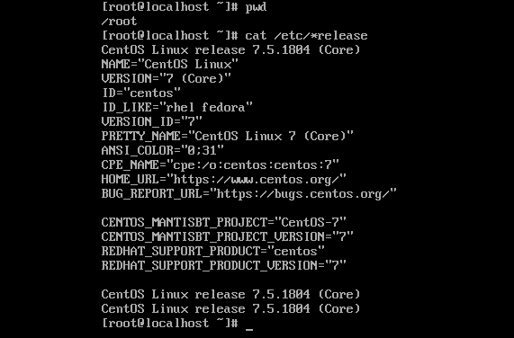
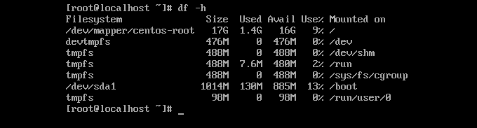

# Linux release and System infomation

    Trong khi sử dụng Linux, bạn có thể cần phải biết về hệ thống bạn đang sử dụng hoặc thông số kỹ thuật phần cứng bạn đang sử dụng. Là người dùng Linux bình thường hoặc nhà phát triển phần mềm, điều quan trọng là bạn phải kiểm tra tính tương thích của hệ thống phần mềm hoặc phần cứng mà bạn muốn cài đặt. Dòng lệnh Linux đi kèm với nhiều lệnh tích hợp để bạn làm quen với nền tảng phần mềm và phần cứng bạn đang làm việc. Sau đây tôi sẽ cung cấp cho bạn một số câu lệnh để kiểm tra thông tin về hệ thống này.


## Linux release and distribution
```
cat /etc/*release
```




## Kernel version
```
uname -option
```
- To view your network hostname, use ‘-n’ switch with uname  
- To get information about kernel-version, use ‘-v’ switch
- To get the information about your kernel release, use ‘-r’ switch 
- To print your machine hardware name, use ‘-m’ switch:
- All this information can be printed at once by running ‘uname -a’ command as shown below.
- The following command will let you know the name of the operating system you are using : `unamne -o`

## Check Ram
```
free -m 
```

## Check Memory info

    head /proc/meminfo

## Get CPU infomation
    lscpu

## Count the number of CPU

    cat /proc/cpuinfo | grep model | uniq -c

## File system
    df -h



## List out the partition information 
    fdisk -l

## The proc Filesystem

    The /proc filesystem contains virtual files that exist only in memory. This filesystem contains files and directories that mimic kernel structures and configuration information. It doesn't contain real files but runtime system information (e.g. system memory, devices mounted, hardware configuration, etc). The /proc filesystem is very useful because the information it reports is gathered only as needed and never needs storage on disk.
    
 Some important files in /proc are

```
/proc/cpuinfo
/proc/interrupts
/proc/meminfo
/proc/mounts
/proc/partitions
/proc/version
/proc/<process-id-#>
/proc/sys
```

## Thay đổi hostname trong Linux

Một số phần mềm yêu cầu server phải được thiết lập chính xác thông tin FQDN (Fully Qualified Domain Name) cho hostname. Đây cũng là vấn đề thường xuyên gặp phải trong khi làm việc với CentOS.


### Kiểm tra hostname hiện tại:
    hostname

### Đổi sang hostname mới là

    hostname "imkifu.com"


Chỉnh sửa /etc/sysconfig/network:
```
nano /etc/sysconfig/network
NETWORKING=yes
HOSTNAME=imkifu.com
```

### Chỉnh sửa file host: 

    nano /etc/hosts
