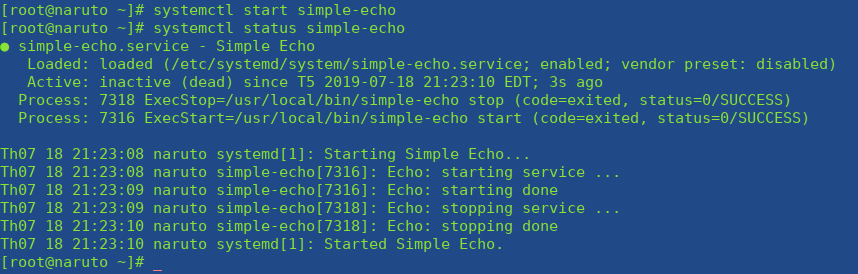

# Systemd

## Khái niệm về Systemd

Systemd = System daemon, có ý chỉ một cái gì đó âm thầm lặng lẽ hoạt động mà bình thường ta không biết được, và ở trong hệ thống Linux thì nó chính là các tiến trình chạy dưới nền (background process). Các tiến trình này cần phải hoạt động liên tục nhưng cũng không thể để người dùng ngồi nhìn nó chạy mãi được. Chính vì vậy, nó được chạy một cách "âm thầm", thuật ngữ gọi là chạy ngầm. Người dùng nếu không để ý hoặc tìm hiểu về nó thì không thể biết được tiến trình đó đang hoạt động. Nhưng systemd cũng không phải là để chỉ các tiến trình chạy ngầm đó, mà nó là một nhóm các chương trình đặc biệt sẽ quản lý, vận hành và theo dõi các tiến trình khác hoạt động.

## Các hệ thống tương tự Systemd

Systemd mới chỉ xuất hiện từ 30-3-2010, còn trước đó có 2 hệ thống khác đã từng được sử dụng

- Upstart: hệ thống init được phát triển bởi Canonical và được sử dụng trong Ubuntu Linux giai đoạn đầu.

- SysV: hệ thống init cổ điển của UNIX BSD System V, được viết bằng shell script và đã quá lâu đời.


## Vai trò của Systemd trong hệ thống

### Bắt đầu là khởi tạo

Bất cứ một chương trình nào trong Linux đều cần được thực thi dưới dạng một tiến trình, và systemd cũng không ngoại lệ. Một trong các thành phần quan trọng này là khởi tạo hệ thống. Systemd cung cấp một chương trình đặc biệt là `/sbin/init` và nó sẽ là chương trình đầu tiên được khởi động trong hệ thống `(PID = 1)`. Và khi hoạt động, `/sbin/init` sẽ giữ vai trò kích hoạt các file cấu hình cần thiết cho hệ thống, và các chương trình này sẽ tiếp nối để hoàn tất công đoạn khởi tạo.

### Các thành phần của Systemd

Về cơ bản thì systemd tương đương với một chương trình quản lý hệ thống và các dịch vụ trong Linux. Nó cung cấp một số các tiện ích như sau

- `systemctl` dùng để quản lý trạng thái của các dịch vụ hệ thống (bắt đầu, kết thúc, khởi động lại hoặc kiểm tra trạng thái hiện tại)
    
- `journald` dùng để quản lý nhật ký hoạt động của hệ thống (hay còn gọi là ghi log)
    
- `logind` dùng để quản lý và theo dõi việc đăng nhập/đăng xuất của người dùng
    
- `networkd` dùng để quản lý các kết nối mạng thông qua các cấu hình mạng

- `timedated` dùng để quản lý thời gian hệ thống hoặc thời gian mạng
    
- `udev` dùng để quản lý các thiết bị và firmware

## Unit file

Tất cả các chương trình được quản lý bởi **systemd** đều được thực thi dưới dạng `daemon` hay `background` bên dưới nền và được cấu hình thành 1 file configuration gọi là **unit** file. Các **unit** file này sẽ bao gồm 12 loại:

- service (các file quản lý hoạt động của 1 số chương trình)

- socket (quản lý các kết nối)

- device (quản lý thiết bị)

- mount (gắn thiết bị)

- automount (tự đống gắn thiết bị)
    
- swap (vùng không gian bộ nhớ trên đĩa cứng)

- target (quản lý tạo liên kết)

- path (quản lý các đường dẫn)

- timer (dùng cho cron-job để lập lịch)
  
- snapshot (sao lưu)

- slice (dùng cho quản lý tiến trình)

- scope (quy định không gian hoạt động)

## Service

Mặc dù là có 12 loại **unit** file trong ***systemd***, tuy nhiên có lẽ `service` là loại thường được quan tâm nhất. Loại này sẽ được khởi động khi bật máy và luôn chạy ở chế độ nền (`daemon` hoặc `background`) Các service thường sẽ được cấu hình trong các file riêng biệt và được quản lý thông qua câu lệnh systemctl Ta có thể sử dụng câu lệnh sau để xem các service đã được kích hoạt bởi hệ thống: `systemctl list-units | grep -e '.service'` hoặc `systemctl -t service` Bộ ba tùy chọn quen thuộc của `systemctl` sẽ dùng khi muốn bật/tắt một service :

- start: bật service

- stop: tắt service

- restart: tắt service rồi bật lại (ngoài ra còn có reload để tải lại file cấu hình tuy nhiên chỉ có 1 số chương trình hỗ trợ như Apache/Nginx ...) Ba tùy chọn trên sẽ được sử dụng khi hệ thống đang hoạt động, tuy nhiên systemctl cũng cung cấp 2 tùy chọn khác để điều khiển việc hoạt động của service từ lúc khởi động hệ thống

- enable: service sẽ được khởi động cùng hệ thống

- disable: service sẽ không được khởi động cùng hệ thống


## Tạo service với Systemd

Các service của systemd được quản lý trong các file cấu hình riêng biệt. Vì vậy, chúng ta hoàn toàn có thể tạo ra một file service của chúng ta để phục vụ một công việc nào đó. Mình sẽ ví dụ với một file cấu hình đơn giản như sau: 

```
# Location: /etc/systemd/system/simple-echo.service
[Unit]
Description=Simple Echo

[Service]
Type = forking
ExecStart = /usr/local/bin/simple-echo start
ExecStop = /usr/local/bin/simple-echo stop
ExecReload = /usr/local/bin/simple-echo restart

[Install]
WantedBy = multi-user.target
```

Và đây là file thực thi của dịch vụ

```
#!/bin/bash
# Location: /usr/local/bin/simple-echo

function echo_start () {
  echo "Echo: starting service ..."
  sleep 1
  echo "Echo: starting done"
}

function echo_stop () {
  echo "Echo: stopping service ..."
  sleep 1
  echo "Echo: stopping done"
}

function echo_status () {
  echo "Echo service"
}

case "$1" in
  'start')
    echo_start
    ;;
  'stop')
    echo_stop
    ;;
  'restart')
    echo_start
    sleep 1
    echo_stop
    ;;
  'status')
    echo_status
    ;;
  *)
    echo "Usage: $0 {start|stop|status|restart}" >&2
    ;;
esac
```

**Chú ý** : Sau khi tạo hai file trên cần cấp thêm quyền thực thi cho nó
```
chmod +x {hai file trên kia}
```
Và giờ ta có thể thử với các câu lệnh systemctl status simple-echo hoặc systemctl start simple-echo, nếu các câu lệnh này không báo lỗi thì quá trình tạo một service đơn giản đã thành công. (Đây chỉ một file cấu hình đơn giản của service, thực chất không có chương trình nào khác được thực thi.)




Nguồn tham khảo :

https://viblo.asia/p/tim-hieu-va-van-dung-systemd-de-quan-ly-he-thong-linux-phan-co-ban-WAyK8kN65xX 


https://techtalk.vn/blog/posts/systemd-la-gi


https://dangkyhosting.com/cach-de-xem-toan-bo-cac-service-trong-linux.html

https://www.familug.org/2017/02/systemd-journalctl-cho-nguoi-moi-tap.html#more


