# Users and Groups

## User là gì? 
Khi một máy tính đuợc sử dụng bởi nhiều người, trong cùng một thời điểm, việc chia riêng biệt những người dùng đó ra là một điều cần thiết. Điều này quan trọng ngay cả khi chỉ có duy nhất một người sử dụng máy tại một thời điểm. Do đó , mỗi người dùng sẽ có một username độc nhất, và username đó đuợc sử dụng để đăng nhập.

Một người dùng có nhiều cái để nhắc đến hơn là username của họ. Một `người dùng` là tất cả các files, các tài nguyên, và các thông tin thuộc về một người dùng. Bạn có thể liên tưởng tới một ngân hàng, mỗi một tài khoản trong ngân hàng sẽ có một lượng tiền đi kèm ,cùng một vài thông tin phụ thêm khác.

Để kiểm tra có tất cả bao nhiêu người dùng đang đăng nhập trên một máy, dùng câu lệnh 
    
    who -a

Để kiểm tra mình đang đăng nhập tài khoản nào, dùng câu lệnh

    whoami


## SuperUser

Root - hay còn gọi là `SuperUser` là người có quyền hạn cao nhất trong `Linux`. Root có tất cả các quyền truy cập vào hệ thống. Bạn có thể cấp quyền cho một người dùng với đầy đủ quyền như một `Root`, nhưng bạn phải cực kì cẩn trọng và hiểu rõ việc bạn làm.

Có ba cách để có đầy đủ quyền truy cập hệ thống
- Đăng nhập bằng tài khoản `Root`
- Sử dụng câu lệnh `su`. `su` sẽ mở ra một cửa sổ mới (switch user) chạy với một người dùng mới. Bạn có thể đăng nhập tài khoản `Root` ở đây. ( Không khuyến khích làm cách này )
- Dùng lệnh `sudo` với tài khoản được trao quyền hạn giống như `Root`. 

Khác biệt giữa `su` và `sudo` xem tại [đây](https://techmaster.vn/posts/34146/co-gi-khac-biet-giua-sudo-va-su-trong-linux)


## Group

Linux sử dụng các nhóm để quản lý người dùng. Nhóm là tập hợp các tài khoản với các quyền được chia sẻ nhất định. Kiểm soát thành viên nhóm được quản lý thông qua tệp `/etc/group`, trong đó hiển thị danh sách các nhóm và thành viên của họ. Theo mặc định, mọi người dùng thuộc về một nhóm mặc định hoặc nhóm chính. Khi người dùng đăng nhập, quyền của thành viên nhóm được đặt cho nhóm chính của họ và tất cả các thành viên được hưởng cùng mức truy cập và đặc quyền. Quyền trên các tập tin và thư mục khác nhau có thể được sửa đổi ở cấp độ nhóm.

#### Tạo mới một nhóm
Bạn nên tạo mới một nhóm trước khi tạo mới một người dùng, nếu không máy sẽ tự động tạo nhóm hoặc bạn phải dùng nhóm mặc định có sẵn trên hệ thống của bạn

- Kiểm tra các nhóm tồn tại
```
    cat /etc/groups
```
- Cú pháp để tạo mới một 
```
    groupadd [-g] gid [-o]] [-r] [-f] groupname 
```      

- -g gid : 	Giá trị số của ID nhóm
- -o     : Tùy chọn này cho phép để thêm nhóm với GID không duy nhất.
- -r	  :Dấu hiệu này chỉ thị sự thêm nhóm tới tài khoản hệ thống.
- -f:	Tùy chọn này khiến cho nó chỉ thoát ra với trạng thái thành công nếu nhóm đã xác định đã tồn tại. Với –g, nếu GID đã tồn tại, thì GID khác (duy nhất) được chọn.
- groupname	Tên nhóm thực sự được tạo.

Nếu bạn không xác định bất cứ tham số nào thì hệ thống sẽ sử dụng các giá trị mặc định

Ví dụ sau sẽ tạo một nhóm developers với các giá trị mặc định
```
$ groupadd developers
```
Để chỉnh sửa một nhóm, sử dụng cú pháp lệnh groupmod:
```
$ groupmod -n new_modified_group_name old_group_name
```
Để thay đổi tên nhóm developers_2 thành deverloper, bạn gõ như sau:
```
$ groupmod -n developer developer_2
```
Thay đổi GID mặc định thành 8199:
```
$ groupmod -g 8199 developer
```
Xóa một nhóm 
```
$ groupdel developer
```

Lưu ý : xóa nhóm thì các thông số của người dùng trong nhóm ý vẫn còn liên kết -> phải xóa liên kết lại bằng tay


### Tạo mới một người dùng.

Nhân Linux ( [kennel](https://searchdatacenter.techtarget.com/definition/kernel) )
xem những người dùng như những con số độc lập. Mỗi người dùng sở hữu một số nguyên độc nhất đuợc gọi là user id hoặc uid, do các con số nhanh hơn và dễ sử lý hơn cách định danh bằng văn bản. Một cơ sở dữ liệu riêng biệt bên ngoài (không dính líu tới kernel) sẽ chứa các thông tin như username, tên thật , ..v...v.. cho mỗi uid.

Để tạo mới một người dùng, bạn cần phải thêm các thông tin về người dùng đó vào trong cơ sở dữ liệu trên máy, sau đó tạo một thư mục home cho anh/cô ta. Đôi khi người quản trị cũng cần phải thiết lập một môi trường riêng cho người dùng đó.


Chỉ người dùng `root` mới có thể thêm và xóa người dùng và nhóm. Thêm người dùng mới được thực hiện bằng lệnh `useradd` và xóa người dùng hiện tại được thực hiện bằng lệnh `userdel`

Muốn liệt kê tất cả người dùng, dùng câu lệnh

    ls /home/

hoặc

    cat /etc/passwd | grep home

- Tạo một người dùng bằng cú pháp sau :

    useradd -d homedir -g groupname -m -s shell -u userid accountname


|Tùy chọn | Miêu tả|
|---------|--------|
|-d homedir	| Xác định thư mục chính cho tài khoản.
|-g groupname |	Xác định một tài khoản nhóm cho tài khoản cá nhân này.
|-m	|Tạo thư mục chính nếu nó không tồn tại.
|-s shell	| Xác định shell mặc định cho tài khoản cá nhân này.
|-u userid	| Bạn có thể xác định ID cá nhân cho tài khoản này.
|accountname	| Tên tài khoản cá nhân thực sự được tạo ra.


- Để đặt mật khẩu cho user chúng ta sử dụng lệnh `passwd` như sau:
```
sudo passwd imkifu
```
Để đặt ràng buộc về tạo mật khẩu cho user, chỉnh sửa các thông số trong file /etc/login.defs
Để xem các quy tắc đã được thiết lập cho một user ta sử dụng lệnh `chage`

    chage -l userSombody


Để thay đổi các thiết lập về mật khẩu cho user chúng ta cũng sử dụng lệnh `chage` với các option:

- m days : Sets the minimum number of days between password changes. Zero allows the user to change the password at any time.
- M days : Sets the maximum number of days for which a password stays valid.
- E date : Sets a date on which the user account will expire and automatically be deactivated.
- W days : Sets the number of days before the password expires that the user will be warned to change it.
- d days : Sets the number of days since January 1, 1970, that the password was last changed.
- I days : Sets the number of days after password expiration that the account is locked.


- Thay đổi thông tin người dùng ta dùng lệnh `usermod`, các options giống `useradd` :

    usermod -option  username

Một người dùng cũng có thể có nhiều file nằm bên ngoài thư mục home của họ. Bạn có thể tìm chúng bằng lệnh find:

    find / -user username

Tuy nhiên, lưu ý rằng lệnh trên có thể mất khá nhiều thời gian , nếu như đĩa của bạn có dung lượng lớn.

Một vài bản phân phối Linux đi kèm với các lệnh như deluser hoặc userdel. Tuy nhiên , việc dỡ bỏ người dùng khá dễ dàng, bạn hoàn toàn có thể làm nó bằng tay, và cũng bởi vì những chương trình ấy đôi khi không làm cho bạn mọi thứ.

- Xóa một người dùng ta dùng lệnh

    userdel -option username

## Khóa tài khoản

Để khóa tài khoản của một User, bạn phải xác định User đó tồn tại với UID cụ thể 


- Khóa tài khoản với `usermod` :

    usermod -L tên tài khoản

- Khóa một tài khoản với `passwd` :

    passwd -l tên tài khoản


Để kiểm tra thông tin tài khoản 

    cat /etc/shadow

Nếu User đã bị khóa bằng passwd thì sẽ xuất hiện hai kí tự là `!!` phía trước thông tin mất khẩu đã bị mã hóa


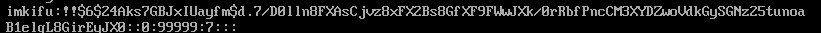


Nếu User bị khóa bởi usermod thì chỉ xuất hiện một kí tự `!`

***lưu ý*** : nếu bạn khởi tạo một user mà chưa đặt mật khẩu cho user đó, điều đó đồng nghĩa với việc user đó tạm thời bị khóa do chưa có mật khẩu , trong file /etc/shadow thông tin về user đó sẽ có dạng `!!` và không có thông tin mật khẩu được mã hóa

    
Có thể khóa thủ công bằng các trực tiếp thay đổi trong file /etc/shadow bằng cách thêm trực tiếp kí tự `*` hoặc `!` vào trước đoạn mật khẩu được mã hóa.


#### man usermod ( diễn giải chi tiết )
- L, --lock
 khoá mật khẩu của 1 tài khoản user trên hệ thống. Chương trình sẽ chèn thêm 1 kí tự "!" phía trước đoạn mật khẩu đã được mã hoá trong file /etc/shadow., để hệ thống nhận diện mật khẩu của user này hiện đã bị khoá không được sử dụng.
 
- U, --unlock
 mở khoá mật khẩu của 1 tài khoản user trên hệ thống. Chương trình sẽ xoá bỏ kí tự "!" nằm trước đoạn mật khẩu đã được mã hoá của user trong file /etc/shadow.


#### man passwd ( diễn giải chi tiết )
- l Lựa chọn này chỉ có thể thực thi bởi quyền root. Khoá mật khẩu của 1 tài khoản bằng cách mã hoá chuỗi mật khẩu thành 1 chuỗi kí tự khác không hợp lệ khi user tiến hành đăng nhập bằng mật khẩu. Để mã hoá thành chuỗi khác thì chương trình sẽ đặt thêm 2 kí tự "!!" trước thông tin mật khẩu.
 
- u Mở khoá mật khẩu của 1 tài khoản, bỏ 2 kí tự "!!" đi.


### Mở khóa

- với `usermod` :

    usermod -U tên tài khoản

- với `passwd` :

    passwd -u tên tài khoản


### Khóa tài khoản tạm thời bằng Shell

Chúng ta dùng câu lệnh sau để kiểm tra shell của người dùng với người dùng tên là ImKifu
```
cat /etc/passwd | grep -E --color "imkifu"
```
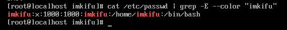


như chúng ta thấy ở ảnh, bash shell đang là /bin/bash

muốn tạm khóa tài khoản, ta đổi bash shell của người dùng thành 1 trong ba cái dưới đây

    /usr/sbin/nologin
    /sbin/nologin
    /bin/false


để chỉnh sửa bash shell ta dùng câu lệnh sau với người dùng là imkifu

```
usermod -s /bin/false imkifu
```

như vậy người dùng imkifu đã bị khóa. Kiểm tra bằng cách `su`. `su` là gì thì xem lại ở trên.

    su imkifu

Có thể chỉnh sửa các file nologin.txt để in ra các lời xin lỗi hay hướng dẫn, chi tiết xem ở [đây](https://unix.stackexchange.com/questions/155139/does-usr-sbin-nologin-as-a-login-shell-serve-a-security-purpose)


Ngoài ra bạn có thể tự định nghĩa bash shell rồi làm tương tự như trên, tài liệu xemm ở [đây](https://www.tldp.org/LDP/sag/html/disable-user.html)

### Kiểm tra có bao nhiêu shell đang được hỗ trợ để sử dụng trên hệ thống

    
    chsh --list-shells

hoặc

    cat /etc/shells

## File lưu trữ dữ liệu về User và Group

Các file lưu trữ thông tin về user và group:

    /etc/passwd
    /etc/shadow
    /etc/group


# Sudo

Lệnh sudo cho phép một user thực thi một lệnh bằng quyền của root. Lý do mà chúng ta phải sử dụng sudo là:

- Tăng cường tính bảo mật cho hệ thống.

- Quản lý quyền hạn của từng user hoặc group trong việc thực thi lệnh.

- Cho phép nhà quản trị kiểm soát được các thao tác của người dùng có can thiệp đến hệ thống, giao quyền thực thi “đúng người đúng việc”. Ngoài ra khi thực thi lệnh từ xa thông qua telnet/SSH thì sudo thực sự thể hiện ưu thế

Sudo được dùng khi ta muốn thực thi một lệnh trên Linux với quyền của một user khác. Nếu được cho phép, ta sẽ thực thi một lệnh như là người quản trị hay một user nào khác. Các khai báo “ai được làm gì” đặc tả trong file `/etc/sudoers`. Những ghi nhận (log) của hệ thống khi sudo được sử dụng theo mặc định nằm trong file `/var/log/secure` (Red Hat/Fedora / CentOS Linux) hoặc `/var/log/auth.log` (Ubuntu / Debian Linux).

#### Cú pháp cơ bản của sudo

    sudo <lệnh cần thực hiện>

Mặc định, nếu không có khai báo định danh của user đích rõ ràng, mặc định sudo sẽ xem như ta đang mượn quyền root để thực thi. Nếu ta muốn “mượn” một người dùng nào khác thì khai báo định danh rõ ràng của người đó

    sudo -u <username> <lệnh cần thực hiện>

File cấu hình sudo sẽ nằm ở:

    /etc/sudoes
    /etc/sudoes.d/


## File /etc/sudoers

Nội dung trong file này thường được đặc tả bằng cú pháp sau:

    USER HOSTNAME=(TARGET-USERS) COMMAND

Trong đó:

- USER: Tên của người sử dụng

- HOSTNAME: Tên máy mà luật được áp dụng lên. Tham số này cần thiết vì sudo được thiết kế để bạn có thể dùng một file sudoers cho các máy khác. Lúc này sudo sẽ xem máy đang chạy được dùng các luật nào. Nói cách khác, bạn có thể thiết kế các luật cho từng máy trong hệ thống.

- TARGET-USERS: Tên người dùng đích cho “mượn” quyền thực thi.

- COMMAND: Tên “lệnh” (thực ra là các chương trình thực thi) mà người dùng được quyền thực thi với bất kỳ tham số nào mà họ muốn. Tuy nhiên bạn cũng có thể đặc tả các tham số của lệnh (bao gồm các dấu thay thế wildcards). Ngược lại, có thể dùng kí hiệu “” để ám chỉ là lệnh chỉ được thực thi mà không có tham số nào cả.

- Nếu là cấp quyền cho group, ta thay tham số USER bằng %GROUP


Xem thêm `man sudoers` để biết cú pháp chi tiết hơn.


### Thiết lập cho sudo
Sau khi biết cú pháp của file sudoers, ta sẽ tiến hành thiết lập cho sudo bằng cách soạn thảo file này. Để mở file sudoer lên và soạn thảo, ta dùng lệnh sau:

    # visudo


- Chỉ thị ” root ALL=(ALL) ALL” tuân theo đúng cú pháp thường gặp, có nghĩa là người dùng root, trên tất cả các máy, có thể mượn quyền tất cả các người dùng, để thực thi tất cả các lệnh.

- Chỉ thị “%admin ALL=(ALL) ALL” cũng tuân theo cú pháp đó, có nghĩa là nhóm người dùng admin, trên tất cả các máy, có thể mượn quyền tất cả các người dùng, để thực thi tất cả các lệnh.


## Thêm quyền/giới hạn quyền cho User

Chúng ta có thể thêm quyền cho người dùng bằng cách chỉnh sửa file `sudoers`

    #vi /etc/sudoers

sau đó bấm chữ i để viết thêm vào file

tìm và gõ đoạn code sau

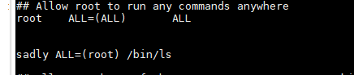

như vậy, User `sadly` đã có thể đọc các thư mục ở Root.

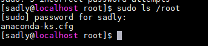

 Muốn User sadly không phải nhập mật khẩu mỗi lần ls /root, ta thêm như sau :

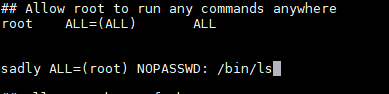


Nguồn tham khảo :

https://www.digitalocean.com/community/tutorials/how-to-edit-the-sudoers-file-on-ubuntu-and-centos

https://echip.pro/2016/12/04/bai-8-tim-hieu-ve-user-va-group-trong-linux/

https://kythuatmaytinh.wordpress.com/2008/03/21/c%E1%BA%A5p-quy%E1%BB%81n-th%E1%BB%B1c-thi-v%E1%BB%9Bi-sudo/

http://www.softpanorama.org/Access_control/Sudo/sudoer_file_examples.shtml

https://www.mankier.com/5/sudoers

http://www.hvaonline.net/hvaonline/posts/list/19378.hva

https://dienpt.com/tim-hieu-ve-sudoers-file/

https://www.gocit.vn/bai-viet/quan-ly-user-group-va-phan-quyen-tren-linux/

https://www.liquidweb.com/kb/how-to-give-a-linux-user-root-level-access-using-sudo/

# History Command

UNIX cung cấp chức năng tra vấn history (những gì đã được nhập vào shell) rất dễ dàng. `History Command` có thể dùng để tìm lại những lệnh dài khó nhớ để tiết kiệm thời gian đánh lại hoặc dùng để kiểm tra xem có một user nào đó đã thực hiện những gì trên hệ thống

### 1. In ra màn hình lịch sử câu lệnh

    history

### 2. In lịch sử câu lệnh với số dòng nhất định

    history 3

### 3. Thực thi lại câu lệnh gần nhất

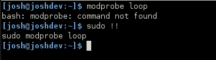

### 4. Thực thi lại câu lệnh gần nhất

Để thực thi lại câu lệnh gần nhất, các bạn gõ 2 dấu “!”

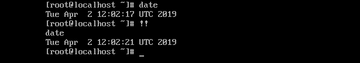

### 5. Thực hiện lại câu lệnh thứ n

Để thực thi lại câu lệnh mong muốn, gõ `!` + số thứ tự câu lệnh

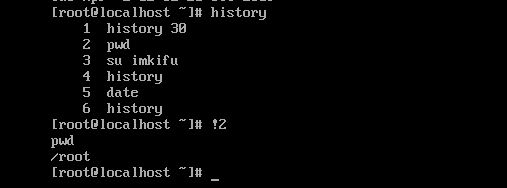

### 6. Lặp lại câu lệnh bắt đầu bằng chuỗi string

Để thực hiện lại câu lệnh cuối cùng bắt đầu bằng một chuỗi kí tự xác định. bạn dùng cú pháp `!string`


    # history 100
    # history 
    # history 4
    # !history

Ở ví dụ nó sẽ thực hiện câu lệnh `history 4`

***Lưu ý*** : Mặc dù hữu ích, điều này rõ ràng có thể nguy hiểm nếu lệnh cuối cùng thực sự khác với những gì bạn mong đợi. Bạn có thể chạy nó với `:p`, ở cuối để thay vào đó hãy in lệnh thay vì thực hiện ngay lập tức.

    # !history:p

Ở đây nó sẽ trả về câu lệnh `history 4`


### 7. History và Piping

Khi muốn xem lịch sử câu lệnh về một vấn đề cụ thể, chúng ta có thể kết hợp lệnh history và grep :

    history | grep usermod


Xem nhiều hơn với less

    history 100 | less

giới thiệu về ***less***

Lệnh này sẽ viết nội dung của file lên một trang màn hình tại một thời điểm. Đánh

% less science.txt

Nhấn [space-bar] nếu bạn muốn xem trang khác, và đánh [q] nếu bạn muốn thoát khỏi trang đang đọc. Như những gì bạn có thể thấy, lệnh less này được sử dụng tốt hơn lệnh cat đối với các file dài.

lệnh in ra 3 câu lệnh cuối

    history | tail -n 3

Đây là vài cách để tìm kiểm câu lệnh, sử dụng `grep` và `less`.
Ngoài ra mình còn có thể sử dụng `Ctrl + R` . Sau khi gõ như vậy, câu lệnh sẽ chuyển thành


    (reverse-i-search)`':

### 8. Ghi lịch sử câu lệnh ra file

Khi thực hiện câu lệnh ghi lịch sử ra file, hệ thống sẽ ghi vào file users ~/.bash_history với option “w”
Đây là nơi lưu trữ mặc định của các lịch sử câu lệnh


    # history -w


### 8.1 Ghi lịch sử câu lệnh ra một file khác 
Theo mặc định, lịch sử bash được ghi vào ~ / .bash_history, 
điều này được đặt trong biến $HISTFILE như dưới đây.
```
[root@centos7 ~]# echo $HISTFILE
/root/.bash_history
[root@centos7 ~]# su - user
[user@centos7 ~]$ echo $HISTFILE
/home/user/.bash_history
```
Chúng ta có thể thay đổi nơi lưu lịch sử câu lệnh ~ / .bashrc bằng câu lệnh bên dưới.

    [root@centos7 ~]# echo 'export HISTFILE="/root/new_history"' >> ~/.bashrc

Sau khi logout và vào lại, tất cả dữ liệu lịch sử sẽ được lưu ở `/root/new_history`. 

### 9. Xóa lịch sử câu lệnh

Xoá tất cả các history trước đó bằng tùy chọn -c

Để xóa lịch sử câu lệnh đã thực thi các bạn dùng lệnh sau:

    # history -c

### 10. Xóa một dòng trong lịch sử câu lệnh

Để xóa một dòng nào đó các bạn dùng cú pháp history -d n ( với n là stt câu lệnh muốn xóa )

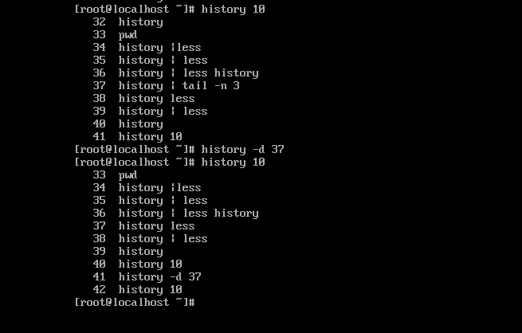


### 11. Chạy một câu lệnh mà ko để lưu lịch sử 

Chúng ta có thể chạy một lệnh mà không bị ghi vào lịch sử bash.


    [root@centos7 ~]# echo "secret command";history -d $(history 1)
    secret command

### Chạy tất cả câu lệnh mà không bị lưu lịch sử

    unset HISTFILE


Kiểm tra thực tế và ví dụ :

```
[root@centos7 ~]# echo $HISTFILE
/root/.bash_history
[root@centos7 ~]# unset HISTFILE
[root@centos7 ~]# echo $HISTFILE

```


### 11. Không cho history lưu lại 1 lệnh cụ thể bằng HISTCONTROL

- Khi thực thi một lệnh, bạn có thể cho history bỏ qua lệnh đó bằng cách thiết lập HISTCONTROL ở chế độ ignorespace VÀ gõ một khoảng trắng phía trước lệnh đó
```
    #export HISTCONTROL=ignorespace
    #  ls -alh
    #history 5
```
khi in ra lịch sử, lệnh ls -alh sẽ không được in ra ( vì nó không được lưu do mình đã đặt dấu cách ở trước )

- Ngoài ra còn có thể không lưu một số câu lệnh mình muốn
We can specify a list of commands that should never be logged in the history file with
the $HISTIGNORE variable, which is not set by default.

    [root@centos7 ~]# echo 'export HISTIGNORE="ls:cd"' >> ~/.bashrc

As before when this file is written to you need to log out and log back in for it to execute.

```
[root@centos7 ~]# ls
anaconda-ks.cfg  new_history
[root@centos7 ~]# pwd
/root
[root@centos7 ~]# cd
[root@centos7 ~]# echo hi
hi
[root@centos7 ~]# history 5
  123  history
  124  du
  125  pwd
  126  echo hi
  127  history 5
```

As shown the ‘ls’ and ‘cd’ commands that we have run were not stored in the logs.


### 12. Tăng kích thước lưu trữ history
Mặc định hệ thống sẽ lưu lại 1000 dòng lệnh đã thực hiện, để tăng khả năng lưu trữ các bạn làm như sau:

Mở file ~/.bashrc và thêm vào 2 dòng sau:

    HISTSIZE=2000
    HISTFILESIZE=2000

Sau đó logout và login lại là được.

Kiểm tra xem kích thước hiện tại như sau:


    [root@centos7 ~]# echo $HISTFILESIZE
    2000
    [root@centos7 ~]# echo $HISTSIZE
    2000


### Loại bỏ các dòng trùng nhau trong toàn bộ history bằng HISTCONTROL

Thao tác ignoredups ở trên chỉ loại bỏ các dòng trùng nhau khi chúng nằm liên tiếp. 
Để bỏ các dòng trùng trong toàn bộ history ta thiết lập như sau:

    $ export HISTCONTROL=erasedup


### 13. Thêm thời gian vào lịch sử câu lệnh

Để thêm thời gian vào lịch sử câu lệnh, các bạn sử dụng câu lệnh sau:

    echo 'export HISTTIMEFORMAT="%c "' >> ~/.bashrc

Sau đó logout và login trở lại và kiểm tra
```
[root@centos7 ~]# history 5
   39  Wed 27 Feb 2019 01:46:03 AM PDT firewall-cmd --add-service=http --permanent
   40  Wed 27 Feb 2019 01:48:03 AM PDT firewall-cmd --reload
   41  Wed 27 Feb 2019 01:50:03 AM PDT tailf /var/log/messages
   42  Wed 27 Feb 2019 01:52:03 AM PDT restorecon -v /var/www/html/index.html
   43  Wed 27 Feb 2019 01:56:03 AM PDT history 5
```

### 14. Thay thế từ

Đây là một tính năng lý tuyệt vời. Bạn đã bao nhiêu lần viết ra một lệnh dài chỉ để thực hiện nhập đầu vào, chẳng hạn như hdd, nhưng lại muốn đổi là hdc? Trong trường hợp này bạn có thể thay thế một từ trong lệnh trước đó bằng một từ khác bằng cách sử dụng “^”, xem ví dụ bên dưới.

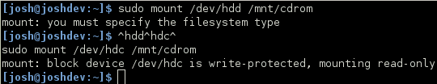


### Xóa lịch sử một nhóm dòng mong muốn

Khi bạn có một nhóm câu lệnh liền nhau, mà bạn không muốn lưu vào lịch sử, bạn có thể dùng câu lệnh sau để xóa theo kiểu vòng lặp

    for h in $(seq sốdòngbắtđầusố   sốdòngkếtthúc | tac); do history -d $h; done

thêm câu lệnh này, nó sẽ xóa luôn cả câu lệnh mình yêu cầu xóa lịch sử

    for h in $(seq sốdòngbắtđầusố   sốdòngkếtthúc | tac); do history -d $h; done; history -d $(history 1 | awk '{print $1}')


###  Điền một tham số cụ thể từ một lệnh cụ thể
Trong ví dụ sau, !cp:2 tìm kiếm những lệnh trong history bắt đầu bằng cp và lấy 
tham số thứ hai sau đó điền vào ls -l

```
$ cp sources.list_hardy /home/t3318/Documents/New/sources.list
ls -l !cp:2
ls -l /home/t3318/Documents/New/sources.list
-rw-r–r– 1 t3318 t3318 292 2008-08-18 15:02 /home/t3318/Documents/New/sources.list
```

Còn ở ví dụ sau, !cp:$ tìm những lệnh bắt đầu với cp và lấy tham số cuối cùng 
(cũng là tham số thứ 2 của lệnh cp ở trên)

```
$ ls -l !cp:$
ls -l /home/t3318/Documents/New/sources.list
-rw-r–r– 1 t3318 t3318 292 2008-08-18 15:02 /home/t3318/Documents/New/sources.list
```


## 15.Quản lý lịch sử

### Sự khác nhau giữa bash HISTSIZE vs. HISTFILESIZE 

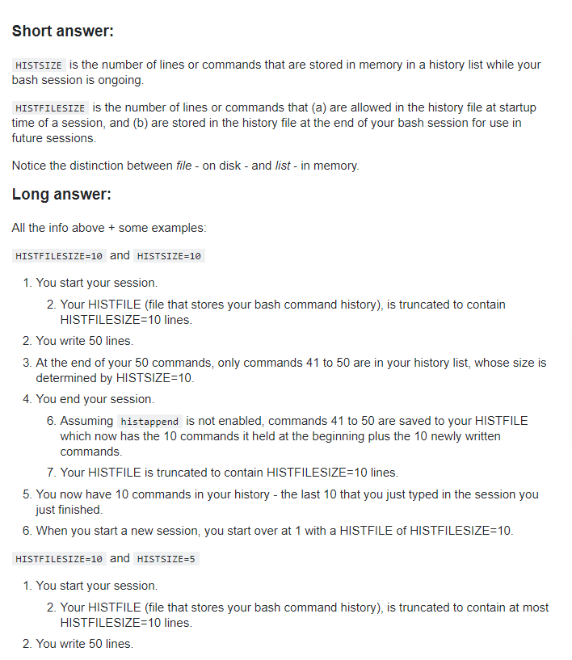

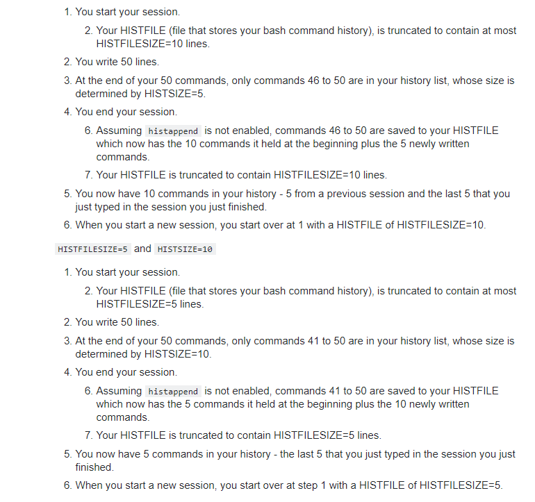

Bài viết chi tiết tại [đây](https://stackoverflow.com/questions/19454837/bash-histsize-vs-histfilesize)


Đôi khi ta muốn exit khỏi terminal và không muốn bị lưu lịch sử những câu lệnh mà ta đã thao tác trên máy, chúng ta có thể thực hiện những cách sau

HISTFILE chỉ lưu lại thông tin command ( đang được lưu trên RAM ) sau khi chúng ta thoát khỏi terminal bằng lệnh `exit` hoặc `logout`.

### Unset HISTFILE

    # unset HISTFILE and exit

### Kill console hiện tại 

    # kill -9 $$

### TÙy chọn xóa history

    # history -c && exit

### Set history size bằng 0

    # HISTSIZE = 0 && exit

### Xóa HISTFILE và unset HISTFILE 

    # rm -f $HISTFILE && unset HISTFILE && exit

Nếu bạn không muốn phải lặp lại công việc xóa lịch sử nhiều lần, bạn có thể thêm những cách trên vào `~/.bash_logout`


## Tài liệu về History Command

https://stackoverflow.com/questions/14750650/how-to-delete-history-of-last-10-commands-in-shell

https://cuongquach.com/linux-5-cach-xoa-lich-su-command-khi-logout-terminal.html

https://www.rootusers.com/17-bash-history-command-examples-in-linux/

https://itfromzero.com/linux/lam-chu-lenh-history-tren-linux.html#them_thoi_gian_vao_lich_su_cau_lenh

https://kythuatmaytinh.wordpress.com/2008/08/18/lam-ch%E1%BB%A7-command-history-tren-linux/

https://unix.stackexchange.com/questions/115934/why-does-bash-have-a-histcontrol-ignorespace-option

Không giới hạn số lịch sử được ghi xem tại [đây](https://superuser.com/questions/137438/how-to-unlimited-bash-shell-history)


# Linux - PATH

$PATH là gì?

Để trả lời cho câu hỏi này, hãy tưởng tượng mỗi lần ta gõ 1 lệnh nào đó, ví dụ ls chẳng hạn (viết tắt của l i s t, dùng để in danh sách folder), thì hệ điều hành sẽ tìm file thực thi (binary) của chương trình mang tên ls ở đâu? Nếu gõ thẳng ra là /bin/ls thì chẳng nói, vì lúc đó ta đã bảo trực tiếp cho hệ điều hành sộc vào folder /bin là sẽ thấy ls. Còn không nói cụ thể, thì chẳng nhẽ sẽ tìm ở toàn bộ các folder trên máy? Lúc này đây ta cần lưu lại đường dẫn đến các chương trình ở 1 nơi nào đó để hệ điều hành biết mà giới hạn chỗ đi tìm. Biến $PATH chính là nơi để lưu lại đường dẫn trên, mà không chỉ một, mà có thể có nhiều đường dẫn, bởi người dùng có thể chứa chương trình ở nhiều folder khác nhau.

Lưu ý: $PATH, không phải $path, hay $Path.

## Muốn xem $PATH chứa gì phải làm sao?

Muốn biết xem có những đường dẫn nào lưu trong $PATH của máy mình, gõ lệnh sau trong terminal

    echo $PATH

kết quả

    /home/tên-account-của-bạn/bin /home/tên-account-của-bạn/.local/bin /usr/local/sbin /usr/local/bin /usr/sbin /usr/bin /sbin /bin /usr/games /usr/local/games

Lưu ý: Không giống các shell khác, trong fish, $PATH là một danh sách với đường dẫn ngăn cách nhau bởi dấu cách ␣, không phải dấu dấu hai chấm :.

Nhưng trông khó nhìn nhể? Muốn cho thông tin hiện ra dễ đọc hơn, có thể thử với printf "%s\n" $PATH. Lệnh printf giúp hiện text trong $PATH theo format quy định bởi người dùng, ở đây là "%s\n", trong đó %s ký hiệu thay cho string,
còn \n báo printf xuống dòng sau mỗi kết quả. Ta đạt được là:

```
/home/tên-account-của-bạn/bin
/home/tên-account-của-bạn/.local/bin
/usr/local/sbin
/usr/local/bin
/usr/sbin
/usr/bin
/sbin
/bin
/usr/games
/usr/local/games
```

## Các đường dẫn trên có bình đẳng không?

Dù là anh em trong 1 nhà, nhưng mấy bạn đường dẫn trong $PATH không bình đẳng. Bạn nào ở trên (hoặc ngoài cùng bên trái) sẽ được ưu tiên tìm trước, bạn nào ở dưới (hoặc phía bên phải) tìm sau. Một khi Linux đã tìm được chương trình nó cần, nó sẽ dừng việc tìm kiếm trong các đường dẫn phía sau. Tức là có thể có 2
files thực thi cùng tên lưu ở 2 nơi, thì Linux chỉ chạy file đầu tiên mà nó tìm thấy.


## Muốn thay đổi $PATH thì cần làm gì?

Đối với shell fish, ta có các lựa chọn sau:

1. Chèn tạm thời đường dẫn /usr/local/bin và đường dẫn /usr/sbin
2. lên đầu $PATH, gõ: set PATH /usr/local/bin /usr/sbin $PATH
3. xuống cuối $PATH, gõ: set PATH $PATH /usr/local/bin /usr/sbin

Lưu ý: Tạm thời ở đây có nghĩa là thiết lập sẽ bị mất sau khi logout. 
Việc này hữu ích nếu chỉ muốn test mà không làm ảnh hưởng đến hệ thống lâu dài.


### Chèn vĩnh viễn:

- lên đầu: 

    set -U fish_user_paths /usr/local/bin $fish_user_paths
- xuống cuối:

    set -U fish_user_paths $fish_user_paths /usr/local/bin

trong đó $fish_user_paths là universal 
variable mà giá trị của nó được chia sẻ mọi lúc mọi nơi trong fish.

- Xóa đường dẫn /usr/local/bin khỏi $PATH, gõ:

    set PATH (string match -v /usr/local/bin $PATH)

Lưu ý: lệnh set giúp hiển thị và thay đổi các variables trong shell.

## Làm sao để biết chương trình nào ứng với đường dẫn nào trong $PATH

Dùng lệnh which nhé. Ví dụ muốn biết chương trình mang tên grep được chứa ở thư mục nào, 
gõ which grep, kết quả sẽ được tương tự như sau:

    /bin/ls

Lưu ý: grep là viết tắt của "global regular expression print", dùng để so sánh các đoạn trong file text xem có chỗ nào giống (hoặc không giống) 
với điều kiện ta đưa ra hay không, sau đó lọc ra thứ ta cần.

# Kết luận

- Các câu lệnh và kết quả in ra trong bài viết này có thể khác đôi chút với các shell khác nhau, nhưng nguyên lý là không đổi. Để tìm câu lệnh phù hợp với máy mình, tốt nhất là vào đọc hướng dẫn của shell đó, ví dụ với fish đọc ở đây, còn không thì google với từ khóa $PATH và tên-shell-mặc-định-trên-máy.

- Ngoài những thứ trên, lúc đọc còn thấy quá trời những điều ngang dọc như:

- $PATH còn thuộc về 1 thứ là environment variable.
- Ngoài thứ tự ưu tiên bên trong $PATH, sẽ còn những thứ tự ưu tiên bên ngoài $PATH, ví dụ như aliases, exported functions, built-in shell commands, v.v.
- Current directory ký hiệu bằng dấu chấm ".".
- Mấy file .bashrc với .bash_profile khác nhau chỗ nào?


Những cái trên sẽ để tìm hiểu sau.

PS: Sau khi thử thay đổi $PATH trong máy, vấn đề gốc ban đầu là cài và chạy jrnl vẫn chưa được giải quyết. ts.


Nguồn tài liệu gốc :

https://kipalog.com/posts/Linux----PATH-de-lam-gi

Tài liệu tham khảo :

http://thinknextco.com/diendan/index.php?threads/t%C3%ACm-hi%E1%BB%83u-v%E1%BB%81-bi%E1%BA%BFn-m%C3%B4i-tr%C6%B0%E1%BB%9Dng-path-trong-linux.405/