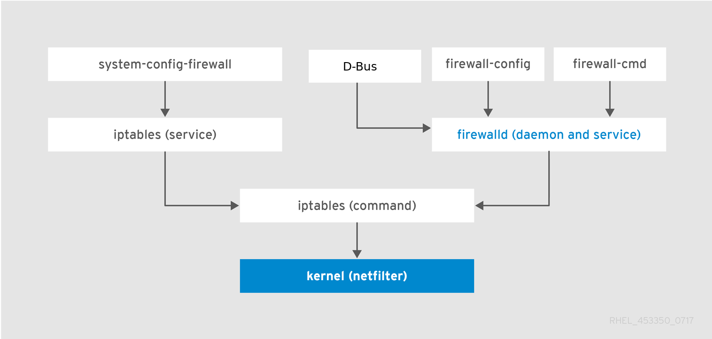

# Firewalld Service

## Firewalld là gì?

FirewallD là giải pháp tường lửa mạnh mẽ, toàn diện được cài đặt mặc định trên RHEL 7 và CentOS 7.

## Firewalld Service so với Iptables Service

Làm việc với FirewallD có hai sự khác biệt chính so với iptables kiểm soát trực tiếp:

- FirewallD sử dụng các zone và dịch vụ (service) thay vì chuỗi và quy tắc.

- Nó quản lý rulesets tự động, cho phép cập nhật mà không vi phạm các phiên và kết nối hiện tại.

Ảnh minh họa:



Nhìn vào ảnh minh họa, ta có thể thấy Firewalld cùng cấp với Iptables Service. Cả hai đều làm việc dựa trên Iptables Command. Do vậy, trên cùng một máy tính sẽ không thể chạy cả hai dịch vụ Firewalld và Iptables Service. 


 **Notes**:
- Firewalld không có command để giới hạn connection đến port cho từng IP( block connection per IP)

- Firewalld không có command recent  => Ko chặn đc scan port

- Firewalld không xử lý được chi tiết trạng thái của connection: NEW, ESTABLISHED, INVALID.

- Firewalld không có option để theo dõi tcp flag => ko xử lý được tấn công syn

[Nguồn tham khảo](https://forums.cpanel.net/threads/using-iptables-instead-of-firewalld-in-centos-7.526891/)


## Cách cài đặt Firewalld

Mặc định trên Centos 7 sẽ được cài mặc định, nhưng trong khuôn khổ bài tìm hiểu tôi sẽ thực hiện đầy đủ từng bước.

1. Cài đặt Firewalld

```
sudo yum install firewalld
```

2. Bật Firewalld khởi động cùng hệ thống
```
sudo systemctl enable firewalld
```

3. Khởi động Firewalld

```
sudo systemctl start firewalld
```

4. Kiểm tra trạng thái
```
systemctl status firewalld
```

**OUTPUT mẫu**
```
[root@localhost ~]# systemctl status firewalld
● firewalld.service - firewalld - dynamic firewall daemon
   Loaded: loaded (/usr/lib/systemd/system/firewalld.service; enabled; vendor preset: enabled)
   Active: active (running) since T5 2019-08-01 22:34:56 EDT; 12s ago
     Docs: man:firewalld(1)
 Main PID: 1324 (firewalld)
   CGroup: /system.slice/firewalld.service
           └─1324 /usr/bin/python -Es /usr/sbin/firewalld --nofork --nopid

Th08 01 22:34:56 localhost.localdomain systemd[1]: Starting firewalld - dynamic firewall daemon...
Th08 01 22:34:56 localhost.localdomain systemd[1]: Started firewalld - dynamic firewall daemon.
```

## Các khái niệm cần biết

Trước khi thực sự dùng đến FirewallD cần hiểu khái niệm về `Zone` và `Quy tắc Runtime/Permanent`

### 1. Zone

Trong FirewallD, `zone` là một nhóm các quy tắc nhằm chỉ ra những luồng dữ liệu được cho phép, dựa trên mức độ tin tưởng của điểm xuất phát luồng dữ liệu đó trong hệ thống mạng.

Các `zone` được xác định trước theo mức độ tin cậy, theo thứ tự từ “ít-tin-cậy-nhất” đến “đáng-tin-cậy-nhất”:

- **drop**: ít tin cậy nhất – toàn bộ các kết nối đến sẽ bị từ chối mà không phản hồi, chỉ cho phép duy nhất kết nối đi ra.
  
- **block**: tương tự như drop nhưng các kết nối đến bị từ chối và phản hồi bằng tin nhắn từ icmp-host-prohibited (hoặc icmp6-adm-prohibited).

- **public**: đại diện cho mạng công cộng, không đáng tin cậy. Các máy tính/services khác không được tin tưởng trong hệ thống nhưng vẫn cho phép các kết nối đến trên cơ sở chọn từng trường hợp cụ thể.

- **external**: hệ thống mạng bên ngoài trong trường hợp bạn sử dụng tường lửa làm gateway, được cấu hình giả lập NAT để giữ bảo mật mạng nội bộ mà vẫn có thể truy cập.

- **internal**: đối lập với external zone, sử dụng cho phần nội bộ của gateway. Các máy tính/services thuộc zone này thì khá đáng tin cậy.

- **dmz**: sử dụng cho các máy tính/service trong khu vực DMZ(Demilitarized) – cách ly không cho phép truy cập vào phần còn lại của hệ thống mạng, chỉ cho phép một số kết nối đến nhất định.

- **work**: sử dụng trong công việc, tin tưởng hầu hết các máy tính và một vài services được cho phép hoạt động.

- **home**: môi trường gia đình – tin tưởng hầu hết các máy tính khác và thêm một vài services được cho phép hoạt động.

- **trusted**: đáng tin cậy nhất – tin tưởng** toàn bộ thiết bị trong hệ thống.

### 2. Quy tắc Runtime/Permanent

Trong FirewallD, các quy tắc được cấu hình thời gian hiệu lực Runtime hoặc Permanent.

- **Runtime(mặc định)**: có tác dụng ngay lập tức, mất hiệu lực khi reboot hệ thống.

- **Permanent**: không áp dụng cho hệ thống đang chạy, cần reload mới có hiệu lực, tác dụng vĩnh viễn cả khi reboot hệ thống.

Ví dụ, thêm quy tắc cho cả thiết lập Runtime và Permanent:

```
firewall-cmd --zone=public --add-service=http
firewall-cmd --zone=public --add-service=http --permanent
firewall-cmd --reload
```

Việc Restart/Reload sẽ hủy bộ các thiết lập Runtime đồng thời áp dụng thiết lập Permanent mà không hề phá vỡ các kết nối và session hiện tại. Điều này giúp kiểm tra hoạt động của các quy tắc trên tường lửa và dễ dàng khởi động lại nếu có vấn đề xảy ra.

## Cấu hình FirewallD

### 1. Thiết lập các Zone

- Liệt kê tất cả các zone trong hệ thống
```
firewall-cmd --get-zones
```

OUTPUT :
```
block dmz drop external home internal public trusted work
```

- Kiểm tra zone mặc định
```
firewall-cmd --get-default-zone
```
OUTPUT:
```
public
```
- Kiểm tra zone active (được sử dụng bởi giao diện mạng)

Vì FirewallD chưa được thiết lập bất kỳ quy tắc nào nên zone mặc định cũng đồng thời là zone duy nhất được kích hoạt, điều khiển mọi luồng dữ liệu.
```
firewall-cmd --get-active-zones
```
OUTPUT:
```
public
  interfaces: ens33
```
- Thay đổi zone mặc định, ví dụ thành home:
```
firewall-cmd --set-default-zone=home
```
OUTPUT:
```
success
``` 
### 2. Thiết lập các quy tắc

#### Kiểm tra quy tắc cũ

Trước khi thiết lập các quy tắc mới, chúng ta hãy kiểm tra các quy tắc hiện tại:

- Liệt kê toàn bộ các quy tắc của các zones:
```
firewall-cmd --list-all-zones
```
OUTPUT:
```
[root@localhost firewalld]# firewall-cmd --list-all-zones
block
  target: %%REJECT%%
  icmp-block-inversion: no
  interfaces: 
  sources: 
  services: 
  ports: 
  protocols: 
  masquerade: no
  forward-ports: 
  source-ports: 
  icmp-blocks: 
  rich rules: 
	

dmz
  target: default
  icmp-block-inversion: no
  interfaces: 
  sources: 
  services: ssh
  ports: 
  protocols: 
  masquerade: no
  forward-ports: 
  source-ports: 
  icmp-blocks: 
  rich rules: 
	

drop
  target: DROP
  icmp-block-inversion: no
  interfaces: 
  sources: 
  services: 
  ports: 
  protocols: 
  masquerade: no
  forward-ports: 
  source-ports: 
  icmp-blocks: 
  rich rules: 
	

external
  target: default
  icmp-block-inversion: no
  interfaces: 
  sources: 
  services: ssh
  ports: 
  protocols: 
  masquerade: yes
  forward-ports: 
  source-ports: 
  icmp-blocks: 
  rich rules: 
	

home
  target: default
  icmp-block-inversion: no
  interfaces: 
  sources: 
  services: ssh mdns samba-client dhcpv6-client
  ports: 
  protocols: 
  masquerade: no
  forward-ports: 
  source-ports: 
  icmp-blocks: 
  rich rules: 
	

internal
  target: default
  icmp-block-inversion: no
  interfaces: 
  sources: 
  services: ssh mdns samba-client dhcpv6-client
  ports: 
  protocols: 
  masquerade: no
  forward-ports: 
  source-ports: 
  icmp-blocks: 
  rich rules: 
	

public (active)
  target: default
  icmp-block-inversion: no
  interfaces: ens33
  sources: 
  services: ssh dhcpv6-client samba
  ports: 137/tcp 138/tcp 139/tcp 445/tcp 901/tcp
  protocols: 
  masquerade: no
  forward-ports: 
  source-ports: 
  icmp-blocks: 
  rich rules: 
	

trusted
  target: ACCEPT
  icmp-block-inversion: no
  interfaces: 
  sources: 
  services: 
  ports: 
  protocols: 
  masquerade: no
  forward-ports: 
  source-ports: 
  icmp-blocks: 
  rich rules: 
	

work
  target: default
  icmp-block-inversion: no
  interfaces: 
  sources: 
  services: ssh dhcpv6-client
  ports: 
  protocols: 
  masquerade: no
  forward-ports: 
  source-ports: 
  icmp-blocks: 
  rich rules: 
	

[root@localhost firewalld]# 
```
- Liệt kê toàn bộ các quy tắc trong zone mặc định và zone active
```
firewall-cmd --list-all
```
OUTPUT:

```
[root@localhost firewalld]# firewall-cmd --list-all
public (active)
  target: default
  icmp-block-inversion: no
  interfaces: ens33
  sources: 
  services: ssh dhcpv6-client samba
  ports: 137/tcp 138/tcp 139/tcp 445/tcp 901/tcp
  protocols: 
  masquerade: no
  forward-ports: 
  source-ports: 
  icmp-blocks: 
  rich rules: 
	
[root@localhost firewalld]# 
```

- Liệt kê toàn bộ các quy tắc trong một zone cụ thể, ví dụ home
```
[root@localhost firewalld]# firewall-cmd --zone=home --list-all
home
  target: default
  icmp-block-inversion: no
  interfaces: 
  sources: 
  services: ssh mdns samba-client dhcpv6-client
  ports: 
  protocols: 
  masquerade: no
  forward-ports: 
  source-ports: 
  icmp-blocks: 
  rich rules: 
	
[root@localhost firewalld]# 
```

Liệt kê danh sách services/port được cho phép trong zone cụ thể:
```
firewall-cmd --zone=public --list-services
firewall-cmd --zone=public --list-ports
```

OUTPUT:
```
[root@localhost firewalld]# firewall-cmd --zone=public --list-services
ssh dhcpv6-client samba
[root@localhost firewalld]# firewall-cmd --zone=public --list-ports
137/tcp 138/tcp 139/tcp 445/tcp 901/tcp
[root@localhost firewalld]# 
```

#### Thiết lập quy tắc cho Service

Đây chính là điểm khác biệt của FirewallD so với Iptables – quản lý thông qua các services. Việc thiết lập tường lửa đã trở nên dễ dàng hơn bao giờ hết – chỉ việc thêm các services vào zone đang sử dụng.

File cấu hình mặc định cho các service lưu tại thư mục: /usr/lib/firewalld/services, với các service được tạo bởi người dùng, file cấu hình sẽ được lưu tại /etc/firewalld/services .

- Đầu tiên, xác định các services trên hệ thống:
```
firewall-cmd --get-services
```
OUTPUT:
```
[root@localhost firewalld]# firewall-cmd --get-services
RH-Satellite-6 amanda-client amanda-k5-client bacula bacula-client bgp bitcoin bitcoin-rpc bitcoin-testnet bitcoin-testnet-rpc ceph ceph-mon cfengine condor-collector ctdb dhcp dhcpv6 dhcpv6-client dns docker-registry docker-swarm dropbox-lansync elasticsearch freeipa-ldap freeipa-ldaps freeipa-replication freeipa-trust ftp ganglia-client ganglia-master git gre high-availability http https imap imaps ipp ipp-client ipsec irc ircs iscsi-target jenkins kadmin kerberos kibana klogin kpasswd kprop kshell ldap ldaps libvirt libvirt-tls managesieve mdns minidlna mongodb mosh mountd ms-wbt mssql murmur mysql nfs nfs3 nmea-0183 nrpe ntp openvpn ovirt-imageio ovirt-storageconsole ovirt-vmconsole pmcd pmproxy pmwebapi pmwebapis pop3 pop3s postgresql privoxy proxy-dhcp ptp pulseaudio puppetmaster quassel radius redis rpc-bind rsh rsyncd samba samba-client sane sip sips smtp smtp-submission smtps snmp snmptrap spideroak-lansync squid ssh syncthing syncthing-gui synergy syslog syslog-tls telnet tftp tftp-client tinc tor-socks transmission-client upnp-client vdsm vnc-server wbem-https xmpp-bosh xmpp-client xmpp-local xmpp-server zabbix-agent zabbix-server
[root@localhost firewalld]# 
```

**NOTE**: 

Biết thêm thông tin về service qua thông tin lưu tại `/usr/lib/firewalld/services/`.

Hệ thống thông thường cần cho phép các services sau: ssh(22/TCP), http(80/TCP), https(443/TCP), smtp(25/TCP), smtps(465/TCP) và smtp-submission(587/TCP)

-  Thiết lập cho phép services trên FirewallD, sử dụng `--add-service`:
```
firewall-cmd --zone=public --add-service=http

firewall-cmd --zone=public --add-service=http --permanen
```

Ngay lập tức, zone “public” cho phép kết nối HTTP trên cổng 80. Kiểm tra lại
```
[root@localhost firewalld]# firewall-cmd --zone=public --list-services
ssh dhcpv6-client samba http
```

- Vô hiệu hóa services trên FirewallD, sử dụng `--remove-service`:
```
firewall-cmd --zone=public --remove-service=http
firewall-cmd --zone=public --remove-service=http --permanent
```

#### Thiết lập quy tắc cho Port

Trong trường hợp bạn thích quản lý theo cách truyền thống qua Port, FirewallD cũng hỗ trợ bạn điều đó.
- Mở Port với tham số `--add-port`:
```
firewall-cmd --zone=public --add-port=9999/tcp
firewall-cmd --zone=public --add-port=9999/tcp --permanent
```
- Mở 1 dải port
```
firewall-cmd --zone=public --add-port=4990-5000/tcp
firewall-cmd --zone=public --add-port=4990-5000/tcp --permanent
```
Kiểm tra lại
```
firewall-cmd --zone=public --list-ports
```
OUTPUT:
```
9999/tcp 4990-5000/tcp
```

- Đóng Port với tham số `--remove-port`:
```
firewall-cmd --zone=public --remove-port=9999/tcp
firewall-cmd --zone=public --remove-port=9999/tcp --permanent
```

## Cấu hình nâng cao

Các dịch vụ và cổng là tốt cho cấu hình cơ bản nhưng có thể quá hạn chế cho cấu hình nâng cao. Rich rules và Direct Interface cho phép bạn thêm các quy tắc tùy chỉnh hoàn toàn tường lửa vào bất kỳ zone đối với bất kỳ cổng, giao thức, địa chỉ và hành động.

### Rich rules

Cú pháp Rich rules là rộng lớn nhưng đầy đủ trong [tài liệu](https://jpopelka.fedorapeople.org/firewalld/doc/firewalld.richlanguage.html) (hoặc dùng lệnh man firewalld.richlanguage ). Sử dụng `--add-rich-rule`, `--list-rich-rules` và `--remove-rich-rule` với lệnh `firewall-cmd` để quản lý chúng.

Dưới đây là một số ví dụ:

- Cho phép tất cả lưu lượng IPv4 từ host 192.168.0.14.
```
firewall-cmd --zone=public --add-rich-rule 'rule family="ipv4" source address=192.168.0.14 accept'
```

- Từ chối lưu lượng IPv4 qua TCP từ host 192.168.1.10 đến cổng 22.
```
firewall-cmd --zone=public --add-rich-rule 'rule family="ipv4" source address="192.168.1.10" port port=22 protocol=tcp reject'
```

- Cho phép lưu lượng IPv4 qua TCP từ host 10.1.0.3 đến cổng 80, và chuyển tiếp nó đến cổng 6532.
```
firewall-cmd --zone=public --add-rich-rule 'rule family=ipv4 source address=10.1.0.3 forward-port port=80 protocol=tcp to-port=6532'
```
- Chuyển tiếp tất cả lưu lượng IPv4 trên cổng 80 đến cổng 8080 trên host 172.31.4.2
```
firewall-cmd --zone=public --add-rich-rule 'rule family=ipv4 forward-port port=80 protocol=tcp to-port=8080 to-addr=172.31.4.2'
```
- Để liệt kê `Rich Rules` hiện tại của bạn:
```
firewall-cmd –list-rich-rules
```

### Iptables Direct Interface
Để xem tất cả các chain tùy chỉnh hoặc quy tắc thêm vào FirewallD:
```
firewall-cmd --direct --get-all-chains
firewall-cmd --direct --get-all-rules
```

### Tạo Zone riêng

Mặc dù, các zone có sẵn là quá đủ với nhu cầu sử dụng, bạn vẫn có thể tạo lập zone của riêng mình để mô tả rõ ràng hơn về các chức năng của chúng. Ví dụ, bạn có thể tạo riêng một zone cho webserver `publicweb` hay một zone cấu hình riêng cho DNS trong mạng nội bộ `privateDNS`. Bạn cần thiết lập Permanent khi thêm một zone.
 
```
firewall-cmd --permanent --new-zone=publicweb

firewall-cmd --permanent --new-zone=privateDNS

firewall-cmd --reload

```

Kiểm tra lại
```
firewall-cmd --get-zones
block dmz drop external home internal privateDNS public publicweb trusted work
```

Khi đã có zone thiết lập riêng, bạn có thể cấu hình như các zone thông thường: thiết lập mặc định, thêm quy tắc… Ví dụ:
```
firewall-cmd --zone=publicweb --add-service=ssh --permanent
firewall-cmd --zone=publicweb --add-service=http --permanent
firewall-cmd --zone=publicweb --add-service=https --permanent
```


### Định nghĩa services riêng trên FirewallD
Việc mở port trên tường lửa rất dễ dàng nhưng lại khiến bạn gặp khó khăn khi ghi nhớ các port và các services tương ứng. Vì vậy, khi có một services mới thêm vào hệ thống, bạn sẽ có 2 phương án:

- Mở Port của services đó trên FirewallD

- Tự định nghĩa services đó trên FirewallD

Ví dụ, imkifu-service có port có thể là 2017, 9999 hay 4 chữ số bất kì nào đó. Bạn sẽ tự định nghĩa servies imkifu-service với port 9999.

- Tạo file định nghĩa riêng từ file chuẩn ban đầu
```
cp /usr/lib/firewalld/services/ssh.xml /etc/firewalld/services/imkifu-service.xml
```

- Chỉnh sửa để định nghĩa servies trên FirewallD
```
vim /etc/firewalld/services/imkifu-service.xml
```

Nội dung file:
```
<?xml version="1.0" encoding="utf-8"?>
<service>
<short>imkifu-service</short>
<description>day la mot service</description>
<port protocol="tcp" port="9999"/>
</service>
```
- Lưu lại và khởi động lại FirewallD
```
firewall-cmd --reload
```
- Kiểm tra lại danh sách services:
```
firewall-cmd --get-services
```

Như vậy, `imkifu-service` đã được thêm vào danh sách services của FirewallD. Bạn có thể thiết lập như các servies thông thường, bao gồm cả cho phép/chặn trong zone. Ví dụ:

```
firewall-cmd --zone=public --add-service=imkifu-service
firewall-cmd --zone=public --add-service=imkifu-service --permanent
```

Tài liệu tham khảo:

https://www.digitalocean.com/community/tutorials/how-to-set-up-a-firewall-using-firewalld-on-centos-7

https://www.linode.com/docs/security/firewalls/introduction-to-firewalld-on-centos/

https://bachdx.blogspot.com/2017/11/iptables-firewalld-fail2ban.html

https://access.redhat.com/documentation/en-us/red_hat_enterprise_linux/7/html/security_guide/sec-using_firewalls

https://lcdung.top/gioi-thieu-va-huong-dan-ve-firewalld-tren-centos-7/

https://mangmaytinh.net/threads/gioi-thieu-ve-firewalld-tren-centos.86/

https://hocvps.com/firewalld-centos-7/

https://www.gocit.vn/bai-viet/iptables-vs-firewalld/


# Rich rule
https://www.youtube.com/watch?v=tt2-M8CVgx4onky


# Tài liệu về Zone

https://www.linuxjournal.com/content/understanding-firewalld-multi-zone-configurations


