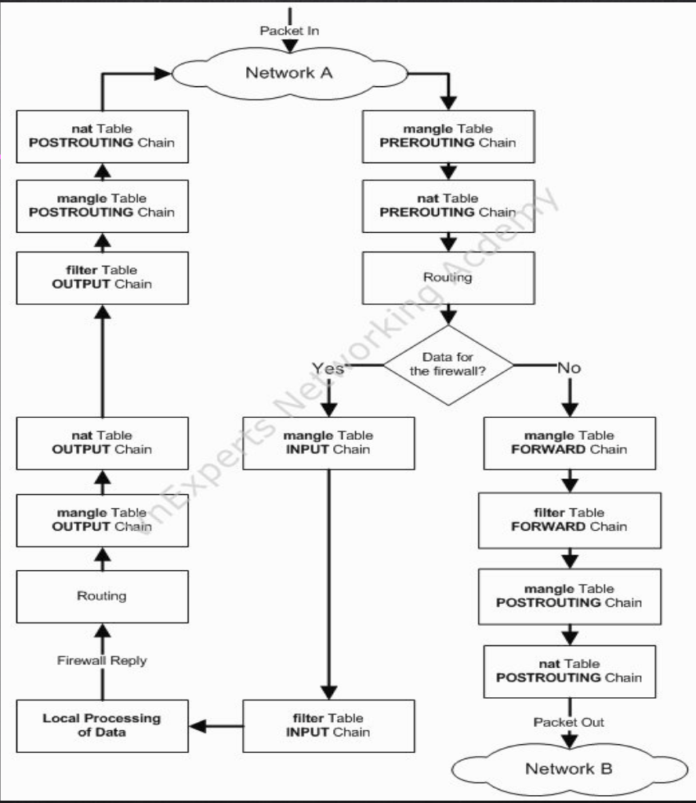
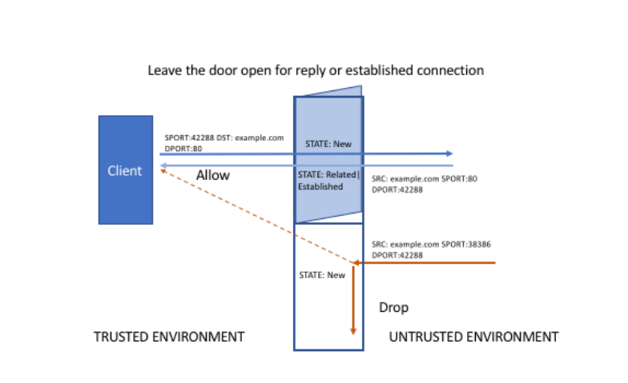

# Giải đáp thắc mắc về Iptables

## Câu hỏi :

1. Tại sao lại có NAT TABLE output chain và NAT TABLE postrouting chain
2. Statefull và stateless
3. Có thêm chain vào TABLE


## Giải đáp :

# Câu hỏi 1:

Hình ảnh từ slide



Đây là hình ảnh thu gọn của đường đi 1 gói tin khi đi vào mạng, qua các Table. Trên thực tế, các gói tin phải đi qua các `hook` của `netfilter`. Để có cái nhìn sâu hơn về luồng hoạt động của gói tin, em mời các anh xem ảnh sau:

```


                                   netfilter hooks

                                  +-----------> local +-----------+
                                  |             process           |
                                  |                               |
                                  |                               |
                                  |                               |
                                  |                               v
  MANGLE            +-------------+--------+               +----------------------+ 
  FILTER            |                      |               |                      |    RAW
  SECURITY          |        input         |               |        output        |    connection tracking
  SNAT              |                      |               |                      |    MANGLE
                    +------+---------------+               +-------+--------------+    DNAT
                           ^                                       |                   routing
                           |                                       |                   FILTER
                           |                                       |                   SECURITY
     +-----------+         |            +---------------------+    |         +-------------+
     |           |                      |                     |    +-------> |             |
+--> |pre routing+----  route    -----> |      forward        |              |post routing +---->
     |           |      lookup          |                     +------------> |             |
     +-----------+                      +---------------------+              +-------------+
     
     RAW                                       MANGLE                         MANGLE
     connection tracking                       FILTER                         SNAT
     MANGLE                                    SECURITY
     DNAT
     routing


```


Mội gói tin sẽ có ba đường đi sau đây:

- Incoming packets destined for the local system: PREROUTING -> INPUT

- Incoming packets destined to another host: PREROUTING -> FORWARD -> POSTROUTING

- Locally generated packets: OUTPUT -> POSTROUTING


Ở câu hỏi 1, gới tin rơi vào trường hợp số 3. Gói tin sẽ phải đi qua hook `OUTPUT` và hook `POSTROUTING`

Nhìn vào ảnh, ta thấy được, khi gói tin đi qua hook `OUTPUT`, nó phải đi qua các `TABLE`: 
- RAW
- DNAT
- FILTER
- SECURITY

Mỗi `TABLE` có các `Chain`, trong các `Chain` có cảc `Rule`, sau khi được thông qua mới đi tiếp đến `hook` tiếp theo.

Ở hook `POSTROUTING`, gói tin tiếp tục được kiểm tra ở các `TABLE` :
- MANGLE
- SNAT

Như vậy, mặc dù cùng đi qua bảng NAT, nhưng thực chất nó đi qua 2 hook riêng biệt, và do đó nó cũng có hành động riêng biệt. Cụ thể ở d dây, khi đi qua hook `OUTPUT`, gói tin trải qua quá trình `DNAT` còn khi đi qua hook `POSTROUTING`. gói tin trải qua quá trình `SNAT`


# Câu hỏi 2:

#### Phân biệt
----

- ***Stateless Packet Filtering***: là dạng bộ lọc không biết được quan hệ của những packet vào với packet đi trước nó hoặc đi sau nó, gọi là cơ chế lọc không phân biệt được trạng thái của các packet, trong kernel 2.0 và 2.2 thì ipfwadm và ipchains chỉ thực hiện được đến mức độ này. Loại firewall này khó có thể bảo vệ được mạng bên trong trước các kiểu tấn công phá hoạt như DoS, SYN flooding, SYN cookie, ping of death, packet fragmentaion hay các hacker chỉ cần dùng công cụ nmap chẳng hạn là có thể biết được trạng thái của các host nằm sau firewall. Điều này không xảy ra với Stateful firewall.


Packet filters thường được hiện thực trên những border routers, sử dụng những tập luật cho trước .Nó quyết định dựa trên các thông tin quan trọng của protocol header:
- IP address filtering.
- TCP or UDP port numbers.
- Protocol type: UDP ,TCP ,ICMP
- Fragmentation.


---


- ***Stateful Packet Filtering***: với mọi packet đi vào mà bộ lọc có thể biết được quan hệ của chúng như thế nào đối với packet đi trước hoặc đi sau nó, ví dụ như các trạng thái bắt tay 3 bước trước khi thực hiện 1 phiên kết nối giao thức TCP/IP (SYN, SYN/ACK, ACK) gọi là firewall có thể phân biệt được trạng thái của các packet. Với loại firewall này, chúng ta có thể xây dựng các quy tắc lọc để có thể ngăn chặn được ngay cả các kiểu tấn công phá hoại như SYN flooding hay Xmas tree... Iptables thuộc loại firewall này. Hơn thế nữa Iptables còn hỗ trợ khả năng giới hạn tốc độ kết nối đối với các kiểu kết nối khác nhau từ bên ngoài, cực kỳ hữu hiệu để ngăn chặn các kiểu tấn công từ chối phục vụ (DoS) mà hiện nay vẫn là mối đe doạ hàng đầu đối vói các website trên thế giới. Một đặc điểm nổi bật nữa của Iptables là nó hỗ trợ chức năng dò tìm chuỗi tương ứng (string pattern matching), chức năng cho phép phát triển firewall lên một mức cao hơn, có thể đưa ra quyết định loại bỏ hay chấp nhận packet dựa trên việc giám sát nội dung của nó. Chức năng này có thể được xem như là can thiệp được đến mức ứng dụng như HTTP, TELNET, FTP... mặc dù thực sự Netfilter Iptables vẫn chỉ hoạt động ở mức mạng (lớp 3 theo mô hình OSI 7 lớp).


Stateful packet filters sử dụng những kỹ thuật giống stateless packet filters,
Nhưng không quyết định dựa trên 01 packet riêng lẻ mà dựa trên toàn bộ việc liên lạc giữa 02 hosts.

Stateful packet filters tăng cường bảo mật bằng cách ghi nhớ các trạng thái kết nối của network và session layers mà chúng đi qua firewall . Những thông tin về session thì được lưu trữ và phân tích trên tất cả các all packets di chuyển qua firewall


**Tóm lại**: 

`stateful filter` sẽ giữ 1 danh sách các connections đã được thiết lập, nó được cho là có hiệu quả hơn trong việc phát hiện các gói tin giả mạo và có thể thực hiện một loạt các functions của IPsec như tunnels và encryption.

`stateless filter` không giữ danh sách ấy, mọi packet đều được process một cách độc lập với nhau. Nó được cho là sẽ xử lí gói tin nhanh hơn.

# Luồng hoạt động

Nhìn vào hình ảnh chi tiết của em ở trên, ta có thể thấy gói tin đi vào bảng `RAW` đầu tiên, sau đó là `connection tracking`. 

**Khái niệm bảng RAW**

`Iptables` là một stateful firewall, điều đó có nghĩa là các gói được kiểm tra liên quan đến trạng thái(state) của nó (Ví dụ: gói có thể là một phần của kết nối mới hoặc có thể là một phần của kết nối hiện có.). Table raw cho phép bạn làm việc với các gói trước khi kernel bắt đầu theo dõi trạng thái của nó, nó cũng giúp loại trừ một số gói tin ra khỏi việc tracking vì ví đề hiệu năng hệ thống.


```
The iptables firewall is stateful, meaning that packets are evaluated in regards to their relation to previous packets. The connection tracking features built on top of the netfilter framework allow iptables to view packets as part of an ongoing connection or session instead of as a stream of discrete, unrelated packets. The connection tracking logic is usually applied very soon after the packet hits the network interface.

The raw table has a very narrowly defined function. Its only purpose is to provide a mechanism for marking packets in order to opt-out of connection tracking.
```


`connection tracking` cho phép iptables đưa ra quyết định về các gói được xem trong bối cảnh kết nối đang diễn ra. Hệ thống theo dõi kết nối cung cấp cho iptables chức năng cần thiết để thực hiện các hoạt động stateful.

`connection tracking` được áp dụng rất sớm sau khi các gói vào networking stack. Chain table `RAW` và một số kiểm tra sơ bộ cơ bản là logic duy nhất được thực hiện trên các gói trước khi liên kết các gói với kết nối.

Hệ thống kiểm tra từng gói dựa trên một tập hợp các kết nối hiện có. Nó sẽ cập nhật trạng thái của kết nối trong cửa hàng của mình nếu cần và sẽ thêm các kết nối mới vào hệ thống khi cần thiết. Các gói đã được đánh dấu với mục tiêu `NOTRACK` trong một trong các chain `RAW` sẽ bỏ qua các thói quen theo dõi kết nối.

`Connection tracking` cho phép iptables đưa ra quyết định cho mỗi gói tin mà nó nhìn thấy dựa vào ngữ cảnh(context) của kết nối đang diễn ra. Quá trình `connection tracking` diễn ra khá sớm trong vòng đời(lifecycle) của một gói tin. Hệ thống sẽ kiểm tra gói tin với tập hợp các kết nối đang có trên hệ thống, cập nhật trạng thái(state) nếu cần hoặc thêm kết nối mới. Các gói tin được đánh dấu bằng target `NOTRACK` từ table `RAW` sẽ được bypass quá trình tracking này.

# **Nói dân dã** :

Tưởng tượng `RAW` và `connection tracking` là hai thằng bảo vệ.

Khi mình ssh, mình gửi gói tin đầu tiên yêu cầu kết nối. Thằng `connection tracking` sẽ đánh trạng thái gói tin đầu tiên của mình là `NEW`. Nhưng sau khi bắt tay ba bước (SYN-SYN+ACK-SYN), thằng `RAW` và `connection tracking`, hai chúng nó sẽ đánh dấu mình là `ESTABLISHED`. Sau đó nó cho mình cái đường hầm riêng biệt để đi cho an toàn, không bị kiểm tra giấy tờ nữa. Gói tin cứ thế mà đi thôi. 

Có một số trường hợp là người quen từ trên Bộ về, cơ to thì cho đi chung đường hầm:  `RELATED` 

- RELATED: Gói tin được gởi tới không thuộc về một kết nối hiện có nhưng có liên quan đến một kết nối đang có trên hệ thống. Đây có thể là một kết nối phụ hỗ trợ cho kết nối chính, ví dụ như giao thức FTP có kết nối chính dùng để chuyển lệnh và kết nối phụ dùng để truyền dữ liệu.

ảnh mình họa :



# Minh họa cấu hình stateful và stateless

For a stateless firewall, you can either accept or drop a packet based on its protocol, port number and origin ip address. For example, the rule below accepts all TCP packets from the 192.168.1.x subnet that are bound for port 80.

```
-A INPUT -p tcp -s 192.168.1.0/24 -m tcp --dport 80 -j ACCEPT
```

For output, the rules look similar. Therefore, outgoing(egress) packets are only accepted if there is a matching rule. The rule below allows only outgoing packets on port 80.
```
-A OUTPUT -o eth0 -p tcp --sport 80 -j ACCEPT
```

For a stateful firewall, you have the ability to monitor state. For example, the rule below only accepts packets to port 80 if it is initiating a new connection or is associated with an existing connection. The tracking is done by a kernel module "ip_conntrack". It keeps a table of all active connections.
```
-A INPUT -p tcp --dport 80 -m state --state NEW,ESTABLISHED -j ACCEPT
```


# Câu hỏi 3:

 thêm Chain vào Table là hoàn toàn có thể, nhưng theo em là không nên nếu chưa hiểu rõ về luồng hoạt động của iptables.

Lý do: 

thêm 1 chain, tức là anh phải thêm rule, thêm policy mặc định, điều này dễ gây xung đột vói các Table khác, Chain khác.

Nếu anh thêm thành công, cũng ko loại trừ trường hợp hiệu suất bị giảm xuống. Vì càng nhiều Chains, rules , gói tin phải `matching` nhiều hơn, làm độ trễ tăng lên. Mà firewawll như một gateway sử lý biết bao nhiêu gói tin.


Nguôn tham khảo :

https://github.com/ImKifu/thuctapsinh/blob/master/HungNK/Linux%20Tool/Netfilter.md


https://www.digitalocean.com/community/tutorials/a-deep-dive-into-iptables-and-netfilter-architecture


https://security.stackexchange.com/questions/74529/using-linux-iptables-to-implement-a-stateless-packet-filtering-firewall


https://github.com/hocchudong/thuctap012017/blob/master/XuanSon/Security/Iptables/docs/Gioi-thieu-Iptables.md


https://chandanduttachowdhury.wordpress.com/2018/03/25/stateful-vs-stateless-firewalls-which-one-to-use-when/


