# Xây dựng mô hình firewall với Firewalld Service

## Lời mở đầu

Sau series những bài tìm hiểu về firewall, hôm nay để tổng kết lại những gì tìm hiểu được, tôi sẽ hướng dẫn các bạn xây dựng mô hnh firewall để các bạn có cái nhìn khách quan hơn cũng như hiểu cách hoạt động.

## Mô hình


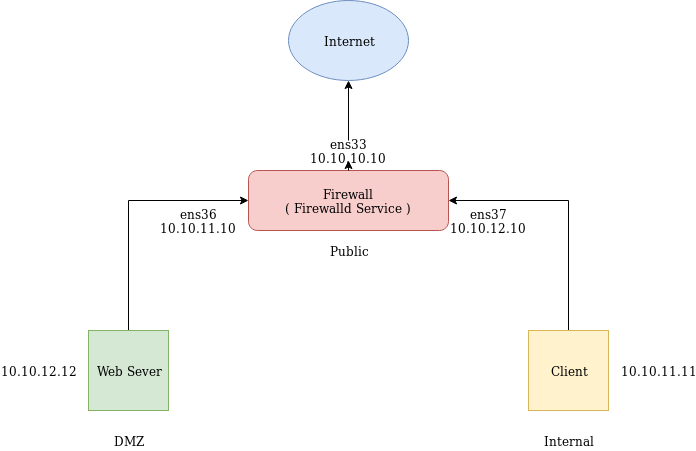


## IP Planning

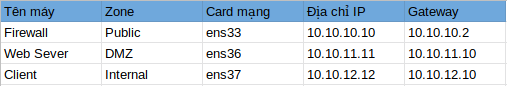


Vì Firewalld quản lý các dịch vụ theo các zone, card mạng, và địa chỉ IP nên tôi sẽ thiết lập 3 zone:

- Zone Public
- Zone DMZ
- Zone Internal

## Cài đặt

### 1. Cài phần cứng

Ở bài hướng dẫn này, tôi dùng máy ảo VMWare để thực hành. Tôi tạo ra 3 máy ảo chạy hệ điều hành CentOS 7, mỗi máy 1GB ram, 10GB ổ cứng. Và tôi tạo ra 3 card mạng theo hình dưới đây ( các card mạng được tôi highlight màu xanh để dễ nhận biết ) :

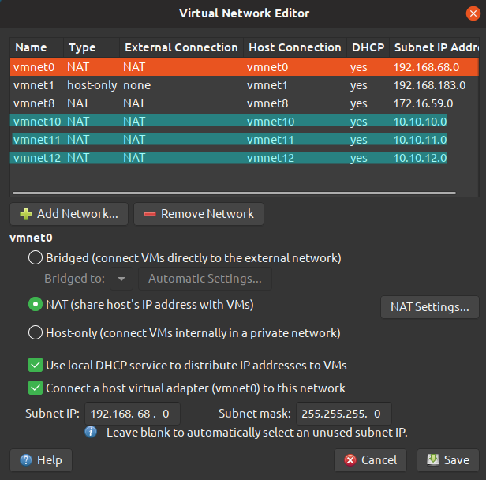


Ở đây tôi không đi vào hướng dẫn chi tiết cài từng con máy ảo, bạn có thể tìm tài liệu hướng dẫn cài máy ảo ở trên mạng, đây là hình ảnh sau khi cài thành công máy ảo sẽ gồm những thành phần như sau :

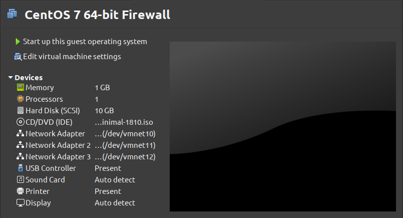

**Chú ý** :

- Máy **Firewall** sẽ có 3 card mạng vmnet10, vmnet11, vmnet12

- Máy **Web Sever** sẽ có 1  card mạng vmnet11

- Máy **Client** sẽ có 1 card mạng vmnet12

### 2. Cài đặt phần mềm

- Đầu tiên, tôi sẽ tiến hành cấu hình địa chỉ IP cho giống với Mô Hình.


#### I. Trên máy Client


Bạn di chuyện vào thư mục chứa file cấu hình card mạng :
```
cd /etc/sysconfig/network-scripts
```
Sau đó bạn liệt kê các file có trong thư mực bằng lệnh `ls`

```
ls
```

OUTPUT mẫu :

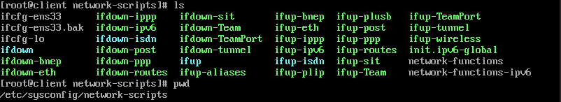

Sau đó bạn tiến hành sửa file `ifcfg-ens33` 
```
vim ifcfg-ens33
```

bạn sửa file với nội dung như sau :

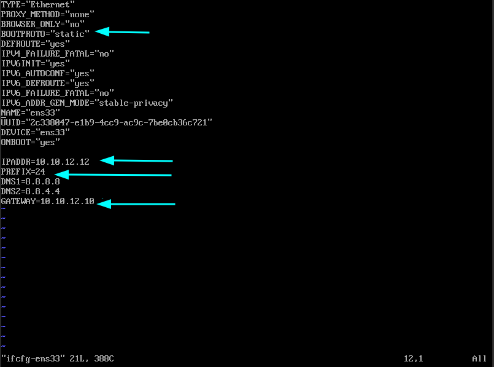

Dòng nào đã có, bạn sửa lại cho giống hình trên, còn dòng nào chưa có, bạn thêm vào. Ở đây tôi sửa 1 dòng từ `dhcp` thành `static` và thêm vào 3 dòng mới, tôi viết vào dưới file.

Bạn đối chiếu với **IP Planning** để chỉnh sửa địa chỉ IP cho chính xác.


Lưu lại và khởi động lại dịch vụ network
```
systemctl restart network
```

Vậy là ta đã cấu hình thành công địa chỉ IP tĩnh cho máy Client. Chúng ta kiểm tra lại bằng câu lệnh sau :
```
ip a
```

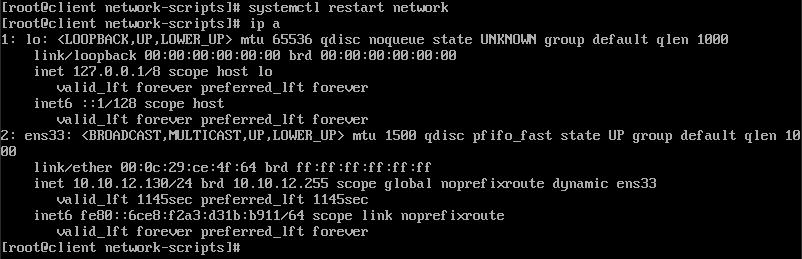

#### II. Trên máy Web Sever

Chúng ta làm tương tự như với **Client**. Sau đây là nội dung file sau khi chỉnh sửa : 

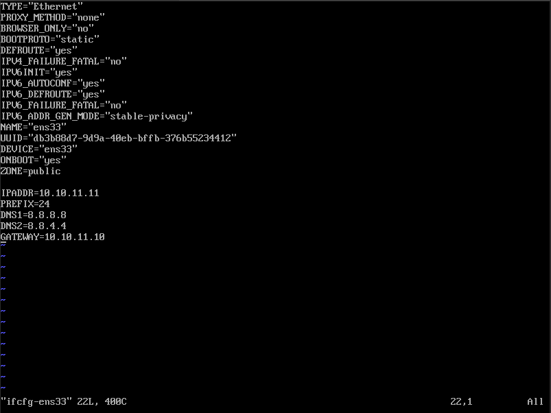


#### III. Trên máy Firewall 

Chúng ta làm tương tự như với **Client**. Sau đây là nội dung file sau khi chỉnh sửa : 

- file ifcfg-ens33

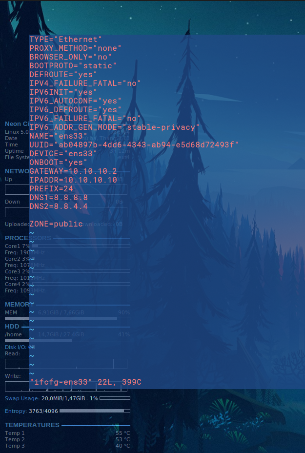


- file ifcfg-ens36

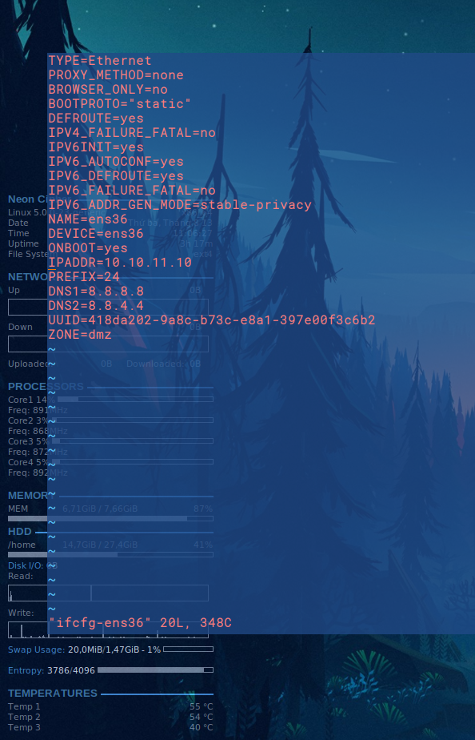


- file ifcfg-ens37

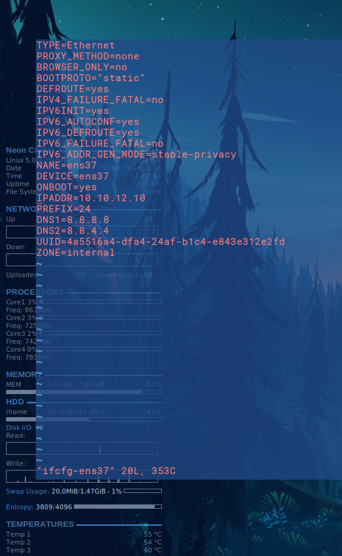


#### Cấu hình Firewalld

Nhìn vào mô hình ở trên, tôi thực hiện biến 1 con máy tính thành Firewall, đóng vai trò như một người gác cổng, lọc cái gói tin vào/ra từ Internet đến máy ở Local ( Internal ) và DMZ. 

Vì vậy, trên máy **Web Sever** và **Client**, tôi thực hiện tắt Firewalld Service.

```
systemctl disable firewalld
systemctl stop firewalld
```

**Chú ý** : nếu bạn cài hệ điều hành khác, bạn cũng phải tắt dịch vụ tường lửa mặc định của máy đó đi. Ở đây, tôi dùng Centos 7 nên mặc định Firewalld được cài đặt và khởi động cùng hệ thống. 

Kiểm tra bằng câu lệnh :
```
systemctl status firewalld
```

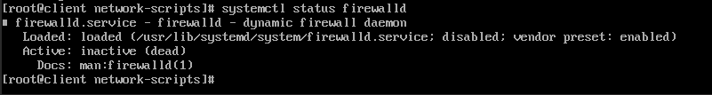


Máy **Firewall** chúng ta cũng kiểm tra bằng câu lệnh :
```
systemctl status firewalld
```

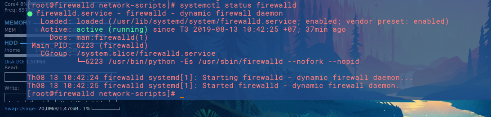


Vậy dịch vị `Firewalld` đang chạy trên máy **Firewall**. Và bây giờ chúng ta sẽ bắt đầu cấu hình.

## Cấu hình ( thực hiện trên máy Firewall )

### Kịch bản 1: Ping giữa 2 máy Client và Web Sever

Kiểm tra tât cả các zone đang hoạt động

```
firewall-cmd --get-active-zones
```

OUTPUT mẫu 

```
public
  interfaces: ens33     ens36      ens37
```

Chúng ta sẽ đổi `interfaces ens36` qua zone `DMZ` và `interfaces ens37` qua zone `Internal` 

Cấu trúc câu lệnh :

```
firewall-cmd --zone=zone-name --change-interface=<interface-name>
```

Bạn nhập lệnh như sau :

```
firewall-cmd --zone=dmz --change-interface=ens36
firewall-cmd --zone=internal --change-interface=ens37
```

**Chú ý** :

Bạn sẽ không phải dùng --permanent option để lưu câu lệnh sau mỗi lần restart. Nếu bạn cài cho một default zone mới, cài đặt sẽ được lưu vĩnh viễn. 

Kiểm tra lại :
```
firewall-cmd --get-active-zones
```
OUTPUT mẫu

```
dmz
  interfaces: ens36
  sources: 10.10.11.11
internal
  interfaces: ens37
  sources: 10.10.12.12
public
  interfaces: ens33
```


Từ đây, chúng ta đã có thể `Ping` từ máy **Client** sang máy **WebSever**. 

### Kịch bản 2: Ping ra ngoài Internet

Masquerade được biết đến là Network Address Translation (NAT), đây là 1 phương pháp cơ bản cho phép máy **Client** kết nối Internet thông qua máy **Firewall** làm trung gian.

Kiểm tra đã bật `Masquerade` chưa: 

```
firewall-cmd --zone=public --query-masquerade
```

nếu OUTPUT trả về là `yes`, thì tức là đã bật rồi, còn nếu là `no`, thì chúng ta tiến hành bật nó lên.

```
firewall-cmd --zone=public --add-masquerade
```

Vậy là chúng ta đã có thể `Ping` ra ngoài Internet

### Kịch bản 3: Cho phép máy Client được SSH đến máy Firewall

Muốn ssh đến máy Firewall trên máy Client, ta chỉ cần thêm dịch vụ vào zone `internal`

```
firewall-cmd --zone=internal --add-service=ssh
```

Muốn thêm dịch vụ ssh vĩnh viễn, không bị mất sau mõi lần reboot firewall thì ta thêm option `--permanent`

```
firewall-cmd --zone=internal --add-service=ssh --permanent
```


## Tổng kết


Vậy là tôi đã hoàn thành mô hình sử dụng dịch vụ Firewalld làm tường lửa. Cảm ơn các bạn đã theo dõi. 

Sau đây là một số link tham khảo :

- tài liệu về firewalld

https://www.tecmint.com/install-configure-firewalld-in-centos-ubuntu/

https://www.liquidweb.com/kb/an-introduction-to-firewalld/

https://access.redhat.com/documentation/en-us/red_hat_enterprise_linux/7/html/security_guide/sec-working_with_zones

https://vicloud.vn/community/cach-thiet-lap-firewall-su-dung-firewalld-tren-centos-7-466.html

https://hocvps.com/firewalld-centos-7/#b._Thi%E1%BA%BFt_l%E1%BA%ADp_cho_Port

- hướng dẫn mở port 

https://vinasupport.com/huong-dan-mo-cong-port-tren-centos-7/

- tìm hiểu về multi-zone

https://www.linuxjournal.com/content/understanding-firewalld-multi-zone-configurations

- Masquerading IP Address and Block/Enable ICMP

https://www.tecmint.com/firewalld-rules-for-centos-7/2/

https://access.redhat.com/documentation/en-us/red_hat_enterprise_linux/7/html/security_guide/sec-managing_icmp_requests

https://docs.fedoraproject.org/en-US/Fedora/19/html/Security_Guide/sec-Configure_Port_Forwarding-CLI.html

- forward

https://www.server-world.info/en/note?os=CentOS_7&p=firewalld&f=2

https://docs.fedoraproject.org/en-US/Fedora/19/html/Security_Guide/sec-Configure_Port_Forwarding-CLI.html

https://serverfault.com/questions/915257/ssh-port-forwarding-with-firewall-cmd

- sửa hostname của máy cho dễ nhìn hơn

https://github.com/oanhhdt/Thuc_tap_NH/blob/master/Linux/docs/Repair_hostname.md