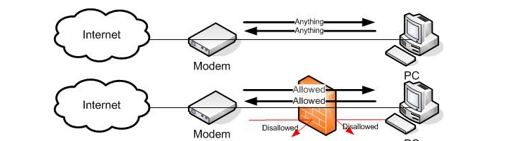
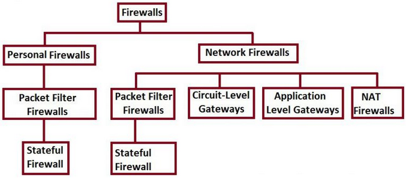
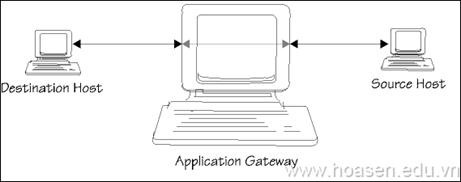
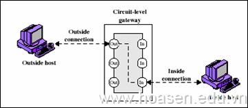
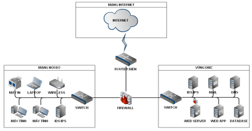
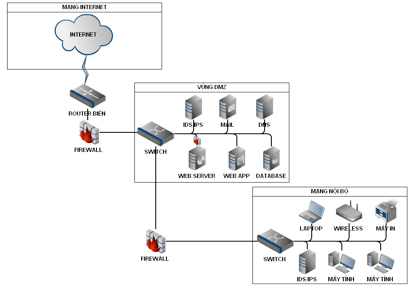
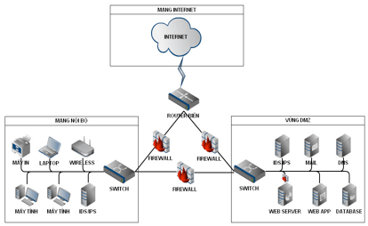

# Firewall

## Tìm hiểu chung về Firewall

### 1. Firewall là gì ?

Firewall (tường lửa) là một giải pháp được tích hợp vào hệ thống mạng để chống sự truy cập trái phép, nhằm bảo vệ các nguồn thông tin nội bộ và hạn chế sự xâm nhập không mong muốn vào hệ thống.

Firewall  là một thuật ngữ trong chuyên ngành mạng máy tính. Nó là một công cụ phần cứng hoặc phần mềm hoặc là cả 2 được tích hợp vào hệ thống để chống lại sự truy cập trái phép, ngăn chặn virus… để đảm bảo nguồn thông tin nội bộ được an toàn, tránh bị kẻ gian đánh cắp thông tin.

### Tại sao cần Firewall? 
Nếu laptop của bạn không được bảo vệ bởi tường lửa, khi bạn kết nối Internet, tất cả các giao thông ra vào mạng đều được cho phép, vì thế hacker, trojan, virus có thể truy cập và lấy cắp thông tin cá nhân của bạn trên máy tính. Chúng có thể cài đặt các đoạn mã để tấn công file dữ liệu trên máy tính. Chúng có thể sử dụng máy tính cuả bạn để tấn công một máy tính của gia đình hoặc doanh nghiệp khác kết nối Internet. Một firewall có thể giúp bạn thoát khỏi gói tin hiểm độc trước khi nó đến hệ thống của bạn.

***`Lý do phải có hệ thống firewall`***

- Bảo vệ hệ thống khi bị tấn công.
- Hạn chế nguy cơ bị tấn công.
- Đảm bảo tính riêng tư.
- Áp đặt các chính sách an ninh cho đơn vị.

### Vai trò và vị trí của firewall

**Vai trò**:

- Vai trò chính là bảo mật thông tin, ngăn chặn sự truy cập không mong muốn từ bên ngoài (Internet) và cấm truy nhập từ bên trong (Intranet) ra bên ngoài (Internet).
- Điều tiết lưu lượng mạng giữa các phân đoạn mạng (bên trong lẫn bên ngoài).
- Là nơi áp đặt các chính sách điều khiển truy cập.

**Vị trí**:

Firewall có thể đặt tại nhiều vị trí khác nhau trong kiến trúc mạng:

- Giữa miền công cộng (public) và miềng riêng tư (private): Firewall mạng.
- Giữa card mạng (NIC) của máy tính với các thành phần còn lại: Firewall cá nhân.

**Ưu điểm và hạn chế của Firewall**

`Ưu điểm:`

- Bảo vệ hệ thống bởi các tấn công (bên trong, bên ngoài).
- Lọc kết nối dựa trên nội dung dữ liệu.
- Thực thi NAT.
- Kết hợp được với hệ thống IDS/IPS.
- Thành phần trong giải pháp phòng thủ theo chiều sâu.

`Hạn chế:`

- Các tấn công ở lớp ứng dụng có thể bị bỏ qua.
- Các kết nối: Dial-up, VPN có thể vượt firewall.
- Quản lý vận hành tương đối phức tạp.
- Tồn tại các điểm yếu nội tại.
- Ảnh hưởng đến tốc độ kết nối.

### 2. Phân loại

Do cá nhân mỗi người mà có quan điểm về cách chia firewall khác nhau. Ở đây tôi sẽ tổng hợp các cách phân loại phổ biến:

#### I) Chia theo `Personal firewall` và `Network firewall`

+ Personal Firewall: Loại này được thiết kế để bảo vệ một máy tính trước sự truy cập trái phép từ bên ngoài. Bên cạnh đó thì Personal Firewall còn được tích hợp thêm tính năng như theo dõi các phần mềm chống virus, phần mềm chống xâm nhập để bảo vệ dữ liệu. Một số Personal Firewall thông dụng như: Microsoft Internet connection firewall, Symantec personal firewall, Cisco Security Agent…. Loại Firewall này thì thích hợp với cá nhân bởi vì thông thường họ chỉ cần bảo vệ máy tính của họ, thường được tích hợp sẵn trong máy tính Laptop, máy tính PC..

+ Network Firewalls: Được thiết kế ra để bảo vệ các host trong mạng trước sự tấn công từ bên ngoài. Chúng ta có các Appliance-Based network Firewalls như Cisco PIX, Cisco ASA, Juniper NetScreen firewall, Nokia firewalls, Symantec’s Enterprise Firewall. Hoặc một số ví dụ về Software-Base firewalls include Check Point’s Firewall, Microsoft ISA Server, Linux-based IPTables.

Điểm khác nhau giữa 2 loại Firewall này đó là số lượng host được Firewall bảo vệ. Bạn hãy nhớ 1 điều là Personal firewall chỉ bảo vệ cho một máy duy nhất còn Network firewall lại khác, nó sẽ bảo vệ cho cả một hệ thống mạng máy tính.

Trong đó, hệ thống Network Firewall được cấu tạo bởi các thành phần chính như sau:

1. Bộ lọc Packet (Packet- Filtering Router)

2. Cổng ứng dụng ( đó là Application-Level Gateway hay Proxy Server).

3. Cổng mạch (Circuite Level Gateway).

Các bạn nhìn vào sơ đồ bên dưới là có thể hình dung ra được 2 loại Firewalls trên:

#### II) Chia theo `Hardware Firewalls` vs `Software Firewalls`

`Hardware firewall` hay còn gọi là firewall cứng nằm giữa mạng máy tính cục bộ của bạn và Internet. Firewall cứng sẽ kiểm tra tất cả các dữ liệu đến từ Internet, đi qua các gói dữ liệu an toàn trong khi chặn các gói dữ liệu nguy hiểm tiềm ẩn.

Để bảo vệ đúng mạng mà không cản trở hiệu suất, firewall cứng yêu cầu thiết lập chuyên gia và do đó có thể không phải là giải pháp khả thi cho các công ty không có bộ phận CNTT chuyên dụng. Tuy nhiên, đối với các doanh nghiệp có nhiều máy tính, có thể kiểm soát an ninh mạng từ một thiết bị đơn giản hóa công việc.

`Hardware firewall` được tích hợp vào bộ định tuyến nằm giữa máy tính và Internet. Họ thường sử dụng lọc gói, có nghĩa là họ quét tiêu đề gói để xác định nguồn gốc, nguồn gốc, địa chỉ đích và kiểm tra với quy tắc người dùng hiện có được xác định để đưa ra quyết định cho phép / từ chối. 

Firewall cứng hoạt động ở tầng thấp hơn Firewall mềm (tầng Network và tầng Transport)

`Hardware firewall` được tích hợp sẵn trên các phần cứng chuyên dụng, thiết kề này dành riêng cho Firewall. 

Một số Firewall cứng như Cisco PIX, WatchGuard Fireboxes, NetScreen firewall, SonicWall Appliaces, Nokia firewall…

+ Ưu điểm:

    - Cung cấp hiệu suất tổng thể tốt hơn so với Firewall mềm vì hệ điều hành của firewall cứng được thiết kế để tối ưu cho firewall.

    - Tính bảo mật cao hơn và tổng chi phí thấp hơn so với Firewall mềm.

+ Nhược điểm:

    - Nó không được linh hoạt như Firewall mềm. Bạn sẽ không thể nào mà tích hợp thêm các chức năng và quy tắc như trên firewall mềm được. Ví dụ như chức năng kiểm soát thư rác đối với firewall mềm thì bạn chỉ cần cài đặt chức năng này như một ứng dụng, nhưng đối với Firewall cứng thì đòi hỏi bạn phải có thiết bị phần cứng hỗ trợ cho chức năng này.

    - Firewall cứng không thể kiểm tra nội dung của một gói tin.

    

    ---------------------
`Software Firewalls` được cài đặt trên các máy tính cá nhân trên mạng. Không giống như tường lửa phần cứng, tường lửa phần mềm có thể dễ dàng phân biệt giữa các chương trình trên máy tính. Điều này cho phép họ cho phép dữ liệu vào một chương trình trong khi chặn một chương trình khác. Tường lửa phần mềm cũng có thể lọc dữ liệu gửi đi, cũng như các phản hồi từ xa cho các yêu cầu gửi đi. Nhược điểm chính của phần mềm tường lửa cho một doanh nghiệp là bảo trì của họ: họ yêu cầu cài đặt, cập nhật và quản trị trên mỗi máy tính cá nhân

Máy tính ở nhà của bạn không phải lúc nào cũng nằm trong mạng gia đình của bạn, đó là lý do tại sao có tường lửa phần mềm cung cấp cho bạn khả năng bảo vệ bổ sung với bạn, ở bất cứ đâu.

Một số Firewall mềm thông dụng: Zone Alarm, Microsoft ISA Server 2006, Norton Firewall, firewalld ( trên Centos 7), UFW ( trên Ubuntu ), ...

+ Ưu điểm:

    - Firewall mềm thường đảm nhận nhiều vai trò hơn firewall cứng, nó có thể đóng vai trò như một DNS server hay một DHCP server.

    - Dễ cấu hình và thiết lập hơn.

    - Tính linh hoạt cao: có thể thêm, bớt các quy tắc, các chức năng.

    - Cho người dùng quyền kiểm soát hoàn toàn lưu lượng truy cập Internet của họ

+ Nhược điểm: 

    - Firewall mềm được cài đặt trên một hệ điều hành do đó không thể loại trừ khả năng có lỗ hổng trên hệ điều hành đó được. Khi lỗ hổng được phát hiện và bạn thực hiện cập nhật bản vá lỗi cho hệ điều hành đó thì bạn nên nâng cấp bản vá cho Firewall luôn, nếu không rất có thể Firewall sẽ hoạt động không ổn định.
    
    - Firewall mềm thường có hiệu suất thấp hơn Firewall cứng.

-------------------------
Ngoài ra còn có `Integrated firewalls`: Hay còn gọi là Firewall tích hợp. Ngoài chức năng cơ bản của Firewall ra thì nó còn đảm nhận các chức năng khác ví dụ như VPN, phát hiện và chống xâm nhập từ bên ngoài, lọc thư rác, chống lại virus…

+ Ưu điểm:

Sử dụng Firewall tích hợp là đơn giản hóa thiết kế mạng bằng cách giảm lượng thiết bị mạng cũng như giảm chi phí quản lý, giảm gánh nặng cho các chuyên viên quản trị, ngoài ra nó còn tiết kiệm chi phí hơn so với việc dùng nhiều thiết bị cho nhiều mục đích khác nhau.

+ Nhược điểm:

Ưu điểm thì là như vậy, tuy nhiên việc tích hợp nhiều chức năng trên cùng một thiết bị sẽ dẫn đến việc khó khăn hơn trong khắc phục sự cố.

#### III) Chia theo chức năng
Phân loại tường lửa

- Firewall packet filter (lọc gói tin)

Firewall lọc gói hoạt động ở lớp mạng của mô hình OSI, hoặc lớp IP của mô hình TCP/IP. Chúng thường là một phần của router, là thiết bị nhận gói từ một mạng và chuyển gói tới mạng khác. Trong firewall lọc gói, mỗi gói được so sánh với tập các tiêu chuẩn trước khi nó được chuyển tiếp. Dựa vào gói và tiêu chuẩn, firewall có thể hủy gói, chuyển tiếp hoặc gởi thông điệp tới nơi tạo gói.

Ví dụ: IP Chains, Router ACLs,…

- Gateway mức mạng (ciruit level gateways)

Gateway mức mạng hoạt động ở lớp session của mô hình OSI, hoặc lớp TCP của mô hình TCP/IP. Chúng giám sát việc thỏa hiệp TCP giữa các gói để xác định rằng một phiên yêu cầu là phù hợp. Thông tin tới máy tính từ xa thông qua một gateway mức mạng, làm cho máy tính ở xa đó nghĩ là thông tin đến từ gateway. Điều này che dấu được thông tin về mạng được bảo vệ.

- Gateway mức ứng dụng (application level gateways)

Các gateway mức ứng dụng, còn được gọi là các proxy, tương tự như các gateway mức mạng ngoại trừ việc chỉ định các ứng dụng. Chúng có thể lọc gói ở lớp ứng dụng của mô hình OSI. Các gói vào hoặc ra không thể truy cập các dịch vụ mà không có proxy.

Ví dụ: Gauntlet, Symantec Enterprise Firewall…

- Firewall nhiều lớp (stateful firewall)

Các firewall nhiều lớp là sự kết hợp hình thức của ba loại firewall. Chúng lọc các gói ở lớp mạng, xác định các gói phù hợp và đánh giá nội dung các gói tại lớp ứng dụng.

Ví dụ: IP Tables, Netscreen,…

### Cách hoạt động

Firewall sẽ sử dụng một hoặc nhiều phương pháp để kiểm soát lưu lượng mạng đến và đi trong một mạng:

- Packet Filtering: Trong phương pháp này, gói tin sẽ được phân tích và so sánh với bộ lọc đã được cấu hình trước đó. Lọc gói tin sẽ có rất nhiều nguyên tắc khác nhau tùy thuộc vào chính sách quản lý của công ty. Mỗi khi một lưu lượng mạng đến và đi, gói tin này sẽ được so sánh với cấu hình sẵn có ở trong firewall, nếu nó được cho phép thì gói tin sẽ được chấp nhận, còn nếu không được cho phép trong cấu hình của firewall, gói tin sẽ bị từ chối đi qua mạng.

- Stateful Inspection: Đây là phương pháp mới hơn, nó không phân tích nội dung của gói tin, thay vào đó, nó so sánh dạng, mẫu của gói tin tới cơ cở dữ liệu được tin tưởng của nó. Cả lưu lượng mạng đến và đi sẽ được đối chiếu tới cơ sở dữ liệu.

### Các thành phần cơ bản của firewall và cơ chế hoạt động

Một firewall bao gồm một hoặc nhiều thành phần sau đây:

- Packet Filtering – Bộ lọc gói tin

- Application Gateway – Cổng ứng dụng

- Circuit Level Gate – Cổng mạch

#### 3.1 Packet Filtering

##### 3.1.1 Nguyên lý hoạt động

Bộ lọc gói tin cho phép hay từ chối packet mà nó nhận được. Nó kiểm tra toàn bộ đoạn dữ liệu để quyết định xem đoạn dữ liệu đó có thỏa mãn một trong các số các rules hay không. Các rules này dựa trên các thông tin ở packet header bao gồm các thông tin sau:

- Địa chỉ IP nguồn (IP Source Address).

- Địa chỉ IP đích (IP Destination Address).

- Protocol (TCP, UDP, ICMP, IP tunnel)

- TCP/UDP source port

- TCP/UDP destination port

- Dạng thông báo ICMP (ICMP message type)

- Cổng gói tin đến (Incomming interface of packet)

- Cổng gói tin đi (Outcomming interface of packet

Packet filtering router

Nếu rules lọc gói được thỏa mãn thì packet được chuyển qua firewall, nếu không packet sẽ bị bỏ đi. Nhờ vậy mà firewall có thể ngăn cản được các kết nối vào các máy chủ hoặc mạng nào đó được xác định, hoặc khóa việc truy cập vào hệ thống mạng nội bộ từ những địa chỉ không cho phép. Ngoài ra, việc kiểm soát các cổng làm cho firewall có khả năng chỉ cho phép một số loại kết nối nhất định vào các loại máy chủ nào đó hoặc những dịch vụ nào đó (SSH, SMTP, FTP…) được phép mới chạy được trên hệ thống mạng cục bộ. 

##### 3.1.2 Ưu điềm và nhược điểm

`Ưu điểm:`

– Đa số các hệ thống firewall đều được sử dụng bộ lọc gói tin. Một trong những ưu điểm của phương pháp dùng bộ lọc gói là chi phí thấp vì cơ chế lọc gói đã có sẵn trong các router.

– Ngoài ra, bộ lọc gói là trong suốt đối với người sử dụng và các ứng dụng vì vậy nó không yêu cầu người sử dụng phải thao tác gì cả.

`Nhược điểm:`

– Việc định nghĩa các chế độ lọc gói là một việc khá phức tạp, nó đòi hỏi người quản trị mạng cần có hiểu biết chi tiết về các dịch vụ internet, các dạng packet header. Khi yêu cầu về lọc gói tin càng lớn, các rules càng trở nên phức tạp do đó rất khó quản lý và điều khiển.

– Do làm việc dựa trên header của các packet nên bộ lọc không kiểm soát được nội dung thông tin của packet. Các packet chuyển qua vẫn có thể mang theo những hành động với ý đồ ăn cắp thông tin hay phá hoại của kẻ xấu. 

#### 3.2 Application Gateway
##### 3.2.1 Nguyên lý hoạt động

Đây là một loại firewall được thiết kế dể tăng cường chức năng kiểm soát các loại dịch vụ, giao thức truy cập vào hệ thống mạng. Cơ chế hoạt động của nó dựa trên cách thức gọi là proxy service. Proxy service là các bộ code đặc biệt cài đặt trên cổng ra (gateway) cho từng ứng dụng. Nếu người quản trị mạng không cài đặt proxy service cho một ứng dụng nào đó, dịch vụ tương ứng sẽ không được cung cấp và do đó không thể chuyển thông tin qua firewall. Ngoài ra, proxy code có thể được định cấu hình để hỗ trợ chỉ một số đặc điểm trong ứng dụng mà người quản trị cho là chấp nhận được trong khi từ chối những đặc điểm khác. 

Application gateway

Một cổng ứng dụng thường được coi như là một Bastion host bởi vì nó được thiết kế đặt biệt để chống lại sự tấn công từ bên ngoài. Những biện pháp đảm bảo an ninh của một Bastion host là:

– Bastion host luôn chạy các version an toàn (secure version) của các phần mềm hệ điều hành (Operating system). Các version an toàn này được thiết kế chuyên cho mục đích chống lại sự tấn công vào hệ điều hành (Operating system) cũng như là đảm bảo sự tích hợp firewall.

– Chỉ những dịch vụ mà người quản trị mạng cho là cần thiết mới được cài đặt trên Bastion host, đơn giản chỉ vì nếu một dịch vụ không được cài đặt, nó không thể bị tấn công. Thông thường, chỉ một số giới hạn các ứng dụng cho các dịch vụ telnet, DNS, FTP, SMTP và xác thực user là được cài đặt trên Bastion host.

– Bastion host có thể yêu cầu nhiều mức độ khác nhau ví dụ như username và password hay smart card.

Mỗi proxy được cài đặt cấu hình để cho phép truy nhập chỉ một số các máy chủ nhất định. Điều này có nghĩa rằng bộ lệnh và đặc điểm thiết lập cho mỗi proxy chỉ đúng với một số máy chủ trên toàn hệ thống.

Mỗi proxy duy trì một quyển nhật ký ghi chép lại toàn bộ chi tiết của dữ liệu mạng đi qua nó. Điều này có nghĩ là bộ lệnh và đặc điểm thiết lập cho mỗi proxy chỉ đúng với một số máy chủ trên toàn hệ thống.

Mỗi proxy đều độc lập với các proxy khác trên Bastion host. Điều này cho phép dễ dàng cài đặt một proxy mới hay tháo gỡ một proxy.
3.2.2 Ưu điểm và nhược điểm

`Ưu điểm:`

– Cho phép người quản trị hoàn toàn điều khiển được từng dịch vụ trên mạng, bởi vì ứng dụng proxy hạn chế bộ lệnh và quyết định những máy chủ nào có thể truy cập bởi các dịch vụ.

– Cổng ứng dụng cho phép kiểm tra độ xác thực rất tốt và nó có nhậy ký ghi chép lại thông tin về truy cập hệ thống.

– Rule lọc cho cổng ứng dụng dễ dàng cấu hình và kiểm tra hơn so với bộ lọc gói.

`Nhược điểm:`

– Cần phải có sự cấu hình trên máy user để user truy cập vào các dịch vụ proxy. Ví dụ telnet 

#### 3.3 Circuit Level Gateway

Circuit Level Gateway – cổng vòng – là một chức năng đặc biệt có thể thực hiện bởi một cổng ứng dụng. Cổng vòng đơn giản chỉ là chuyển tiếp các kết nối TCP mà không thực hiện bất kì một hành động xử lý hay lọc gói nào.

Hình sau minh họa một hành động sử dụng kết nối telnet qua cổng vòng. Cổng vòng đơn giản chuyển tiếp kết nối telnet qua firewall mà không thực hiện một sự kiểm tra, lọc hay điều khiển các thủ tục telnet nào. Cổng vòng làm việc như một sợi dây, sao chép các byte giữa kết nối bên trong (inside connection) và các kết nối bên ngoài (outside connection). Tuy nhiên vì sự kết nối này xuất hiện từ hệ thống firewall nên nó che dấu thông tin về mạng nội bộ. 

Circuit Level Gateway

Cổng vòng thường được sử dụng cho những kết nối ra ngoài. Ưu điểm lớn nhất là một Bastion host có thể được cấu hình như là một hỗn hợp cung cấp cổng ứng dụng cho những kết nối đến và cổng vòng cho các kết nối đi. Điều này làm cho hệ thống firewall dễ dàng sử dụng cho người dùng trong mạng nội bộ muốn trực tiếp truy câp tới các dịch vụ internet, trong khi vẫn cung cấp chức năng bảo vệ mạng nội bộ từ những sự tấn công bên ngoài. 

## Mô hình mạng bảo mật cho doanh nghiệp

***`Một mô hình mạng bảo mật là cần thiết cho mỗi tổ chức để phân biệt rõ ràng giữa các vùng mạng theo chức năng và thiết lập các chính sách an toàn thông tin riêng cho từng vùng mạng theo yêu cầu thực tế.`***

Trước tiên ta cần tìm hiểu về các thành phần trong mô hình mạng bảo mật, các thành phần trong mô hình mạng bao gồm:

1. Vùng mạng nội bộ: Còn gọi là mạng LAN (Local area network), là nơi đặt các thiết bị mạng, máy trạm và máy chủ thuộc mạng nội bộ của đơn vị.

2. Vùng mạng DMZ: Vùng DMZ là một vùng mạng trung lập giữa mạng nội bộ và mạng Internet, là nơi chứa các thông tin cho phép người dùng từ Internet truy xuất vào và chấp nhận các rủi ro tấn công từ Internet. Các dịch vụ thường được triển khai trong vùng DMZ là: máy chủ Web, máy chủ Mail, máy chủ DNS, máy chủ FTP,…

3. Vùng mạng Server (Server Farm): Vùng mạng Server hay Server Farm, là nơi đặt các máy chủ không trực tiếp cung cấp dịch vụ cho mạng Internet. Các máy chủ triển khai ở vùng mạng này thường là Database Server, LDAP Server,…

4. Vùng mạng Internet: Còn gọi là mạng ngoài, kết nối với mạng Internet toàn cầu.

Việc tổ chức mô hình mạng bảo mật đảm bảo bảo mật có ảnh hưởng lớn đến sự an toàn cho các hệ thống mạng và các cổng thông tin điện tử. Đây là cơ sở đầu tiên cho việc xây dựng các hệ thống phòng thủ và bảo vệ. Ngoài ra, việc tổ chức mô hình mạng bảo mật có thể hạn chế được các tấn công từ bên trong và bên ngoài một cách hiệu quả.

### Một số mô hình mạng phổ biến

#### 1. Mô hình 1

Trong mô hình này, vùng mạng Internet, vùng mạng nội bộ và vùng mạng DMZ được thiết kế tách biệt nhau. Ngoài ra, ta đặt một firewall giữa các vùng mạng nhằm kiểm soát luồng thông tin giữa các vùng mạng với nhau và bảo vệ các vùng mạng khỏi các tấn công trái phép.

#### 2. Mô hình 2

Trong mô hình này, ta đặt một firewall giữa vùng mạng Internet và vùng mạng DMZ và một firewall giữa vùng mạng DMZ và vùng mạng nội bộ.

Như vậy, vùng mạng nội bộ nằm sâu bên trong và cách vùng mạng Internet bằng 2 lớp firewall như trên hình vẽ.

#### 3. Mô hình 3

Trong mô hình này, ta đặt một firewall giữa vùng mạng Internet và vùng mạng DMZ , một firewall giữa vùng mạng DMZ và vùng mạng nội bộ và một firewall giữa vùng mạng nội bộ và vùng mạng Internet. Như vậy, mỗi sự truy cập giữa các vùng với nhau đều được kiểm soát bởi một firewall như hình vẽ.

### Một số tiêu chí khi thiết kế mô hình mạng bảo mật

1. Nên đặt các máy chủ web, máy chủ thư điện tử (mail server)… cung cấp dịch vụ ra mạng Internet trong vùng mạng DMZ. Tránh các tấn công mạng nội bộ hoặc gây ảnh hướng tới an toàn mạng nội bộ nếu các máy chủ này bị tấn công và chiếm quyền kiểm soát. Chú ý không đặt máy chủ web, mail server hoặc các máy chủ chỉ cung cấp dịch vụ cho nội bộ trong vùng mạng này.
    
2. Các máy chủ không trực tiếp cung cấp dịch vụ ra mạng ngoài như máy chủ ứng dụng, máy chủ cơ sở dữ liệu, máy chủ xác thực… Nên đặt trong vùng mạng server network để tránh các tấn công trực diện từ Internet và từ mạng nội bộ. Đối với các hệ thống thông tin yêu cầu có mức bảo mật cao, hoặc có nhiều cụm máy chủ khác nhau có thể chia vùng server network thành các vùng nhỏ hơn độc lập để nâng cao tính bảo mật.

3. Nên thiết lập các hệ thống phòng thủ như tường lửa (firewall) và thiết bị phát hiện/phòng chống xâm nhập (IDS/IPS) để bảo vệ hệ thống, chống tấn công và xâm nhập trái phép. Khuyến cáo đặt firewall và IDS/IPS ở các vị trí như sau: đặt firewall giữa đường nối mạng Internet với các vùng mạng khác nhằm hạn chế các tấn công từ mạng từ bên ngoài vào; đặt firewall giữa các vùng mạng nội bộ và mạng DMZ nhằm hạn chế các tấn công giữa các vùng đó; đặt IDS/IPS tại vùng cần theo dõi và bảo vệ.

4. Nên đặt một Router ngoài cùng (Router biên) trước khi kết nối đến nhà cung cấp dịch vụ internet (ISP) để lọc một số lưu lượng không mong muốn và chặn những gói tin đến từ những địa chỉ IP không hợp lệ.

    Nên đặt các máy chủ web, máy chủ thư điện tử (mail server)… cung cấp dịch vụ ra mạng Internet trong vùng mạng DMZ. Tránh các tấn công mạng nội bộ hoặc gây ảnh hướng tới an toàn mạng nội bộ nếu các máy chủ này bị tấn công và chiếm quyền kiểm soát. Chú ý không đặt máy chủ web, mail server hoặc các máy chủ chỉ cung cấp dịch vụ cho nội bộ trong vùng mạng này.
    Các máy chủ không trực tiếp cung cấp dịch vụ ra mạng ngoài như máy chủ ứng dụng, máy chủ cơ sở dữ liệu, máy chủ xác thực… Nên đặt trong vùng mạng server network để tránh các tấn công trực diện từ Internet và từ mạng nội bộ. Đối với các hệ thống thông tin yêu cầu có mức bảo mật cao, hoặc có nhiều cụm máy chủ khác nhau có thể chia vùng server network thành các vùng nhỏ hơn độc lập để nâng cao tính bảo mật.
    Nên thiết lập các hệ thống phòng thủ như tường lửa (firewall) và thiết bị phát hiện/phòng chống xâm nhập (IDS/IPS) để bảo vệ hệ thống, chống tấn công và xâm nhập trái phép. Khuyến cáo đặt firewall và IDS/IPS ở các vị trí như sau: đặt firewall giữa đường nối mạng Internet với các vùng mạng khác nhằm hạn chế các tấn công từ mạng từ bên ngoài vào; đặt firewall giữa các vùng mạng nội bộ và mạng DMZ nhằm hạn chế các tấn công giữa các vùng đó; đặt IDS/IPS tại vùng cần theo dõi và bảo vệ.
    Nên đặt một Router ngoài cùng (Router biên) trước khi kết nối đến nhà cung cấp dịch vụ internet (ISP) để lọc một số lưu lượng không mong muốn và chặn những gói tin đến từ những địa chỉ IP không hợp lệ.

Nguồn tham khảo :

https://nguyentanvy.wordpress.com/2011/11/28/cc-thnh-ph%E1%BA%A7n-c%E1%BB%A7a-firewall-v-c%C6%A1-ch%E1%BA%BF-ho%E1%BA%A1t-d%E1%BB%99ng/

https://vpsgiare.info/firewall-hoat-dong-nhu-the-nao/

https://vnpro.vn/thu-vien/khai-niem-va-phan-loai-firewall-2127.html

https://blogchiasekienthuc.com/dan-cong-nghe/firewall-la-gi-tim-hieu-ky-hon-ve-firewall.html#ii-co-may-loai-firewall

https://netsystem.vn/tim-hieu-ve-firewall-su-khac-nhau-giua-firewall-cung-va-mem-la-gi/

https://netsystem.vn/chuc-nang-cua-firewall-la-gi/

https://securitydaily.net/network-mo-hinh-mang-hop-ly/

https://securitydaily.net/network-security-tong-quan-ve-tuong-lua/

https://www.vietnetco.vn/internal-firewall-he-thong-phong-ve-mang-noi-bo.html
