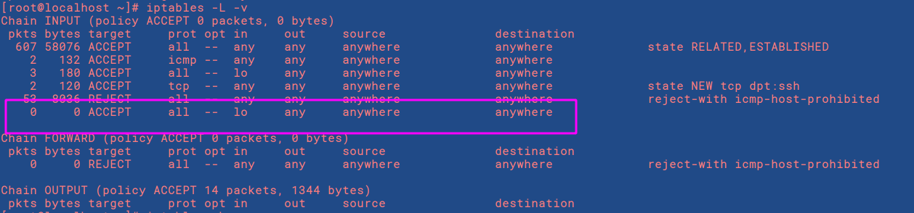

# Iptables Service

## I. Giới thiệu về Iptables Service

Iptables Service là Firewall được cấu hình và hoạt động trên nền Console rất nhỏ và tiện dụng, Iptables do Netfilter Organiztion viết ra để tăng tính năng bảo mật trên hệ thống Linux. Iptables cung cấp các tính năng sau:

Tích hợp tốt với kernel của Linux. Có khả năng phân tích package hiệu quả. Lọc package dựa vào MAC và một số cờ hiệu trong TCP Header. Cung cấp chi tiết các tùy chọn để ghi nhận sự kiện hệ thống. Cung cấp kỹ thuật NAT. Có khả năng ngăn chặn một số cơ chế tấn công theo kiểu DoS.
 
### 1. Các tính năng chính

- stateless packet filtering (IPv4 and IPv6)

- stateful packet filtering (IPv4 and IPv6)

- all kinds of network address and port translation, e.g. NAT/NAPT (IPv4 and IPv6)

- flexible and extensible infrastructure

- multiple layers of API's for 3rd party extensions

### 2. Người dùng có thể làm gì với iptables?

- Xây dựng một hệ thống tường lửa cho hệ thống dựa trên stateless và stateful packet filtering

- Triển khai một cụm cluster stateless và stateful firewall

- Dùng NAT và masquerading để chia sẻ kết nối internet

- Dùng NAT để xây dựng transparent proxies

- Thực hiệm một số tác vụ với packet như thay đổi TOS/DSCP/ECN trong IP header

## II. Tìm hiểu các khái niệm cơ bản về Iptables

Các bạn vui lòng đọc bài này: [Các bạn bấm vào đây](https://github.com/ImKifu/thuctapsinh/blob/master/HungNK/Linux%20Tool/Netfilter.md)

Bài này sẽ cho ta kiến thức tổng quan, khái niệm cũng như hiểu cách gói tin đi qua firewall.

Chúng ta sẽ tìm hiểu được hai tầng đáy ( Netfilter và Iptables Command )

Ảnh mô tả:


## III. SỬ DỤNG IPTABLES

### 1. Cài đặt

IPTABLES command được cài mặc định trong hệ thống Linux. Package của iptables là iptables-version.rpm hoặc iptables-version.tgz

Tôi đang thực hành trên môi trường Centos 7. Vì vậy firewall mặc định của Centos 7 là Firewalld. Chúng ta muốn thực hành Iptables, chúng ta phải tắt Firewalld đi.

- Tắt Firewalld
```
systemctl stop firewalld
systemctl mask firewalld
```

- Lệnh cài đặt
```
sudo yum install iptables
```

- Khởi động Iptable cùng hệ thống
```
systemctl enable iptables
systemctl enable ip6tables
```

- Bật Iptables
```
systemctl start iptables
systemctl start ip6tables
```

- Kiểm tra trạng thái
```
[root@localhost log]# systemctl status iptables
● iptables.service - IPv4 firewall with iptables
   Loaded: loaded (/usr/lib/systemd/system/iptables.service; enabled; vendor preset: disabled)
   Active: active (exited) since T2 2019-07-29 23:39:22 EDT; 10s ago
  Process: 1710 ExecStart=/usr/libexec/iptables/iptables.init start (code=exited, status=0/SUCCESS)
 Main PID: 1710 (code=exited, status=0/SUCCESS)
   CGroup: /system.slice/iptables.service

Th07 29 23:39:22 localhost.localdomain systemd[1]: Starting IPv4 firewall with iptables...
Th07 29 23:39:22 localhost.localdomain iptables.init[1710]: iptables: Applying firewall rules: [  OK  ]
Th07 29 23:39:22 localhost.localdomain systemd[1]: Started IPv4 firewall with iptables.
Hint: Some lines were ellipsized, use -l to show in full.
```
```
[root@localhost log]# systemctl status ip6tables
● ip6tables.service - IPv6 firewall with ip6tables
   Loaded: loaded (/usr/lib/systemd/system/ip6tables.service; enabled; vendor preset: disabled)
   Active: active (exited) since T2 2019-07-29 23:39:30 EDT; 11s ago
  Process: 1739 ExecStart=/usr/libexec/iptables/ip6tables.init start (code=exited, status=0/SUCCESS)
 Main PID: 1739 (code=exited, status=0/SUCCESS)

Th07 29 23:39:30 localhost.localdomain systemd[1]: Starting IPv6 firewall with ip6tables...
Th07 29 23:39:30 localhost.localdomain ip6tables.init[1739]: ip6tables: Applying firewall rules: [... ]
Th07 29 23:39:30 localhost.localdomain systemd[1]: Started IPv6 firewall with ip6tables.
Hint: Some lines were ellipsized, use -l to show in full.
```

### 2. Bắt đầu với Iptables

Trước khi bắt đầu, tôi sẽ cho bạn xem danh sách một số quy tắc tường lửa cần thiết trong mỗi server. 

```
TARGET    PROT   OPT  IN   OUT   SOURCE     DESTINATION
ACCEPT    all    --   lo   any   anywhere   anywhere
ACCEPT    all    --   any  any   anywhere   anywhere    ctstate  RELATED,ESTABLISHED
ACCEPT    tcp    --   any  any   anywhere   anywhere    tcp      dpt:ssh
ACCEPT    tcp    --   any  any   anywhere   anywhere    tcp      dpt:http
ACCEPT    tcp    --   any  any   anywhere   anywhere    tcp      dpt:https
DROP      all    --   any  any   anywhere   anywhere
```

Ngay dòng thứ nhất, chúng ta có các cột như `TARGET, PROT, OPT, IN, OUT, SOURCE, DESTINATION`, ý nghĩa của mỗi cột là như sau:

- TARGET: Hành động sẽ thực thi cho mỗi chuỗi quy tắc.

- PROT: Là viết tắt của chữ Protocol, nghĩa là giao thức. Tức là các giao thức sẽ được áp dụng để thực thi quy tắc này. Ở đây chúng ta có 3 lựa chọn là all, tcp hoặc udp. Các ứng dụng như SSH, FTP, sFTP,..đều sử dụng giao thức kiểu TCP.

- IN: Thiết bị mạng nhận kết nối vào được áp dụng cho quy tắc, chẳng hạn như lo, eth0, eth1.

- OUT: Thiết bị mạng phục vụ nhu cầu gửi kết nối ra ngoài được áp dụng quy tắc.

- DESTINATION: Địa chỉ của lượt truy cập được phép áp dụng quy tắc.

Để dễ hiểu hơn, tối sẽ lấy quy tắc thứ nhất ra giải thích cho các bạn nhé:
```
ACCEPT    all    --   lo   any   anywhere   anywhere
```

Chấp nhận toàn bộ kết nối thông qua thiết bị lo, lo ở đây nghĩa là “Loopback Interface“, là một thiết bị mạng ảo nội bộ, chẳng hạn như IP 127.0.0.1 là kết nối qua thiết bị này.

```
ACCEPT    all    --   any  any   anywhere   anywhere    ctstate  RELATED,ESTABLISHED
```
Cho phép giữ lại các kết nối hiện tại. Nghĩa là khi bạn đang ở trong SSH và sửa đổi lại Firewall, nó sẽ không đá bạn ra khỏi SSH nếu bạn không thỏa mãn quy tắc.

```
ACCEPT    tcp    --   any  any   anywhere   anywhere    tcp      dpt:ssh
```
Cho phép kết nối vào SSH Server ở bất cứ thiết bị nào, bất cứ ai và bất cứ đâu. Mặc định nó sẽ hiển thị dpt:ssh để biểu diễn cổng 22 của SSH, nếu bạn đổi SSH thành cổng khác thì nó sẽ hiển số cổng.

```
ACCEPT    tcp    --   any  any   anywhere   anywhere    tcp      dpt:http
```
Cho phép kết nối vào cổng 80, mặc định nó sẽ biểu diễn bằng chữ http.

```
ACCEPT    tcp    --   any  any   anywhere   anywhere    tcp      dpt:https
```
Cho phép kết nối vào cổng 443, mặc định nó sẽ biểu diễn bằng chữ https.

```
DROP      all    --   any  any   anywhere   anywhere
```
Ngắt các kết nối ở mọi kết nối khác nếu không thuộc những loại kết nối ở trên.

### 3. Cách tạo một quy tắc mới

Nếu iptables của bạn chưa được thiết lập thì bạn gõ lệnh iptables -L -v nó sẽ trả kết quả về giống thế này:
```
[root@localhost ~]# iptables -L -v
Chain INPUT (policy ACCEPT 0 packets, 0 bytes)
 pkts bytes target     prot opt in     out     source               destination         
   56  7357 ACCEPT     all  --  any    any     anywhere             anywhere             state RELATED,ESTABLISHED
    2   132 ACCEPT     icmp --  any    any     anywhere             anywhere            
    1    60 ACCEPT     all  --  lo     any     anywhere             anywhere            
    1    60 ACCEPT     tcp  --  any    any     anywhere             anywhere             state NEW tcp dpt:ssh
   41  5005 REJECT     all  --  any    any     anywhere             anywhere             reject-with icmp-host-prohibited

Chain FORWARD (policy ACCEPT 0 packets, 0 bytes)
 pkts bytes target     prot opt in     out     source               destination         
    0     0 REJECT     all  --  any    any     anywhere             anywhere             reject-with icmp-host-prohibited

Chain OUTPUT (policy ACCEPT 110 packets, 12352 bytes)
 pkts bytes target     prot opt in     out     source               destination         
[root@localhost ~]# 
```

Từ output trên, bạn sẽ thấy nó được chia ra làm 3 nhóm với 3 kiểu quy tắc đó là:

- INPUT: áp dụng cho các kết nối đi vào.

- FORWARD: áp dụng cho các kết nối đã được trỏ đến một vị trí khác.

- OUTPUT: áp dụng cho các kết nối ra ngoài từ máy chủ.

Tuy trên kia của tôi đã có sẵn một số quy tắc, nhưng không sao tôi vẫn sẽ thêm các quy tấc từng bước lại để các bạn theo dõi.

Ok, bây giờ chúng ta sẽ thêm một quy tắc đơn giản vào iptables với lệnh sau:
```
iptables -A INPUT -i lo -j ACCEPT
```
Đoạn trên có nghĩa là:

- -A INPUT: khai báo kiểu kết nối sẽ được áp dụng (A nghĩa là Append).

- -i lo: Khai báo thiết bị mạng được áp dụng (i nghĩa là Interface).

- -j ACCEPT: khai báo hành động sẽ được áp dụng cho quy tắc này (j nghĩa là Jump).

Và bây giờ hãy thử gõ lại lệnh `iptables -L -v` nhé, bạn sẽ thấy quy tắc chúng ta vừa thêm đã xuất hiện trong đó.



Sau khi thêm một quy tắc hay làm bất cứ việc gì xong, nhớ gõ lệnh lưu quy tắc và khởi động lại iptables để nó áp dụng thay đổi.

```
service iptables save
service iptables restart
```
Tiếp tục bây giờ chúng ta thêm một quy tắc để cho phép lưu lại các kết nối hiện tại để tránh hiện tượng tự block bạn ra khỏi máy chủ.
```
iptables -A INPUT -m conntrack --ctstate RELATED,ESTABLISHED -j ACCEPT
```
Đoạn trên cấu trúc cũng như quy tắc chúng ta vừa thêm, nhưng nó sẽ có thêm hai tham số mới là:

- -m conntrack: Áp dụng cho các kết nối thuộc module tên là “Connection Tracking“. Module này sẽ có 4 kiểu kết nối là NEW, ESTABLISHED, RELATED và INVALID. Cụ thể là ở quy tắc này chúng ta sẽ sử dụng kiểu RELATED và ESTABLISHED để lọc các kết nối đang truy cập.

- –ctstate RELATED,ESTABLISHED: Khai báo loại kết nối được áp dụng của cái module Connection Tracking mà mình đã nói ở trên.

Và đây là đoạn tạo quy tắc cho phép truy cập cổng 22 của SSH.
```
iptables -A INPUT -p tcp --dport 22 -j ACCEPT
```
- -p tcp: Giao thức được áp dụng.

- –dport 22: Cổng cho phép áp dụng.

Và cho phép truy cập cổng 80
```
iptables -A INPUT -p tcp --dport 80 -j ACCEPT
```
Nhưng sẽ khóa toàn bộ các kết nối còn lại:
```
iptables -A INPUT -j DROP
```
Bây giờ bạn đã có đủ các quy tắc cần thiết mà mình đã đề cập ở đầu bài rồi đó.

### 4. Bổ sung một quy tắc

Ở phần tạo quy tắc, bạn có để ý là chúng ta luôn sử dụng tham số -A (tức là Append) để nối một quy tắc mới vào danh sách các quy tắc của iptables, mỗi khi tạo mới một quy tắc nó sẽ tự động đưa vào cuối cùng.

Nhưng nếu bạn muốn thêm một quy tắc và đặt nó vào vị trí như mong muốn thì sẽ sử dụng tham số -I thay cho -A, chẳng hạn như:
```
iptables -I INPUT 2 -p tcp --dport 443 -j ACCEPT
```

Trong đó, -I INPUT 2 nghĩa là mình đặt quy tắc này vào dòng thứ 2 trong danh sách các quy tắc thuộc loại kết nối INPUT. Cũng xin nói thêm là cổng 443 chính là cổng HTTPS/SSL.

**Tại sao phải có option -I**

Khi một gói tin được các quy tắc duyệt từ trên xuống dưới, ( rule đầu tiên có số thứ tự là 1 ) nêu gói tin trùng với quy tắc nào trước thì nó sẽ dừng lại ở quy tắc đấy, và không kiểm tra các quy tắc còn lại. Vậy nếu như mình để quy tắc của mình thêm vào ở số thứ tự thấp quá, nó sẽ không được duyệt đến.

### 5. Cách xóa một quy tắc

Ở trên mình đã có nói qua cách thêm một quy tắc để cho phép kết nối vào cổng 22 của SSH. Nhưng nếu bạn đã đổi cổng SSH rồi thì dĩ nhiên chúng ta sẽ không cần quy tắc này nữa, nên sẽ cần xóa nó đi để thêm một quy tắc mới.

Trước khi xóa một quy tắc, bạn cần phải xác định được quy tắc này nằm ở hàng thứ mấy trong loại kết nối (INPUT, OUTPUT,..). Bạn cứ gõ lệnh `iptables -L` ra và xem rồi đếm.
```
Chain INPUT (policy ACCEPT)
target     prot opt source               destination
ACCEPT     all  --  anywhere             anywhere
ACCEPT     tcp  --  anywhere             anywhere            tcp dpt:https
ACCEPT     all  --  anywhere             anywhere            ctstate RELATED,ESTABLISHED
ACCEPT     tcp  --  anywhere             anywhere            tcp dpt:ssh
ACCEPT     tcp  --  anywhere             anywhere            tcp dpt:http
DROP       all  --  anywhere             anywhere
 
Chain FORWARD (policy ACCEPT)
target     prot opt source               destination
 
Chain OUTPUT (policy ACCEPT)
target     prot opt source               destination
```

Vậy ở đây là mình cần xóa quy tắc số 4 của INPUT.
```
iptables -D INPUT 4
```
Ngoài ra, nếu bạn muốn xóa toàn bộ các quy tắc chứa hành động DROP thì có thể sử dụng lệnh sau:
```
iptables -D INPUT -j DROP
```

### 6. Lưu quy tắc

Sau khi thêm một quy tắc hay làm bất cứ việc gì xong, nhớ gõ lệnh lưu quy tắc và khởi động lại iptables để nó áp dụng thay đổi.

```
service iptables save
service iptables restart
```
hoặc 
```
iptables-save | sudo tee /etc/sysconfig/iptables
```
ngoài ra còn có câu lệnh để lưu giữ vào cấu hình hệ thống: 
```
sudo /sbin/iptables-save
```
Tại CentOS, cấu hình được lưu tại /etc/sysconfig/iptables.


### 7. File log

Tại Centos 7, file log được lưu ở /var/log/messages 

**Chú ý**:

Mặc định ko có log nào được ghi vì bạn đâu có thêm rule ghi lại log.

Muốn ghi lại logfile phải thêm rule 
```
iptables -A INPUT -j LOG --log-prefix ' [thứ gì đó bạn muốn dán nhãn] '
```

bạn sẽ thấy file `messages` rất hạn chế, nó lưu log của rất nhiều service khác. Nên sẽ tốt hơn nếu bạn lưu ra 1 file riêng chỉ có log file của Iptables. Cách làm như sau:


tạo file với đường dẫn sau: 
```
vim /var/log/iptables.log
```

thêm nội dung sau vào file vừa tạo:
```
:msg, startswith, "iptables: " -/var/log/iptables.log
& ~
```

The first line means send all messages that start with “iptables: ” to /var/log/iptables.log. The second line means discard the messages that were matched in the previous line. The second line is of course optional, but it saves the trouble of explicitly filtering out firewall logs from subsequent syslog rules.


vào file `/etc/rsyslog.conf` và thê dòng sau:

```
kern.warning /var/log/iptables.log
```

sau đó restart rsyslog service 
```
service rsyslog restart
```


Kiểm tra :

Chặn ping 
```
iptables -A INPUT -p icmp --icmp-type echo-request -j REJECT
```

chỉ định rule ghi log
```
iptables -A INPUT -j LOG --log-prefix='iptables'
```

ping và kiểm tra file `iptables.log`

-----------

Tài liệu về lưu log ra file khác: 

https://blog.shadypixel.com/log-iptables-messages-to-a-separate-file-with-rsyslog/


https://tecadmin.net/enable-logging-in-iptables-on-linux/

https://unix.stackexchange.com/questions/423778/log-iptables-events-on-centos-7

https://www.centos.org/forums/viewtopic.php?t=44666

https://cuongquach.com/huong-dan-chan-ping-tren-linux.html

https://www.cyberciti.biz/tips/force-iptables-to-log-messages-to-a-different-log-file.html

https://blog.shadypixel.com/log-iptables-messages-to-a-separate-file-with-rsyslog/

https://serverfault.com/questions/752711/iptables-how-to-log-and-set-a-specific-log-file


Tài liệu các câu lệnh hay dùng :

https://www.cyberciti.biz/tips/linux-iptables-examples.html


https://www.digitalocean.com/community/tutorials/iptables-essentials-common-firewall-rules-and-commands


Nguồn tài liệu tham khảo để viêt bài :

https://support.rackspace.com/how-to/use-iptables-with-centos-7/

https://hocvps.com/iptables/

https://github.com/hocchudong/thuctap012017/blob/master/TVBO/docs/Firewalls/iptables/docs/iptables-about.md 

https://www.gocit.vn/bai-viet/iptables-vs-firewalld/

https://adminvietnam.org/tong-quan-iptables/1841/

https://thachpham.com/linux-webserver/iptables-linux-toan-tap.html

https://viblo.asia/p/network-tim-hieu-ve-iptables-n7prv348RKod

https://www.hostinger.vn/huong-dan/huong-dan-iptables-bao-mat-ubuntu-vps-voi-linux-firewall/

https://hocvps.com/iptables/

https://www.cyberciti.biz/tips/linux-iptables-examples.html

Bài viết hay mà chưa kịp dịch :

https://www.booleanworld.com/depth-guide-iptables-linux-firewall/