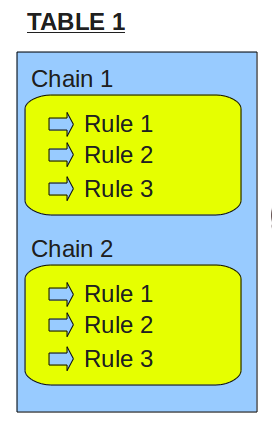
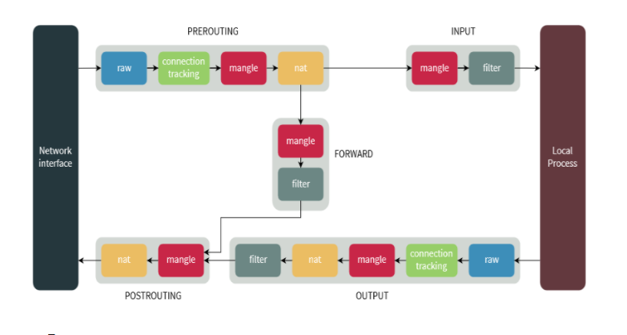

# A Deep Dive into Iptables and Netfilter Architecture

## Lời mở đầu

Tường lửa là một công cụ quan trọng có thể được cấu hình để bảo vệ máy chủ và cơ sở hạ tầng của bạn. Trong hệ sinh thái Linux, iptables là một công cụ tường lửa được sử dụng rộng rãi, giao tiếp với `kernel's netfilter packet filtering framework`. Đối với người dùng và quản trị viên không hiểu kiến trúc của các hệ thống này, việc tạo các chính sách tường lửa đáng tin cậy có thể gây khó khăn, không chỉ do cú pháp thách thức mà còn do số lượng các phần có liên quan có trong framework.

Trong hướng dẫn này, tôi sẽ đi sâu vào kiến trúc iptables với mục đích làm cho nó dễ hiểu hơn cho những người dùng cần xây dựng chính sách tường lửa của riêng họ. Tôi sẽ thảo luận về cách iptables tương tác với netfilter và cách các thành phần khác nhau khớp với nhau để cung cấp một hệ thống lọc và xáo trộn toàn diện.

## Stateless and stateful filtering mechanisms

`stateful filter` sẽ giữ 1 danh sách các connections đã được thiết lập, nó được cho là có hiệu quả hơn trong việc phát hiện các gói tin giả mạo và có thể thực hiện một loạt các functions của IPsec như tunnels và encryption.

`stateless filter` không giữ danh sách ấy, mọi packet đều được process một cách độc lập với nhau. Nó được cho là sẽ xử lí gói tin nhanh hơn.

[Link tham khảo bấm vào đây](https://ostec.blog/en/perimeter/firewall-stateful-stateless)


## IPTables và Netfilter là gì?

Phần mềm tường lửa cơ bản được sử dụng phổ biến nhất trong Linux được gọi là `iptables`. Tường lửa `iptables` hoạt động bằng cách tương tác với các móc lọc gói trong `Linux kernel's networking stack`. Những kernel hooks này được gọi là `netfilter` framework .

Mỗi gói đi vào hệ thống mạng (đến hoặc đi) sẽ kích hoạt các hook này khi nó đi qua `stack`, cho phép các chương trình đăng ký với các hook này tương tác với lưu lượng tại các điểm chính. Các `kernel modules` được liên kết với `iptables` đăng ký tại các hook này để đảm bảo lưu lượng tuân thủ các điều kiện được quy định bởi các quy tắc tường lửa.

## Netfilter Hooks

Có năm hook `netfilter` mà các chương trình có thể đăng ký. Khi các gói tiến triển qua stack, chúng sẽ kích hoạt các mô-đun hạt nhân đã đăng ký với các hook này. Các hook mà gói tin sẽ kích hoạt tùy thuộc vào việc gói đến hay đi, đích đến của gói và liệu gói bị rơi hay bị từ chối tại điểm trước đó.    

Các móc sau biểu thị các điểm được xác định rõ trong networking stack:

- NF_IP_PRE_ROUTING: Hook này sẽ được kích hoạt bởi bất kỳ lưu lượng truy cập đến nào ngay sau khi vào ngăn xếp mạng. Hook này được xử lý trước khi bất kỳ quyết định định tuyến nào được đưa ra liên quan đến nơi gửi gói. 

- NF_IP_LOCAL_IN: Hook này được kích hoạt sau khi gói đến được định tuyến nếu gói được định sẵn cho hệ thống cục bộ. 

- NF_IP_FORWARD: Hook này được kích hoạt sau khi gói đến được định tuyến nếu gói được chuyển tiếp đến máy chủ khác. 

- NF_IP_LOCAL_OUT: Hook này được kích hoạt bởi bất kỳ lưu lượng truy cập ngoài được tạo cục bộ nào ngay khi nó chạm vào ngăn xếp mạng. 

- NF_IP_POST_ROUTING: Hook này được kích hoạt bởi bất kỳ lưu lượng đi hoặc chuyển tiếp nào sau khi định tuyến đã diễn ra và ngay trước khi được đưa ra trên dây.

Kernel modules muốn đăng ký tại các hook này phải cung cấp số ưu tiên để giúp xác định thứ tự chúng sẽ được gọi khi hook được kích hoạt. Điều này cung cấp phương tiện cho nhiều modules (hoặc nhiều phiên bản của cùng một ) được kết nối với từng hook nối theo thứ tự xác định. Mỗi modules sẽ được gọi lần lượt và sẽ trả lại quyết định cho `netfilter framework` sau khi xử lý cho biết những gì sẽ được thực hiện với gói.

## Iptables

Iptables chỉ là giao diện dòng lệnh để tương tác với tính năng packet filtering của `netfilter` framework. 

Cơ chế packet filtering của iptables hoạt động bao gồm 3 thành phần sau: tables, chains và targets.

## IPTables Tables and Chains

Tường lửa `iptables` sử dụng các `bảng` để tổ chức các quy tắc của nó. Các `bảng` này phân loại các quy tắc theo loại quyết định mà chúng được sử dụng để đưa ra. Chẳng hạn, nếu một quy tắc liên quan đến dịch địa chỉ mạng, nó sẽ được đưa vào `bảng nat`. Nếu quy tắc được sử dụng để quyết định có cho phép gói tin tiếp tục đến đích hay không, nó có thể sẽ được thêm vào `bảng filter`.

Trong mỗi `bảng` `iptables`, các quy tắc được tổ chức thêm trong các `chain` riêng biệt. Trong khi các bảng được xác định bởi mục đích chung của các quy tắc mà chúng nắm giữ, các `chain` tích hợp đại diện cho các hook lọc bộ lọc mạng kích hoạt chúng. Chains cơ bản xác định khi nào các quy tắc sẽ được đánh giá.

Như bạn có thể thấy, tên của các `chain` gần như trùng với tên của các `hook` lọc mạng mà chúng được liên kết với:

- PREROUTING: Triggered by the NF_IP_PRE_ROUTING hook.

- INPUT: Triggered by the NF_IP_LOCAL_IN hook.

- FORWARD: Triggered by the NF_IP_FORWARD hook.

- OUTPUT: Triggered by the NF_IP_LOCAL_OUT hook.

- POSTROUTING: Triggered by the NF_IP_POST_ROUTING hook.

| Chain | Rule |
|-------|------|
| Chain PREROUTING | Rule trong chain này được thực thi ngay khi gói tin vừa vào đến giao diện mạng(Network Interface). Chain này tồn tại ở các table: nat, mangle và raw.
|Chain INPUT | Rule trong chain này được thực thi ngay trước khi gói tin gặp tiến trình(process). Chain này chỉ tồn tại ở table mangle và nat.
| Chain OUTPUT | Rule trong chain này được thực thi ngay sau khi gói tin được tiến trình tạo ra. Chain này tồn tại ở các table: raw, mangle, nat và filter.
| Chain FORWARD | Rule này thực thi cho các gói tin được định tuyến qua host hiện tại. Chain này chỉ tồn tại ở table mangle và filter.
| Chain POSTROUTING | Rule này thực thi ngay khi gói tin rời giao diện mạng. Chain này chỉ tồn tại ở table mangle và nat.


`Chain` cho phép quản trị viên kiểm soát vị trí trong đường dẫn phân phối của gói, quy tắc sẽ được đánh giá. Vì mỗi bảng có nhiều `chain`, ảnh hưởng của một bảng có thể được tác động tại nhiều điểm trong quá trình xử lý. Vì các loại quyết định nhất định chỉ có ý nghĩa tại một số điểm nhất định trong stack, các bảng sẽ không có chain được đăng ký với mỗi hook kernel. Tức là 5 bảng có 5 chains thì không phải 5x5=15 chain đấy được đăng kí cùng lúc với 5 hook kenel.

Chỉ có năm hook kernel của netfilter, do đó, chains từ nhiều bảng được đăng ký tại mỗi hook. Ví dụ, ba bảng có chains PREROUTING. Khi các chain này đăng ký tại hook NF_IP_PRE_ROUTING được liên kết, chúng chỉ định mức độ ưu tiên chỉ ra thứ tự mỗi chain PREROUTING của bảng được gọi. Mỗi quy tắc bên trong chuỗi PREROUTING ưu tiên cao nhất được đánh giá tuần tự trước khi chuyển sang chain PREROUTING tiếp theo. Chúng tôi sẽ xem xét thứ tự cụ thể của từng chuỗi trong những ví dụ tiếp theo dưới đây.

## Các loại bảng

Hãy dừng lại một lát và xem xét các bảng khác nhau mà iptables cung cấp. Chúng đại diện cho các bộ quy tắc riêng biệt, được tổ chức theo mối quan tâm, để đánh giá các gói.

| Tên bảng| Miêu tả |
|-----------------------------------------|----------------------------|
| The Filter Table | Bảng Filter là một trong những bảng được sử dụng rộng rãi nhất trong iptables. Bảng Filter được sử dụng để đưa ra quyết định về việc có nên để gói tin tiếp tục đến đích dự định hay từ chối yêu cầu của nó hay không. Theo cách nói tường lửa, đây được gọi là gói "lọc". Bảng này cung cấp phần lớn các chức năng mà mọi người nghĩ đến khi thảo luận về tường lửa.
| The NAT Table | Bảng NAT được sử dụng để thực hiện các quy tắc dịch địa chỉ mạng. Khi các gói vào network stack, các quy tắc trong bảng này sẽ xác định xem và cách sửa đổi địa chỉ nguồn hoặc đích của gói để tác động đến cách gói và bất kỳ lưu lượng phản hồi nào được định tuyến. Điều này thường được sử dụng để định tuyến các gói đến các mạng khi không thể truy cập trực tiếp. |
| The Mangle Table | Bảng mangle được sử dụng để thay đổi các tiêu đề IP của gói theo nhiều cách khác nhau. Chẳng hạn, bạn có thể điều chỉnh giá trị TTL (Thời gian để sống) của một gói, kéo dài hoặc rút ngắn số bước nhảy mạng hợp lệ mà gói có thể duy trì. Các tiêu đề IP khác có thể được thay đổi theo cách tương tự. Bảng này cũng có thể đặt "dấu" nhân bên trong trên gói để xử lý thêm trong các bảng khác và bằng các công cụ mạng khác. Dấu này không chạm vào gói thực tế, nhưng thêm dấu vào kernel's representation của gói. |
| The Raw Table | Tường lửa iptables có trạng thái, nghĩa là các gói được đánh giá liên quan đến mối quan hệ của chúng với các gói trước đó. Các tính năng theo dõi kết nối được xây dựng trên đỉnh của bộ lọc mạng cho phép iptables xem các gói như một phần của kết nối hoặc phiên liên tục thay vì như một luồng các gói rời rạc, không liên quan. Theo dõi kết nối một cách logic thường được áp dụng rất sớm sau khi gói truy cập vào giao diện mạng. Bảng `raw` có chức năng được xác định rất hẹp. Mục đích duy nhất của nó là cung cấp một cơ chế đánh dấu các gói để từ chối theo dõi kết nối. |
| The Security Table | Bảng Security được sử dụng để đặt các dấu hiệu bối cảnh bảo mật của Selinux bên trong trên các gói, điều này sẽ ảnh hưởng đến cách thức Selinux hoặc các hệ thống khác có thể diễn giải bối cảnh bảo mật của Selinux xử lý các gói. Các dấu này có thể được áp dụng trên cơ sở mỗi gói hoặc mỗi kết nối. |


## Chain nào được thực hiện trong mỗi bảng?

Chúng tôi đã nói về các `bảng` và `chains` riêng biệt. Chúng ta hãy đi qua các `chains` có sẵn trong mỗi bảng. Ngụ ý trong cuộc thảo luận này là một cuộc thảo luận thêm về thứ tự đánh giá của các chuỗi được đăng ký vào cùng một hook. Nếu ba bảng có chains `PREROUTING`, chúng được đánh giá theo thứ tự nào?

Bảng sau đây cho biết các chaín có sẵn trong mỗi bảng iptables khi được đọc từ trái sang phải. Chẳng hạn, nhìn vào bảng, chúng ta có thể thấy rằng bảng `raw` có cả chains `PREROUTING` và `OUTPUT`. Khi đọc từ trên xuống dưới, nó cũng hiển thị thứ tự mỗi chuỗi được gọi khi netfilter hook liên quan được kích hoạt.

Một vài điều cần lưu ý. Trong bảng biểu diễn bên dưới, bảng `NAT` đã được phân chia giữa các hoạt động `DNAT` (những hoạt động thay đổi địa chỉ đích của gói) và các hoạt động `SNAT` (những hoạt động thay đổi địa chỉ nguồn) để hiển thị thứ tự rõ ràng hơn. Chúng tôi cũng đã bao gồm các rows that represent points nơi đưa ra quyết định định tuyến và nơi bật tính năng theo dõi kết nối để cung cấp cái nhì n toàn diện hơn về các quy trình đang diễn ra:

| Tables↓/Chains→ | PREROUTING | INPUT | FORWARD | OUTPUT | POSTROUTING |
|-----------------|------------|-------|---------|--------|-------------|
| (routing decision)|          |       |         |    ✓   |             |
| raw | ✓ |  |   | ✓ | 
| (connection tracking  enabled) |  ✓ | | | ✓ | 
| mangle |  ✓ | ✓ | ✓ | ✓ | ✓ |
| nat (DNAT) | ✓ | | | ✓ | | |
| (routing decision) | ✓ | | | ✓ | | 
| filter | | ✓ | ✓ | ✓ | |
| security | | ✓ | ✓ | ✓ | |
| nat (SNAT) | | ✓ | | | ✓ |

 Khi một gói kích hoạt netfilter hook, các chain liên kết sẽ được xử lý khi chúng được liệt kê trong bảng ở trên từ trên xuống dưới. Các hook (cột) mà một gói sẽ kích hoạt phụ thuộc vào việc nó là gói đến hay đi, các quyết định định tuyến được đưa ra và liệu gói có vượt qua các tiêu chí lọc hay không.


Một số sự kiện sẽ khiến chains của bảng bị bỏ qua trong quá trình xử lý. Chẳng hạn, chỉ gói đầu tiên trong kết nối sẽ được đánh giá theo các quy tắc NAT. Bất kỳ quyết định `nat` nào được thực hiện cho gói đầu tiên sẽ được áp dụng cho tất cả các gói tiếp theo trong kết nối mà không cần đánh giá bổ sung. Phản hồi cho các kết nối `NAT'ed` sẽ tự động áp dụng các quy tắc NAT ngược để định tuyến chính xác.

## Chain Traversal Order

Giả sử rằng máy chủ biết cách định tuyến một gói và các quy tắc tường lửa cho phép truyền của nó, các luồng sau đây biểu thị các đường dẫn sẽ đi qua trong các tình huống khác nhau:

- Incoming packets destined for the local system: `PREROUTING` -> `INPUT`

- Incoming packets destined to another host: `PREROUTING` -> `FORWARD` -> `POSTROUTING`

- Locally generated packets: `OUTPUT` -> `POSTROUTING`

Nếu chúng ta kết hợp các thông tin trên với thứ tự được trình bày trong bảng trước, chúng ta có thể thấy rằng một gói đến được định sẵn cho hệ thống cục bộ trước tiên sẽ được đánh giá theo các chuỗi `PREROUTING` của các bảng `raw`, `mangle` và `nat`. Sau đó, nó sẽ đi qua các chuỗi `INPUT` của các bảng `mangle`, `filter`, `security` và `nat` trước khi cuối cùng được chuyển đến local socket.
 
 ## IPTables Rules

iptables rule bao gồm một hoặc nhiều tiêu chuẩn để xác định packets nào sẽ phải chịu ảnh hưởng và target để xác định hành động nào sẽ được thực thi với packet ấy.

Cả hai yếu tố của rules đó là match và target đều là tùy chọn. Như vậy, cấu trúc của iptables như sau: iptables -> Tables -> Chains -> Rules




### Matching

Để một rule trong iptables được xem là matched thì gói tin đi qua phải đáp ứng các tiêu chí của rule đó để hành động tiếp theo hoặc target được thực thi.

Hệ thống matching của iptables rất linh hoạt và có thể được mở rộng đáng kể với các tiện ích mở rộng(extension) của iptables có sẵn trên hệ thống. Rule có thể xây dựng các tiêu chí để match bao gồm loại protocol, dest hoặc source address, dest hoặc source port, dest hoặc source network, input hoặc output interface, header, các trạng thái state của kết nối. Chúng có thể được kết hợp để tạo ra các bộ quy tắc khá phức tạp để phân biệt giữa các gói tin khác nhau.

### Targets

A target là một hành động sẽ được trigger ngay khi các tiêu chí của rule khớp(matched) hoàn toàn. Target được chia ra làm 2 nhóm sau:

- **Terminating targets**: Chấm dứt các mục tiêu thực hiện một hành động chấm dứt đánh giá trong chuỗi và trả lại quyền kiểm soát cho `netfilter` hook. Tùy thuộc vào giá trị trả về được cung cấp, hook có thể thả gói hoặc cho phép gói tiếp tục đến giai đoạn xử lý tiếp theo. Tùy thuộc vào rule thiết lập, nó có thể DROP, ACCEPT hoặc REJECT gói tin.

- **Non-terminating targets**: Các mục tiêu không chấm dứt thực hiện một hành động và tiếp tục đánh giá trong chain. Mặc dù mỗi chain cuối cùng phải trả lại quyết định chấm dứt cuối cùng, bất kỳ số lượng mục tiêu không kết thúc nào cũng có thể được thực hiện trước. Là loại target mà nó thực thi hành động và vẫn tiếp tục việc kiểm tra gói tin dựa theo các rule khác. Ví dụ target LOG, nó ghi log vào file và packet đó vẫn chịu sự kiểm tra của các rule còn lại.

***special class of non-terminating target: the jump target***  

The availability of each target within rules will depend on context. For instance, the table and chain type might dictate the targets available. The extensions activated in the rule and the matching clauses can also affect the availability of targets.

Cách chia loại Target theo hành động :
### Targets
-------
* -j RETURN: will cause the current packet to stop traveling through the chain (or sub-chain)
* -j ACCEPT : the rule is accepted and will not continue traversing the current chain or any other ones in the same table. Note however, that a packet that was accepted in one chain might still travel through chains within other tables, and could still be dropped there
* -j DNAT : only available within PREROUTING and OUTPUT chains in the nat table, and any of the chains called upon from any of those listed chains
* -j SNAT: valid only in nat table, within the POSTROUTING chain
* -j DROP: Drops the packet, right there right then
* -j REJECT: Sends a response back (unlike drop). Valid in the INPUT, FORWARD and OUTPUT chains or their sub chains
* -j LOG: Note: Does not work on namespaces. Also can fill up your kernel log.
  ```
    	iptables -A INPUT -p tcp -j LOG --log-prefix "INPUT packets"
  ```
* -j ULOG: packet information is multicasted together with the whole packet through a netlink socket. One or more user-space processes may then subscribe to various multicast groups and receive the packet
* -j MARK: Only valid in mangle table. 
   Note that the mark value is not set within the actual package, but is a value that is associated within the kernel with the packet. In other words does not make it out of the machine
  ```
  iptables -t mangle -A PREROUTING -p tcp --dport 22 -j MARK --set-mark 2
  ```
* -j MASQUERADE: Similar to SNAT but used on a outbound network *interface* when the outbound IP can change. Say a DHCP interface
   Only valid within the POSTROUTING
* -j REDIRECT: redirect packets and streams to the machine itself. Valid within the PREROUTING and OUTPUT chains of the nat table. It is also valid within user-defined chains that are only called from those chains


## Mô hình


```


                                   netfilter hooks

                                  +-----------> local +-----------+
                                  |             process           |
                                  |                               |
                                  |                               |
                                  |                               |
                                  |                               v
  MANGLE            +-------------+--------+               +----------------------+ 
  FILTER            |                      |               |                      |    RAW
  SECURITY          |        input         |               |        output        |    connection tracking
  SNAT              |                      |               |                      |    MANGLE
                    +------+---------------+               +-------+--------------+    DNAT
                           ^                                       |                   routing
                           |                                       |                   FILTER
                           |                                       |                   SECURITY
     +-----------+         |            +---------------------+    |         +-------------+
     |           |                      |                     |    +-------> |             |
+--> |pre routing+----  route    -----> |      forward        |              |post routing +---->
     |           |      lookup          |                     +------------> |             |
     +-----------+                      +---------------------+              +-------------+
     
     RAW                                       MANGLE                         MANGLE
     connection tracking                       FILTER                         SNAT
     MANGLE                                    SECURITY
     DNAT
     routing


```




## Jumping to User-Defined Chains

Chúng ta nên đề cập đến một lớp đặc biệt của mục tiêu không kết thúc: mục tiêu nhảy. Mục tiêu nhảy là các hành động dẫn đến việc đánh giá chuyển sang một chain khác để xử lý bổ sung. Chúng ta đã nói khá nhiều về các chain tích hợp được liên kết chặt chẽ với các `netfilter` hooks gọi chúng. Tuy nhiên, `iptables` cũng cho phép quản trị viên tạo chain riêng cho mục đích tổ chức.

Các quy tắc có thể được đặt trong các chain do người dùng xác định theo cùng cách mà chúng có thể được đặt vào các chain tích hợp. Sự khác biệt là các chain do người dùng xác định chỉ có thể đạt được bằng cách "nhảy" theo chúng từ một quy tắc (chúng không được tự đăng ký với `netfilter` hook ).

Chain do người dùng định nghĩa đóng vai trò là các phần mở rộng đơn giản của chain gọi chúng. Chẳng hạn, trong chain do người dùng xác định, việc đánh giá sẽ quay trở lại chain gọi nếu kết thúc danh sách quy tắc hoặc nếu mục tiêu `RETURN` được kích hoạt theo quy tắc khớp. Đánh giá cũng có thể chuyển sang các chain do người dùng xác định.

This construct allows for greater organization and provides the framework necessary for more robust branching.

## Connection tracking trong iptables

Tôi đã giới thiệu hệ thống theo dõi kết nối được triển khai trên khung của bộ lọc mạng khi tôi thảo luận về bảng `raw` và tiêu chí khớp trạng thái kết nối. Theo dõi kết nối cho phép `iptables` đưa ra quyết định về các gói được xem trong bối cảnh kết nối đang diễn ra. Hệ thống theo dõi kết nối cung cấp cho iptables chức năng cần thiết để thực hiện các hoạt động `stateful`.

Theo dõi kết nối được áp dụng rất sớm sau khi các gói vào networking stack. Chain table `RAW` và một số kiểm tra sơ bộ cơ bản là logic duy nhất được thực hiện trên các gói trước khi liên kết các gói với kết nối.

Hệ thống kiểm tra từng gói dựa trên một tập hợp các kết nối hiện có. Nó sẽ cập nhật trạng thái của kết nối trong cửa hàng của mình nếu cần và sẽ thêm các kết nối mới vào hệ thống khi cần thiết. Các gói đã được đánh dấu với mục tiêu `NOTRACK` trong một trong các chain `RAW` sẽ bỏ qua các thói quen theo dõi kết nối.
 
Connection tracking cho phép iptables đưa ra quyết định cho mỗi gói tin mà nó nhìn thấy dựa vào ngữ cảnh(context) của kết nối đang diễn ra. Quá trình Connection tracking diễn ra khá sớm trong vòng đời(lifecycle) của một gói tin. Hệ thống sẽ kiểm tra gói tin với tập hợp các kết nối đang có trên hệ thống, cập nhật trạng thái(state) nếu cần hoặc thêm kết nối mới. Các gói tin được đánh dấu bằng target `NOTRACK` từ table `raw` sẽ được bypass quá trình tracking này.

## Available States - Các trạng thái của kết nối

Đây là những trạng thái mà hệ thống connection tracking (module conntrack của IPtables) theo dõi trạng thái của các kết nối:

- NEW: Khi có một gói tin mới được gởi tới và không nằm trong bất kỳ connection nào hiện có, hệ thống sẽ khởi tạo một kết nối mới và gắn nhãn NEW cho kết nối này. Nhãn này dùng cho cả TCP và UDP.

- ESTABLISHED: Trạng thái chuyển NEW to ESTABLISHED khi nhận được phản hồi hợp lệ từ phía đối diện của kết nối. Với kết nối TCP, nó chính là SYN/ACK và với UDP/ICMP, là phản hồi mà ở đó địa chỉ nguồn và địa chỉ đích được hoán đổi.

- RELATED: Gói tin được gởi tới không thuộc về một kết nối hiện có nhưng có liên quan đến một kết nối đang có trên hệ thống. Đây có thể là một kết nối phụ hỗ trợ cho kết nối chính, ví dụ như giao thức FTP có kết nối chính dùng để chuyển lệnh và kết nối phụ dùng để truyền dữ liệu.

- INVALID: Gói tin được đánh dấu INVALID khi gói tin này không có bất cứ quan hệ gì với các kết nối đang có sẵn, không thích hợp để khởi tạo một kết nối mới hoặc đơn giản là không thể xác định được gói tin này, không tìm được kết quả trong bảng định tuyến.

- UNTRACKED: Gói tin có thể được gắn hãn UNTRACKED nếu gói tin này đi qua bảng raw và được xác định ( gắn cờ ) là không cần theo dõi gói này trong bảng connection tracking.

- SNAT: Đó là trạng thái sẽ được đánh dấu khi gói tin được chỉnh sửa phần source address bởi quá trình NAT. Nó được dùng bởi hệ thống Connection tracking để thay đổi lại source address ở gói tin phản hồi lại.

- DNAT: Đó là trạng thái sẽ được đánh dấu khi gói tin được chỉnh sửa phần destination address bởi quá trình NAT. Nó được dùng bởi hệ thống Connection tracking để thay đổi lại destination address ở gói tin phản hồi lại.


Các trạng thái được theo dõi trong hệ thống theo dõi kết nối cho phép quản trị viên tạo các quy tắc nhắm mục tiêu các điểm cụ thể trong vòng đời của kết nối. Điều này cung cấp các chức năng cần thiết cho các quy tắc an toàn và kỹ lưỡng hơn.

## Cách hoạt động của iptables

Iptables hoạt động bằng cách so sánh network traffic với một danh sách các rules. Rule định nghĩa các tính chất mà packet cần có để match với rule kèm theo những hành động sẽ được thực thi với những matching packets.

Có rất nhiều các options để thiết lập rule sao cho nó match với packets đi qua như protocol, ip, interface... Khi một packet match, target được thực thi. Target có thể là quyết định cuối cùng áp dụng đối với packet ví dụ như ACCEPT hoặc DROP. Nó cũng có thể chuyển packet tới chain khác để xử lí hoặc đơn giản log lại.

Các rules này được gộp lại thành nhóm gọi là chains. Chains là danh sách các rules và nó sẽ được check lần lượt. Khi một packet match với 1 rules, nó sẽ được thực thi với hành động tương ứng và không cần phải check với các rules còn lại.

Mỗi chain có thể có một hoặc nhiều rule nhưng mặc định nó sẽ có 1 policy. Trong trường hợp packets không match với bất cứ rules nào, policy sẽ được thực thi, bạn có thể accept hoặc drop nó.

***Chú ý***:

Nếu gói tin không khớp với bất cứ rule nào thuộc chain, Iptable sẽ áp dụng "default policy" cho gói tin đó. Mặc định "default policy" của các chain là cho phép gói tin.

# Kết luận

`Netfilter` packet filtering framework và tường lửa `iptables` là cơ sở cho hầu hết các giải pháp tường lửa trên các máy chủ Linux. Các `netfilter` kernel hooks đủ gần với ngăn xếp mạng để cung cấp khả năng kiểm soát mạnh mẽ đối với các gói khi chúng được hệ thống xử lý. Tường lửa `iptables` tận dụng các khả năng này để cung cấp một phương thức linh hoạt, có thể mở rộng để truyền đạt các yêu cầu chính sách tới kernel. Bằng cách tìm hiểu về cách các phần này khớp với nhau, bạn có thể sử dụng chúng tốt hơn để kiểm soát và bảo vệ môi trường máy chủ của mình.


Nguồn tham khảo :

https://github.com/hocchudong/thuctap012017/blob/master/TVBO/docs/Firewalls/iptables/docs/iptables-about.md

https://github.com/MinhKMA/meditech-thuctap/blob/master/MinhNV/BTL/firewall/iptables-theory.md

https://ostec.blog/en/perimeter/firewall-stateful-stateless

https://blogd.net/linux/iptables-chuyen-sau/

https://www.digitalocean.com/community/tutorials/a-deep-dive-into-iptables-and-netfilter-architecture   

https://gist.github.com/mcastelino/c38e71eb0809d1427a6650d843c42ac2

https://gist.github.com/egernst/2c39c6125d916f8caa0a9d3bf421767a


Tài liệu lưu iptables command:

https://www.thomas-krenn.com/en/wiki/Saving_Iptables_Firewall_Rules_Permanently

https://www.cyberciti.biz/faq/how-do-i-save-iptables-rules-or-settings/


