# LOGICAL VOLUME  
## MỤC LỤC :  
- [1.Cài đặt Linear](#1)  
  
- [2.Cài đặt Striped](#2)  

- [3.Cài đặt Mirror](#3)
 
  
==============================================================================    
 <div id='1'/>  

## 1. Cài đặt Linear :
- Từ 1 ổ cứng 1Gb , ta tạo partition 100Mb và cài đặt logical volume ( /dev/sde1)
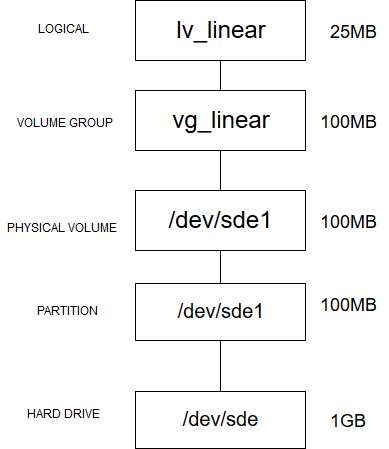  

### Cách ghi của ổ Linear:  
- Dữ liệu khi được lưu vào logical volume sẽ lưu  xuống physical volume , từng pe sẽ được sử dụng để lưu trữ dữ liệu , lần lượt từng physical volume sẽ được lưu trữ đến khi hết các physical volume gộp nên volume group.  

  

 

### Cài đặt  
  - Tạo các physical volume :  
  ```
  pvcreate /dev/sde1
  ```  
  - Tạo volume group :  
  ```
  vgcreate vg_linear /dev/sde1
  ```
- Tạo logical volume :  
```
lvcreate -L 25M -n lv_linear vg_linear
```  

  - Sau khi tạo logical volume ta mount lại để sử dụng :  

```
 mount /dev/vg_linear/lv_linear /home/user/Ten_directory  
```  
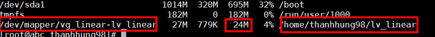  

- Kiểm tra bằng cách đưa một file 20MB vào directory vừa mount , sau đó sử dụng `bwm-ng` để xem dữ liệu được ghi trên physical volume sde1:  
 
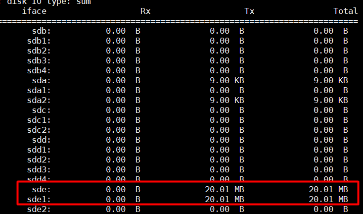    

Ta thấy dữ liệu được ghi vào PV sde1 20MB.  
 

### Extend Linear Volume

- Giả sử nếu logical volume đã đầy , ta có thể thêm dung lượng vào như sau :    
Trước tiên ta phải kiểm tra volume group xem có còn dung lượng free không bằng lệnh : 
```
vgs
```  
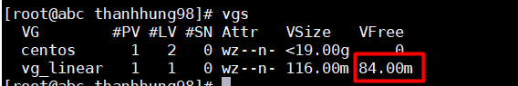     
- Ta thấy sau khi sử dung 25MB cho logical tại volume group còn free 84MB  
Để tăng kích thước Logical Volume ta sử dụng câu lệnh sau:

```
lvextend -L +20M /dev/vg_linear/lv_linear  
```
>Trong đó -L là dung lượng muốn thêm vào  

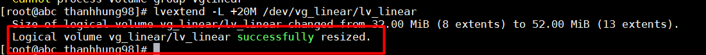     

- Ta thấy logical volume cũ đã tăng thêm 20MB. 

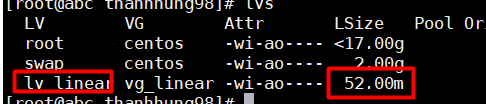       
- Sau đó muốn sử dụng được lượng dung lượng extend ta dùng 2 lệnh sau rồi mount vào hệ thống để sử dụng :  
```
e2fsck -f /dev/vg_linear/lv_linear  

resize2fs /dev/vg_linear/lv_linear
```  
 <div id='2'/>  

## 2. Cài đặt Striped:  
- Từ 1 ổ 1Gb ta chia thành 2 physical volume , mỗi physical volume 100MB  
 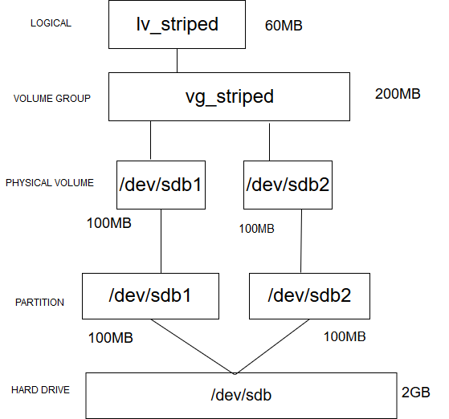  

### Cách ghi ổ striped :   
- Kiểu LV này giúp cải thiện khả năng ghi đọc của ổ cứng . Striping giúp chia đều dữ liệu vào các PV. Dữ liệu khi lưu vào logical volume sẽ được chia nhỏ ra và chia đều cho từng PE ở dưới (Ví dụ nếu có 2 physical volume dữ liệu sẽ lưu vào pv thứ nhất rồi pv thứ hai và lặp lại quá trình đến khi lưu hết dữ liệu trên logical volume).  

  

### Cài đặt  

- Tạo physical volume :  

```
 pvcreate /dev/sdb1 /dev/sdb2
```  

- Tạo volume group:  
```
vgcreate vg_striped /dev/sdb1 /dev/sdb2

```  
- Tạo logical volume:
```
lvcreate -L 60M -n lv_striped -i2 vg_strip
```

**Chú ý:**
> -L dung lượng tạo logical volume , ở đây là 60MB  
 -i2 số physical volume ta ghi vào khi sử dụng striped,  ở đây khi dữ liệu được ghi vào sẽ chia vào 2 physical volume  


- Ta có thể kiểm tra bằng các lệnh :  

```
pvdisplay -m

lvs --segments
```
  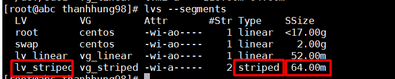   

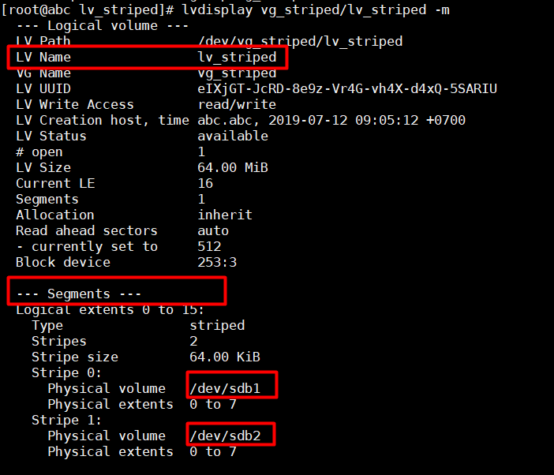

- Logical volume có type là striped .  
 

**Lưu ý:**  
>Khi tạo logical volume striped , dung lượng của Logical volume được tạo ra sẽ được các physical volume chia đều để lưu trữ .Ví dụ nếu có 2 physical volume tạo nên một volume group , ta tạo logical volume với 100MB thì mỗi physical volume sẽ chứa 50MB.   

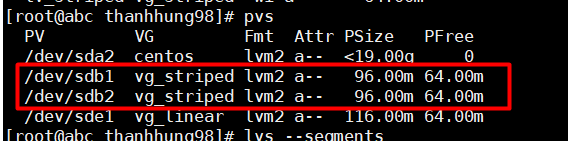  

- Ta thấy hai physical volume /dev/sdb1 và dev/sdb2 đã dành ra một khoảng là 30 MB để lưu trữ cho logical volume với dung lượng là 60MB.  

Để kiểm tra striped ta copy thử 1 file 50MB vào logical volume mirror đã được mount và dùng `bwm-ng` để theo dõi :  
   
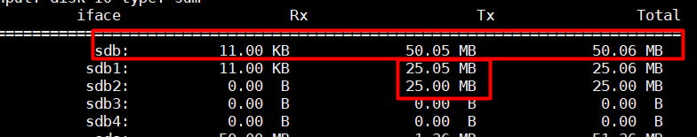    

- Ta thấy dữ liệu được ghi tại sdb1 là 25MB và ở  sdb2 là 25MB. Với tổng dữ liệu từ logical volume là 50MB đã được chia đều ra cho 2 physical volume. 
### Extend Striped Volume

- Giả sử ta đã sử dụng hết dung lượng của logical volume và extend hết từ volume group . Nếu muốn thêm dung lượng volume group ta sẽ add thêm 2 physical volume vào volume group này .  
```
vgextend vg_striped /dev/sdb3 /dev/sdb4
```  
- Với sdb3 và sdb4 là hai physical volume , mỗi physical volume có dung lượng 100MB . Sau đó ta extend logical volume  

- Kiểm tra bằng lệnh :  
```
vgs
```  
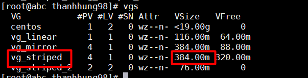  

- Sau khi extend volume group , ta extend logical volume bằng lệnh :  

```
lvextend /dev/vg_striped/lv_striped -L +300M
```
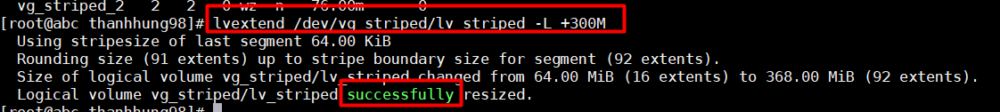  

- Ta thấy logical volume đã tăng thêm dung lượng , từ 60MB lên 360MB

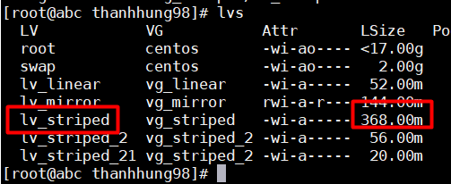  

- Kiểm tra physical volume bằng lệnh :  
```
pvdisplay -m  
```  
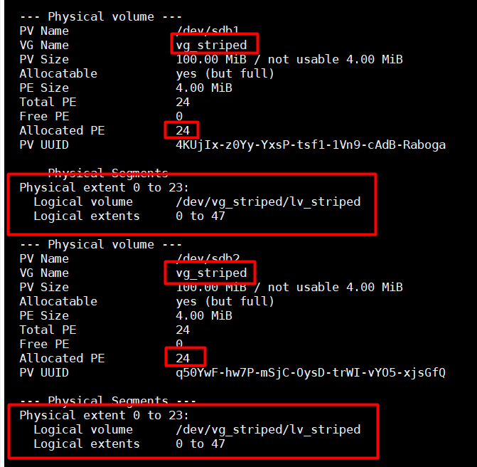   

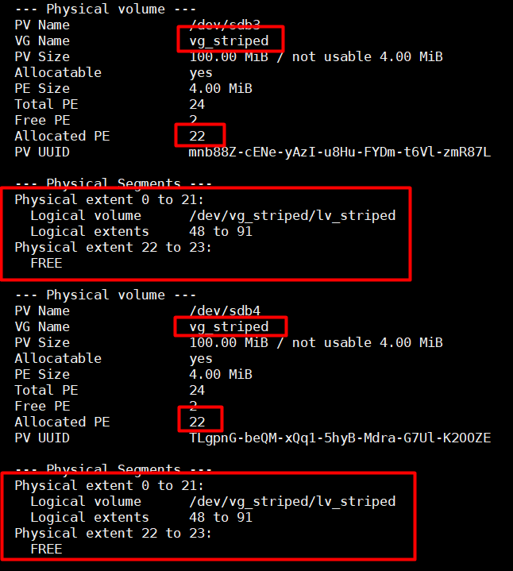    

- Sau khi lưu hết tại hai 200MB vào ổ physical volume sdb1 ,sdb2 , dữ liệu lưu tiếp 160MB còn lại vào sdb3 , sdb4 ( 22PE được dùng để lưu trữ ) .  

- Để chạy và mount để sử dụng đủ số dung lượng mà ta vừa extend , cần sử dụng 2 lệnh sau rồi mount lại logical volume :    
```
e2fsck -f /dev/vg_striped/lv_striped 

resize2fs /dev/vg_striped/lv_striped
```
 <div id='3'/>  

## 3. Cài đặt Mirror: 
- Từ ổ cứng 2Gb ta tạo ra 2 physical volume 100MB    
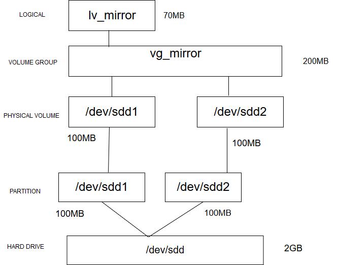  

  
 ### Cách ghi ổ mirror:  
 - Kiểu ghi này copy data trên các thiết bị khác nhau .Khi dữ liệu được viết vào một PV , nó sẽ được viết luôn vào PV còn lại . Cung cấp sự an toàn nếu các thiết bị có hỏng hóc . Trong các LV chạy mirror , nếu một LV bị hỏng , LV còn lại sẽ chạy Linear Volume và vẫn có thể truy cập đến được.    
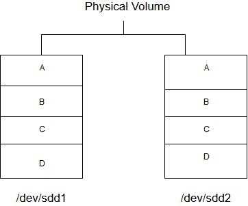    

  ### Cài đặt   
- Tạo physical volume :  
```
pvcreate /dev/sdd1 /dev/sdd2
```
- Tạo volume group :  
```
vgcreate vg_mirror /dev/sdd1 /dev/sdd2
``` 
- Tạo logical volume :  
```
lvcreate -L 70M -m1 -n lv_mirror vg_mirror 
```
 Trong đó :  
 >-L : dung lượng Logical volume  
 -m1 : số mirror lưu . ( Ở đây ta lưu dữ liệu vào 1 ổ , và lưu bản mirror vào ổ còn lại)  

 **Lưu ý :**   
>Điều kiện chạy được mirror volume là Logical Volume tạo ra không được vượt quá dung lượng physical Volume bé nhất  

- Ta kiểm tra bằng lệnh :  
```
lvs --segments
```  
 - Ta thấy type là Raid1 , tức là logical volume mirror đã được cài đặt thành công.  

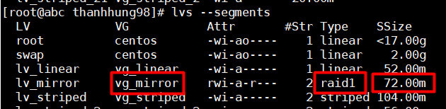
  
- Kiểm tra physical volume bằng lệnh :  
```
pvdisplay -m
```
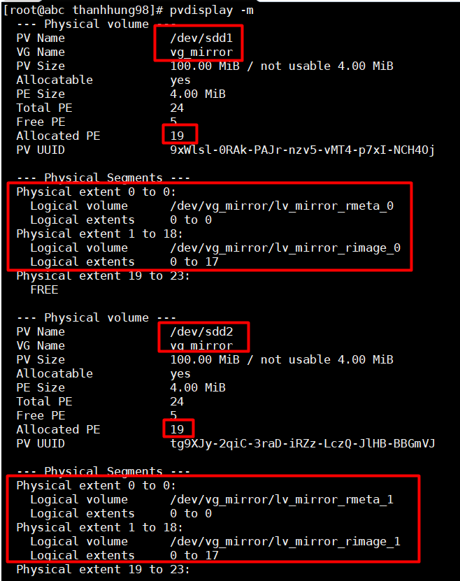  

Tại 2 physical volume sdd1 và sdd2 (mỗi pv có dung lượng 100MB), cả 2 pv đều dành ra 70MB ( 19 PE) để lưu trữ cho logical volume mirror ta tạo ở trên (70MB).  

Để kiểm tra mirror ta copy thử 1 file 20MB vào logical volume mirror đã được mount và dùng `bwm-ng` để theo dõi :  

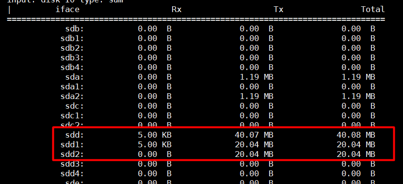  

Ta thấy dữ liệu được ghi tại sdd1 là 20MB và ở sdd2 cũng là 20MB . Và tổng dung lượng của sdd là 40MB ( Gấp đôi dữ liệu lưu tại logical volume)    
 
### Extend Mirror Volume

- Giả sử ta đã dùng hết dung lượng logical volume và extend hết từ volume group , nếu muốn extend volume group ta add thêm từ 2 physical volume :  

```
vgextend /dev/vg_mirror /dev/sdd3 /dev/sdd4
```  

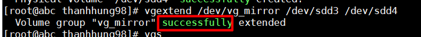   

- Kiểm tra bằng lệnh :  
```
vgs
```  
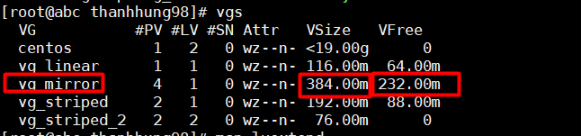  
- Ta thấy dung lượng volume group đã tăng lên từ 200MB lên 400MB .  
**Lưu ý :** 
> Mặc dù tổng volume là 400MB nhưng ta chỉ có thể tạo logical volume tối đa là 200MB , do cơ chế mirror sẽ tạo các bản sao sang các ổ khác .  


- Ta sẽ extend dung lượng logical volume thêm 70MB :  
```
lvextend -L +70M /dev/vg_mirror/lv_mirror
```
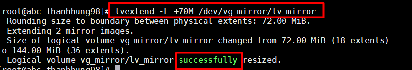  

- Kiểm tra các physical volume :  
```
pvdisplay -m
```
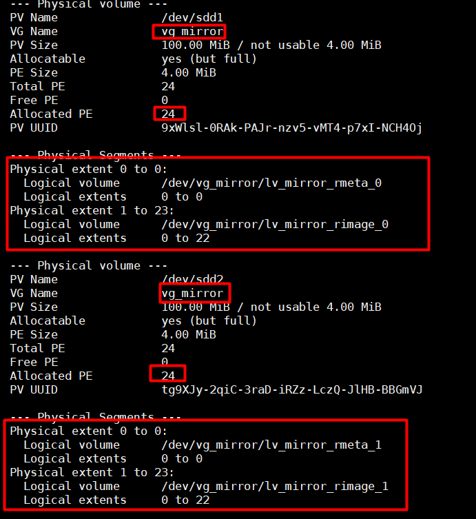  
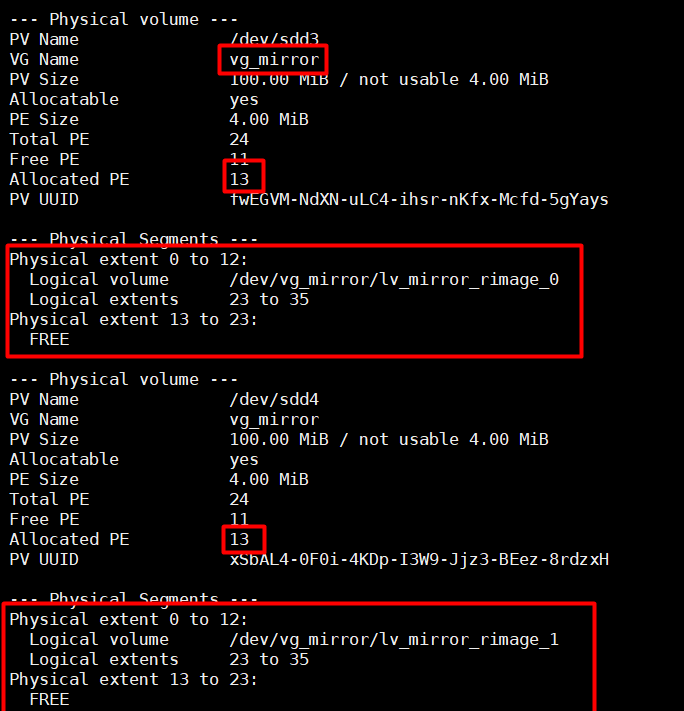  

- Ta thấy sau khi sử dụng hết 100MB từ sdd1 và sdd2 sẽ lưu trữ tiếp sang 2 physical volume sdd3 và sdd4 . Với logical volume ở trên đã được extend ra 140MB , sau khi lưu hết 100MB vào sdd1 và sdd2 , 40MB còn lại sẽ được lưu tiếp vào sdd3 và sdd4 (13 PE đã được sử dụng) với cơ chế mirror .  

- Để chạy và mount để sử dụng đủ số dung lượng mà ta vừa extend , cần sử dụng 2 lệnh sau rồi mount lại logical volume :  
```
e2fsck -f /dev/vg_mirror/lv_mirror

resize2fs /dev/vg_mirror/lv_mirror
```


  

  

