# Cài đặt   
### Cấu hình :  
- Cài đặt Ubuntu Server trên máy ảo VMWare , Sử dụng 2 ổ cứng để cài LVM  , 1 ổ chứa các partition của OS , còn 1 ổ tạo LVM để lưu trữ dữ liệu .
 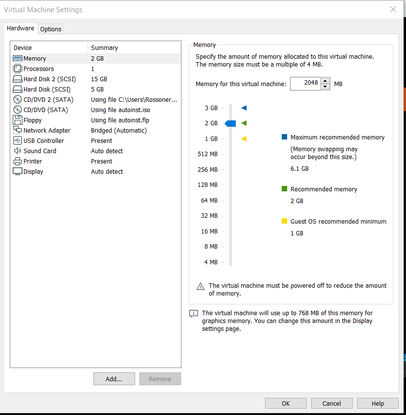  

### Cài đặt  
- Sau khi boot lên màn hình sẽ hiển thị màn hình chọn ngôn ngữ  :  
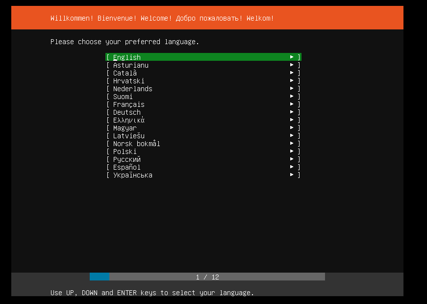 

- Ta chọn ngôn ngữ và nhấn Enter với các tùy chọn sau :  

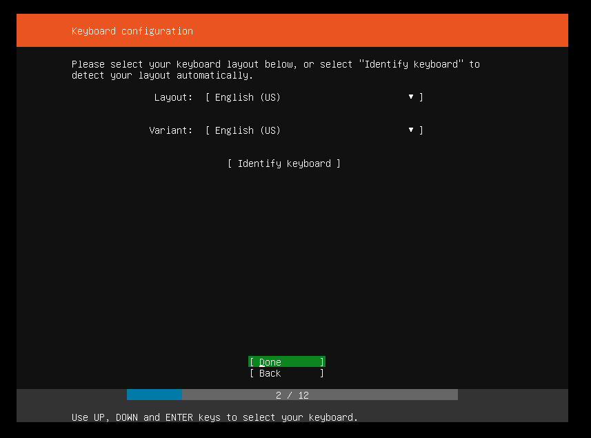  
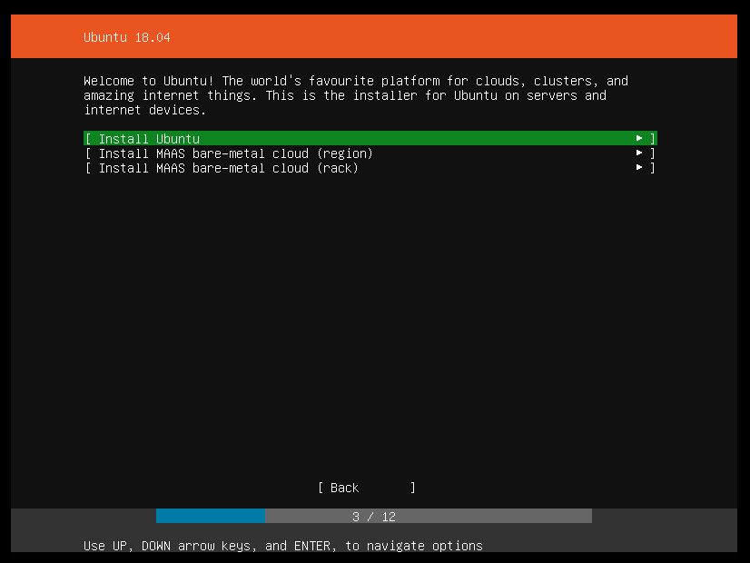  
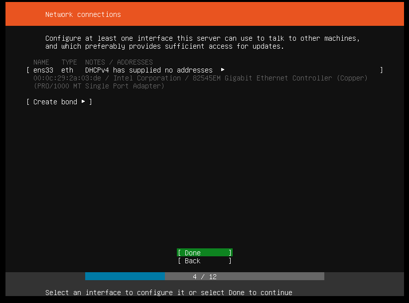  
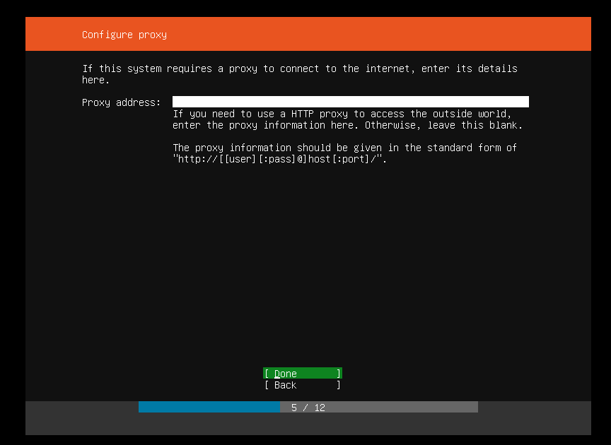  
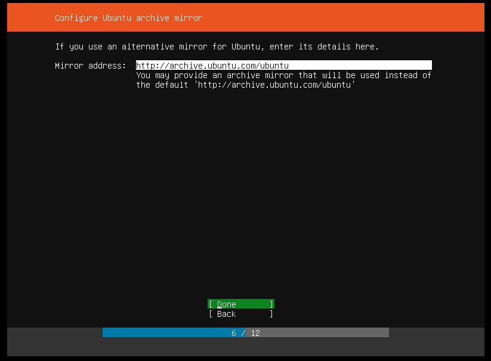  

- Sau khi đến màn hình File Setup , ta chọn Manual để cấu hình LVM khi cài đặt  

  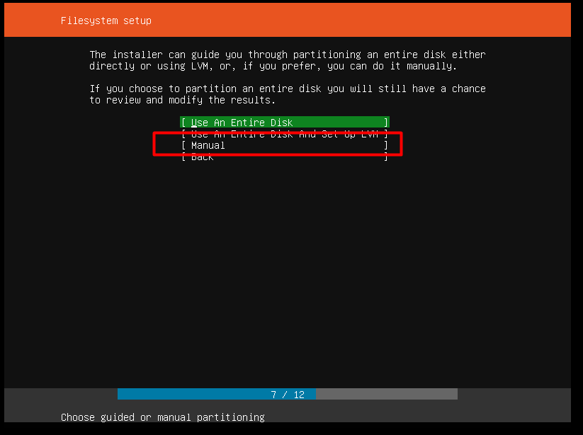  

- Trước tiên ta tạo các Partition cho OS

  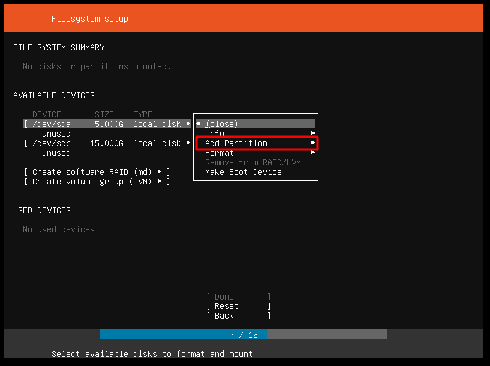  

- Ta tạo Phân vùng swap cho hệ thống :  
    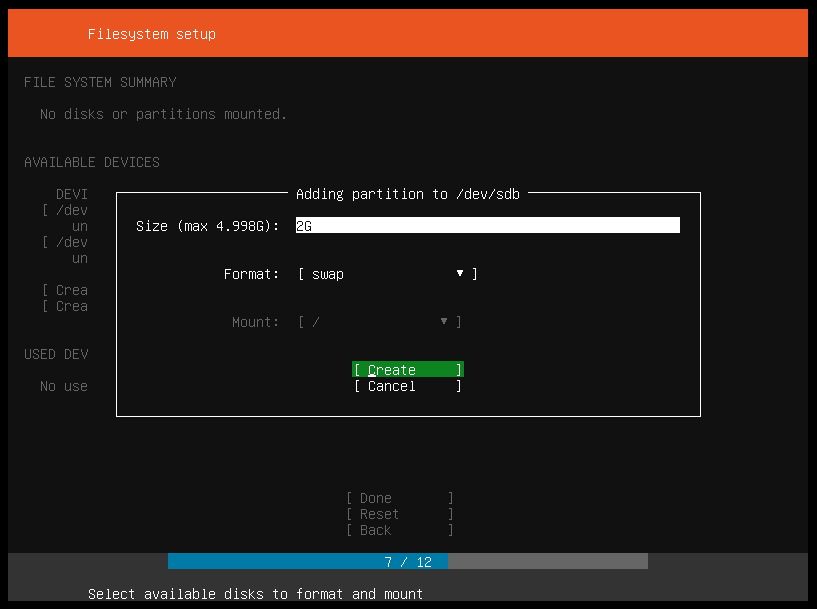  

- Tương tự ta tạo phân vùng root :  

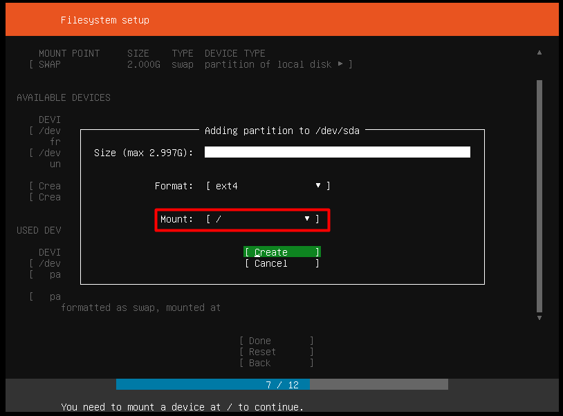  
### Chú ý :  
>- Để hệ thống cài đặt ổn định cần ít nhất phân vùng swap thuộc partition .Do đó khi cài đặt ta sử dụng 1 ổ với dung lượng nhỏ để cài đặt phân vùng bắt buộc thuộc partition và một số phân vùng cần lưu trữ ít(swap, / , ... )  
>- Ổ cứng còn lại để lưu trữ phần lớn các dữ liệu của hệ thống ta chọn ổ dung lượng lớn và cài đặt LVM trên ổ đấy .  

- Sau khi có hai phân vùng chính cho hệ thống , ta tạo Logical Volume từ ổ cứng còn lại. Chọn Create Volume Group :  

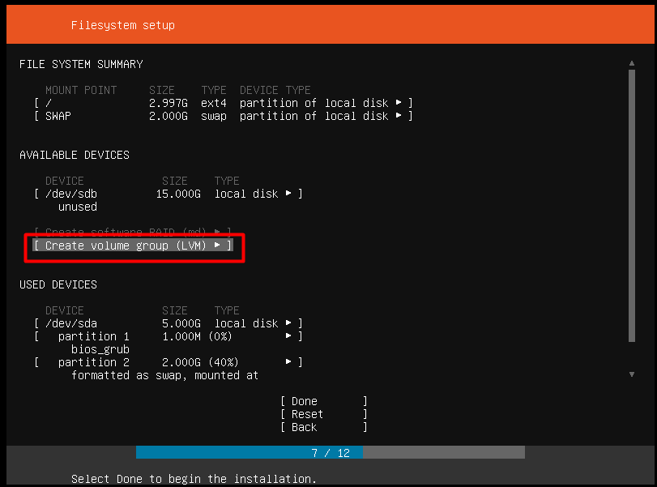  

- Đặt tên Volume Group,Tích vào ổ cứng ta muốn chọn để làm VG và ấn create  :  
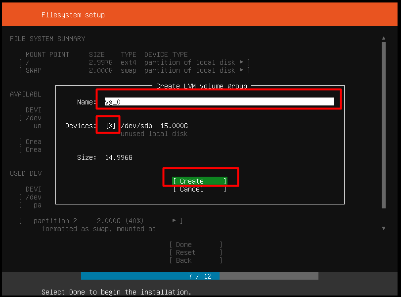  

- Từ Volume Group vừa tạo ta Create các Logical Volume để lưu trữ (ví dụ / , /home, ... )  
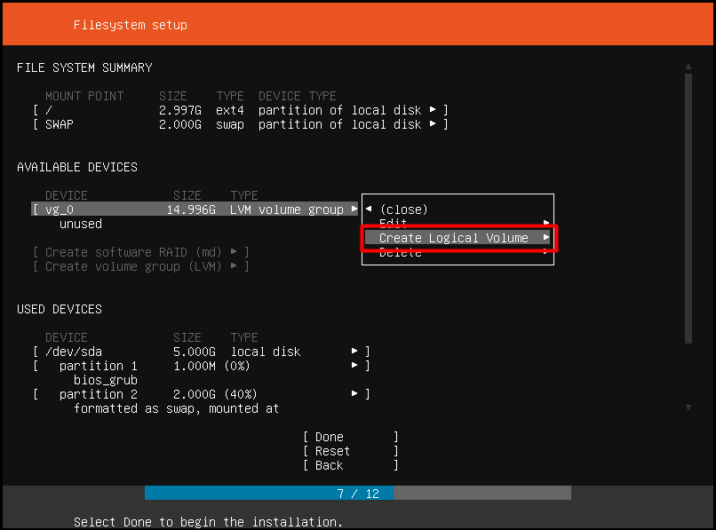  

- Đặt tên cho LV , Kích thước , Format và chọn vị trí Mount của Logical Volume , ở hình dưới là /home
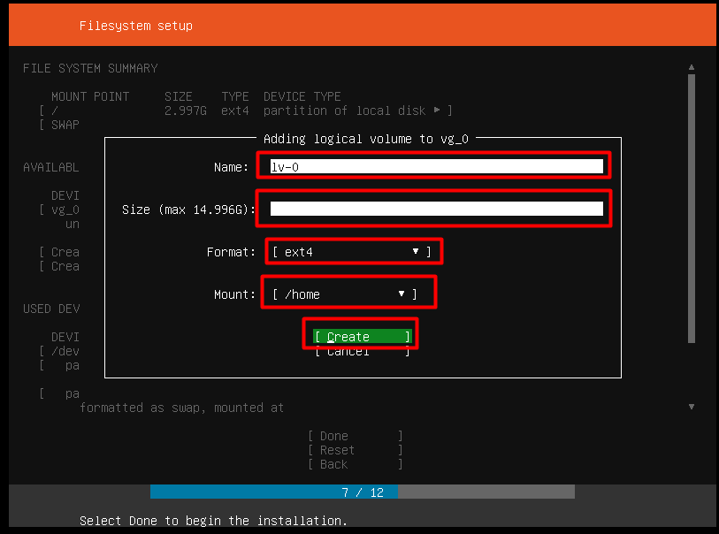  

- Sau khi đã tạo ra các Partition và các Logical Volume để lưu trữ , ta ấn Done 
 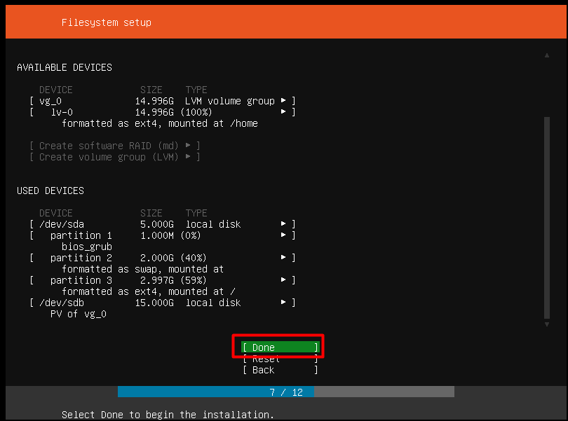 

 - Điền thông tin và mật khẩu vào rồi ấn Done :  
   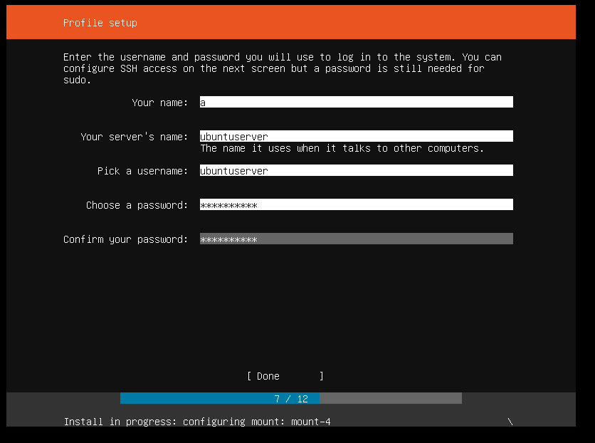  
 
Đợi cài đặt hoàn tất và reboot:  
   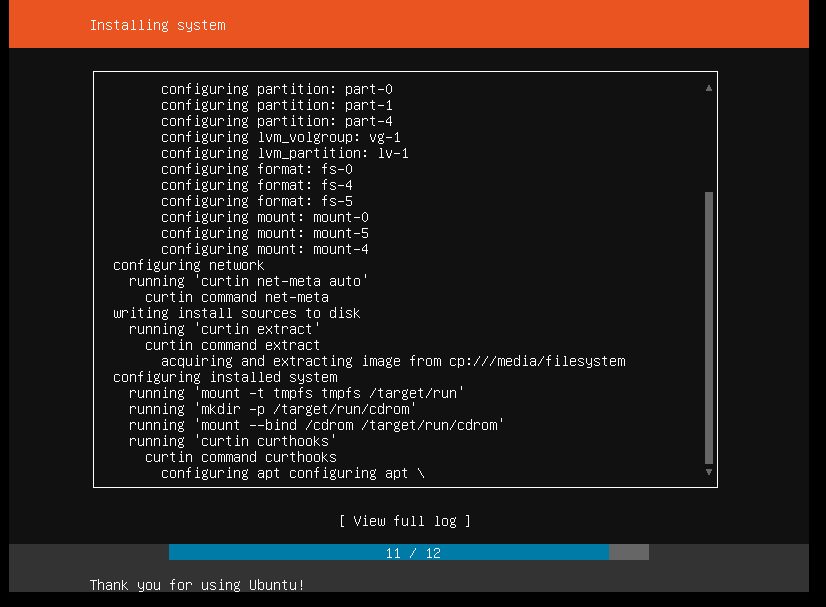  

Sau khi reboot , ta nhập tên và mật khẩu để đăng nhập rồi kiểm tra các ổ cứng bằng lệnh `lsblk`:  

   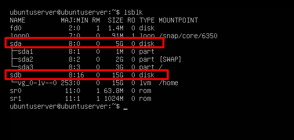  
ta thấy hệ thống gồm 2 ổ , ổ 5Gb sda bao gồm phân vùng Swap và root , ổ 15GB sdb có partition thuộc volume group , tạo ra logical volume chứa dữ liệu của /home.  
