# TÌM HIỂU VỀ LVM BACKUP VÀ SNAPSHOT  
## MỤC LỤC :  
- [1.LVM BACKUP ](#1)  

  - [1.1.Lệnh vgcfgbackup ](#1.1)    

  - [1.2.Lệnh vgcfgrestore](#1.2)  
  
  - [1.3.Cấu hình](#1.3)  

- [2.LVM Snapshot ](#2)  
  - [2.1.LVM Snapshot ](#2.1)    

  - [2.2.Cấu hình](#2.2)  
- [3.Note](#3) 

- [4.Sử dụng crontab để chạy vgcfgbackup thường xuyên](#4)

-----------------------------------------------------------------
 <div id='1'/>      

## 1. LVM Backup :  

 <div id='1.1'/>      

### 1.1. vgcfgbackup :  

Khi tạo , xóa , thêm logical volume, ... các thao tác trên sẽ được cập nhật ở volume group với config file tại /etc/lvm/.Khi ổ đĩa lỗi ta có thể restore cấu hình LVM bằng một file cấu hình backup. Lệnh `vgcfgbackup` sẽ lưu các cấu hình của volume group và lưu vào file tại /etc/lvm/backup/vg_name . Mặc định vgcfgbackup tự động chạy.  
. Câu lệnh :   
```
vgcfgbackup [-f path_newfilename ] vg_name  
```  
>Trong đó :  
>- vg_name : Tên của volume group  
>- -f : chỉ định nơi lưu trữ file backup , nếu không có thì mặc định lưu tại /etc/lvm/backup/    

 <div id='1.2'/>      

### 1.2. vgcfgrestore :  
  Lệnh `vgcfgrestore` sẽ restore các cấu hình volume group từ các physical volume . File lưu trữ tại /etcc/lvm/archive. Câu lệnh :    
```
vgcfgrestore [-f|--file <filename>] [-v] vg_name  
```
   >-  vg_name : Tên volume group .
   >  - -f : Đường dẫn lưu file backup .  
   > - -v : Hiển thị chi tiết khi chạy lệnh .

 <div id='1.3'/> 


### 1.3.Cấu hình :  
   - Chuẩn bị :  

   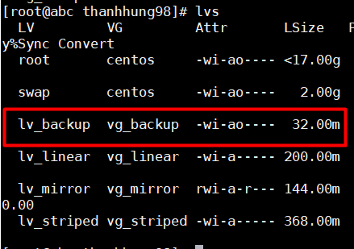  


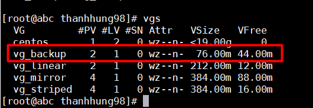  

Tạo logical volume lv_backup từ volume group vg_backup.  

### Backup :  
- Dùng lệnh :  
```
vgcfgbackup -f path_name /dev/vg_name
```  
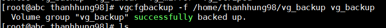  

### Restore :  
  
- Để restore , trước tiên ta remove logical volume vừa tạo    

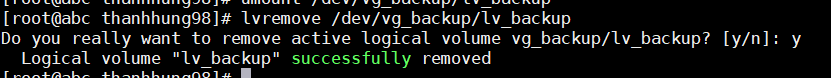  

- Sau đó restore lại bằng lệnh :   
```
vgcfgrestore vg_name -f path_name
```  

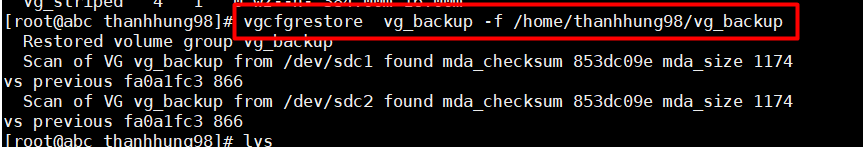  

- Dùng lệnh dưới để kiểm tra :  
```
lvscan
```  
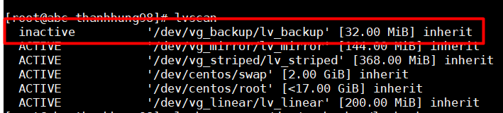  

- Ta thấy logical volume vừa bị xóa đi đã được restore , tuy nhiên ở trạng thái inactive. Để active lại logical volume sử dụng lệnh sau :    

```
lvchange -a y /dev/vg_backup/lv_backup
```  
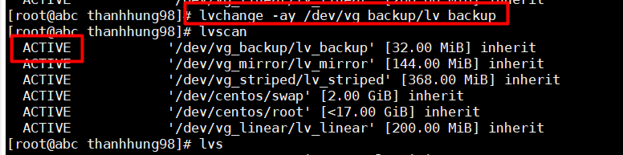  

- Kiểm tra lại ta thấy trạng thái là active .  

**Chú ý**
>Ta có thể restore bằng các file trong /etc/lvm/backup hoặc /etc/lvm/archive   

 <div id='2'/>      

## 2.LVM Snapshot  
 <div id='2.1'/>        

### 2.1. Snapshot  

LVM Snapshot tạo một bản copy của các lvm volume . Chỉ lưu các thay đổi của LVM trước khi đã tạo snapshot volume .  VÍ dụ nếu volume gốc có thay đổi 1GB dữ liệu , thì 1GB dữ liệu đó cũng được thay đổi tại snapshot volume .LVM snapshot cho phép tạo virtual image của thiết bị .  
Nếu snapshot volume full sẽ bị vô hiệu hóa . Do đó cần phải quan tâm đến kích thước của snapshot . Snapshot có thể được resize như logical volume thông thường .

 <div id='2.2'/>      


### 2.2 Cấu hình :  
-  Chuẩn bị :   

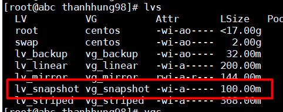  


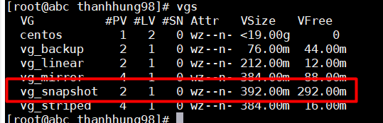    

Tạo logical volume lv_snapshot từ volume group vg_snapshot.  


- Tạo snapshot volume  
```
lvcreate -L 100M -s -n lv-demo1-snap /dev/vg_snapshot/lv_snapshot  
```  
>Trong đó :  
>- -L : Dung lượng muốn tạo ra cho logical volume snapshot  
>- -s : Tạo snapshot
>- -n : tên của logical volume snapshot  
>- /dev/vg_snapshot/lv_snapshot : Đường dẫn của logical volume gốc mà ta muốn snapshot  


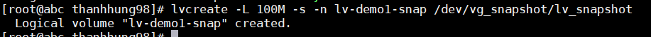   
 
- Để kiểm tra ta dùng lệnh `lvs` để xem snapshot logical volume đã được tạo ra chưa :  
  
 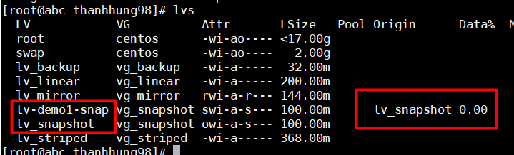  

   - Ta thấy lv-demo1-snap đã được tạo ra với logical volume gốc là lv_snapshot   

- Restore từ snapshot volume :  
  - Trước khi restore ta phải umount logical volume gốc . 
  ```
  umount /dev/vg_snapshot/lv_snapshot
  ```  

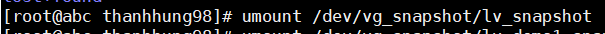    

- Sau đó dùng lệnh sau để phục hồi lại logical volume từ snapshot :    
```
 lvconvert --merge /dev/vg_snapshot/lv-demo1-snap
```   
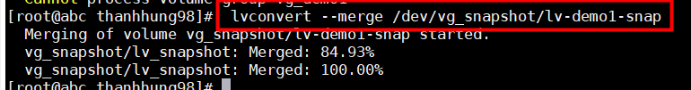    


**Lưu ý :**  
Sau khi thực hiện snapshot , logical volume snapshot sẽ bị mất đi.    
 <div id='3'/>      

# 3. Note 
## 3.1 Lưu ý về LVM snapshot :   
- Có thể lưu nhiều snapshot cho 1 logical volume  

- Snap shot không thể tạo khác ổ với logical volume gốc ( cùng volume group )  
- Khi dung lượng snapshot volume đầy , logical volume này sẽ bị vô hiệu hóa , không merge được với logical volume gốc .

- Có thể thêm dung lượng snapshot bằng lệnh :  
   ```
   lvextend -L +1G /dev/vg_name/lv_snapshot_name
   ```  

>Trong đó :  
>- -L : Size muốn tăng thêm .    

- Xóa snapshot logical volume bằng lệnh :    
```
 lvremove /dev/vg_name/lv_snapshot_name
```  

## 3.2 Các loại backup :  
 ### Full backup:
 - Định nghĩa : 
    - Full Backup có nghĩa là backup toàn bộ dữ liệu đang có trong hệ thống .

- Ưu điểm của Full Backup :

   -  Dễ dàng phục hồi lại dữ liệu. Khi cần phục hồi lại thì sẽ phục hồi lại toàn bộ dữ liệu của ngày Backup Full.
    - Tính an toàn cao cho dữ liệu.

- Nhược điểm của Full Backup:

    - Thời gian backup lâu. Dữ liệu càng nhiều thì thời gian backup càng lâu
    - Tốn dung lượng lưu trữ. Nếu mỗi ngày đều chạy full backup thì rất tốn dung lượng ổ cứng. Ví dụ một ổ cứng 1TB nếu backup full mỗi ngày thì trong 1 tuần sẽ cần 7TB lưu trữ.
    - Chi phí đầu tư thiết bị lưu trữ lớn.

 

### Differential Backup :  
- Định nghĩa :   
   - Differential Backup là backup những gì thay đổi so với lần Full Backup gần nhất

    

- Ưu điểm của Differential Backup :

   -  Thời gian backup nhanh hơn
   -  Dung lượng backup nhỏ hơn so với Full Backup. Tiết kiệm dung lượng lưu trữ
   - Tốc độ phục hồi dữ liệu sẽ nhanh hơn so với Incremental Backup

- Nhược điểm của Differential Backup :

    -Khi cần khôi phục dự liệu cần có 2 bản backup : 1 File Full Backup lần gần nhất và 1 File Differential Backup vào thời điểm cần restore


### Incremental Backup :
- Định nghĩa :  
Incremental Backup là backup những gì thay đổi so với lần Incremental Backup gần nhất
    

- Ưu điểm của Incremental Backup :

   - Thời gian backup nhanh nhất
   - Dung lượng backup bé nhất

- Nhược điểm của Incremental Backup :

   - Khi cần khôi phục dữ liệu phải có đủ các bản backup : 1 File Full backup lần gần nhất và tất cả các File Incremental Backup từ thời điểm Full Backup đến thời điểm cần restore
   - Thời gian Restore lâu hơn so với Differential Backup
  

 ## 3.3 Các loại snapshot trong LVM :  
- Snapshot Volumes:  
  - LVM Snapshot tạo một bản copy của các lvm volume . Chỉ lưu các thay đổi của LVM trước khi đã tạo snapshot volume .  VÍ dụ nếu volume gốc có thay đổi 1GB dữ liệu , thì 1GB dữ liệu đó cũng được thay đổi tại snapshot volume .LVM snapshot cho phép tạo virtual image của thiết bị .  
Nếu snapshot volume full sẽ bị vô hiệu hóa . Do đó cần phải quan tâm đến kích thước của snapshot . Snapshot có thể được resize như logical volume thông thường .
   
- Thinly-Provisioned Snapshot :  

 <div id='4'/>  

 # 4. Dùng crontab chạy vgcfgbackup  :   
## 4.1. Crontab :  
### CronTab là gì
- Linux có cách để tạo và chạy các lệnh theo một chu kỳ xác định là Crontab . Cronjob là các lệnh thực thi hành động đặt trước vào thời điểm nhất định. Crontab là nơi lưu trữ các cronjob

- Cron là một tiện ích giúp lập lịch chạy những dòng lệnh bên phía server để thực thi một hoặc nhiều công việc nào đó theo thời gian được lập sẵn. Một số người gọi những công việc đó là Cron job hoặc Cron task.

- Cron là một chương trình deamon, tức là nó được chạy ngầm mãi mãi một khi nó được khởi động lên. Như các deamon khác thì bạn cần khởi động lại nó nếu như có thay đổi thiết lập gì đó. Chương trình này nhìn vào file thiết lập có tên là crontab để thực thi những task được mô tả ở bên trong.

- Một cron schedule đơn giản là một text file. Mỗi người dùng có một cron schedule riêng, file này thường nằm ở /var/spool/cron. Crontab files không cho phép bạn tạo hoặc chỉnh sửa trực tiếp với bất kỳ trình text editor nào, trừ phi bạn dùng lệnh crontab.

## Một số lệnh thường dùng:

- crontab -e: tạo hoặc chỉnh sửa file crontab 
- crontab -l: hiển thị file crontab 
- crontab -r: xóa file crontab

## Cấu trúc của crontab

- Một crontab file có 5 trường xác định thời gian, cuối cùng là lệnh sẽ được chạy định kỳ, cấu trúc như sau:  

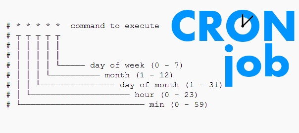    

- Nếu một cột được gán ký tự *, nó có nghĩa là tác vụ sau đó sẽ được chạy ở mọi giá trị cho cột đó.

 ### Ví dụ :  
- Chạy script 30 phút 1 lần:  
```
0,30 * * * * command  
```
   -  Chạy script 15 phút 1 lần:  
```    
0,15,30,45 * * * * command
```
-  Chạy script vào 3 giờ sáng mỗi ngày:
```
0 3 * * * command  
```

## 4.2. Lập lịch để chạy vgcfg :  
### Mô tả : 

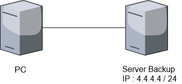    

- PC chạy script để backup volume group của lvm và tự động gửi file mới nhất sang directory bên server backup . Dùng crontab để lập lịch dùng script trên trong khoảng thời gian nhất định .  

### Cấu hình :  
   - Tạo file `backup.sh` như sau :  
```
#!/bin/bash

HOME=/root
LOGNAME=root
PATH=/usr/local/sbin:/usr/local/bin:/sbin:/bin:/usr/sbin:/usr/bin
LANG=en_US.UTF-8
SHELL=/bin/sh
PWD=/root

#Nhap mat khau may backup
rootpass=hung123456

NOW=`date '+%F_%H:%M:%S'`;
yum --enablerepo=epel -y install sshpass

vgcfgbackup -f /home/thanhhung98/lv_backup_file/vg_backup_$NOW vg_backup

file=$(ls -t /home/thanhhung98/lv_backup_file | head -1)

sshpass -p $rootpass scp -r /home/thanhhung98/lv_backup_file/$file root@4.4.4.4:/home/relayserver/backup_lvm
```  

- Dùng lệnh `crontab -e ` và cấu hình như sau :  
```
*/5 * * * * /home/thanhhung98/backup.sh
```  
>Lưu ý  :  
>- Ở đây ta cho cứ 5 phút sẽ chạy script backup 1 lần  


- Kiểm tra máy PC :   

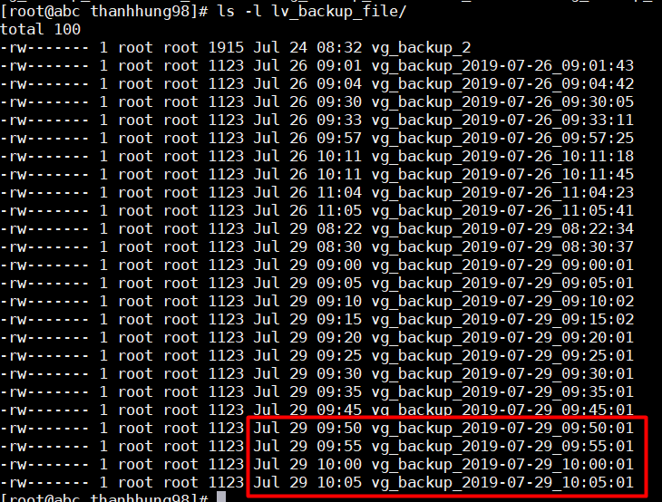    

- Ta thấy volume group được backup mỗi 5 phút 1 lần .  

- Kiểm tra server backup :  

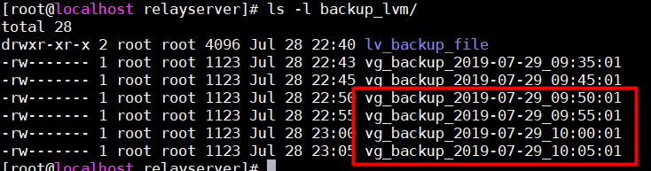    
- Các file mới nhất đã được chuyển sang server backup.  

