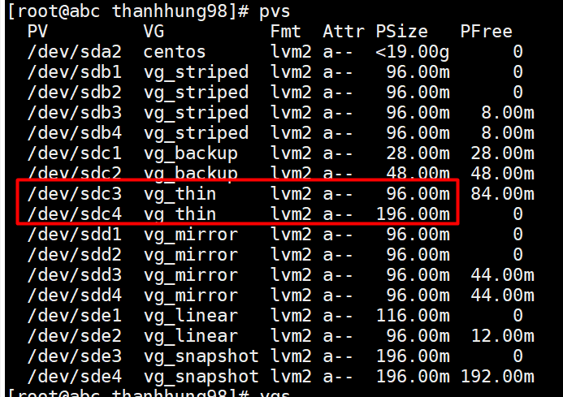
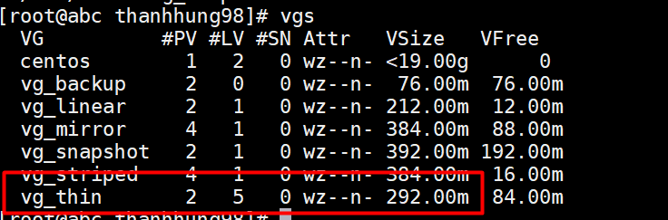
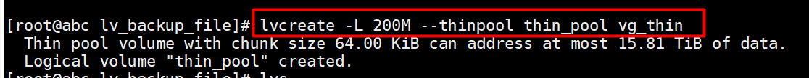
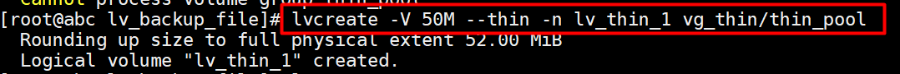
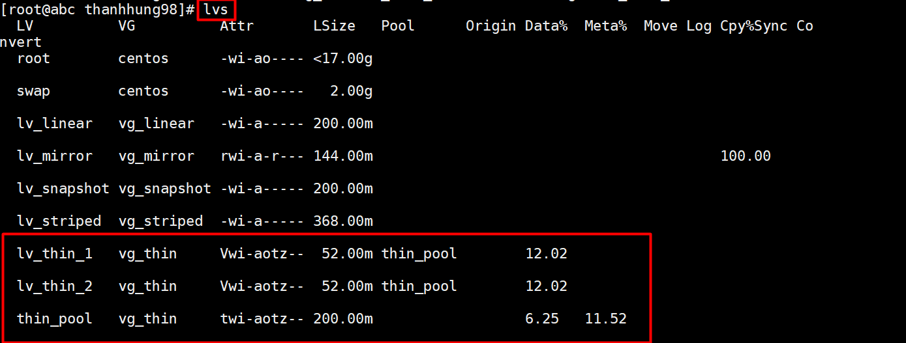
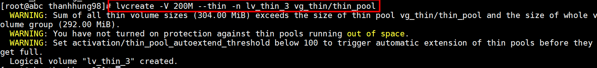
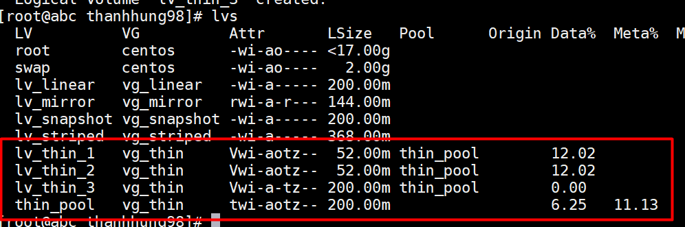
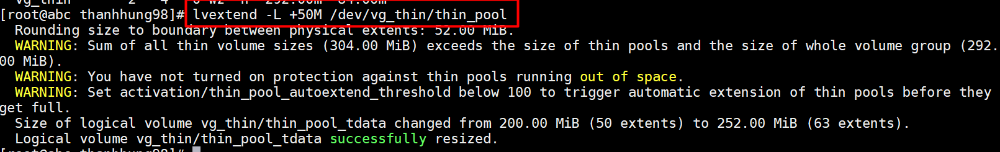

# THIN PROVISIONING LOGICAL VOLUME - CLUSTERED LOGICAL VOLUME  
## 1. Thinly-Provisioned Logical Volumes (Thin Volumes):
 ### Thin provisioning :    
- Thinly-Provisioned volume cho phép chúng ta tạo logical volume với lớn hơn dung lượng volume group vốn có . Sử dụng thin provisioning , ta cần quản lý một storage pool với dung lượng xác định ( thin pool ) . Thin pool có thể được expand tự động để tăng năng suất và tối ưu tài nguyên .   

**Lưu ý** :  
>Các thin volume và thin pool phải cài đặt trên cùng volume group .  

- Ví dụ nếu như có 10 user yêu cầu 100GB dữ liệu , quản trị có thể tạo cho mỗi người 100GB nhưng dung lượng thực tế khi đưa cho mỗi người là ít hơn rất nhiều . Những dung lượng còn lại chỉ được dùng khi cần thiết . Khi sử dụng thin provisioning , cần quản lý storage pool cẩn thận và thêm dung lượng khi pool sắp đầy .   

###  Cài đặt :  
   - Chuẩn bị :  
     - Từ 2 physical volume 50MB và 200MB , tạo volume group từ 2 physical trên  

  

  

- Tạo thin pool bằng lệnh sau :  
```
 lvcreate -L 200M --thinpool thin_pool vg_thin
```  

>Trong đó :  
>-  -L : Size của volume group
>-    -–thinpool : Tạo thinpool
>-   thin_pool : Tên Thin pool
>- vg_thin : Volume group name sử dụng lưu trữ thinpool

  

- Tạo Thin volume : 
```
 lvcreate -V 50M --thin -n lv_thin_1 vg_thin/thin_pool
```   
>Trong đó :  
>- -V : Kích thước thin volume  
>- --thin : Khai bảo kiểu tạo volume 
>- lv_thin_1 : tên volume group  
>- vg_thin/thin_pool : tên volume group và tên thin pool tạo nên thin volume  
  
  

- Tương tự tạo 1 thin volume nữa với dung lượng 50M rồi kiểm tra bằng lệnh `lvs` :  

  

### Over Provisioning :  
- Theo như ở trên đã nói , ta có thể tạo các logical volume với dung lượng vượt quá dung lượng sẵn có .   
- Giả sử với 200MB của volume group trên , ta có 2 logical volume 50MB ( Tổng dữ liệu là 100MB ), ta tạo một logical volume với dung lượng là 200MB (Vượt quá dung lượng volume group )  
```
lvcreate -V 200M --thin -n thin_vol_3 vg_thin/thin_pool1
```  
  

- Ta thấy logical volume vẫn được tạo ra , vượt quá dung lượng vốn có của volume group.  
- Kiểm tra bằng `lvs` :  

  

## Extend logical thin pool :  
- Ta extend như một logical volume thông thường bằng lệnh :  
```
lvextend -L +50M /dev/vg_thin/thin_pool
```
  

## Clustered Logical Volume :
Clustered Logical volume cho phép sử dụng các volume group và các logical volume trên một shared storage. Với cấu hình cluster , volume group và các logical volume có thể được tủy cập bởi tất cả các node trong cùng một lúc . 
Để sử dụng CLVM , `clvmd` daemon phải được chạy . Để đảm bảo `clvmd` chạy khi khởi động máy , ta dùng lệnh   
```
chkconfig clvmd on
```  

Nếu không có `clvmd` daemon , metadata khi được lưu các máy khác trong node sẽ không thể thấy được . Khi metadata được lưu và chỉnh sửa bởi tất cả các máy , sự không đồng bộ khi lưu metadata có thể dẫn đến việc lỗi các dữ liệu . Để ngăn chặn nhiều node thay đổi metadata một cách ngẫu nhiên , clustered LVM sử dụng Distributed Lock Manager .

