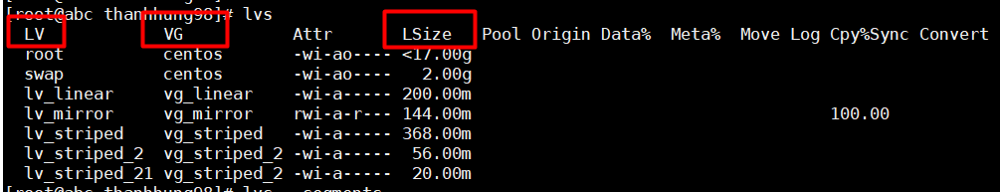
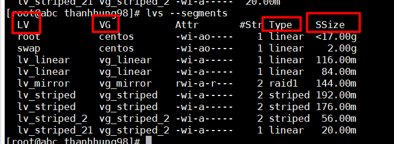
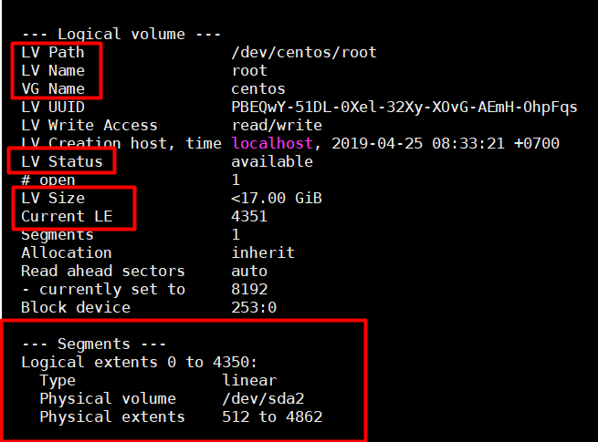
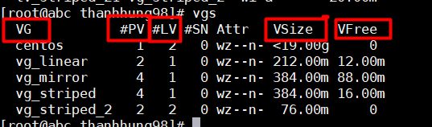
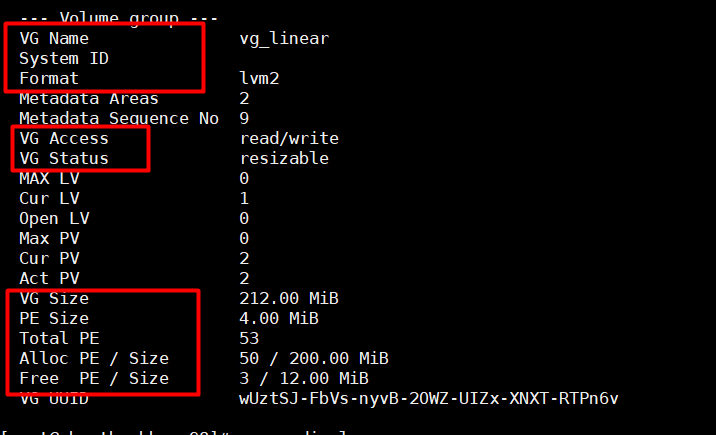
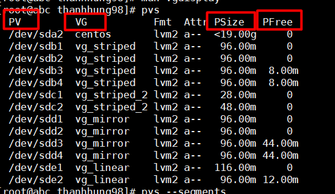
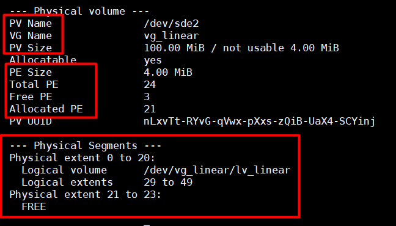
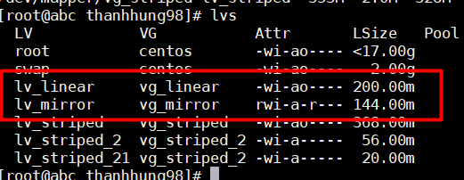
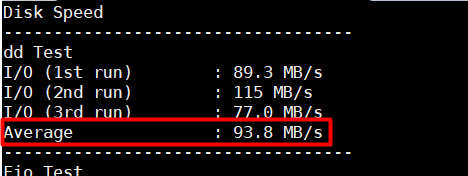
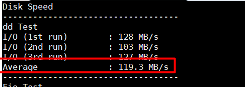

# NOTE  
## MỤC LỤC :  
- [1.Các lệnh thường dùng ](#1)  

  - [1.1. Các lệnh kiểm tra](#1.1)    

  - [1.2. Resize logical volume](#1.2)  
  
- [2.So sánh tốc độ Linear và Striped](#2)  

- [3.Lệnh dd](#3)
 
  
==============================================================================    
 <div id='1'/>      

### Các lệnh thường sử dụng trong LVM  

- Tạo Partition :  
```
fdisk /dev/sda
```  
- Tạo Physical Volume :  
```
pvcreate /dev/sda1 
```  
- Tạo Volume Group:  
```
vgcreate vg-demo1 /dev/sda1 
```
- Tạo Logical Volume :  

 ```
 lvcreate -L 1G -n lv-demo1 vg-demo1
 ```  
 Trong đó :  
   >-L: Chỉ ra dung lượng của logical volume  
   -n: Chỉ ra tên của logical volume  

 <a name="1.1"></a>  

### Các lệnh kiểm tra :  
- Kiểm tra các Hard Drives , Partition trong máy bằng lệnh :    
```
lsblk
```  
- Kiểm tra Logical Volume :  
```
lvs
``` 
>LV : Tên Logical VOlume  
VG : Tên Volume Group mà Logical Volume thuộc về .  
LSize : Dung lượng Logical Volume  
   
  
  
  
```
lvs --segments  
```  
  >Tương tự lệnh lvs nhưng có hiển thị thêm Type để xem Logical Volume là linear , striped , ...  

  


```
lvdisplay -m
```  
>LV Path : Đường dẫn của Logical Volume
LV Name : Tên Logical Volume  
VG Name : Tên Volume Group  
LV Status : trạng thái  
LV Size : Dung lượng Logical Volume  

>Trong phần Segments hiển thị chi tiết hơn về các Logical Extend , các LE thì thuộc Physical Volume nào và trong khoaangr Physical Extents bao nhiêu .    
Type : Kiểu ghi của Logical Volume (Linear , Striped ...)  


  


- Kiểm tra Volume Group :  

```
vgs
```   
>VG :Tên Volume group  
#PV : số lượng PV tạo nên Volume group  
#LV : số LV tạo ra từ Volume group  
VSize: Tổng dung lượng của Volume group  
VFree : Dung lượng Free của Volume Group  

  

```
vgdisplay 
```  
>VG Name : tên Volume Group  
VG Access : Quyền read , write của Volume Group  
VG Status : Extend , reduce Volume Group được hkoong   
VG Size : Tổng dung lượng Volume Group  
PE Size : Dung lượng của 1 Physical Extend  
Total PE : Tổng các PE tạo nên Volume Group ( PESize * TotalPE = VGSize)  
Alloc PE/Size : Dung lượng đã được dùng để tạo Logical Volume hiển thị dưới dạng PE/Size  
Free PE/Size : Dung lượng còn trống trong Volume Group hiển thị dưới dạng PE/Size  

  

- Kiểm tra Physical Volume :  
```
pvs
```  
>PV : Tên Physical Volume  
VG : Tên Volume Group mà Physical Volume thuộc về  
PSize: Dung lượng Physical Volume  
PFree : Dung lượng free của Physical Volume  


  

```
pvdisplay -m
```  
>PV Name : tên Physical Volume  
VG Name : Tên Volume Group mà Physical Volume tạo nên.  
PV Size : Tổng dung lượng của Physical Volume  
PE Size : kích thước của 1 PE  
Total Pe : Tổng PE của Physical Volume  (PESize * Total PE = PVSize)  
Free PE : Số PE free  
Allocated PE : Số PE đã được sử dụng để tạo nên Volume Group  

>Trong Physical Segments hiển thị rõ hơn về các PE .  
Số lượng các PE thuộc Các logical Volume nào và Map với các LE nào .  

  

 <a name="1.2"/></a>  

### Resize logical volume :  
- Umount logical volume :    
```
umount /dev/vg_name/lv_name
```  
- Kiểm tra filesystem :
```
e2fsck -f /dev/vg_blah/lv_blah
```  
- Thay đổi volume group :  
```
vgchange -ay
```  

- Resize filesystem : 
```
resize2fs /dev/vg/lv 1G
```  

- Thu hồi dung lượng logical volume bằng lệnh sau :  
```
lvreduce -L -1G /dev/vg/lv
```    
Sau đó mount lại và sử dụng.

**Chú ý**  
>Khi resize thấp hơn dung lượng đang lưu trữ của logical volume , sẽ báo lỗi và phải format lại logical volume mới sử dụng lại được.  
 <div id='2'/>    

## Tốc độ ghi giữa LV Linear và LV Striped  
- Để so sánh tốc độ ghi , ta ghi 20MB vào 2 Logical Volume Striped và Linear : 

  
Kiểm tra bằng script sau :  
```
curl -Lso- https://raw.githubusercontent.com/nhanhoadocs/scripts/master/Utilities/bench_vm.sh | bash  
```  
- Tốc độ ghi của Linear :  
  
  

- Tốc độ ghi của Striped :  

  

- Ta thấy dữ liệu lưu vào ổ striped có tốc độ nhanh hơn ghi vào linear  
 <a name="3"></a>

### Lệnh dd   

- Lệnh dd dùng để convert và copy file , tuy nhiên lệnh này cũng được dùng để kiểm tra performance ổ đĩa :  

```
dd if=/dev/zero of=test_$$ bs=64k count=16k conv=fdatasync iflag=direct && rm -f test_$$
```  

>- Trong đó :   
>    - if : đọc dữ liệu từ một file  
>    - of : Viết dữ liệu ra một file 
>    - bs :  Size block mà ta muốn lệnh dd đọc ( GB,MB ,...)
>    - count : Số block ta muốn dd đọc   
>    - conv : convert file với các tùy chọn  
>        - sync : đọc và ghi metadata 
>        -  fdatasync :Viết vào outputfile trước khi kết thúc 
>        - fsync : tương tự fdatasync nhưng đồng thời viết cả metadata vào  
>        - dsync : đồng bộ I/O cho các dữ liệu .
>        - noerror : vẫn tiếp tục chạy khi đọc phải lỗi  