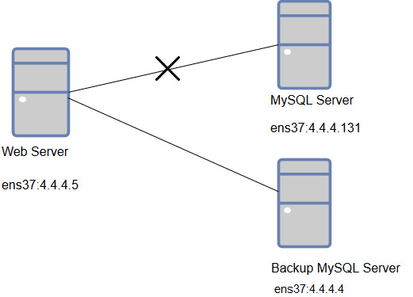
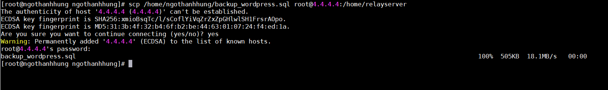
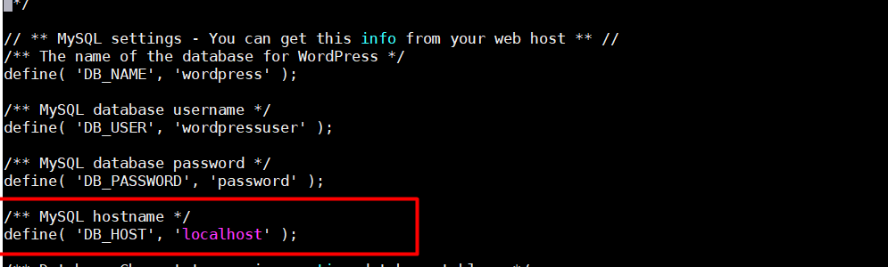

# BACKUP và RESTORE MYSQL  
**1. Backup Cơ Sở Dữ Liệu**

Việc sao lưu (hay còn gọi là export hoặc backup) được sử dụng nhờ câu lênh mysqldump, câu lệnh này sẽ chuyển toàn bộ dữ liệu có trong database ra một file. Cú pháp câu lệnh này như sau:

mysqldump -u [username] -p [database] > [filename].sql

Trong đó:

    username: Là tên người dùng có quyền sao lưu cơ sở dữ liệu
    database: Là tên cơ sở dữ liệu cần backup
    filename: Là tên file dùng để lưu dữ liệu được sao lưu
    
**2. Restore Cơ Sở Dữ Liệu**

Sử dụng lệnh sau

mysql -u [uname] -p [dbname] < [backupfile.sql]

Trong đó:

[uname] : user của database

[dbname] : Tên của database

[backupfile.sql] : Tên file backup đã lưu (file backup muốn phục hồi)  

**3. Mô hình cài đặt :**  
  
 

Cài đặt Wordpress trên web server , kết nối với MySQL Server . Sau khi cài đặt thành công backup lại database của MySQL server và cài đặt lại MySQL tại một server khác, restore lại các database tại server mới.Sau đó kiểm tra lại Các trang web wordpress.    

## **1.Cài đặt wordpress :** 
  Xem bài viết sau : https://github.com/nthung98/Tong_Hop_Note/blob/master/Linux/Apache/docs/1.Tim_hieu_ve_Web_Server.md  
## **2.Backup lại các database :**  
- Backup lại các database tại server :   
  
  
- Gửi file backup cho server mysql mới :  
  - Tại mysql server cũ (IP 4.4.4.131 ) ta gửi file backup sang server mới (IP 4.4.4.4) với lệnh `scp`  
  


## **3.Restore lại database:**  
- Trước khi restore database tại server mới , ta cần tạo các database trống trên đó trước .  
Sau đó dùng lệnh :  
```
mysql -u [uname] -p [dbname] < [backupfile.sql]
```

- Kiểm tra trong mysql xem đã có các database chưa , sau khi kiểm tra xong nhập lệnh  
```
FLUSH PRIVILEGES;
```  

- Tại web server , kết nối lại các trang wordpress sang địa chỉ IP của server mới , ở đây là 4.4.4.4 .  
  


-Truy cập vào các trang wordpress để kiểm tra


