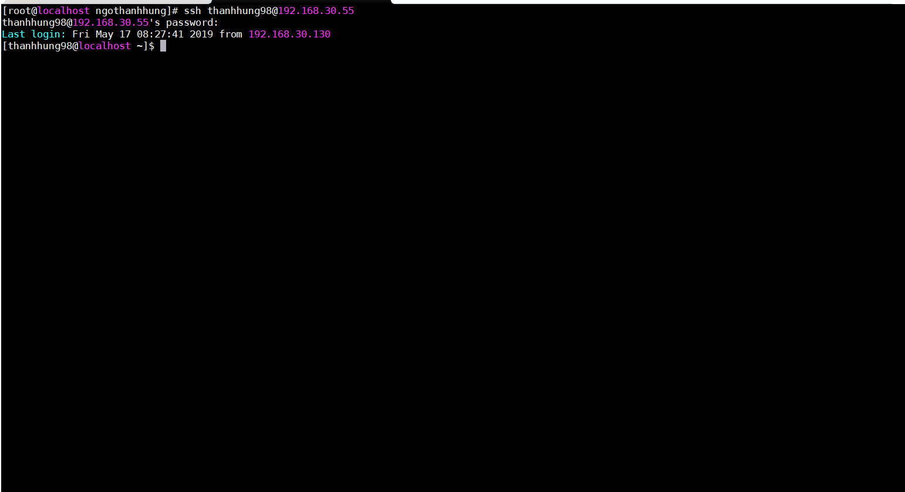
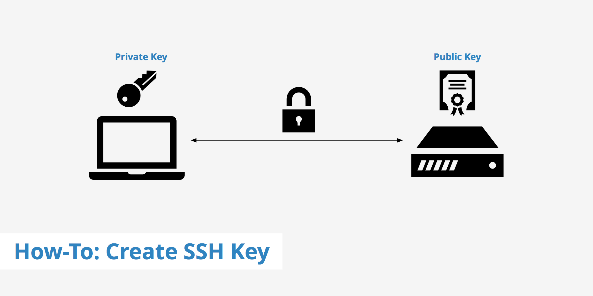
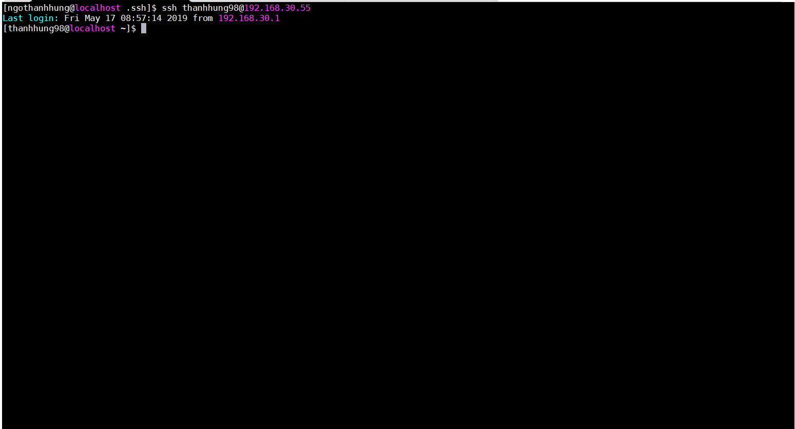

# SSH
SSH (Secure Shell) là một giao thức mạng, giao thức này cho phép chúng ta kết nối đến một máy chủ Linux từ xa thông qua mạng Internet. Mọi dữ liệu gửi và nhận thông qua SSH đều được mã hóa giúp bảo mật thông tin an toàn hơn.


## CÀI ĐẶT VÀ SỬ DỤNG SSH  
### Cài đặt :   
 ```
  yum -y install openssh-server openssh-clients  
```
###  SSH với username :   
```   
ssh localhost@IP_localhosst
```
 

### SSH với key :    
   

**Cách thức hoạt động của SSH Key**

SSH Key là một phương thức chứng thực người dùng truy cập bằng cách đối chiếu giữa một key cá nhân (Private Key) và key công khai(Public Key).  

Private key và Public key luôn có liên hệ chặt chẽ với nhau để nó có thể nhận diện lẫn nhau. Nội dung giữa Private Key và Public Key hoàn toàn khác nhau, nhưng nó vẫn sẽ nhận diện được với nhau thông qua một thuật toán riêng của nó. Khi thiết lập kết nối , máy chủ sẽ gửi public key cho các máy client muốn ssh từ xa , và máy chủ sẽ dùng private key để xác thực kết nối .    

**Thành phần chính của một SSH Key**

Khi tạo ra một SSH Key,  có 3 thành phần quan trọng như sau:

   -  Public Key (dạng file và string) – lưu trữ vào  ~/.ssh/authorized_keys trên server muốn remote.
    - Private Key (dạng file và string) –file lưu trong máy tinh , sau đó dùng PuTTY, WinSCP, MobaXterm,..để có thể login.
    - Keypharse (dạng string, cần ghi nhớ) – Mật khẩu để mở private key, khi đăng nhập vào server sẽ hỏi keypharse nếu có cài đặt.  

**- Cấu hình**  
- Từ một máy client ta muốn remote access vào một server .  
   - Tại client :  
```   
ssh-keygen -t rsa  
```
Sau đó ta gửi key public cho máy muốn remote :  
```
ssh-copy-id localhost@IP_localhost
```

   - Tại server :  
Chỉnh file /etc/ssh/sshd_config với các tùy chọn như sau :  
```sh
PubkeyAuthentication yes
AuthorizedKeysFile .ssh/authorized_keys
``` 

Nếu không muốn remote access bằng password và user , chỉ dùng key ta thêm tùy chọn
```  
PassAuthentication no
```  

Sau khi hoàn thành các bước trên ta có thể truy cập từ Client SSH vào Server bằng key : 
  
