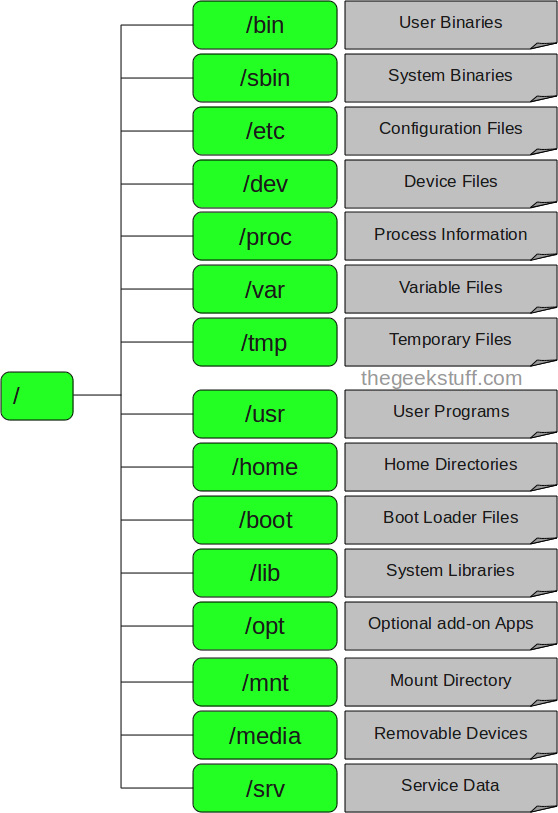

# LỊCH SỬ :

### Unix & BSD  

Nhắc đến Linux thì trước tiên, ta phải quay ngược thời gian để tìm hiểu về một cái tên khác, đó là **Unix** . **Unix** là một hệ điều hành vốn ra đời đã từ rất lâu, tại phòng thí nghiệm Bell Labs của AT&T. Dự án được dẫn dắt bởi **Ken Thompson** và **Dennis Ritchie**, 2 nhà khoa học máy tính nổi tiếng.Công việc phát triển Unix chính thức được bắt đầu vào mùa hè năm 1969, và phiên bản đầu tiên của Unix được ra đời vào tháng 3 năm 1971, tiếp đó là phiên bản thứ 2 ra đời năm 1972.

Ken Thompson và Dennis Ritchie chính là 2 người đã tạo ra B, ngôn ngữ lập trình vốn được support ở Unix những phiên bản đầu. Sau đó, vào năm 1972, Ritchie đã viết lại ngôn ngữ B, cải thiện nó tốt hơn, để trở thành **ngôn ngữ lập C**, ngôn ngữ lập trình còn rất phổ biến cho đến tận ngày nay. Hầu hết các components của Unix sau này đều được viết bằng C.
### Linux
Những năm sau của thập niên 70, AT&T chia sẻ Unix cho những tổ chức giáo dục, hay tổ chức thương mại bên ngoài, từ đó dẫn đến sự ra đời của nhiều phiên bản Unix khác nhau. Nổi bật nhất trong số đó là phiên bản giáo dục được xây dựng bởi Computer Systems Research Group thuộc đại học California, Berkeley. Phiên bản này được biết đến rộng rãi với cái tên **Berkeley Software Distribution**, hay **BSD**.  

Ban đầu, BSD được xây dựng dựa trên codebase cũng như design của Unix, tuy nhiên càng về sau, các phiên bản của Unix và BSD càng có những điểm đặc trưng, khác biêt, dẫn đến việc xảy ra những “cuộc chiến” để trở thành “tiêu chuẩn” giữa phiên bản Unix BSD và phiên bản Unix của AT&T mang tên mã System V. Kết quả là phần thắng thuộc về System V  

Nhánh BSD đi đến hồi kết của quá trình phát triển lịch sử của nó, với sự ra đời và của các open source project như: **FreeBSD**, **NetBSD** và **OpenBSD** . Phiên bản cuối cùng của BSD được giới thiệu năm 1995. Trong khi đó, phiên bản cuối cùng của Unix được phát triển bởi Bell Laps, phiên bản Unix 10, được ra mắt vào năm 1989.  

### GNU
Trong dòng chảy của sự phát triển của Unix, năm 1983 đã diễn ra một sự kiện quan trọng, là tiền đề cho những biến động lớn sau này.
Tháng 9 năm 1983, **Richard Stallman** thông báo về sự ra đời của dự án GNU (GNU là viết tắt của từ GNU’s not Unix)

Phiên bản thương mại, close source nổi tiếng, thành công nhất, có lẽ chính là MacOS đình đám của Apple. MacOS cũng như các hệ điều hành khác của Apple hiện nay là iOS, watchOS, và tvOS đều được dựa trên nền tảng của BSD
Mục tiêu của dự án GNU là tạo ra được một hệ điều hành miễn phí, giống Unix, nơi mà mọi người có quyền tự do copy, phát triển, chỉnh sửa và phân phối phần mềm, và việc tái phân phối là không bị giới hạn. (Nên nhớ, Unix và các phiên bản rẽ nhánh từ Unix ban đầu đều là close source và bị ràng buộc bản quyền)  
Project GNU đã tạo ra được rất nhiều sản phẩm quan trọng như GNU Compiler Collection (gcc), GNU Debugger, GNU Emacs text editor (Emacs), GNU build automator (make) … Ngoài ra còn phải kể đến giấy phép nổi tiếng được sử dụng rộng rãi nhất hiện nay: GNU General Public License (GPL)  
GNU Project đã đạt được nhiều thành tựu lớn, tạo ra được nhiều công cụ tương tự như những gì có trên Unix. Tuy nhiên, GNU vẫn thiếu một thành phần quan trọng, mảnh ghép cuối cùng để nó trở thành một hệ điều hành hoàn chỉnh. Đó chính là Kernel, phần thực hiện công việc điều khiển, giao tiếp với các thiết bị phần cứng (CPU, RAM, Devices …). Richard vaf FSF đã hoàn thiện hoàn toàn một hệ điều hành , tuy nhiên kernel của GNU là GNU Hurd hoạt động không được hiệu quả , GNU chưa thể trở thành một hệ thống hoàn chỉnh như mục tiêu ban đầu .

### Linux  

Ngày 25 tháng 8 năm 1991, một cậu sinh viên ở Phần Lan mang tên Linus Torvalds giới thiệu một sản phẩm cá nhân, sau này trở thành Linux Kernel.Project của Linus nhanh chóng nhận được sự chú ý cùng với đó là những đóng góp của nhiều cá nhân, tổ chức. 

Sự kết hợp giữa nhân Linux, với các phần mềm của GNU đã tạo ra một hệ điều hành hoàn chỉnh, hệ điều hành hoàn toàn miễn phí đầu tiên. Nó được mang tên GNU/Linux.

Có các điểm cần lưu ý :   
	- Bản thân Linux chỉ là một kernel , nó không phải là một hệ điều hành hoàn chỉnh , hệ điều hành sử dụng được gọi là Linux thực chất là GNU/Linux
	- Hệ điều hành Linux hoàn toàn không sử dụng chung, hay kế thừa bất kỳ phần code nào của Unix, hay BSD. Nó được xây dựng mới hoàn toàn bởi Linus và GNU Project để có thể trở thành … một phiên bản clone của Unix

Linux chỉ là phần **Kernel**, còn GNU cung cấp các công cụ cần thiết chạy trên Kernel đó. Tuy nhiên, việc config Kernel như thế nào, cài đặt, sử dụng các phần mềm nào thì ta có thể tự do quyết định.
Một số các tổ chức, công ty giúp chúng ta làm sẵn những việc đó với việc phối kết hợp Linux Kernel với các utilities, hay package manager để tạo ra một bản phân phối một hệ điều hành hoàn chỉnh. Chúng được gọi là Linux Distribution, hay Distro  

## DISTRO : 
- Một bản phân phối Linux (thường được gọi tắt là distro) là một hệ điều hành được tạo dựng từ tập hợp nhiều phần mềm dựa trênhạt nhân Linux và thường có một hệ thống quản lý gói tin.

- Thành phần: Một bản distro điển hình bao gồm: một kernel Linux, các công cụ và thư viện GNU, các phần mềm thêm vào, phần document, một hệ thống window system (mà phần lớn là sử dụng X Window System - hệ thống cửa sổ dùng để hiển thị đồ họa Bitmap), window manager và desktop environment.   

-Loại hình và xu hướng phát triển :   
+ Thương mại hoặc phi thương mại .  
+ Thiết kế cho doanh nghiệp , người dùng chuyên nghiệp hay người dùng bình thường   
+ Thiết kế cho máy chủ , máy tính cá nhân , thiết bị nhúng , ...

## Linux distributions:  
**Nhóm Debian** :    
-Nhóm này dựa trên Debian , bản thân Debian cũng là một distro . Tất cả distro trong nhóm này đều sử dụng phương thức quản  lí gói là dpkg , phương thức cập nhật là apt . Và các tập tin cài ddwatj có ứng dụng chính thức có đuôi là .deb . Trong nhóm này nổi bật nhất là Debian , Ubuntu ,Kali ,...  
- Có 3 dạng khác nhau:  
	- Phiên bản ổn định mà người dùng được khuyến khích sử dụng.
	- Phiên bản không ổn định.
	- Phiên bản thử nghiệm cho những ai mong muốn có được phần mềm mới nhất.

**Nhóm RedHat**:  
Nhóm này có xuất phát điểm là từ RedHat Linux Enterprise và bản thân RHEL cũng là 1 distro. Tuy nhiên, nó là 1 distro có tính chất thương mại và hướng tới người dùng doanh nghiệp, còn phiên bản free chính thức của nó và hướng tới người dùng cá nhân là Fedora.  

Dùng yum quản lí gói cài đặt.  

Nổi bật gồm Fedora , Centos,...

Phân biệt theo đối tượng :  

- Nhóm 1 : Arch , Gentoo, Slackware 
Nhắm tới người dùng am hiểu về hệ thống . Hầu hết phương thức và cấu hình hệ thống dều phải thực hiện qua môi trường dòng lệnh .
- Nhóm 2 : Debian , Fedora 
Nhắm vào người dùng am hiểu hệ thống nhưng cung cấp nhiều công cụ hơn .Có qui trình phát triển và kiểm tra chất lượng kĩ càng 
- Nhóm 3 : CentOS , RHEL , SUSE EL 
Nhắm vào thị trường doanh nghiệp , cơ quan , máy chủ .Ổn định , thời gian ra phiên bản mới lâu
- Nhóm 4 : Ubuntu , Open SUSE , Linux mint  
Nhắm đến những người mới dùng Linux   

**CẤU TRÚC THƯ MỤC CỦA LINUX** : 

1. / – Root
- Mở từng tập tin và thư mục từ thư mục Root.
- Chỉ có Root user mới có quyền viết dưới thư mục này.
- Lưu ý rằng /root là thư mục gốc của Root user.
2. /bin – User Binaries
- Chứa các tập tin thực thi nhị phân (binary executables).
- Lệnh Linux phổ biến sử dụng ở chế độ Singer-user mode nằm trong thư mục này.
- Tất cả user trên hệ thống nằm tại thư mục này đều có thể sử dụng lệnh.
- Ví dụ: ps, ls, ping, grep, cp...
3. /sbin – System Binaries
- Cũng giống như /bin, /sbin cũng chứa tập tin thực thi nhị phân (binary executables).
- Lệnh Linux nằm trong thư mục này được sử dụng bởi Admin hệ thống, nhằm mục đích duy trì hệ thống.
- Ví dụ: iptables, reboot, fdisk, ifconfig, ...
4. /etc – Configuration Files
- Chứa cấu hình các tập tin cấu hình của hệ thống, các tập tin lệnh để khởi động các dịch vụ của hệ thống……
- Ngoài ra /etc còn chứa shell scripts startup và shutdown, sử dụng để chạy/ngừng các chương trình cá nhân.
- Ví dụ: /etc/resolv.conf, /etc/logrotate.conf.
5. /dev – Files device
- Chứa các tập tin để nhận biết cho các thiết bị của hệ thống (device files).
- Bao gồm thiết bị đầu cuối, USB hoặc các thiết bị được gắn trên hệ thống.
- Ví dụ: /dev/tty1, /dev/usbmon0
6. /proc – Process Information
- Chưa các thông tin về System Process.
- Đây là hệ thống tập tin giả có chứa thông tin về các quá trình đang chạy. chẳng hạn như thư mục /proc/{pid} có chứa thông tin về quá trình đặc biệt của pid.
- Đây là một hệ thống tập tin ảo có thông tin về tài nguyên hệ thống. Chẳng hạn như /proc/uptime.
7. /var – Variable Files
- Var là viết tắt của variable file, lưu lại tập tin ghi các số liệu biến đổi (variable files).
- Nội dung các tập tin được dự kiến sẽ tăng lên tại thư mục này.
- Bao gồm: hệ thống tập tin log (/var/log), các gói và các file dữ liệu (/var/lib), email (/var/mail), print queues (/var/spool); lock files (/var/lock); các file tạm thời cần khi reboot (/var/tmp).
8. /tmp – Temporary Files (các tập tin tạm thời)
- Thư mục chứa các tập tin tạm thời được tạo bởi hệ thống và user.
- Các tập tin tạo thư mục này được xóa khi hệ thống được khởi động lại (reboot).
9. /usr – User Programs
- Chứa các ứng dụng, thư viện, tài liệu và mã nguồn các chương trình thứ cấp.
- /usr/bin chứa các tập tin của các ứng dụng chính đã được cài đặt cho user. Nếu bạn không tìm thấy user binary tại thư mục /bin, bạn có thể tìm tại thư mục /usr/bin. Ví dụ như at, awk, cc, less, scp.
- /usr/sbin có chứa các tập tin ứng dụng cho Admin hệ thống. Nếu không tìm thấy hệ nhị phân tại /sbin, bạn có thể tìm tại /usr/sbin. Chẳng hạn như atd, cron, sshd, useradd, userdel.
- /usr/lib chứa thư viện /usr/bin và /usr/sbin.
- /usr/local chứa các chương trình user mà bạn cài đặt từ nguồn.
Chẳng hạn khi bạn cài đặt apache từ nguồn, apache nằm dưới /usr/local/apache2.
10. /home – thư mục Home
- Thư mục chính lưu trữ các tập tin cá nhân của tất cả user.
- Ví dụ: /home/john, /home/nikita.
11. /boot – Boot Loader Files
- Chứa các tập tin cấu hình cho quá trình khởi động hệ thống.
- Các file Kernel initrd, vmlinux, grub nằm trong /boot.
- Ví dụ: nitrd.img-2.6.32-24-generic, vmlinuz-2.6.32-24-generic.
12. /lib – System Libraries
- Chứa các file thư viện hỗ trợ các thư mục nằm dưới /bin và /sbin.
- Tên file thư viện có thể là ld* hoặc lib*.so.*.
- Ví dụ: ld-2.11.1.so, libncurses.so.5.7.