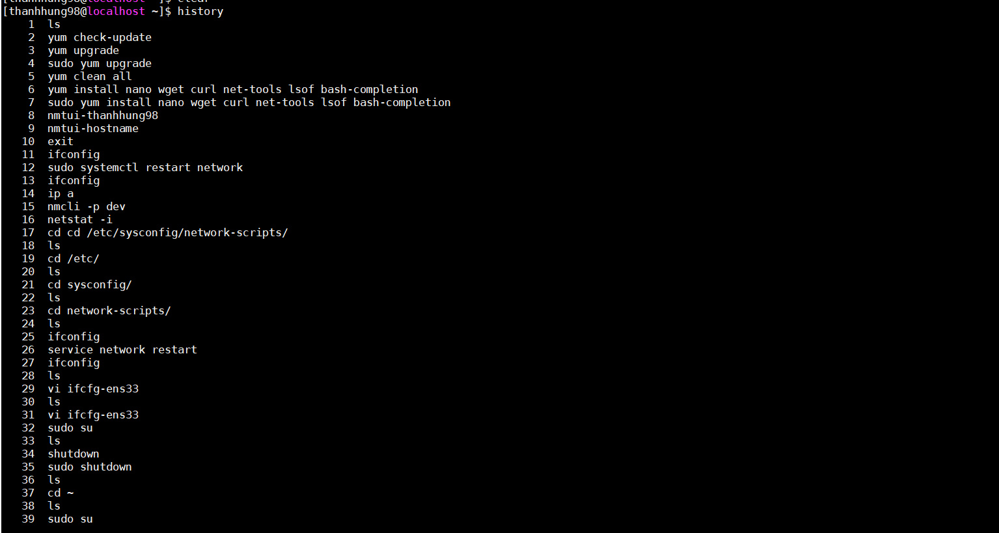
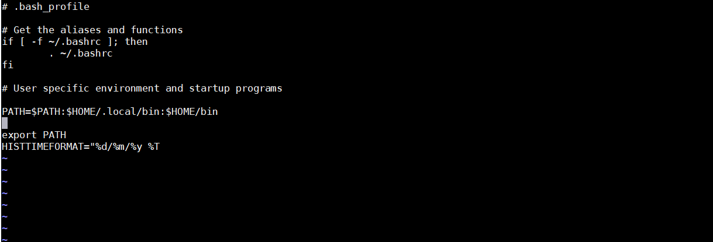
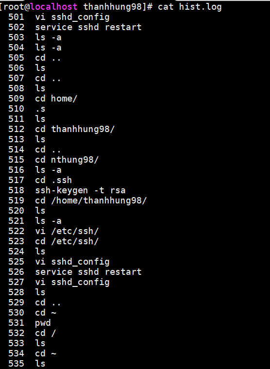
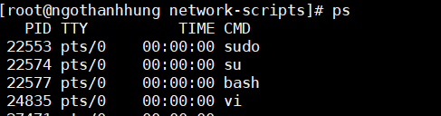

# CÁC LỆNH CƠ BẢN  
**echo**  
- Cú pháp :   
```
echo [option(s)] [string(s)]
```  

- Các tùy chọn :  
   - Lưu ý : cần có -e sau lệnh echo để có thể sử dụng các backslash escapes như \n \b  

**\b** : Xóa bỏ khoảng cách giữa các chữ  
**\t** : Tạo tab space 
**\n** : Xuống dòng  

echo * : Hiển thị các file,folder .   
echo "abc" > file : chèn dòng chữ vào file , xóa hết các dữ liệu cũ.    
echo >> : chèn thêm dòng chữ xuống dưới , dữ liệu cũ giữ nguyên .  

**chmod**  
`chmod option owner(+,-)(r,w,x) file/folder`  
Với owner gồm : u = user, u = group, o = others  

**history**  
Hiển thị các lệnh đã dùng trong Terminal  
  

- Hiển thị thêm ngày giờ của lệnh :  
Định nghĩa biến môi trường HISTTIMEFORMAT trong file .bash_profile như sau    
`HISTTIMEFORMAT="%d/%m/%y %T " `  
Trong đó  
  - %d : Ngày  
  - %m : Tháng  
  - %y : Năm  
  - %T : Thời gian  

  
 

Sau đó dùng lệnh source ~/.bash_profile để load các cấu hình của các biến môi trường .  Khi đó dùng history sẽ hiển thị thêm ngày giờ của lệnh đã được dùng  
  
 
- Đẩy lệnh history vào một file .log :   
 Tạo một file .log và một file script , ta viết các lệnh sau trong script :  
 ``` 
$!/bin/bash  
history -r  
history > hist.log
```  
**Sau đó chạy file script và kiểm tra file log :**  
`source ./history.sh`  

  

     
**Hiển thị RAM , CPU**  
Hiển thị CPU :
```  
cat /proc/cpuinfo

nproc  #Số nhân xử lí của cpu  

lsccpu
```  
Hiển thị RAM :  
```
cat /proc/meminfo

free
```  

**Hiển thị các gói đã cài đặt**  
```
rpm -qa   

yum list installed  
```
 **Hiển thị các file nén trong hệ thống**  
` find . -iname \*.zip `  

 ### **Biến môi trường trong linux**  
- Khi làm việc trên máy tính chúng ta cần những thông tin như tên phiên bản hệ điều hành (HĐH) đang chạy, tên thư mục home, thư mục chứa lệnh chương trình …

- Một khái niệm quan trọng trên linux đó là môi trường (environment) được định nghĩa qua các biến môi trường. Một số biến được đặt bởi hệ thống, số khác do bạn đặt, hoặc set bởi shell (các lệnh) hay một chương trình nào đó được load.

- Một biến môi trường có tên là một dãy chữ cái và nhận một  giá trị nhất định, giá trị này có thể là số, chữ, tên file, thiết bị (device) hay một kiểu dữ liệu nào đó.  

- Các biến môi trường lưu trong mục home của người dùng: .bashrc, .bash_profile, .bash_aliasses, /etc/profile


### Các biến môi trường căn bản :  
 - Biến $HOME :  
 HOME là một biến môi trường đại diện cho thư mục home của người dùng. Lệnh cd không có đối số sẽ thay đổi thư mục làm việc hiện tại thành giá trị của HOME. Nghĩa là lệnh cd $HOME và cd ~ là tương đương nhau .  
 
 - Biến $PATH :  
PATH là biến đưa ra danh sách các directory mà hệ thống tìm đến khi thực hiện các lệnh hoặc script để chạy . Mỗi directory path được ngăn cách bởi dấu ":" .  

**Process**  
Lệnh `ps`:  
  
    
Kill process theo tên :   
`killall process-name`

**netstat**  
Netstat (network statistics) là một công cụ dòng lệnh để theo dõi các kết nối mạng vào và ra có sẵn trên tất cả các hệ điều hành dựa trên Unix và cũng có sẵn trên hệ điều hành Windows. Nó rất hữu ích trong việc khắc phục sự cố mạng và đo lường hiệu năng. Netstat là một trong những công cụ gỡ lỗi dịch vụ mạng cơ bản nhất, cho bạn biết cổng nào mở và bất kỳ chương trình nào đang lắng nghe trên các cổng.  
  
Các options :  
netstat -a  : hiển thị các cổng tcp và udp    
netstat -au : hiển thị các cổng udp  
netstat -at : hiển thị các cổng tcp
netstat -l : hiển thị các cổng tcp v  à udp trong trạng thái listening  
netstat -lu : hiển thị các cổng  udp trong trạng thái listening  
netstat -lt : hiển thị các cổng tcp  trong trạng thái listening  
netstat -s : hiện các thông số của các protocol , bao gồm ip , icmp ,tcp ,udp  

**top**  
The top command is another highly recommended method to see your Linux servers resource usage. One can see a list of top process that using the most memory or CPU or disk.

**uname**  
Hiển thị thông số của hệ thống :  
`uname -s`: Kernal name    
`uname -r`: Kernal release  
`uname -v`: Kernal version  
`uname -m`: Hardware name  

**tail**  
- in 10 dòng cuối .Có thể thay đổi số dòng bằng -n number
- In ra những dòng của file trong khi vẫn đang bị viết bởi các chương trình khác  :  
```  
tail –ftest.txt  
```
**file**  
Đưa ra thuộc tính của file  
`file <package_name>`  


**find**  
- Tìm file :   ``find``  
- Tìm theo tên :
```  
find -name abc.txt
``` 
- Tìm theo thể loại:  
    Bạn còn có thể tìm theo đúng loại file muốn tìm, bằng cách dùng -type. Một số option:  
      
      f: regular file  
      d: directory (thư mục)  
      l: symbolic link  
      c: character devices  
      b: block devices    
- Tìm file theo dung lượng  
`find / -size (+,-)50c`  
    c: bytes  
    k: Kilobytes  
    M: Megabytes  
    G: Gigabytes  
    b: 512-byte blocks  

- Tìm theo Owner và Permission

Chúng ta có thể tìm theo user hay group owner bằng -user và -group.

