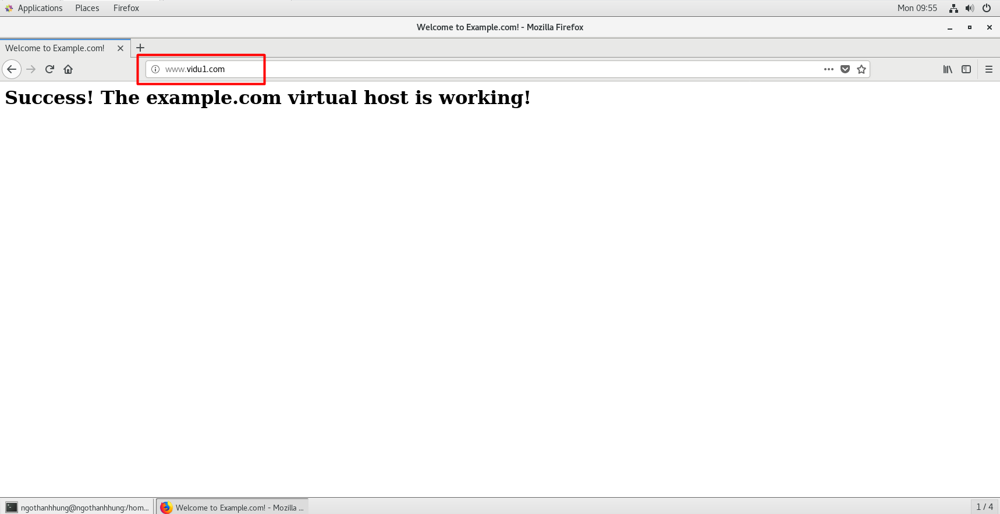
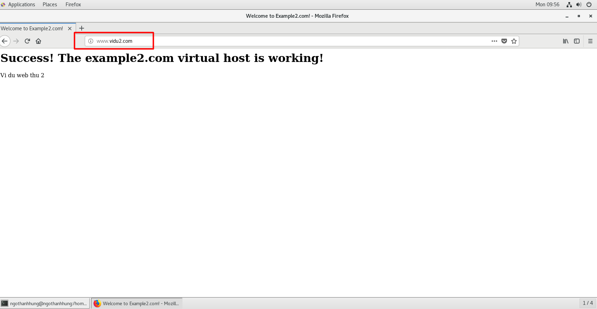
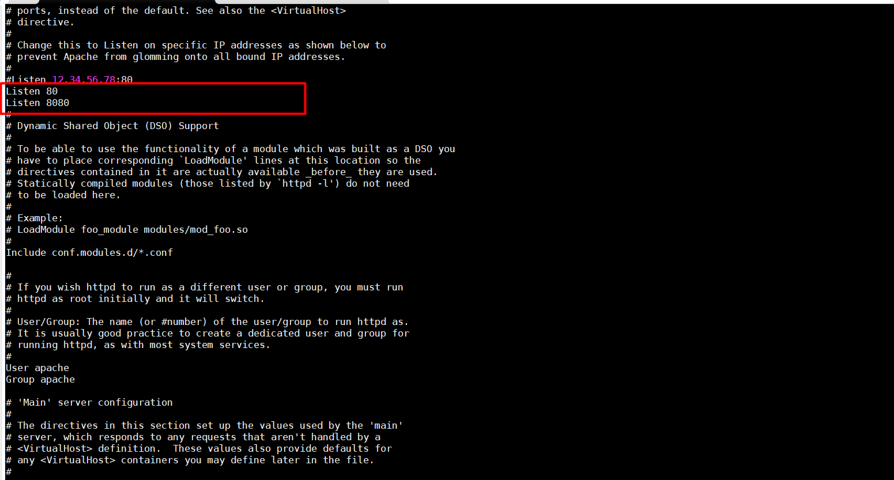
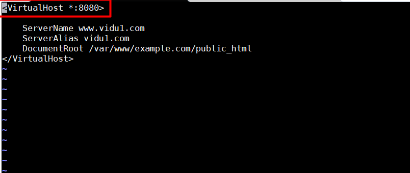

# CẤU HÌNH VIRTUAL HOST APACHE  

## 1.Chạy nhiều website trên 1  IP address , tại 1 cổng:  
1.1 Tạo Directory cho website :  
 - Tạo directory chứa các file cấu hình của website :  
 ```
 mkdir -p /var/www/example.com/public_html
  mkdir -p /var/www/example2.com/public_html
 ```  
 - Cấp quyền truy cập cho các file trên :  
 ```
 chmod -R 755 /var/www  
 ```  
- Tạo và cấu hình các file index.html trong public_html :  
```
vi /var/www/example.com/public_html/index.html  
```  

```
<html>
  <head>
    <title>Welcome to Example.com!</title>
  </head>
  <body>
    <h1>Success! The example.com virtual host is working!</h1>
  </body>
</html>
```  
- Copy file vừa cấu hình sang directory của website thứ 2 và chỉnh sửa file index.html :  
```
cp /var/www/example.com/public_html/index.html /var/www/example2.com/public_html/index.html
```  
```
<html>
  <head>
    <title>Welcome to Example2.com!</title>
  </head>
  <body>
    <h1>Success! The example2.com virtual host is working!</h1>
    <p>Vi du web thu 2 </p>  
  </body>
</html>

```  
1.2 Tạo Virtual Host Files :  
- Tạo directory sites-available để giữ các file cấu hình virtual host , còn directory sites-enabled sẽ giữ các symbolic links những website mình muốn hiển thị .  
```
sudo mkdir /etc/httpd/sites-available
sudo mkdir /etc/httpd/sites-enabled
```  
- Để apache server chạy các file từ directory sites-enabled , thêm lệnh sau vào cuối file httpd.conf :  
```
vi /etc/httpd/conf/httpd.conf


IncludeOptional sites-enabled/*.conf

```

1.3 Cấu hình Virtual Host File  :  
- Tạo và cấu hình file example.com.conf như sau :  
```
vi /etc/httpd/sites-available/example.com.conf
```  
- Chú ý : Các file virtual host cần có đuôi .conf    
- Cấu hình file :  
```
<VirtualHost *:80>

    ServerName www.vidu1.com  
    ServerAlias vidu1.com
    DocumentRoot /var/www/example.com/public_html
   
</VirtualHost>
```  
 **Trong đó *:80 là cho phép truy cấp tất cả các interface bằng port 80**

- Tương tự với file của website 2 :  
```
sudo cp /etc/httpd/sites-available/example.com.conf /etc/httpd/sites-available/example2.com.conf
```  
```
sudo nano /etc/httpd/sites-available/example2.com.conf
```  
- File cấu hình :  
```
<VirtualHost *:80>
    ServerName www.vidu2.com
    ServerAlias vidu2.com
    DocumentRoot /var/www/example2.com/public_html

</VirtualHost>
```  

1.4 Enable Virtual Host Files :  
- Ta tạo các symbolic link của các file cấu hình virtual host vào trong directory sites-enabled :  
```
sudo ln -s /etc/httpd/sites-available/example.com.conf /etc/httpd/sites-enabled/example.com.conf
sudo ln -s /etc/httpd/sites-available/example2.com.conf /etc/httpd/sites-enabled/example2.com.conf
```  
- Sau đó ta restart lại service để áp dụng các thay đổi :  
```
sudo apachectl restart  
```
1.5 Cấu hình bên client :  
- Do không có một domain thật , nên ta cần cấu hình file hosts ở một máy client để có thể truy cập vào web server (Ở ví dụ đây máy client chạy CentOS7):
```
vi /etc/hosts
```
- File cấu hình :  
```
127.0.0.1   localhost
127.0.1.1   guest-desktop
server_ip_address www.vidu1.com
server_ip_address www.vidu2.com
```
- Sau đó ta có thể kiểm tra bằng cách nhập địa chỉ 2 website vào browser trong máy client :  
  
  

## 2. Cấu hình 2 website khác port :
(Đã có sẵn các cấu hình căn bản từ phần 1)  
 Cấu hình lại file httpd.conf để thêm port listening :  
 ```
 vi /etc/httpd/conf/httpd.conf  
 ```
 File cấu hình thêm dòng sau để web server lắng nghe từ cổng 8080:    
  
Cấu hình file virtual host của website vidu1 , còn website vidu2 giữ nguyên ở cổng 80:
```  
vi /etc/httpd/sites-available/example.com.conf
```    
  
Sau đó ta thử truy cập từ client kiểm tra có truy cập vào web được không  .

## 3.Cấu hình website ở 2 dải IP khác nhau :  
(Đã có sẵn các cấu hình căn bản từ phần 1)  

- Cấu hình 2 file config của 2 website để đặt ở 2 dải IP khác nhau , ở ví dụ này sử dụng Web Server trên máy ảo , ta đặt 2 website này vào 2 dải IP của NAT và Host-only . 
- Cấu hình website thứ nhất :  
```
vi /etc/httpd/sites-available/example.com.conf
```

  - File cấu hình :
```  
<VirtualHost 192.168.30.55>

    ServerName www.vidu1.com
    ServerAlias vidu1.com
    DocumentRoot /var/www/example.com/public_html
</VirtualHost>
```  
- Tương tự với file của website thứ 2 :  
```
vi /etc/httpd/sites-available/example2.com.conf

```
```

<VirtualHost 4.4.4.5>

    ServerName www.vidu2.com
    ServerAlias vidu2.com
    DocumentRoot /var/www/example2.com/public_html
</VirtualHost>
~

```  
Sau khi cấu hình xong dùng một máy client để ping và kiểm tra có truy cập được 2 trang web không :
  

