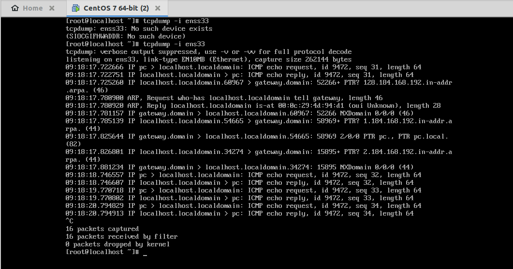
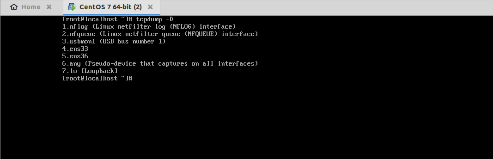
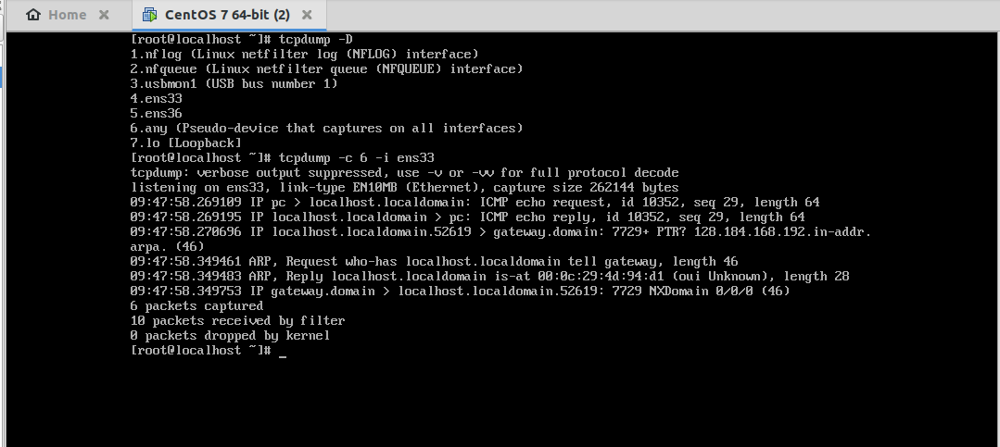

# Tìm hiểu về lệnh tcpdump trên CentOS7
## 1. Khái niệm
- ```TCPdump``` là công cụ được phát triển nhằm mục đích phân tích các gói dữ liệu mạng theo dòng lệnh. Nó cho phép khách hàng chặn và hiển thị các gói tin được truyền đi hoặc được nhận trên một mạng mà máy tính có tham gia.
## 2. Cài đặt 
Để sử dụng được lệnh tcpdump trên CentOS7 , chúng ta phải cài một gói với lệnh như sau:
```
yum install tcpdump -y 
```
## 3. Một số lệnh cơ bản
### Định dạng chung của một dòng giao thức tcpdump:
```
time-stamp src > dst:  flags  data-seqno  ack  window urgent options
```
- Time-stamp: hiển thị thời gian gói tin được capture.
- Src và dst: hiển thị địa chỉ IP của người gửi và người nhận.  
- Cờ Flag  
S(SYN): Được sử dụng trong quá trình bắt tay của giao thức TCP.  
.(ACK): Được sử dụng để thông báo cho bên gửi biết là gói tin đã nhận được dữ liệu thành công.  
F(FIN): Được sử dụng để đóng kết nối TCP.  
P(PUSH): Thường được đặt ở cuối để đánh dấu việc truyền dữ liệu.  
R(RST): Được sử dụng khi muốn thiết lập lại đường truyền.  
- Data-sqeno : Số sequence number của gói dữ liệu hiện tại.  
- ACK : Mô tả số sequence number tiếp theo của gói tin do bên gửi truyền (số sequence number mong muốn nhận được).  
- Window : Vùng nhớ đệm có sẵn theo hướng khác trên kết nối này.  
- Urgent : Cho biết có dữ liệu khẩn cấp trong gói tin.  

### Bắt gói tin trên Interface  
```
tcpdump -i <INTERFACE>
```
Ví dụ:

  

Bấm tổ hợp phím Ctrl + C để dừng.

Sau khi ta dừng, sẽ hiện ra một bảng với các thông số:

- **Packet capture**: số lượng gói tin bắt được và xử lý.  
- **Packet received by filter**: số lượng gói tin được nhận bởi bộ lọc.  
- *Packet dropped by kernel**: số lượng packet đã bị dropped bởi cơ chế bắt gói tin của hệ điều hành.

### Hiển thị giao diện có sẵn
Để có danh sách các giao diện có sẵn trên hệ thống, bạn có thể chạy lệnh sau:
```
tcpdump -D
```
Ví dụ :

  

### Bắt n gói tin với tùy chọn -c
- Mặc định, tcpdump sẽ bắt liên tiếp các gói tin. Để dừng quá trình này, chúng ta phải thao tác tổ hợp phím Ctrl + C. 
- Nhưng với tùy chọn -c, chúng ta có thể chỉ cho tcpdump biết là "Tôi chỉ muốn bắt n gói." Cú pháp như sau:
```
tcpdump -c n -i <interface>
```  
Với n là số gói tin cần bắt.

Ví dụ: Ta cần bắt 6 gói tin 




