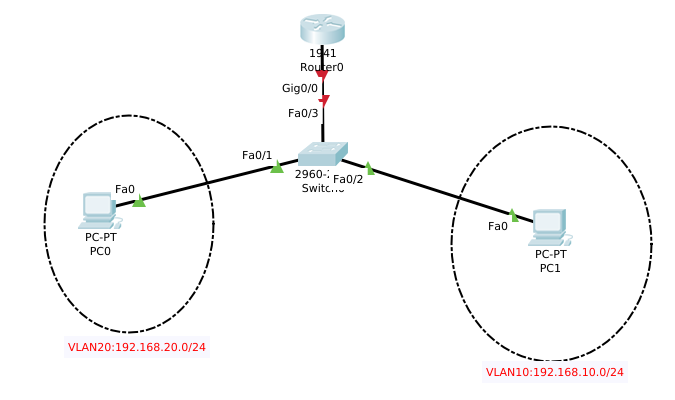
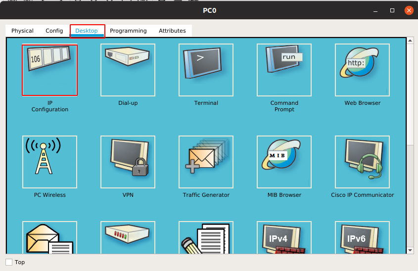
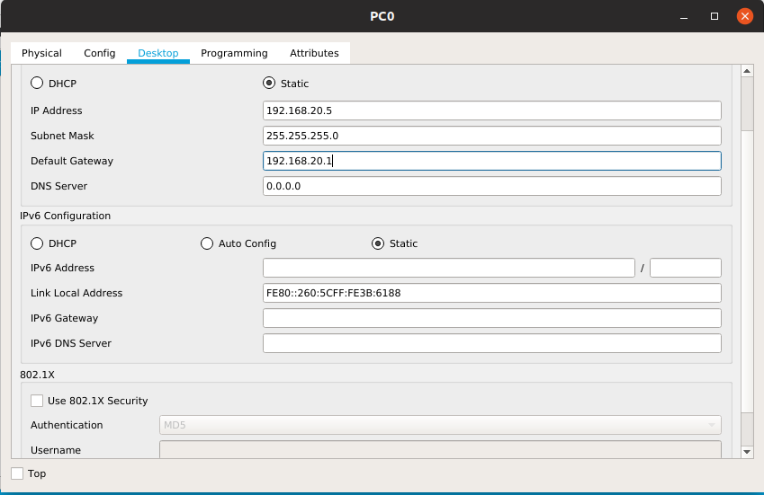
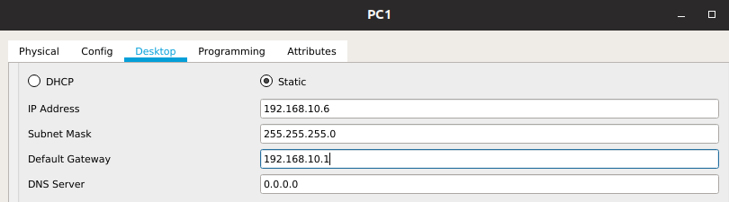

# Chia VLAN 
## Mô hình  



- Để thực hiện cấu hình Vlan chúng ta thực hiện các bước sau đây :  
+Đầu tiên cấu hình Vlan trên switch.  

Cấu hình như sau :
``` 
Switch(config)#vlan 10//tạo vlan 100
Switch(config-vlan)#name KT //đặt tên cho vlan đó
Switch(config-vlan)#exit
Switch(config)#vlan 20
Switch(config-vlan)#name HC
Switch(config-vlan)#exit  
```
- Ta cấu hình các cổng thuộc Vlan đó:  
```
Switch(config)#interface range f0/1
Switch(config-if-range)#switchport access vlan 20
Switch(config-if-range)#exit
Switch(config)#interface range f0/2
Switch(config-if-range)#switchport access vlan 10
Switch(config-if-range)#exit
```
- Ta đặt địa chỉ IP cho các VLAN:
```
Switch(config)#int vlan 20
Switch(config-if)#ip address 192.168.20.1 255.255.255.0
Switch(config-if)#no shutdown
Switch(config-if)#exit
Switch(config)#int vlan 10
Switch(config-if)#ip address 192.168.10.1 255.255.255.0
Switch(config-if)#no shutdown 
Switch(config-if)#exit
```  
- Bước tiếp theo ta đặt địa chỉ IP cho router:
``` 
Router(config)#int gig0/0.10
Router(config-subif)#encapsulation dot1Q 10
Router(config-subif)#ip address 192.168.10.1 255.255.255.0
Router(config-subif)#exit
Router(config)#int gig0/0.20
Router(config-subif)#encapsulation dot1Q 20
Router(config-subif)#ip address 192.168.20.1 255.255.255.0
Router(config-subif)#exit
Router(config)#int gig0/0
Router(config-if)#no shutdown
Router(config-if)#exit
```
- Sau đó ta gán địa chỉ ip cho từng PC:

  

  
 


- Cuối cùng ta cấu hình trunk trên switch :
```
Switch(config)#interface f0/3
Switch(config-if)#switchport mode trunk
Switch(config-if)#exit
```


