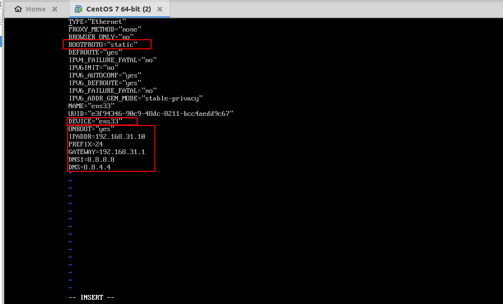
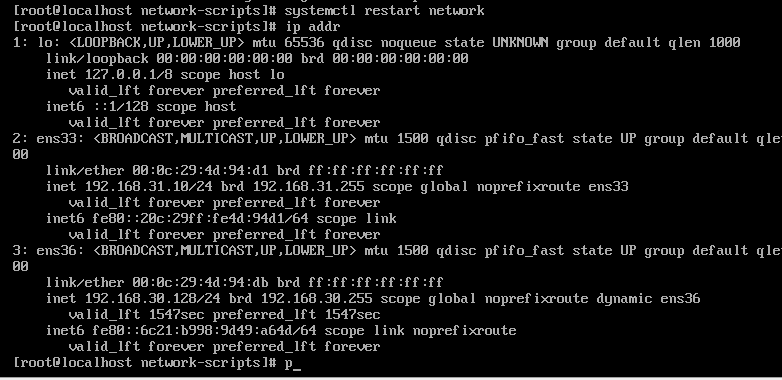
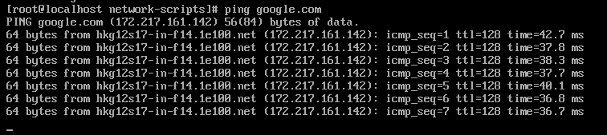

# Cấu hình IP tĩnh trên CenOS7
Đầu tiên các bạn login vào hệ thống.  
Sau khi login hệ thống chúng ta vào thư mục sau: /etc/sysconfig/network-scripts/  bằng lệnh:
```
cd  /etc/sysconfig/network-scripts/
```
Sau đó chúng ta mở file tên card mạng:
Mở file ifcfg-ens33 :
```
vi ifcfg-ens33
```
Sửa thông số sau:



Lưu lại file ens33 bằng lệnh  :x!

Khởi động lại card mạng bằng lệnh sau:
```
systemctl restart network.service
```
ví dụ:   



Cuối cùng ta ping google.com :



Chúc mọi người thành công !!!

# ifdown và ifup
Câu lệnh ifdown và ifup giống như ifconfig up hay ifconfig down. Hai câu lệnh thực hiện bật hoặc tắt giao diện chỉ định. Điều này yêu cầu quyền quản trị nên bạn phải dùng thêm từ khóa sudo trên Ubuntu.
```
sudo ifdown eth0
sudo ifup eth0
```
