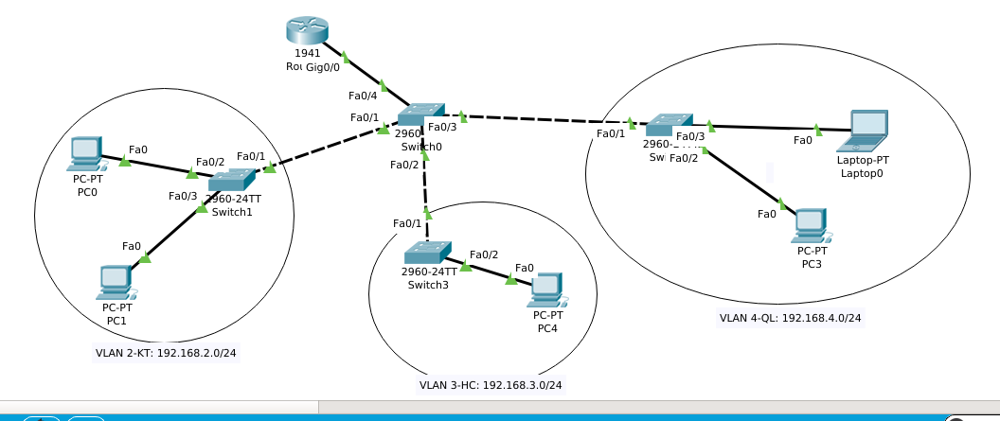

# Cấu hình DHCP 
Dưới đây là mô hình :  



- Đầu tiên ta cấu hình trên switch0 cấu hình trunk, vtp và tạo vlan :
```
Switch(config)#interface range f0/1-4
Switch(config-if-range)#switchport mode trunk
Switch(config-if-range)#switch trunk allowed vlan all
Switch(config-if-range)#exit
Switch(config)#vtp version 2
Switch(config)#vtp domain nhanhoa
Switch(config)#vtp password 123
Setting device VLAN database password to 123
Switch(config)#vtp mode server 
Switch(config)#vlan 2
Switch(config-vlan)#name KT
Switch(config-vlan)#exit
Switch(config)#vlan 3
Switch(config-vlan)#name HC
Switch(config-vlan)#exit
Switch(config)#vlan 4
Switch(config-vlan)#name QL
Switch(config-vlan)#exit
```
a.Tiếp theo ta cấu hình trunk, vtp và gán port switch vào vlan trên từng switch:  
- Trên switch1
```
Switch(config)#interface f0/1
Switch(config-if)#sw mode trunk
Switch(config-if)#sw trunk allowed vlan all
Switch(config)#vtp version 2
Switch(config)#vtp domain nhanhoa
Switch(config)#vtp password 123
Switch(config)#vtp mode client
Switch(config)#exit
Switch(config)#int range f0/2-f0/3
Switch(config-if-range)#sw access vlan 2
```

- Làm tương tự với switch2 và switch3  
b.Sau đó ta cấu hình ip của các vlan và cấu hình dhcp:
```
Router(config)#int gigabitEthernet 0/0.2
Router(config-subif)#encapsulation dot1Q 2
Router(config-subif)#ip address 192.168.2.1 255.255.255.0
Router(config-subif)#no shutdown
Router(config-subif)#exit
Router(config)#int gigabitEthernet 0/0.3
Router(config-subif)#encapsulation dot1Q 3
Router(config-subif)#ip address 192.168.3.1 255.255.255.0
Router(config-subif)#no shutdown
Router(config-subif)#exit
Router(config)#int gigabitEthernet 0/0.4
Router(config-subif)#encapsulation dot1Q 4
Router(config-subif)#ip address 192.168.4.1 255.255.255.0
Router(config-subif)#no shutdown
Router(config-subif)#exit
Router(config)#ip dhcp pool KT
Router(dhcp-config)#network 192.168.2.1 255.255.255.0
Router(dhcp-config)#network 192.168.2.0 255.255.255.0
Router(dhcp-config)#default-router 192.168.2.1
Router(dhcp-config)#exit
Router(config)#ip dhcp pool HC 
Router(dhcp-config)#network 192.168.3.0 255.255.255.0
Router(dhcp-config)#default-router 192.168.3.1
Router(dhcp-config)#dns-server 0.0.0.0
Router(dhcp-config)#exit
Router(config)#ip dhcp pool QL
Router(dhcp-config)#network 192.168.4.0 255.255.255.0
Router(dhcp-config)#default-router 192.168.4.1
Router(dhcp-config)#exit
```
