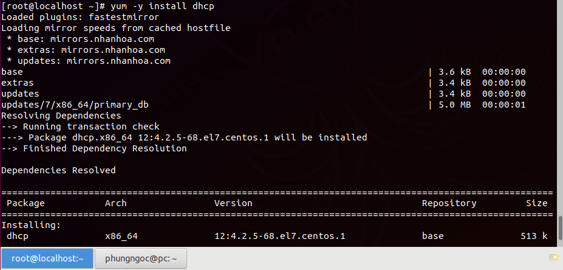
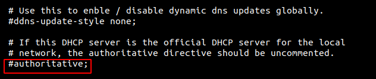
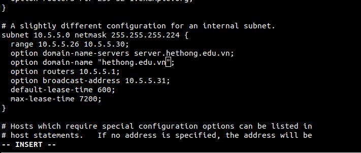

# Cài đặt và cấu hình DHCP Server trên CentOS 7 
## 1. Cài đặt DHCP server
Sử dụng tài khoản root. Chạy dòng lệnh :  
```
#yum install dhcp 
```


Kiểm tra xem dhcp đã được cài chưa ta dùng lệnh:
```
rpm -qa | grep dhcp
```
## 2. Cấu hình DHCP Server trên CentOS 
Sau khi đã cài đặt gói dịch vụ thành công chúng ta chép file cấu hình mẫu tới thư mục /etc/dhcp
```
cp /usr/share/doc/dhcp-*/dhcpd.conf.example /etc/dhcp/dhcpd.conf
```
Chỉnh sửa file cấu hình DHCP:
```
# vi /etc/dhcp/dhcpd.conf
```
Sau khi chỉnh sửa, restart DHCP để các thay đổi có hiệu lực:
```
# systemctl restart dhcpd
``` 
Khởi động/kết thúc dịch vụ DHCP:
```
# systemctl [start] [stop] dhcpd
```
Tiến hành chỉnh sửa lần lượt :

Cấu hình domain name và domain name-server :


Nếu máy chủ DHCP Server này là máy chủ chính thức trong hệ thống mạng nội bộ, bạn hãy tìm và bỏ comment dòng này authoritative :



Cấu hình Subnet, dãy IP,  domain và domain name-server :



Sau khi tiến hành thay đổi thông số như ý muốn, bạn lưu lại và đóng file.  

Sau khi chỉnh sửa, restart DHCP để các thay đổi có hiệu lực:
```
# systemctl restart dhcpd
``` 
Khởi động/kết thúc dịch vụ DHCP:
```
# systemctl [start] [stop] dhcpd
```
Vậy là xong. Bạn có thể chuyển qua máy con Client để cấu hình Client tự động nhận địa chỉ IP cấp phát từ DHCP Server.

Chúc mọi người thành công !!


