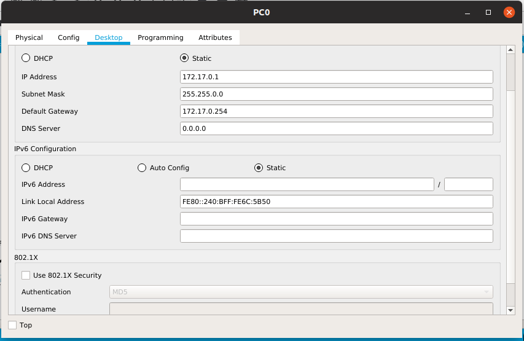
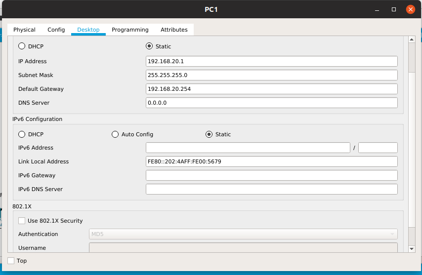
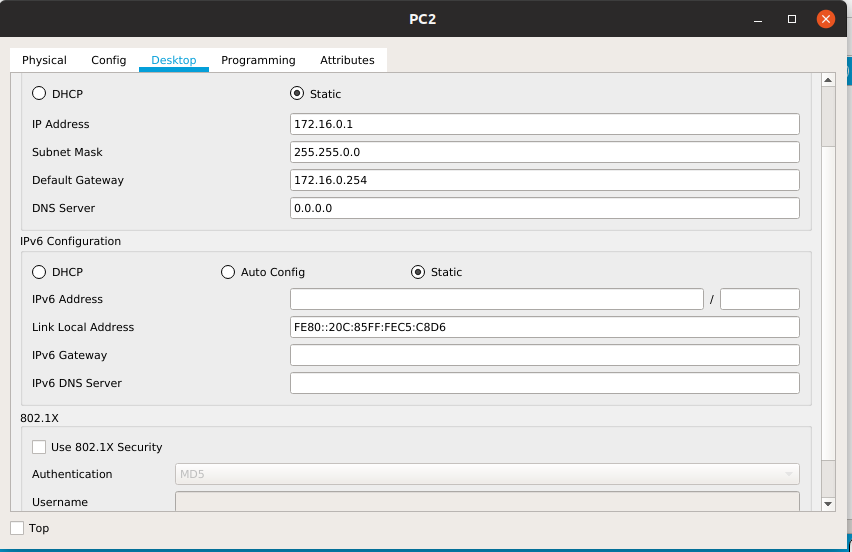
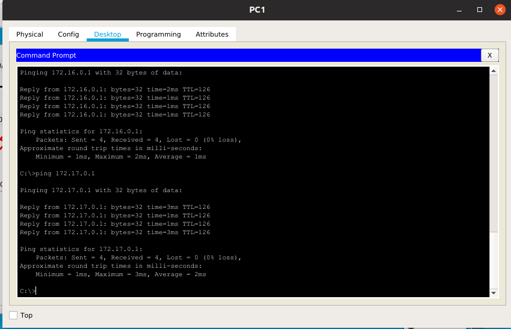

# Giao thức định tuyến RIPv2
- Ta có mô hình như sau :  

  

- Đầu tiên ta gán địa chỉ ip cho các router :  
+Route0:
```
Router(config)#int fa0/0 
Router(config-if)#ip add 192.168.20.254 255.255.255.0
Router(config-if)#no shutdown
Router(config-if)#exit
Router(config)#int se0/0/0
Router(config-if)#ip add 192.168.11.1 255.255.255.0
Router(config-if)#no shutdown
Router(config-if)#exit
Router(config)#int se0/0/1
Router(config-if)#ip add 192.168.10.1 255.255.255.0
Router(config-if)#no shutdown
Router(config-if)#exit
```  
+Router1:
```
Router(config)#int se0/0/0
Router(config-if)#ip add 192.168.10.2 255.255.255.0
Router(config-if)#no shutdown
Router(config-if)#exit
Router(config)#int fa0/0
Router(config-if)#ip add 172.16.0.254 255.255.0.0
Router(config-if)#no shutdown
Router(config-if)#exit
Router(config)#int se0/0/1
Router(config-if)#ip add 192.168.12.2 255.255.255.0
Router(config-if)#no shutdown
Router(config-if)#exit
```  

+Router2:
```
Router(config)#int se0/0/1
Router(config-if)#ip add 192.168.12.1 255.255.255.0
Router(config-if)#no shutdown
Router(config-if)#exit
Router(config)#int se0/0/0
Router(config-if)#ip add 192.168.11.2 255.255.255.0
Router(config-if)#no shutdown
Router(config-if)#exit
Router(config)#int fa0/0
Router(config-if)#ip add 172.17.0.254 255.255.0.0
Router(config-if)#no shutdown
Router(config-if)#exit
```  
- Sau đó, ta gán địa chỉ ip cho các PC:
  
  





- Tiếp theo, ta cấu hình giao thức RIPv2 trên các router:  

+Router0:
```
Router(config)#router rip
Router(config-router)#version 2
Router(config-router)#network 192.168.20.0
Router(config-router)#network 192.168.11.0
Router(config-router)#network 192.168.10.0
Router(config-router)#no auto-summary
Router(config-router)#exit
```  
 
+Router1:
```
Router(config)#router rip
Router(config-router)#version 2
Router(config-router)#network 192.168.10.0
Router(config-router)#network 192.168.12.0
Router(config-router)#network 172.16.0.0
Router(config-router)#no auto-summary 
Router(config-router)#exit
```

+Router2:
```
Router(config)#router rip
Router(config-router)#version 2
Router(config-router)#network 172.17.0.0
Router(config-router)#network 192.168.11.0
Router(config-router)#network 192.168.12.0
Router(config-router)#no auto-summary 
Router(config-router)#exit
```

- Cuối cùng ta thực hiện  **Ping** :

  

Chúc mọi người thành công!!!