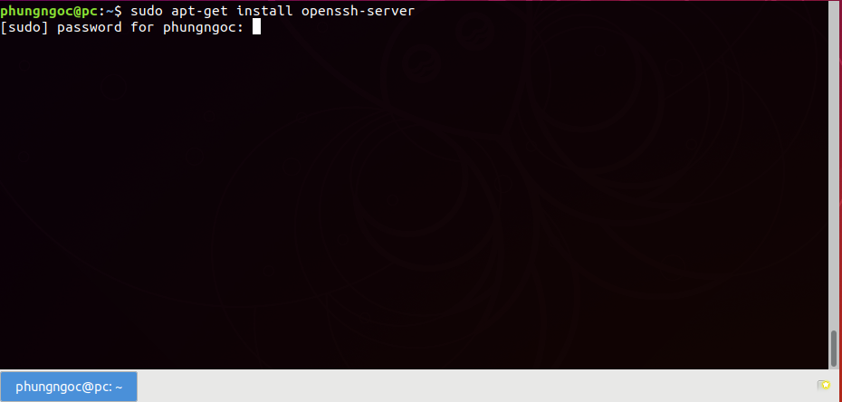
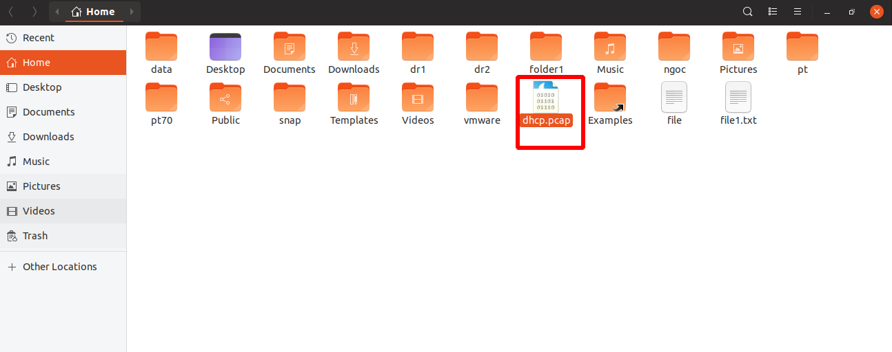
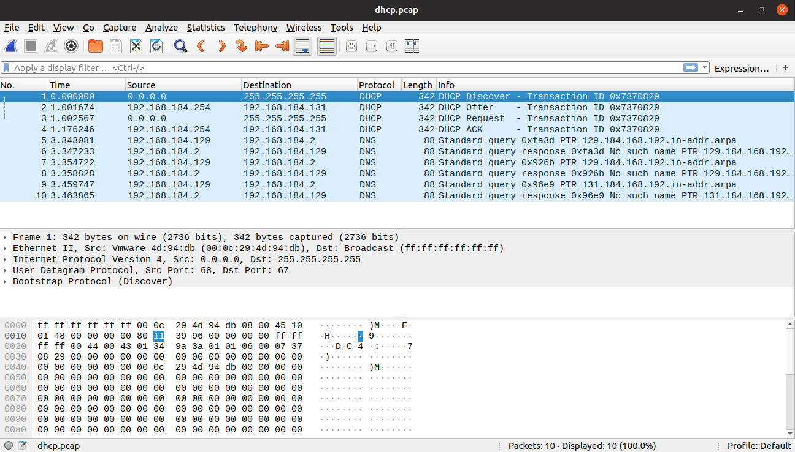
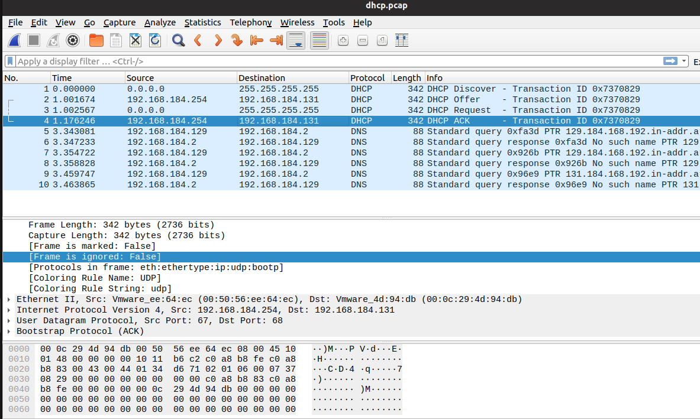

# Bắt gói tin DHCP bằng wireshark
- Đầu tiên, trên máy ảo ta thực hiện lệnh :
```
 dhclient
```
- Sau đó, dùng lệnh tcpdump để bắt gói tin dhcp:
```
tcpdump -i ens36 port 67 -w dhcp.pcap
```
- Tiếp theo, ta cần  OpenSSH-Server :  
Ta thực hiện câu lệnh :
```
sudo apt-get install openssh-server
```


Bạn cần phải khởi động dịch vụ SSH (SSH Service), sử dụng lệnh sau:
```
sudo service ssh restart
```

- Ta cần copy file gói tin dhcp trên máy ảo ta thực hiện lệnh :
``` 
scp dhcp.pcap phungngoc@192.168.1.35:/home
```
- Tiếp theo, ta mở file dhcp.pcap bằng wireshark



Ta sẽ bắt được 4 gói tin DHCP:



##  Phân tích gói tin :
1. DHCP Discover


- Client gửi thông điệp Discover theo hình thức Broadcast
- IP nguồn 0.0.0.0, IP đích 255.255.255.255
Cổng nguồn 68, cổng đích 67  
- Opcode = 1 : Thông điệp yêu cầu
2. DHCP Offer

 

- Message type : 2 - thông điệp phản hồi
- Địa chỉ cấp cho Client : 192.168.184.254
- Các option : Type(offer), ID server, IP address Lease Time, Subnet Mark, Router, DNS

3.  DHCP Request


- Client gửi thông điệp Discover theo hình thức Broadcast
- Cổng nguồn 68, cổng đích 67
- Opcode = 1 : Thông điệp yêu cầu
- Client IP, Your IP, Next server IP, relay agent IP : đặt về 0.0.0.0

4. DHCP Ack



- IP nguồn : 192.168.184.254, IP đích 192.168.184.131
- Các option : Type (ACK), DHCP serverID, IP address Lease Time, Subnet Mark, Router, DNS


Chúc mọi người thành công!!!