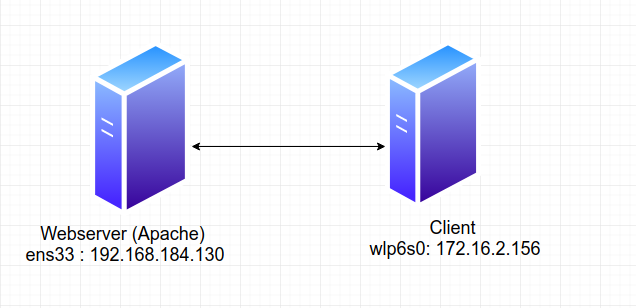
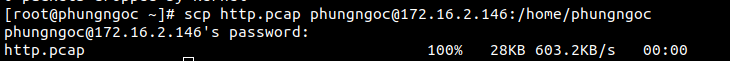
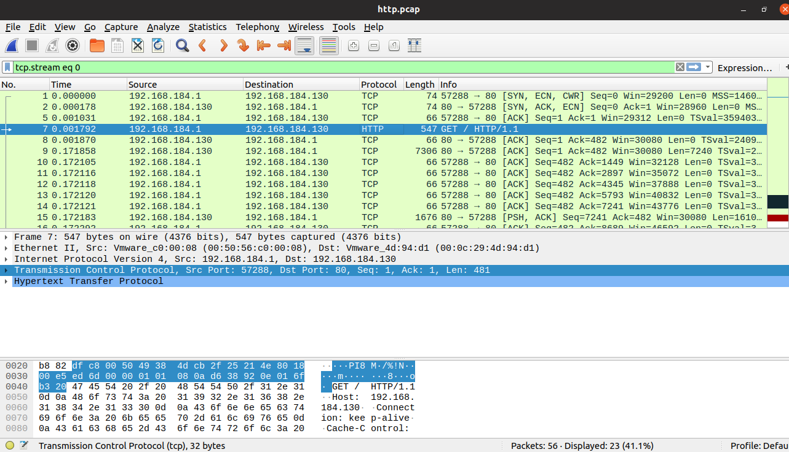
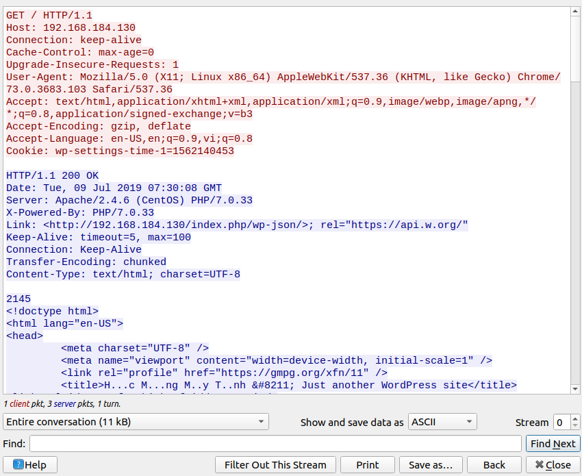

# Bắt gói tin HTTP bằng TCPdump
Mô hình như sau:

 

## Bước 1 : Dùng lệnh TCPdump để bắt gói tin HTTP
```
tcpdump -i ens33 port 80 -w http.pcap
```

## Bước 2: Ta cần copy file gói tin http trên máy ảo ta thực hiện lệnh :
``` 
scp dhcp.pcap phungngoc@172.16.2.146:/home/phungngoc
```


## Bước 3: Tiếp theo, ta mở file http.pcap bằng wireshark



Chọn package và chọn Follow TCP Stream:



### GET /HTTP/1.1  
Các phương pháp thông dụng của HTTP:
- GET: được sử dụng để lấy lại thông tin từ Server đã cung cấp bởi sử dụng một URI đã cung cấp. Các yêu cầu sử dụng GET chỉ nhận dữ liệu và không có ảnh hưởng gì tới dữ liệu.
- POST: một yêu cầu POST được sử dụng để gửi dữ liệu tới Server
- PATCH: thay đổi một phần đại diện hiện tại của nguồn mục tiêu với nội dung được tải lên.
- PUT: thay đổi tất cả các đại diện hiện tại của nguồn mục tiêu với nội dung được tải lên.
- DELETE: gỡ bỏ tất cả các đại diện hiện tại của nguồn mục tiêu bởi URI.
- HEAD: tương tự như GET, nhưng nó truyền tải dòng trạng thái và khu vực Header.
- CONNECT: thiết lập một tunnel tới Server được xác định bởi URI đã cung cấp.
- TRACE: trình bày một vòng lặp kiểm tra thông báo song song với path tới nguồn mục tiêu.
- OPTIONS: miêu tả các chức năng giao tiếp cho nguồn mục tiêu.
### Connection : keep-alive 
- Connection: tùy chọn điều khiển cho kết nối hiện thời. Ví dụ: keep-alive, Upgrade…
Keep-Alive là một cấu trúc kết nối giữa web server và trình duyệt.
### Cache-Control: max-age=0
- Kiểm soát bộ nhớ đệm.
### Upgrade-Insecure-Requests
- Tiêu đề yêu cầu HTTP gửi tín hiệu đến máy chủ thể hiện ưu tiên của máy khách đối với phản hồi được mã hóa và xác thực và nó có thể xử lý thành công lệnh CSP. 
Cảnh báo của trình duyệt đối với những giao thức http vì hiện nay nó đã không còn an toàn và có nguy cơ bị đánh cắp dữ liệu (đặc biệt là thông tin đăng nhập, tài khoản ngân hàng). Cách tốt nhất hiện nay là nâng cấp lên https để dữ liệu truyền tải được an toàn hơn.

### User-Agent: Mozilla/5.0 (X11; Linux x86_64) AppleWebKit/537.36 (KHTML, like Gecko) Chrome/73.0.3683.103 Safari/537.36

- Đây là thông tin nhận dạng mà trình duyệt máy khách báo cáo về chính nó.

### Accept 
- Accept là kiểu dữ liệu mà sẽ nhận được từ response. Thường thấy nhất là các kiểu text/html, application/xhtml+xml.  
Cú pháp:
văn bản / html, ứng dụng / xhtml + xml, ứng dụng / xml; q = 0.9, hình ảnh / webp, * / *; q = 0.8

### Accept-Encoding: gzip, deflate
- Yêu cầu HTTP header quảng cáo mà mã hóa nội dung, thường là một thuật toán nén, khách hàng có thể hiểu được.

### Accept-Language :en-US,en;q=0.9,vi;q=0.8
- Yêu cầu HTTP header quảng cáo mà ngôn ngữ khách hàng có thể hiểu được, và đó locale biến được ưa thích. 
### Cookie: wp-settings-time-1=1562140453
- Là nơi chứa thông tin được mã hóa dùng để gửi lên server (sau khi đã được website gửi về để lưu trữ trước đó).

### Keep-Alive: timeout = 5, max = 100
- Điều này có nghĩa là cho phép kết nối được giữ nguyên, trong 5 giây và tối đa 100 tài nguyên.

### Transfer-Encoding: chunked
- Mã hóa truyền dữ liệu 
- Dữ liệu được gửi trong một loạt các khối.

### Content-Type : text/html; charset=UTF-8
- Content-Type tiêu đề thực thể được sử dụng để chỉ các loại phương tiện truyền thông của tài nguyên.
- Trong các phản hồi, một Content-Typetiêu đề cho khách hàng biết loại nội dung của nội dung được trả về thực sự là gì. Các trình duyệt sẽ thực hiện đánh hơi MIME trong một số trường hợp và không nhất thiết phải tuân theo giá trị của tiêu đề.
- charset : Các tiêu chuẩn mã hóa ký tự.

