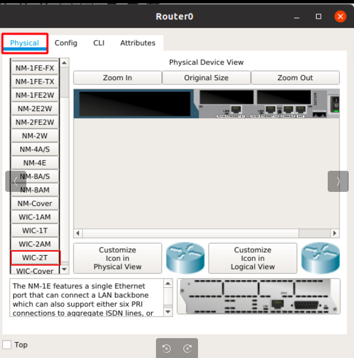
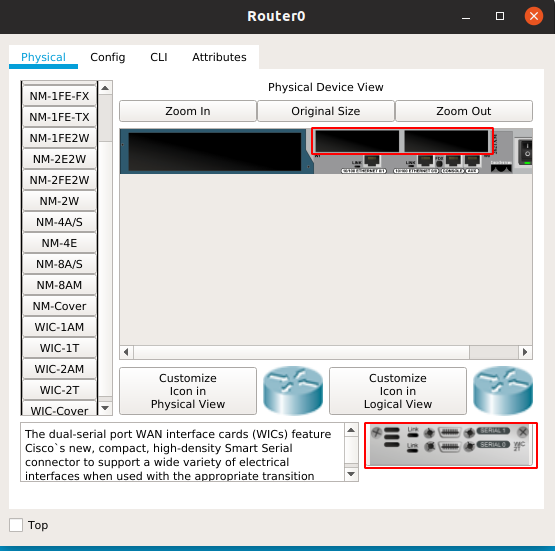
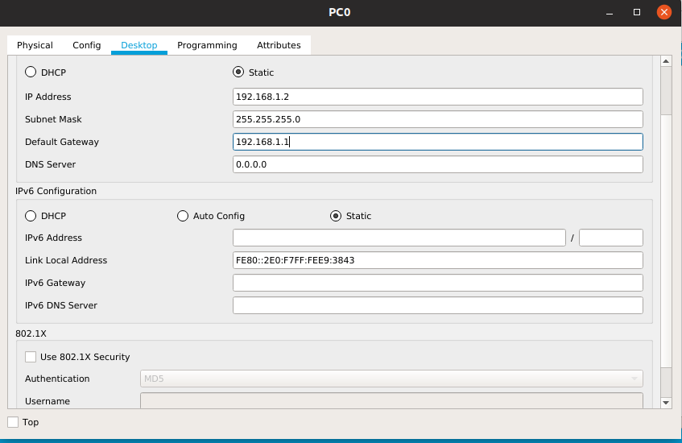
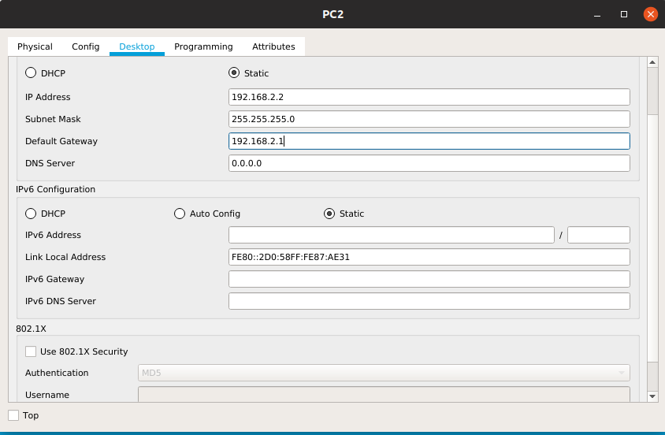

# Cấu hình định tuyến tĩnh 
## Mô hình  

  

- Với mô hình trên, các router được nối với nhau với cổng phù hợp ta làm như sau:  

  




Thực hiện các bước tương tự với router1,2,3

- Sau đó ta đặt địa chỉ ip cho router:  

+Router0:
```
Router(config)#interface Serial0/0
Router(config-if)#ip address 172.16.0.1 255.255.0.0
Router(config-if)#no shutdown
Router(config-if)#exit
Router(config)#interface FastEthernet0/0
Router(config-if)#ip address 192.168.1.1 255.255.255.0
Router(config-if)#no shutdown
```  
+Router1:
```
Router(config)#interface Serial0/0
Router(config-if)#ip address 172.16.0.2 255.255.0.0
Router(config-if)#no shutdown
Router(config-if)#exit
Router(config)#interface Serial0/1
Router(config-if)#ip address 10.0.0.1 255.0.0.0
Router(config-if)#no shutdown
Router(config-if)#exit
Router(config)#interface Serial0/2
Router(config-if)#ip address 160.15.0.254 255.255.0.0
Router(config-if)#no shutdown
```
+Router2:
```
Router(config)#interface Serial0/0
Router(config-if)#ip address 10.0.0.2 255.0.0.0
Router(config-if)#no shutdown
Router(config-if)#exit
Router(config)#interface FastEthernet0/0
Router(config-if)#ip address 192.168.2.1 255.255.255.0
Router(config-if)#no shutdown
```
+Router3:
```
Router(config)#interface Serial0/0
Router(config-if)#ip address 160.15.0.1 255.255.0.0
Router(config-if)#no shutdown
Router(config-if)#exit
Router(config)#interface FastEthernet0/0
Router(config-if)#ip address 192.168.3.1 255.255.255.0
Router(config-if)#no shutdown
```
- Tiếp theo ta đặt địa chỉ ip cho pc: 

  

  

  

- Bước tiếp theo ta định tuyến cho từng router:  

+Router0:
```
Router(config)#ip route 192.168.2.0 255.255.255.0 10.0.0.0
Router(config)#ip route 10.0.0.0 255.0.0.0 172.16.0.0
Router(config)#ip route 192.168.3.0 255.255.255.0 160.15.0.0
Router(config)#ip route 160.15.0.0 255.255.0.0 172.16.0.0
```

+Router1:
```
Router(config)#ip route 192.168.2.0 255.255.255.0 10.0.0.0
Router(config)#ip route 192.168.1.0 255.255.255.0 172.16.0.0
Router(config)#ip route 192.168.3.0 255.255.255.0 160.15.0.0

```
+Router2:
```
Router(config)#ip route 192.168.1.0 255.255.255.0 172.16.0.0
Router(config)#ip route 172.16.0.0 255.255.0.0 10.0.0.0
```
+Router3:
```
Router(config)#ip route 192.168.1.0 255.255.255.0 172.16.0.0
Router(config)#ip route 172.16.0.0 255.255.0.0 160.15.0.0
```  
- Cuối cùng ta ping từ PC0 đến PC1 và PC2

Chúc các bạn thành công!

