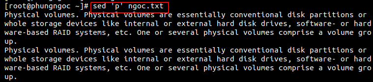
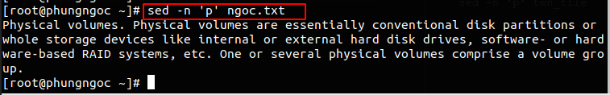

# Tìm hiểu lệnh Sed cơ bản

#Mục lục

[1. Giới thiệu](#1)  
[2. Cách sử dụng cơ bản](#2)


<a name="1"></a>  

## 1. Giới thiệu
Lệnh sed là công cụ xử lý văn bản mạnh mẽ và là một tiện ích UNIX lâu đời nhất và phổ biến nhất. Nó được sử dụng để sửa đổi nội dung của một tệp, thường đặt nội dung vào một tệp mới.

Lệnh sed có thể lọc văn bản, cũng như thực hiện thay thế trong luồng dữ liệu.


<a name="2"></a>

## 2. Cách sử dụng cơ bản
 Cú pháp cơ bản của lệnh sed:
```
sed [tùy chọn] commands [file]
```

Trước hết, có thể sử dụng sed để xem nội dung file:
```
sed '' ten_file
```

### In kết quả ra màn hình

Chúng ta sẽ sử dụng lệnh print để thực hiện hành động này một cách tường minh, bằng cách truyền vào ký tự p ở trong cặp nháy đơn:
```
sed 'p' ten_file
```


Ở đây, sed đã in ra mỗi dòng 2 lần.Để hủy bỏ việc tự động in kết quả của sed, bạn có thể dụng tùy chọn -n:
```
sed -n 'p' ten_file
```


- Chỉ in ra dòng đầu tiên:
```
sed -n '1p' ten_file
```
- In các dòng từ x tới y:   #sed 'x,yp' [file]
- In ra các dòng với số thứ tự lẻ:  #sed '1,2p' [file]
- In ra các dòng với số thứ tự chẵn:  #sed '2,2p' [file]

### Tìm kiếm và thay thế  
Mặc định sed chỉ thay thế lần xuất hiện đầu tiên của mẫu trong mỗi file.
- Để thay thế tất cả các lần xuất hiện: `#sed "s/pattern/replace_string/g" file`
- Thay thế từ xuất hiện thứ N của mẫu đến cuối văn bản: `#sed "s/pattern/replace_string/Ng" file`
- Thay thế lần xuất hiện thứ N: `#sed "s/pattern/replace_string/N" file`

Ký tự s là viết tắt của từ substitute.  
Để thực hiện việc thay thế trực tiếp trên nội dung của file (in-place substitution) bạn sử dụng tùy chọn -i trong câu lệnh:
```
 sed -i -e #sed "s/pattern/replace_string/g" file 
```
Ví dụ:

Câu lệnh dưới đây sẽ thực hiện việc tìm kiếm cho foo và thay thế bởi bar có trong trong test.txt
```
$ sed -e "s/foo/bar/g" test.txt
``` 
Trong câu lệnh trên:

- Tùy chọn -e dùng để thêm vào biểu thức thực thi bởi sed
- Biểu thức "s/foo/bar/g" là biểu thức regular expression dùng để thực hiện việc thay thế (subtitude) foo bởi bar và việc thay thế này được thực hiện cho tất cả các kết quả foo có trong test.txt
- File test.txt là tập tin chứa nội dung văn bản  

Sử dụng tùy chọn i trong biểu thức regular expression, nếu bạn muốn tìm kiếm và thay thế theo kiểu không phân biệt in hoa và in thường (nghĩa là cả foo, Foo, FoO... đều sẽ được thay thế bởi bar:
```
$ sed -i -e "s/foo/bar/g" test.txt
```