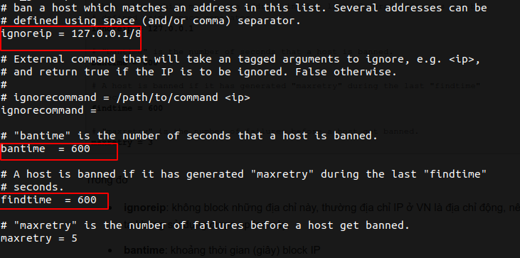
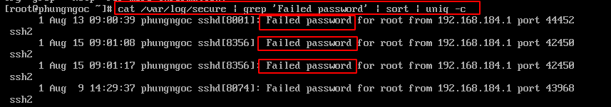
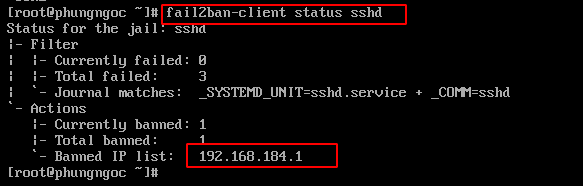

# Fail2ban và iptables trên CentOS

# Mục lục 
[1. Giới thiệu](#1)  
[2. Cài đặt và cấu hình](#2)   
[3. Theo dõi SSH login](#3)  
[4. Kết luận](#4)


<a name="1"></a>

## 1. Giới thiệu 

Hầu hết các máy chủ Linux cung cấp thông tin đăng nhập SSH thông qua Cổng 22 cho mục đích quản trị từ xa.  
Nó thường bị tấn công bởi các cuộc tấn công. Fail2ban là một phần mềm quét các tệp nhật ký cho các nỗ lực đăng nhập mạnh mẽ trong thời gian thực và cấm những kẻ tấn công bằng tường lửa hoặc iptables.

<a name="2"></a>

## 2. Cài đặt và cấu hình

### 2.1. Cài đặt
```
yum install epel-release
yum install fail2ban
```
### 2.2. Cấu hình
#### Cấu hình Fail2Ban  

Sau khi cài đặt xong, bạn mở file cấu hình của Fail2Ban lên sẽ thấy một số thông số như sau:
```
vi /etc/fail2ban/jail.conf  
```
 

Trong đó

- ignoreip: không block những địa chỉ này, thường địa chỉ IP ở VN là địa chỉ động, nên chúng ta không sử dụng được option này.
- bantime: khoảng thời gian (giây) block IP
- findtime: khoảng thời gian (giây) một IP phải login thành công
- maxretry: số lần login false tối đa  


#### Cấu hình Fail2Ban bảo vệ SSH  
Tạo file cấu hình
```
vi /etc/fail2ban/jail.local
```
```
[sshd]
enabled  = true
filter   = sshd
action   = iptables[name=SSH, port=ssh, protocol=tcp]
logpath  = /var/log/secure
maxretry = 5
bantime = 3600
```

Trong đó

- enabled: kích hoạt bảo vệ, nếu muốn tắt bạn hãy chuyển thành false
- filter: giữ mặc định để sử dụng file cấu hình /etc/fail2ban/filter.d/sshd.conf
- action: fail2ban sẽ ban địa chỉ IP nếu match filter /etc/fail2ban/action.d/iptables.conf. Nếu bạn đã thay đổi port ssh, sửa đoạn port=ssh bằng port mới, ví dụ port=2222
- logpath: đường dẫn file log fail2ban sử dụng để theo dõi
- maxretry: số lần login false tối đa
- bantime: thời gian ban IP 3600 giây = 1 giờ, bạn có thể điều chỉnh lại nếu muốn

#### Khởi động fail2ban :
```
systemctl enable fail2ban
systemctl start fail2ban
```
 
#### Kiểm tra rulues của fail2ban trên iptables

```
iptables -L
```
Kết quả :

```
Chain INPUT (policy ACCEPT)
target     prot opt source               destination         
f2b-SSH    tcp  --  anywhere             anywhere             tcp dpt:ssh

Chain FORWARD (policy ACCEPT)
target     prot opt source               destination         

Chain OUTPUT (policy ACCEPT)
target     prot opt source               destination         

Chain f2b-SSH (1 references)
target     prot opt source               destination         
RETURN     all  --  anywhere             anywhere   
```

<a name="3"></a>

## 3. Theo dõi SSH login
Bạn có thể sử dụng lệnh sau để biết được VPS/Server đã từng bị tấn công SSH chưa:
```
cat /var/log/secure | grep 'Failed password' | sort | uniq -c
```
Kết quả thường sẽ là như bên dưới, đã từng có rất nhiều đợt tấn công:

 

Để xem IP đã bị banned bởi Fail2Ban bạn sử dụng lệnh:
```
fail2ban-client status sshd
```
Output trả về sẽ có dạng như thế này:



Để xóa IP khỏi danh sách banned, bạn sử dụng lệnh sau :
```
fail2ban-client set sshd unbanip IPADDRESS
```

<a name="4"></a>

## 4. Kết luận
Fail2ban mà chúng tôi giới thiệu phía trên chỉ là một trong những giải pháp hiệu quả trong việc ngăn chặn bute-force.  

Các biện pháp Secure SSH thường được sử dụng nhằm tránh, hạn chế bị tấn công Brute force.   

### Username và Mật khẩu mạnh

Cấu hình timeout cho 1 session SSH, cấu hình  `/etc/ssh/sshd_config`  
```
ClientAliveInterval 360
ClientAliveCountMax 0
```
Không cho phép password trống, cấu hình `/etc/ssh/sshd_config`  
```
PermitEmptyPasswords no
```
Giới hạn các user được phép SSH, cấu hình `/etc/ssh/sshd_config`  
```
AllowUsers user1 user2
```
Không cho phép root login, cấu hình `/etc/ssh/sshd_config`  
```
PermitRootLogin no
```
Sử dụng port khác port 22, cấu hình `/etc/ssh/sshd_config`
```
Port 3456
```
### Cho phép ssh từ một số IP, nhất đinh, cấu hình iptables.  
Để truy cập VPS qua SSH, bạn cần mở port SSH 22. Bạn có thể cho phép kết nối ssh ở bất cứ thiết bị nào, bất cứ ai và bất cứ đâu.
Mặc định sẽ hiển thị ssh cho cổng 22, nếu bạn đổi ssh thành cổng khác thì iptables sẽ hiển thị số cổng
```
iptables -A INPUT -p tcp -m tcp --dport 3456 -j ACCEPT 
```  
Bạn có thể chỉ cho phép kết nối VPS qua SSH duy nhất từ 1 địa chỉ IP nhất định 
```
iptables -A INPUT -p tcp -s xxx.xxx.xxx.xxx -m tcp --dport 22 -j ACCEPT
```
### Bảo mật máy chủ server bằng SSH Key  
Tạo SSH keys  
```
ssh-keygen -t rsa
```
Trong lúc cài đặt, chương trình sẽ hỏi bạn nơi lưu keys và mật khẩu sử dụng private key.  
```
[root@phungngoc ~]# ssh-keygen -t rsa
Generating public/private rsa key pair.
Enter file in which to save the key (/root/.ssh/id_rsa): /root/.ssh/id_rsa
Enter passphrase (empty for no passphrase): 
Enter same passphrase again: 
Your identification has been saved in /root/.ssh/id_rsa.
Your public key has been saved in /root/.ssh/id_rsa.pub.
The key fingerprint is:
SHA256:rvYuhaGMBPjD/PG36TwsXsOlhQhwWrHS/bwcbLsW0dc root@phungngoc.xyz
The key's randomart image is:
+---[RSA 2048]----+
|. . +.           |
|o  * o           |
| =o + .  .   .   |
|  *....=... . E  |
| . = +.oS.o.     |
|  . + o=+B       |
|       +X+       |
|      ++*o       |
|     ooB*.       |
+----[SHA256]-----+
```


