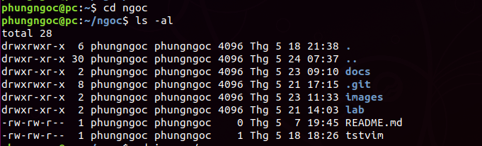

# Phân quyền trong Linux
## 1. User
- User là người có thể truy cập đến hệ thống. User có username và password.
- Group là tập hợp nhiều user lại. Mỗi user luôn là thành viên của một group. Khi tạo một user thì mặc định một group được tạo ra.
- Tập lệnh quản lý User và Group  
Tạo User:  
Cú pháp: 
```
#useradd [option] <username>
```  
Thay đổi thông tin cá nhân :  
Cú pháp:
``` 
#usermod [option] <username>
```  
Những option tương tự Useradd  
Các tùy chọn của lệnh:  
**-c**: thay đổi thông tin cá nhân của tài khoản người dùng  
**-d** : thay đổi thư mục cá nhân của tài khoản người dùng  
**-e, expire_date** : thay đổi thời điểm hết hạn của tài khoản người dùng (YYYYMM-DD)    
**-f, inactive_days** : thiết đặt số ngày hết hiệu lực của mật khẩu trước khi tài khoản người dùng hết hạn sử dụng  
**-g, initial_group** : tùy chọn này thay đổi tên hoặc số khởi tạo đăng nhập nhóm người dùng  
**-G, group** : thay đổi danh sách các nhóm phụ mà người dùng cũng là thành viên thuộc các nhóm đó. Mỗi nhóm sẽ được ngăn cách với nhóm khác bởi dấu ‘,’ mặc định người dùng sẽ thuộc vào nhóm khởi tạo  
**-l, login_name** : thay đổi tên đăng nhập của người dùng. Trong một số trường hợp, tên thư mục riêng của người dùng có thể sẽ  thay đổi để tham chiếu đến tên đăng nhập mới  
**-p, passwd** : thay đổi mật khẩu đăng nhập của tài khoản người dùng  
**-s, shell** : thay đổi shell đăng nhập  
**-u, uid** : thay đổi chỉ số người dùng  


Tạo group:  
Cú pháp :
```
#groupadd [option] <username>
```
## 2. Cấu trúc của một tập tin, thư mục
Với lệnh sau ta có thể xem cấu trúc thư mục và file :
``` 
#ls -al
```
ví dụ:


## 3. Phân quyền user và group
Linux có 3 quyền cơ bản của 1 user và group đó là:
- r (read) – quyền đọc file/folder : r=4
- w (write) – quyền ghi/sửa nội dung file/folder : w=2
- x (execute) – quyền thực thi (truy cập) thư mục. Đối với thư mục thì bạn cần phải có quyền execute thì mới dùng lệnh cd để truy cập vào được x=1
- – (Deny) – Không có quyền  

Kí tự - đầu tiên là một cờ đặc biệt để chỉ loại file, - với file thông thường, d với thư mục, c với thiết bị, l với liên kết (liên kết tới một file khác).  

Cấu trúc chỉ số phân quyền:  
- owner: Quyền của user mà chủ sở hữu của file này.
- group: Quyền của những users thuộc group mà chủ sở hữu của file này.
- other: Quyền của tất cả các user khác trên máy.

Để có thể thay đổi các chỉ số phân quyền này ta sẽ dử dụng lệnh chmod
```
# chmod  <tùy chọn> <chỉ số phân quyền> <tên tập tin/thư mục>
```

## 4. Thay chủ sở hữu file/folder
Để đổi chủ sở hữu một thư mục cho user/group nào đó thì bạn sẽ sử dụng lệnh chown như sau: 
```
chown [tên user]:[tên group] [file/folder]
``` 


