# Linux commands 
## 1. echo
- Lệnh echo dùng để hiển thị nội dung văn bản, thay thế, thêm nội dung trong file.
- Cú pháp :  
```
echo [option] [string]
```
 Các opition :  
- -e ở đây cho phép giải thích các dấu gạch chéo ngược:  
1. \b : xóa tất cả các khoảng trắng ở giữa văn bản
2. \n: tùy chọn này tạo ra dòng mới
3. \t: tùy chọn này được sử dụng để tạo không gian tab ngang.  
- echo * : lệnh này sẽ in tất cả các tệp / thư mục, tương tự như lệnh ls.   

| Lệnh |	Chức năng |  
| ------ | ------ |  
| echo "string" > newfile |	Dùng để thêm một chuổi vào một tệp mới |
| echo "string" >> newfile | Dùng để nối một chuổi vào cuối tệp đã tồn tại |
| echo $VARIABLE | Dùng để hiển thị nội dung biến môi trường |

- Lệnh echo hổ trợ in kết quả được tô màu:  
Đối với chuỗi ký tự, có các mã màu được sử dụng phổ biến sau:  

   reset – 0  
   black – 30  
red – 31   
green – 32  
yellow – 33  
blue – 34  
magenta – 35  
cyan – 36  
white – 37  

Để in ra 1 đoạn văn bản được tô màu, dùng lệnh sau:
```
echo -e "\e[Mamau doanvanban \e[0m"
```
Trong đó"

\e[Mamau => là chuỗi escape thiết lập màu.  
\e[0m => reset lại màu mặc định  

## 2. cp 
- cp là một lệnh Linux để sao chép các tập tin và thư mục.
- Cú pháp :
```
cp [option] source dest
```  
- Tạo ra bản sao của file:
```
cp (file(file)).backup
```
- Copy file1 thành file2
```
cp (file1) (file2)
```
- Copy thư mục và file trong đó thành thư mục khác: 
``` 
cp -r <directory1> <directory2>/
``` 
## 3. chown
- Lệnh chown được sử dụng để thay đổi quyền sở hữu của người dùng và nhóm của một tệp, thư mục hoặc liên kết đã cho.
- Cú pháp:  
``` 
chown [option] user[:group] file(s)
```
## 4. Kiểm tra RAM, CPU (central prossesing unit)
- Để xem lượng RAM đã sử dụng chúng ta có rất nhiều lệnh khác nhau như:
```
free -m
```
ví dụ :

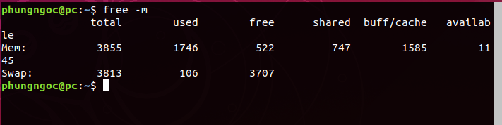

- Để hiển thị thông tin CPU ta dùng lệnh sau :

```
lscpu
```
- In ra thông tin của CPU :
```
cat /proc/cpuinfo
```
+
ví dụ :

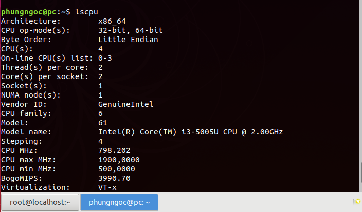

## 5. Cách kiểm tra các packet đã được cài đặt 
- Sử dụng lệnh apt như sau:  
```
apt list --installed | grep <package_name>
```
Ví dụ :

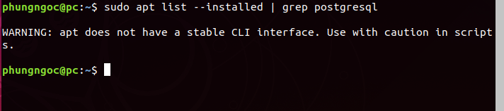

- Nếu muốn kiểm tra những ứng dụng nào đã cài đặt, chúng ta sẽ sử dụng dpkg:  
```
sudo dpkg –list
```
- Duyệt toàn bộ danh sách bằng lệnh:

```
sudo dpkg –list | less
```
- Tìm kiếm bằng tham số grep đi kèm:
```
dpkg –list | grep [search term]
```
 Ví dụ :

 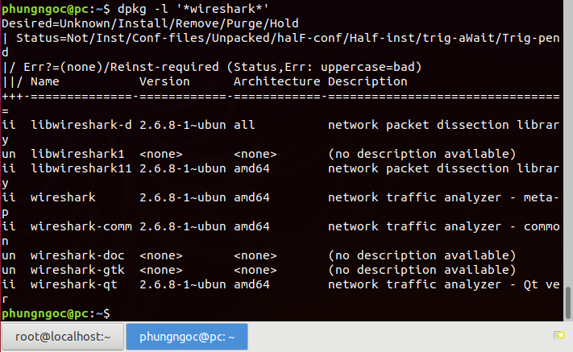

## 6. Liệt kê user

- Để liệt kê danh sách các user chúng ta có thể dùng câu lệnh sau:
```
$ cat /etc/passwd
```

- Để chỉ hiển thị tên của người dùng chúng ta có thể dùng câu lệnh sau:
```
$ cut -d : -f 1 /etc/passwd
```

- Ngoài ra, chúng ta cũng có thể sử dụng chương trình awk thay vì cut để lấy ra danh sách người dùng trên hệ thống như sau:

```
$ awk -F':' '{ print $1}' /etc/passwd
```
## 7. Cài đặt phần mềm 
### 7.1. Dùng Ubuntu Software Center
Để cài đặt 1 phần mềm, bạn làm theo các bước sau:  
- Mở Ubuntu Software Center
- Viết tên phần mềm cần cài đặt
- Chọn phần mềm cần cài đặt và nhấn Install
- Nhập mật khẩu root và đợi nó cài đặt xong  

Ví dụ: Cài phần mềm Telegram Desktop


### 7.2. Sử dụng apt-get trên Terminal
1. Cài đặt online:   
- Mở Terminal: Ctrl Alt T 
- Ta dùng lệnh :
```
sudo apt-get install ten_goi
```
- Nhập mật khẩu và đợi cài đặt xong    

2. Cài đặt offline:
- Ta đã tải về gói phần mềm rồi. Bây giờ ta chỉ việc cài đặt chúng thôi, nên việc này không cần thiết phải có mạng Internet.
- Cài đặt file .deb
Cài đặt loại này cực kì đơn giản, bạn chỉ cần click vào là tự nó sẽ cài đặt – sử dụng Ubuntu Software Center.
- Cài đặt file .rpm  
Mình sẽ chuyển file .rpm thành file .deb để làm giống như trên:  
+Mở Terminal  
+Cài đặt gói alien với câu lệnh:
``` 
sudo apt-get install alien  
```
+Convert file từ .rpm thành .deb với câu lệnh:
```
 sudo alien -k filename.rpm
 ```
+Sau bước trên bạn đã có một tệp tin là filename.deb, tiếp tục click vào để cài đặt.

- Cài đặt file .bin  
+Đầu tiên lưu file .bin tới Desktop.   
+Mở Terminal:  
+Di chuyển đến thư mục chứa file: 
```
cd Desktop
```
+Thêm quyền cho file:
```
 sudo chmod +x filename.bin  
```
+Cài đặt: ./filename.bin   
+Sau đó chương trình sẽ cài đặt trong Terminal!

- Cài đặt phần mềm từ tarball  

Một tarball (thường là các file .tar , .tar.gz , .tgz , .tar.bz2 , .tbz2 ) gồm có mã nguồn cho chương trình mà ta phải tự biên dịch, trình biên dịch (compile) như GCC… thì thường có sẵn trong Linux . Các bước cài đặt Tarball về cơ bản như sau:  
+Giải nén tarball  
-Cách 1: click vào file, nhấn chuột phải, chọn extract here

-Cách 2: dùng dòng lệnh:
```
$ tar zxvf file.tar.gz
$ tar zxf file.tar.gz
```
Configure  

-Mở terminal lên, dùng lệnh cd để di chuyển tới nơi chứa file  
-Gõ ./configure : mục đích là để kiểm tra xem hệ thống có đầy đủ các phần mềm để cài đặt chưa,nếu thiếu thì ta phải cài đặt các phần mềm đó trước   
-Gõ make : chờ cho tới khi hoàn thành rồi đến bước tiếp theo  
-Gõ ```
sudo make install ``` đợi cho tới khi kết thúc là hoàn thành cài đặt.

## 8. Process 
- Hiển thị process đang chạy ta dùng câu lệnh:
```
ps aux | less
```
- a : hiển thị các quy trình cho tất cả người dùng   
- u : hiển thị người dùng / chủ sở hữu của quy trình 
- x : cũng hiển thị các quy trình không được đính kèm với thiết bị đầu cuối  

Ví dụ :

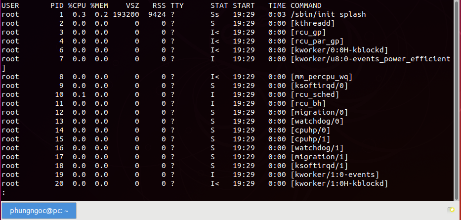  
- killall để kết thúc 1 tiến trình đang chạy
Kill process theo tên với lệnh :
```
killall [process-name]
```

- kill để chấm dứt tiến trình dựa vào ID hoặc PID :  
+ PID (proportional Integral Derivative ) là bộ điều khiển vi tích phân tỉ lệ.  
Câu lệnh:
```
kill [PID]
```
 
## 9. Netstat 
- Là lệnh để giám sát hệ thống trên linux
- Các câu lệnh :  
`netstat -a` hiển thị tất cả các ổ cắm hiện đang sử dụng.  

`netstat -at` kiểm tra port đang sử dụng TCP 

 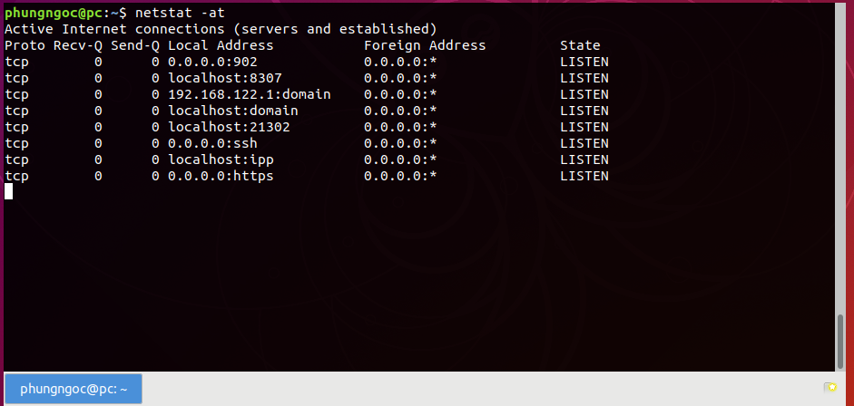

`netstat -au` kiểm tra port đang sử dụng UDP  

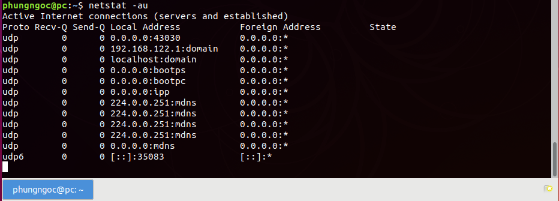

`netstat -rn` show ra bảng định tuyến

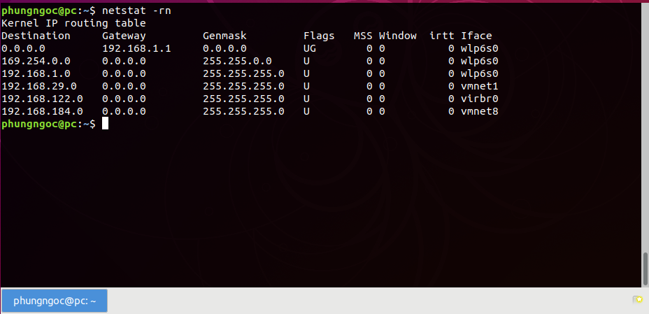

| Destination	|	Cột này cho biết mạng đích |
| ---- | --------------- |
|Gateway |	Cột này cho biết cổng được xác định cho mạng |
| Genmask |	Cột này cho biết netmask của mạng |
| MSS	| Cột này cho biết Kích thước phân đoạn tối đa (MSS) mặc định cho các kết nối TCP cho tuyến đường này |
| Window |  Cột này cho biết kích thước cửa sổ mặc định cho các kết nối TCP trên tuyến đường này. |
| Irtt | Cột này cho biết Thời gian khứ hồi ban đầu cho tuyến đường này.|
| Iface | Cột Iface hiển thị giao diện mạng. |

## 10. history
- Tra vấn lịch sử ta dùng lệnh sau hiển thị 1000 dòng lệnh cuối cùng :
```
history | less
```
- Nếu muốn tìm 1 lệnh cụ thể  đã sử dụng ta có thể dùng lệnh sau :
``` 
history | grep 'từ khóa cần tìm'
```
- Muốn xóa lịch sử các lệnh đã sử dụng ta dùng lệnh sau :
```
history -c 
```
Ví dụ tìm kiếm lệnh top :

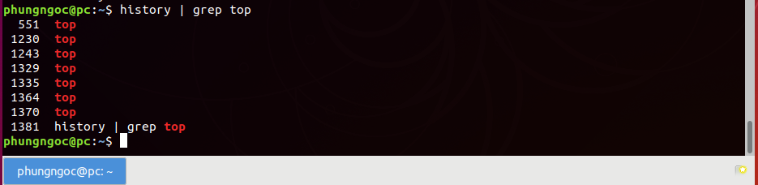

## 11. Biến môi trường
- Biến môi trường là một tập hợp các biến động là một phần của môi trường vận hành cho các hệ điều hành giống như UNIX như CentOS. Các biến này ảnh hưởng đến hành vi của các quy trình chạy trong hệ điều hành đó.  
- Đọc biến môi trường  
Một số lệnh có thể hiển thị các biến môi trường trong CentOS.  
Các env lệnh cho phép bạn xuất ra một môi trường, thường với mục đích thay đổi môi trường cho một chương trình cụ thể. 

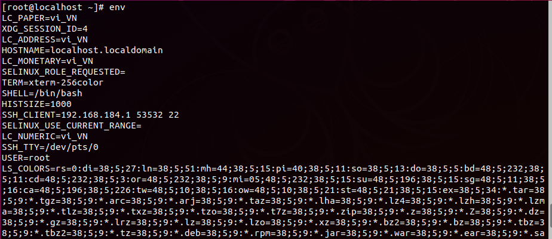

Các set lệnh in tên và giá trị của mỗi biến môi trường, và tạo ra kết quả này:

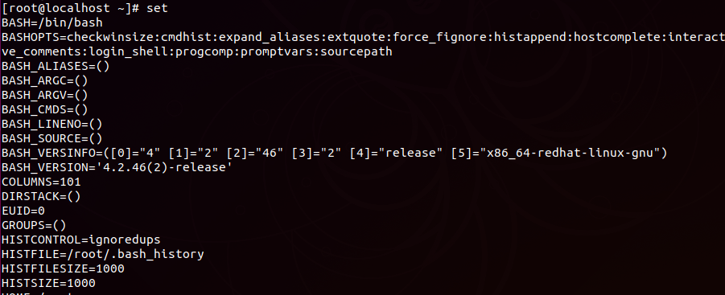  

Các printenv lệnh cũng in các biến môi trường:

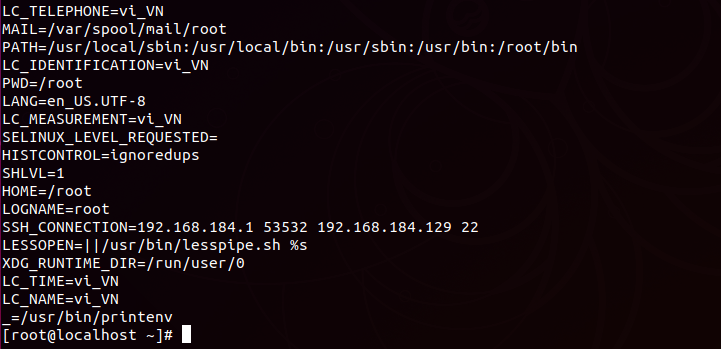

Bạn cũng có thể đọc giá trị của một biến cụ thể bằng lệnh echo:

Ví dụ:

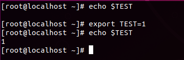


