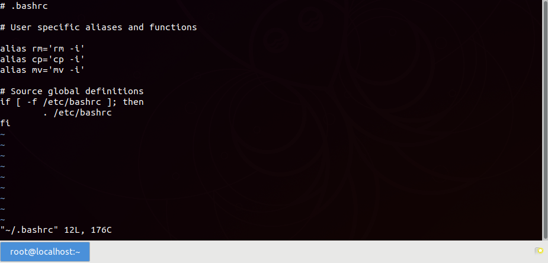
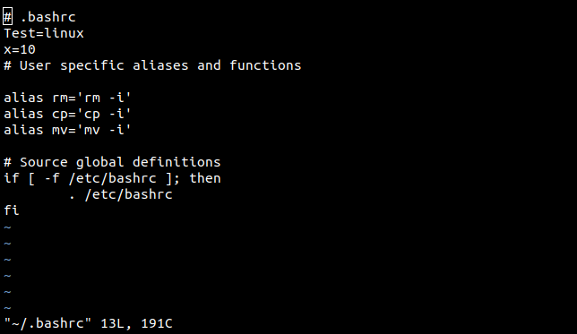
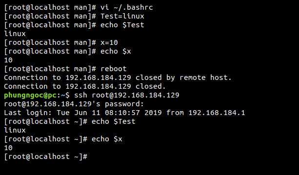

# Bashrc 
1. .bashrc: Các lệnh trong .bashrc sẽ được gọi khi khởi tạo 1 shell (nên nhớ khi đăng nhập vào hệ thống đó cũng là 1 shell rồi)
2. Chỉnh sửa bashrc  

- Để chỉnh sửa bashrc bằng vi , hãy gọi lệnh sau :
```
vi ~/.bashrc
```



3. Để khi reboot biến môi trường không bị mất ta sẽ sửa bashrc ví dụ như sau:






