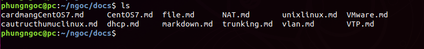

# Các lệnh với file và thư mục trong linux
## 1. Tạo một thư mục mới
mkdir là lệnh thao tác với thư mục cơ bản trên Linux.Cú pháp câu lệnh:
```
mkdir folder
```  
Folder là tên thư mục bạn muốn tạo.  


## 2. Tìm kiếm thư mục hiện tại
Muốn tìm kiếm thư mục hiện tại của bạn, bạn có thể sử dụng lệnh pwd.  
Ví dụ:
```
phungngoc@pc:~/ngoc$ pwd
/home/phungngoc/ngoc
```  
## 3. Tạo và chỉnh sửa các file
- touch: tạo file mới (touch ten_file).
- Để chỉnh sửa file, bạn phải sử dụng trình soạn thảo tích hợp sẵn trên dòng lệnh. Thông thường, đây là vi và được dùng với cú pháp:
``` 
vi <ten_file>
```
## 4. Đọc một số file
- Đọc nội dung của chúng là sử dụng câu lệnh cat. Cú pháp câu lệnh:
- cat <ten_file> : hiển thị tất cả file. 
- more <tên file>: hiển thị file theo từng trang.
- head < tên file>: hiển thị các dòng đầu tiên.
- tail < tên file>: hiển thị các dòng cuối cùng.
## 5. Sao chép hoặc di chuyển file
- Để sao chép một file, bạn có thể sử dụng lệnh: cp
```
cp ten_file
```
- mv: di chuyển file hoặc thư mục; cũng được dùng để đặt lại tên file hoặc thư mục :
```
mv vị_trí_cũ vị_trí_mới hoặc mv tên_cũ tên_mới
```
## 6. Xóa các file và thư mục
Nếu muốn xóa một thư mục hoặc một file bạn có thể sử dụng lệnh rm. 
Ta có thể sử dụng rm với nhiều tùy chọn khác nhau. Một số tùy chọn quan trọng như:

- f: buộc xóa các file có thông báo nhắc nhở
- i: nhắc nhở trước khi xóa
- r: xóa bỏ các thư mục đệ quy
- d: xóa các thư mục rỗng
- v: giải thích đang thực hiện nhiệm vụ gì
## 7. Tìm file
- find <tiêu chuẩn tìm kiếm>: dùng cho các tên file.  
### Tìm theo tên  
Cách tìm kiếm đơn giản, hiển nhiên nhất là tìm theo tên.
```
find -name "file_name"
```
Ta còn có option -not hay "!" để tìm tất cả file trừ file trong lệnh.
```
find -not -name “file_name_to_avoid”
find \! -name “file_name_to_avoid”
```
Muốn tìm tất cả các file có tên "test" thì ta gõ:
```
find -name test*
```
### Tìm theo thể loại  
Bạn còn có thể tìm theo đúng loại file muốn tìm, bằng cách dùng -type. Một số option:  

f: regular file  
d: directory (thư mục)  
l: symbolic link  
c: character devices  
b: block devices  
Ví dụ để tìm các file có đuôi ovpn ta gõ:  
```
find -type f -name "*.md"
```

- grep < tiêu chuẩn tìm kiếm>: để tìm nội dung trong file.  
-i: Hệ thống sẽ lọc cho bạn các dữ liệu có chứa từ hoặc chuỗi mà bạn gõ vào nhưng không phân biệt chữ hoa và thường.  
-v: Hệ thống sẽ lọc cho bạn dữ liệu không chứa từ hoặc chuỗi mà bạn gõ vào.  

## 8. Lệnh wc.
- Lệnh wc (word count) cho phép bạn đếm số từ, số dòng, số ký tự trong một file dữ liệu. Bạn có thể sử dụng lệnh wc với các option:  

-l (line): đếm số dòng có trong file dữ liệu.  
-c (character): đếm số ký tự có trong file dữ liệu, nó đếm luôn ký tự khoảng trắng đó nha.  
-w (word): đếm số từ trong một file dữ liệu.  

## 8. Liệt kê nội dung thư mục
Để liệt kê danh sách các thư mục, bạn có thể sử dụng lệnh ls:




