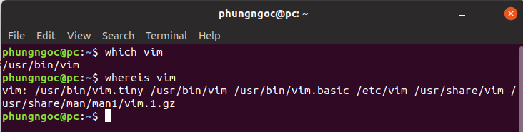
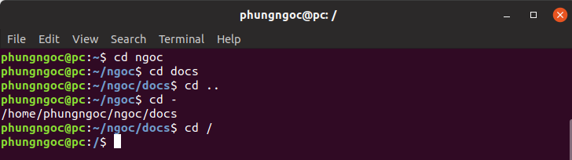
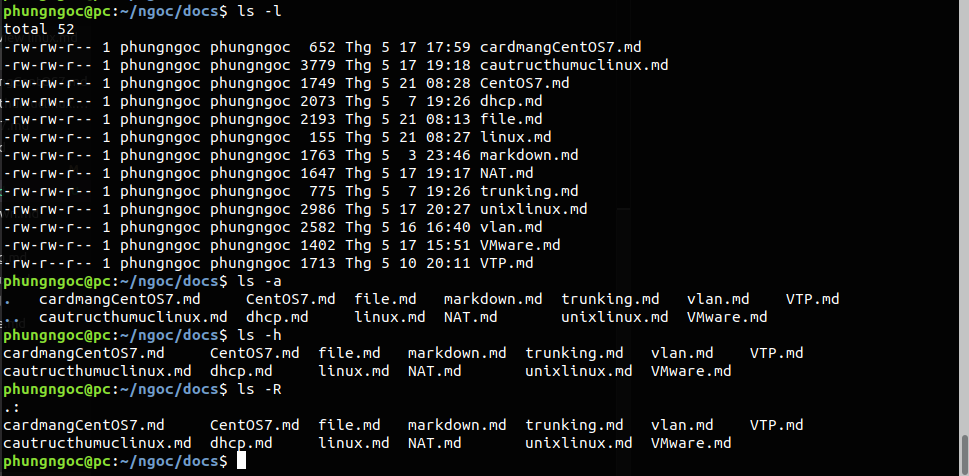
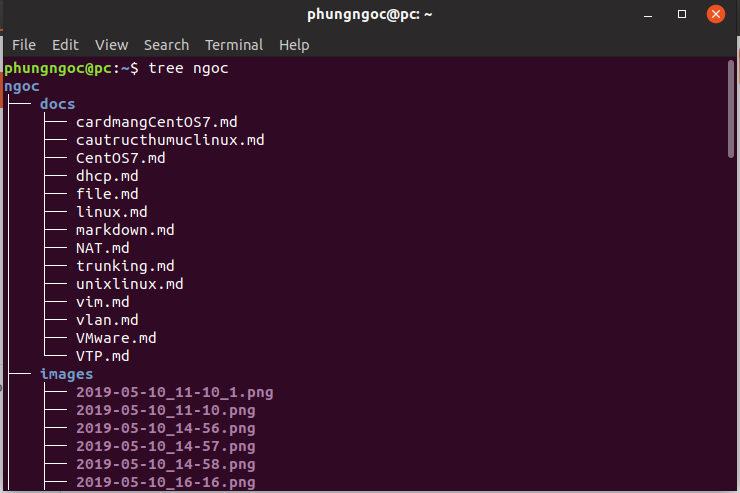
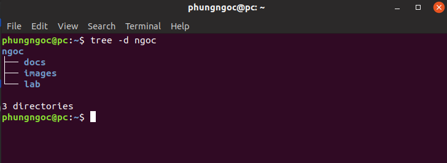

# Ứng dụng định vị
- Để xác định vị trí các chương trình là sử dụng which :
```
which <ten_chuongtrinh>
```
- Tìm các gói trong một phạm vi rộng hơn của các thư mục hệ thống:
```
whereis <ten_chuongtrinh>
```
Ví dụ:


# Truy cập các thư mục
cd viết tắt của Change Directory  

| CD | Thay đổi thư mục nhà của bạn |
|-----|-----|
| cd .. | Thay đổi thư mục cha |
| cd - | Thay đổi thư mục trước |
| cd / | Thay đổi thư mục hiện tại của bạn |thành thư mục gốc (/) |  

Ví dụ:
 

# Hệ thống tập tin
- ls sẽ liệt kê toàn bộ những file, directory có trong thư mục hiện tại:
``` 
ls <option>
```
- ls -l sẽ hiển thị tên file, directory cùng với size, ngày tháng chỉnh sửa gần nhất, user sở hữu và các permisson của user đó.
- ls -a sẽ hiển thị toàn bộ file/thư mục, kể các các file/thư mục ẩn.
- ls -h hiển thị size dưới dạng dễ hiểu hơn, như kb, mb ...
- ls -R hiện thị cả các file ở các sub-directory
Ví dụ:  

 

- Lệnh tree trên linux:  

Cài đặt lệnh tree :
```
sudo apt-get install tree 
```  
Liệt kê file/thư mục cơ bản:
```
tree <ten_file/thumuc>
```
Liệt kê cả file ẩn:
```
tree -a <ten_file>
```
Chỉ liệt kê thư mục:
```
tree -d <ten_thumuc>
```
Ví dụ:






