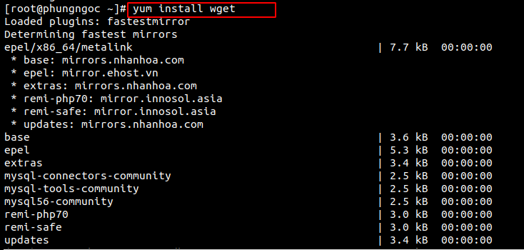
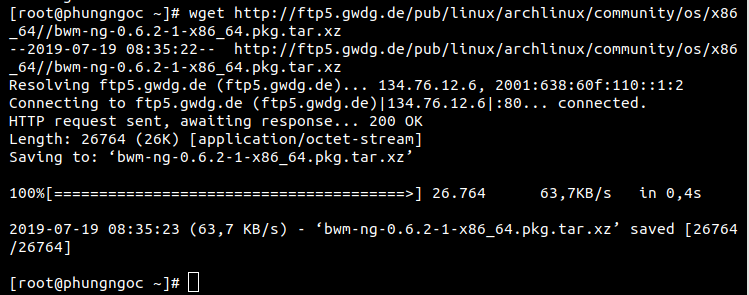
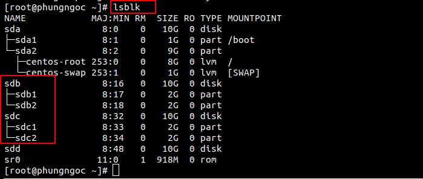
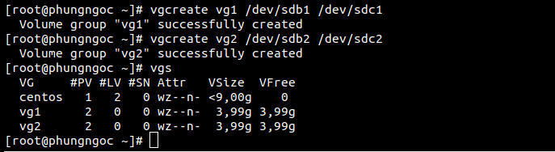
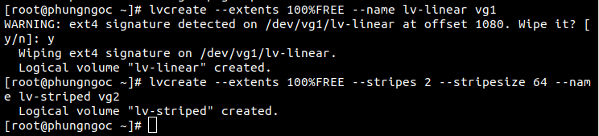
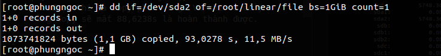
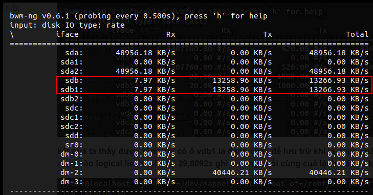
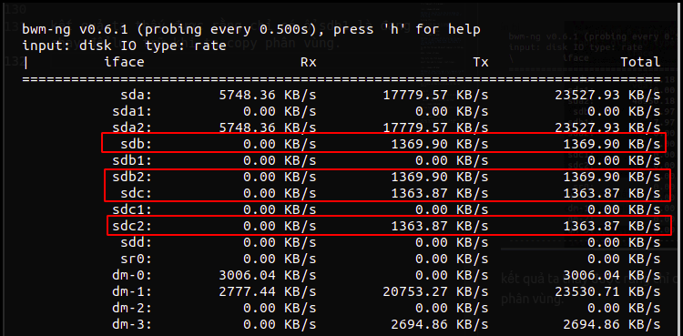
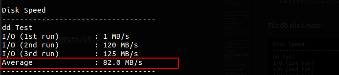
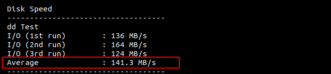

# Mục lục 
- [1.Tìm hiểu logical volume manager](#1)    
- [2.Ưu nhược điểm của từng kiểu dữ liệu](#2)  
- [3.Cách thực hiện tạo một Logical Volume với LVM Stripe, LVM linear](#3)  


<a name="1"></a>

## 1.Tìm hiểu logical volume mangager</a>

### Linear Logical Volumes 
- Linear : Dữ liệu sẽ được lưu hết phân vùng này rồi bắt đầu chuyển sang phân vùng khác để lưu trữ.  

Cách ghi dữ liệu:

 

### Striped Logical Volumes 
- Striped: sẽ chia đều các dữ liệu ra và ghi vào các phân vùng đã có. Và cách chia dữ liệu ra bao nhiêu thì được định sẵn bởi người cài đặt nó.  

Cách ghi dữ liệu:


### Mirrored Logical Volumes
- Mirrored Logical Volumes duy trì các bản sao dữ liệu giống hệt nhau trên các thiết bị khác nhau. Khi dữ liệu được ghi vào một thiết bị, nó cũng được ghi vào thiết bị thứ hai.Cung cấp sự an toàn nếu các thiết bị có hỏng hóc.
- Trong các LV chạy mirror , nếu một LV bị hỏng , LV còn lại sẽ chạy Linear Volume và vẫn có thể truy cập đến được.
- LVM chia thiết bị được sao chép thành các vùng có kích thước thường là 512KB.  
- LVM có lưu trữ log để theo dõi các phân vùng đồng bộ của các data được ghi.


<a name="2"></a>

## 2. Ưu điểm và nhược điểm của các kiểu lưu trữ
### Linear

- Ưu điểm : Các dữ liệu tập trung vào một phân vùng sẽ dễ dàng quản lý
- Nhược điểm : Khi bị mất dữ liệu sẽ mất hết dữ liệu của một phần đó. Làm việc chậm hơn bởi vì chỉ có một phân vùng mà trong khi các khu vừng khác không hoạt động

### Striped

- Ưu điểm: Tốc độ sẽ nhanh hơn vì tất cả các phân vùng sẽ cùng làm việc. Tốc độ đọc và ghi cũng nhanh hơn phương pháp Linear
- Nhược điểm: Khi mất dữ liệu ở một phân vùng thì sẽ bị mất và ảnh hưởng rất nhiều dữ liệu bởi vì mỗi dữ liệu đều được lưu ở nhiều phân vùng khi sử dụng phương pháp striped

### Mirror 

- Ưu điểm : Nếu một LV bị hỏng , LV còn lại sẽ chạy Linear Volume và vẫn có thể truy cập đến được.


<a name="3"></a>

## 3. Cách thực hiện tạo một Logical Volume với LVM Stripe, LVM linear

Ta thực hiện 1 ví dụ để làm rõ về 2 kiểu dữ liệu stripe và linear. Ta cần chuẩn bị:
- Bao gồm 3 disk : vda, vdb và vdc
- Cài các gói sau : wget, bwn-ng

### Bước 1: Cài đặt lệnh wget
```
yum install wget 
```


### Bước 2 : Cài lệnh giám sát quá trình đọc ghi ổ đĩa bwn-ng



### Bước 3: Tạo ra các phân vùng để tạo 2 logical có 2 kiểu lưu trữ riêng biệt



### Bước 4 : Tạo ra các Volume Group 

 

### Bước 5: Ta sẽ tạo ra một logical với kiểu lưu trữ là linear và một logical với kiểu lưu trữ là striped. Ở đây tôi sẽ tạo ra logical có tên là linear_lv với group1 theo cú pháp 
```
lvcreate --extents (số %)FREE --name (tên logical)
```
và striped logical với group2 theo cú pháp:
```
lvcreate --extents N%FREE --stripes (số physical) --stripesize (số dung lượng) --name (tên logical) (tên group )
```

 

### Bước 6: Sau đó ta đi tạo định dạng cho logical để có thể mount lại nó vào thư mục và dùng chúng  

Ta dùng lệnh sau:
```
mkfs -t ext4 /dev/vg1/lv-linear  
mkfs -t ext4 /dev/vg2/lv-striped
```


### Bước 7: Ta mount nó lại vào cây thư mục root là có thể sử dụng chúng. Và để kiểm tra lại xem logical đã được mount hay chưa ta sử dụng lệnh df -h

Ta cần tạo thư mục để mount logical vào thư mục đó:
```
mkdir linear stripes 
```

Thực hiện câu lệnh mount:
```
mount /dev/vg1/lv-linear /root/linear/
```


### Bước 8: Copy file root vào 2 logical này để xem tốc độ độc ghi của nó và cách lưu trữ dữ liệu.

Sử dụng với linear ta sử dụng 2 tab terminal với 2 lệnh sau:
```
dd if=<địa chỉ đầu vào> of=<địa chỉ đầu ra> option
```

Trong đó:

- if= địa chỉ nguồn của dữ liệu nó sẽ bắt đầu đọc
- of= viết đầu ra của file
- option : các tùy chọn cho câu lệnh



Với tab terminal thứ 2 ta thực hiện lệnh sau:

```
bwm-ng -u bytes -i disk
```


Kết quả ta thấy được rằng chỉ có ổ sdb1 là đang chạy để lưu trữ khi ta copy phân vùng.Ta copy sẽ mất 93,0278s thì hoàn thành được.

Sử dụng với cách lưu trữ striped :




Kết quả ở logical striped ta thấy rằng cả physical sdb2 và sdc2 cùng chạy để có thể lưu trữ được khi ta copy phân vùng. Và khi ta để ý rằng copy sẽ mất 88,6238s là hoàn thành được.

### Tốc độ ghi giữa LV Linear và LV Striped
Để so sánh tốc độ ghi , ta ghi 200MB vào 2 Logical Volume Striped và Linear:

Kiểm tra bằng script sau :
```
curl -Lso- https://raw.githubusercontent.com/nhanhoadocs/scripts/master/Utilities/bench_vm.sh | bash  
```

Tốc độ của Linear :

 

Tốc độ của Striped:



Vậy ta thấy dữ liệu lưu vào ổ striped có tốc độ nhanh hơn ghi vào linear.

