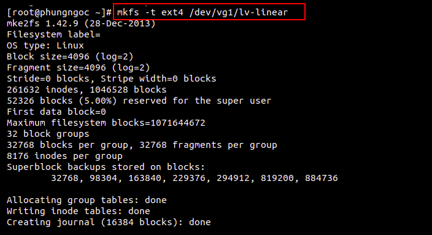
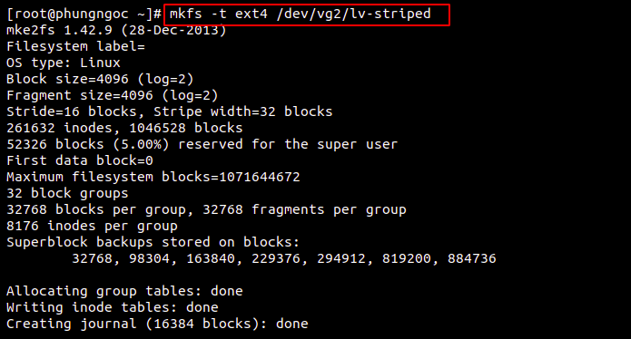
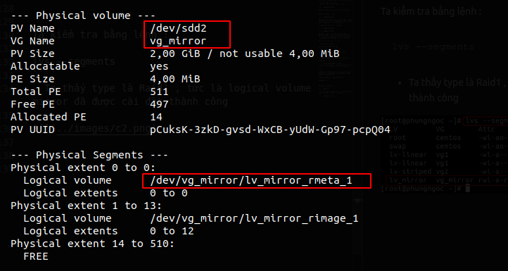
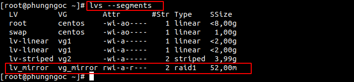

# Mục lục 

[1.Creating Linear, Striped Volumes](#a)    
[2.Creating Mirrored Volumes](#b)  


#  Creating Logical Volumes  

<a name="a"></a>

## 1. Creating Linear , Striped Volumes


### Bước 1: Cài đặt lệnh wget
```
yum install wget 
```


### Bước 2 : Cài lệnh giám sát quá trình đọc ghi ổ đĩa bwn-ng


### Bước 3: Tạo ra các phân vùng để tạo 2 logical có 2 kiểu lưu trữ riêng biệt


### Bước 4 : Tạo ra các Volume Group 

 

### Bước 5: Ta sẽ tạo ra một logical với kiểu lưu trữ là linear và một logical với kiểu lưu trữ là striped. Ở đây tôi sẽ tạo ra logical có tên là linear_lv với group1 theo cú pháp 
```
lvcreate --extents (số %)FREE --name (tên logical)
```
và striped logical với group2 theo cú pháp:
```
lvcreate --extents N%FREE --stripes (số physical) --stripesize (số dung lượng) --name (tên logical) (tên group )
```

 

### Bước 6: Sau đó ta đi tạo định dạng cho logical để có thể mount lại nó vào thư mục và dùng chúng  

Ta dùng lệnh sau:
```
mkfs -t ext4 /dev/vg1/lv-linear  
mkfs -t ext4 /dev/vg2/lv-striped
```





### Bước 7: Ta mount nó lại vào cây thư mục root là có thể sử dụng chúng. Và để kiểm tra lại xem logical đã được mount hay chưa ta sử dụng lệnh df -h

Ta cần tạo thư mục để mount logical vào thư mục đó:
```
mkdir linear stripes 
```

Thực hiện câu lệnh mount:
```
mount /dev/vg1/lv-linear /root/linear
```


### Bước 8: Copy file root vào 2 logical này để xem tốc độ độc ghi của nó và cách lưu trữ dữ liệu.

Sử dụng với linear ta sử dụng 2 tab terminal với 2 lệnh sau:
```
dd if=<địa chỉ đầu vào> of=<địa chỉ đầu ra> option
```

Trong đó:

- if= địa chỉ nguồn của dữ liệu nó sẽ bắt đầu đọc
- of= viết đầu ra của file
- option : các tùy chọn cho câu lệnh


Với tab terminal thứ 2 ta thực hiện lệnh sau:

```
bwm-ng -u bytes -i disk
```


kết quả ta thấy được rằng chỉ có ổ sdb1 là đang chạy để lưu trữ khi ta copy phân vùng.Ta copy sẽ mất 93,0278s thì hoàn thành được.

Sử dụng với cách lưu trữ striped :


Kết quả ở logical striped ta thấy rằng cả physical sdb2 và sdc2 cùng chạy để có thể lưu trữ được khi ta copy phân vùng. Và khi ta để ý rằng copy sẽ mất 88,6238s là hoàn thành được.

<a name="b"></a>

## 2.Creating Mirrored Volumes

- Tạo physical volume :
```
pvcreate /dev/sdd1 /dev/sdd2
```
- Tạo volume group :
```
vgcreate vg_mirror /dev/sdd1 /dev/sdd2
```
- Tạo logical volume :
```
lvcreate -L 50M -m1 -n lv_mirror vg_mirror 
```
Trong đó :

- -L : dung lượng Logical volume  
- -m1 : số mirror lưu . ( Ở đây ta lưu dữ liệu vào 1 ổ , và lưu bản mirror vào ổ còn lại) 

Lưu ý: 

- Điều kiện chạy được mirror volume là Logical Volume tạo ra không được vượt quá dung lượng physical Volume bé nhất

Kiểm tra physical volume bằng lệnh :
```
pvdisplay -m
```



Ta kiểm tra bằng lệnh :
```
lvs --segments
```
- Ta thấy type là Raid1 , tức là logical volume mirror đã được cài đặt thành công

 


