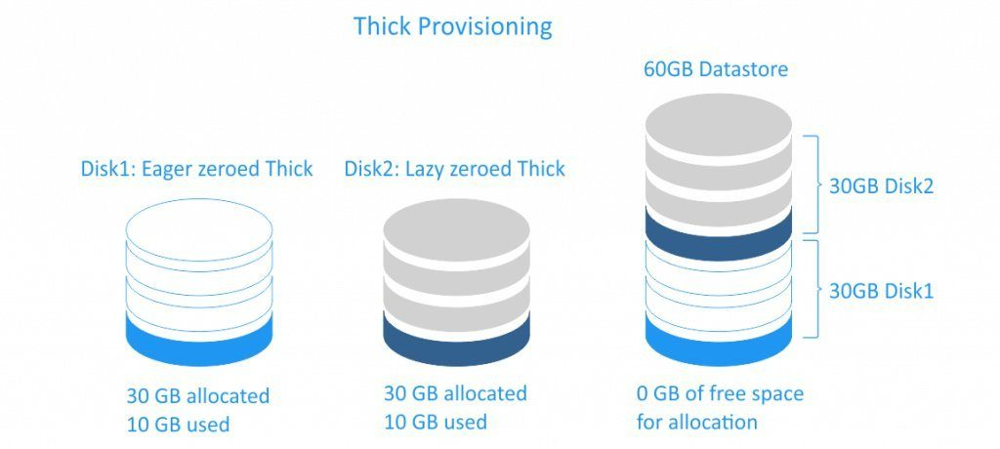
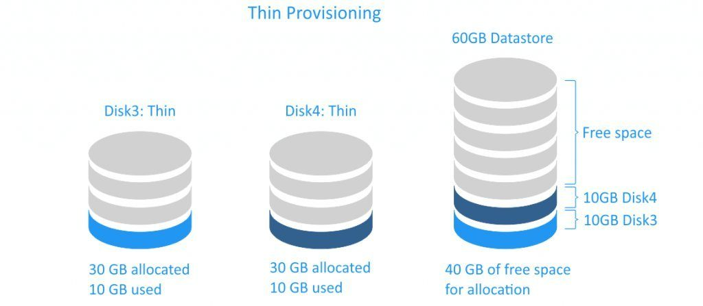

# Thick and Thin Provisioning 

## 1. Thick Provisioning

- Thick Provisioning là một loại phân bổ lưu trữ trước.
- Khi ta tạo một disk ảo cho máy ảo nó sẽ nhận nguyên dung lượng disk đó làm disk của nó dù cho nó chưa sử dụng hết dung lượng disk đó.    

 

## 2. Thin Provisioning

- Thin là một loại chia ra trước lưu trữ. nó chỉ tiêu thụ dung lượng mà nó cần ban đầu và cấp phát theo sự phát triển
- Với cơ chế này sẽ tránh được sự lạng phí dung lượng ổ cứng so với thick. Cơ chế này thì máy ảo chỉ chiếm dung lượng bằng đúng phần dung lượng mà nó đang lưu trữ. Vì vậy với phần dung lượng còn trống ta vẫn có thể làm việc khác
- Với cơ chế này ta có thể tận dụng được hết dung lượng disk nhưng nó có nhược điểm là nếu dung lượng đĩa cứng bị hết thì tất cả các VM trên đó sẽ gặp vấn đề vì không còn dung lượng disk để sử dụng.

