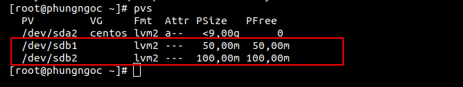
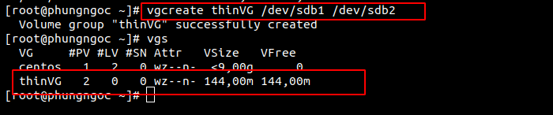
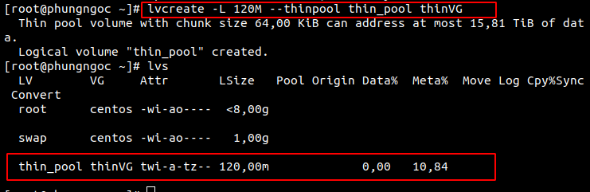
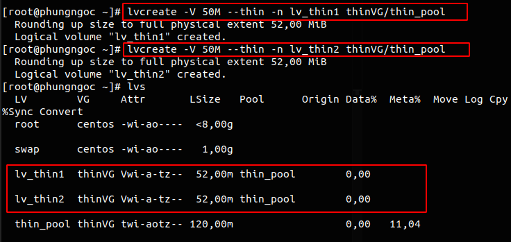
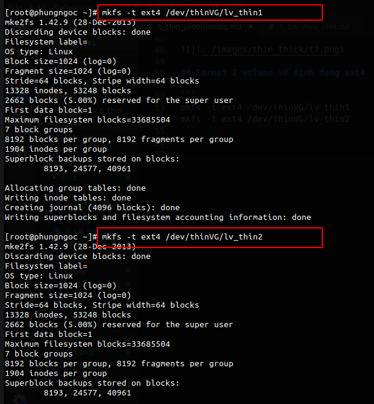
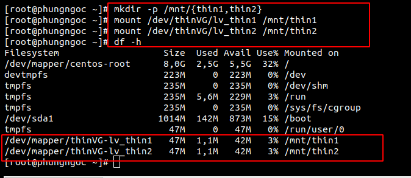
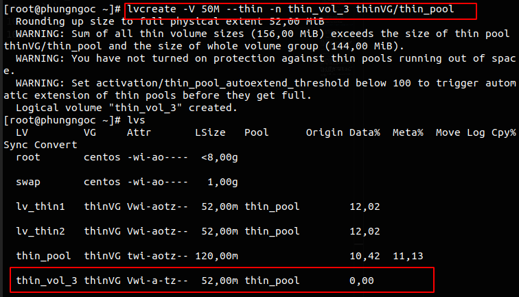

# Tìm hiểu về tính năng Thin Provisioning trong LVM

# Mục lục 

[1.Giới thiệu](#1)  
[2.Làm thế nào để sử dụng tính năng?](#2)  
[3.Tính năng Over Provisioning](#3)

<a name="1"></a>

## 1. Giới thiệu 


Thin Provisioning là tính năng cấp phát ổ cứng dựa trên sự linh hoạt của LVM. Giả sử ta có một Volume Group, ta sẽ tạo ra 1 Thin Pool từ VG này với dung lượng là 120M cho nhiều khách hàng sử dụng. Giả sử ta có 3 khách hàng, mỗi khách hàng được cấp 6GB lưu trữ. Như vậy ta có 3 x 40M là 120M. 

<a name="2"></a>

## 2.Làm thế nào để sử dụng tính năng?
## Chuẩn bị :  
Từ 2 physical volume 50MB và 100MB , tạo volume group từ 2 physical.  




## Tạo một Thin Volume Group 

Khởi tạo Volume  Group từ 2 đĩa sdb1 và sdb2 với tổng dung lượng là 150M:
```
vgcreate thinVG /dev/sd1 /dev/sdb2 
```


## Tạo Thin Pool
```
lvcreate -L 120M --thinpool thin_pool thinVG
 ```
Trong đó :

- -L : Size của volume group
- --thinpool : Tạo thinpool
- thin_pool : Tên Thin pool
- vg_thin : Volume group name sử dụng lưu trữ thinpool

 

## Tạo Thin volume :
```
lvcreate -V 50M --thin -n lv_thin_1 vg_thin/thin_pool  
lvcreate -V 50M --thin -n lv_thin_2 vg_thin/thin_pool
```

Trong đó :

- -V : Kích thước thin volume
- --thin : Khai bảo kiểu tạo volume
- lv_thin_1 : tên thin volume
- vg_thin/thin_pool : tên volume group và tên thin pool tạo nên thin volume 

Dùng lệnh `lvs` để kiểm tra.

 

## Format 2 volume về định dạng ext4

```
mkfs -t ext4 /dev/thinVG/lv_thin1
mkfs -t ext4 /dev/thinVG/lv_thin2
```



## Tạo mount point và mount 4 volume này lên hệ thống

```
mkdir -p /mnt/{thin1,thin2}
mount /dev/thinVG/lv_thin1 /mnt/thin1
mount /dev/thinVG/lv_thin2 /mnt/thin2
```



## Mở rộng Thin Pool
Về bản chất, Thin Pool vẫn là 1 Logical Volume nên ta có thể dễ dàng mở rộng Thin Pool, miễn là Volume Group chứa nó vẫn còn dung lượng trống:

```
lvextend -L +10MB /thinVG/thin_pool
```

<a name="3"></a>

## 3.Tính năng Over Provisioning

Khi sử dụng tính năng `Thin Provisioning` ta có thể cung cấp dung lượng cho nhiều hơn những gì thực tế ta có khi storage pool hiện đang còn có dung lượng trống. Việc cung cấp như này được gọi là `Over Provisioning`.  

Giả sử với 150MB của volume group trên , ta có 2 logical volume 50MB , ta tạo một logical volume với dung lượng là 50MB (Vượt quá dung lượng volume group )
```
lvcreate -V 50M --thin -n thin_vol_3 thinVG/thin_pool
```

 

Tiếp tục thực hiện các bước để có thể sử dụng thin volume vừa tạo ra tương tự như ở trên:

```
mkdir /mnt/thin3
mkfs -t ext4 /dev/thinVG/thin_vol_3
mount /dev/thinVG/thin_vol_3 /mnt/thin3
```
khi kiểm tra câu lệnh df -h ta được: 

```
Filesystem                     Size  Used Avail Use% Mounted on
/dev/mapper/centos-root        8,0G  2,5G  5,5G  32% /
devtmpfs                       223M     0  223M   0% /dev
tmpfs                          235M     0  235M   0% /dev/shm
tmpfs                          235M  5,6M  229M   3% /run
tmpfs                          235M     0  235M   0% /sys/fs/cgroup
/dev/sda1                     1014M  142M  873M  15% /boot
tmpfs                           47M     0   47M   0% /run/user/0
/dev/mapper/thinVG-lv_thin1     47M  1,1M   42M   3% /mnt/thin1
/dev/mapper/thinVG-lv_thin2     47M  1,1M   42M   3% /mnt/thin2
/dev/mapper/thinVG-thin_vol_3   47M  1,1M   42M   3% /mnt/thin3
```


