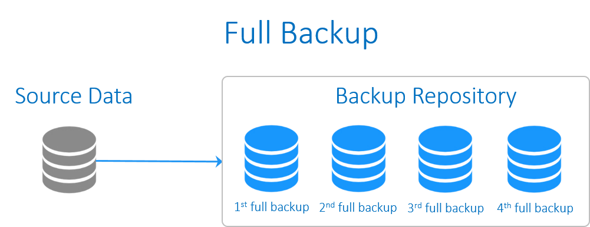
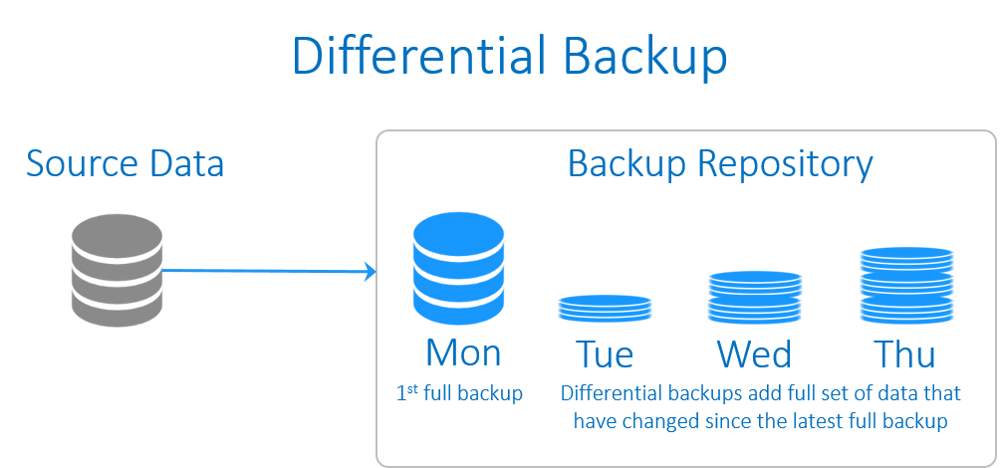
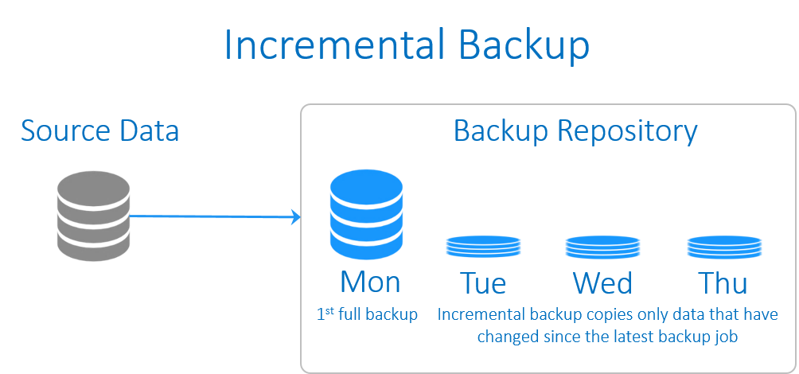
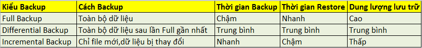

# TỔNG QUAN VỀ CÁC KIỂU BACKUP DỮ LIỆU

# Mục lục 
[I.Các kiểu backup dữ liệu](#I)
- [1.Full Backup](#1)
- [2.Differential Backup](#2)
- [3.Incremental Backup](#3)

## I.Các kiểu backup dữ liệu

### 1. Full Backup

Full Backup có nghĩa là backup toàn bộ dữ liệu đang có của bạn.  

#### Ưu điểm của Full Backup :
- Dễ dàng phục hồi lại dữ liệu. Khi cần phục hồi lại thì sẽ phục hồi lại toàn bộ dữ liệu của ngày Backup Full.
- Tính an toàn cao cho dữ liệu.
#### Nhược điểm của Full Backup:

- Thời gian backup lâu. Dữ liệu càng nhiều thì thời gian backup càng lâu
- Tốn dung lượng lưu trữ. Nếu mỗi ngày đều chạy full backup thì rất tốn dung lượng ổ cứng.
- Chi phí đầu tư thiết bị lưu trữ lớn.  

### 2.Differential Backup

Differential Backup là backup những gì thay đổi so với lần Full Backup gần nhất  
#### Ưu điểm của Differential Backup :

- Thời gian backup nhanh hơn
- Dung lượng backup nhỏ hơn so với Full Backup. - Tiết kiệm dung lượng lưu trữ
- Tốc độ phục hồi dữ liệu sẽ nhanh hơn so với Incremental Backup
#### Nhược điểm của Differential Backup :

- Khi cần khôi phục dự liệu cần có 2 bản backup :
1 File Full Backup lần gần nhất và 1 File Differential Backup vào thời điểm cần restore

### 3. Incremental Backup 

 

Incremental Backup là backup những gì thay đổi so với lần Incremental Backup gần nhất.  

#### Ưu điểm của Incremental Backup :

- Thời gian backup nhanh nhất
- Dung lượng backup bé nhất
#### Nhược điểm của Incremental Backup :

- Khi cần khôi phục dữ liệu phải có đủ các bản backup :
- 1 File Full backup lần gần nhất và tất cả các File Incremental Backup từ thời điểm Full Backup đến thời điểm cần restore
- Thời gian Restore lâu hơn so với Differential Backup

### Bảng so sánh

