# Tìm hiểu về LVM backup và snapshot
# Mục lục 
[I.LVM Backup](#I)
- [1. vgcfgbackup](#1)
- [2. vgcfgrestore](#2)
- [3. Cách tạo và sử dụng LVM backup](#3)

[II.LVM Snapshot](#II)

- [1. Tạo một snapshot](#12)
- [2. Tăng dung lượng của snapshot.](#22)     
- [3. Restore snapshot.](#23)


<a name="I"></a>

## I.LVM Backup

<a name="1"></a>

### 1.vgcfgbackup

Bất cứ khi nào bạn thực hiện bất kỳ hoạt động lvm nào như lvcreate, loại bỏ, thêm đĩa ... nên được cập nhật trong tệp conf nhóm khối tương ứng trong thư mục /etc/lvm/. Nếu đĩa bị lỗi, chúng tôi có thể khôi phục cấu hình LVM vào đĩa bằng tệp cấu hình sao lưu này. Lệnh vgcfgbackup lấy dữ liệu cấu hình từ tiêu đề lvm của đĩa và lưu vào một vị trí tệp mặc định /etc/lvm/backup/vg_name. 

```
vgcfgbackup [-f path_newfilename ] vg_name  
```
Trong đó :

- vg_name : Tên của volume group
- -f : chỉ định nơi lưu trữ file backup , nếu không có thì mặc định lưu tại /etc/lvm/backup/

Chúng ta hãy xem thư mục sao lưu: 

```
 ls -l /etc/lvm/backup/
```

<a name="2"></a>

## 2.vgcfgrestore 
Lệnh `vgcfgrestore` khôi phục LVM volume group từ các Physical Volume.  
Câu lệnh:
```
vgcfgrestore [-f|--file <filename>] [-v] vg_name  
```
Trong đó:
- vg_name : Tên volume group .
- -f : Đường dẫn lưu file backup .
- -v : để biết chi tiết về những gì đang xảy ra.

<a name="3"></a>

## 3.Cách tạo và sử dụng LVM backup
 
### Chuẩn bị:  
Tạo 1 vg-backup và 1 lv-backup

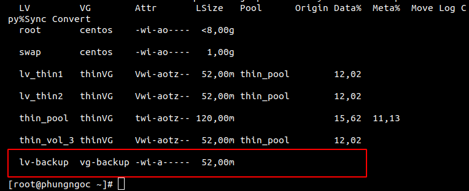

### Backup 
```
vgcfgbackup [-f path_newfilename ] vg_name
```

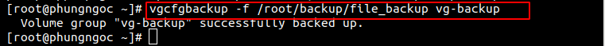

Kiểm tra lại bằng việc xem file_backup đã được ghi hay chưa:
```
ll /ect/lvm/backup
```
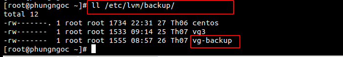


### Restore
Khôi phục cấu hình các volume group từ các kho lưu trữ backup được lưu từ trước.  
Trước tiên, ta cần remove Physical Volume vừa tạo `lv-backup` :
```
lvremove /dev/vg-backup/lv-backup
```

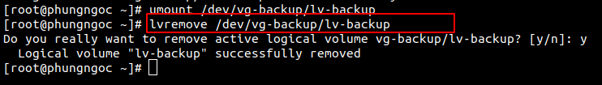  

#### Cách 1:ta dùng lệnh sau để restore :

```
vgcfgrestore [-f|--file <filename>] [-v] vg_name  
```
Ta dùng lệnh sau để kiểm tra :
```
lvscan
```

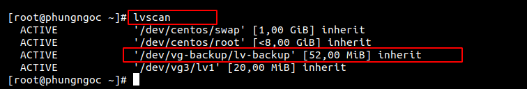 


#### Cách 2: Ta có thể vào file `/etc/lvm/archive/vgname_(xxxxxx).vg` đây là các file log ghi thời gian mà bạn thao tác trên các logical volume.  
```
ll /etc/lvm/archive/
```
1. Tìm file có thời gian gần nhất là file mới được ghi và restore lại được.
```
-rw-------  1 root root 1130 08:57 26 Th07 vg-backup_00001-1795958756.vg
```
2.  Đọc chi tiết xem ngày và giờ khi muốn restore đọc một file nào đó.
```
head /etc/lvm/archive/vg-backup_00001-1795958756.vg
```
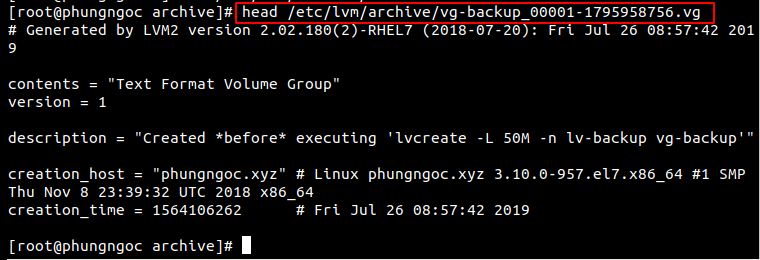

3. Restore dữ liệu
```
vgcfgrestore vg-backup -v -f /etc/lvm/archive/vg-backup_00001-1795958756.vg
```
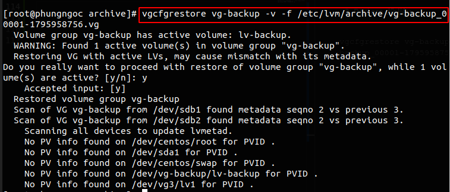 

Bước cuối cùng active lại vùng nhớ đê nhận restore.
```
lvchange -ay /dev/vg-backup/lv-backup
```

Kiểm tra kết quả dữ liệu sau khi backup vẫn còn nguyên
```
ll /ect/lvm/backup
```
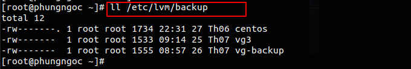 

Vậy đã restore lại được dữ liệu đã xóa.


<a name="II"></a>

## II. LVM Snapshot

Snapshot là cơ chế tạo ra “bản sao” của volume, lưu trữ toàn bộ định dạng và dữ liệu trên volume. Mỗi volume có thể tạo một hoặc nhiều snapshot.


<a name="12"></a>

### 1.Tạo một snapshot
Chuẩn bị tạo 1 volume group, 1 logical volume:

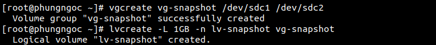

Tạo snapshot volume bằng lệnh sau:
```
lvcreate -L 500M -s -n lv-snap1 /dev/vg-snapshot/lv-snapshot
```
Trong đó :

- -L : Dung lượng muốn tạo ra cho logical volume snapshot
- -s : Tạo snapshot
- -n : tên của logical volume snapshot
- /dev/vg-snapshot/lv-snapshot : Đường dẫn của logical volume gốc mà ta muốn snapshot

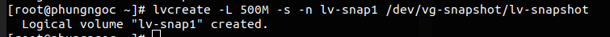 

Xem thông tin của snapshot:
```
lvdisplay /dev/vg-snapshot/lv-snap1
```
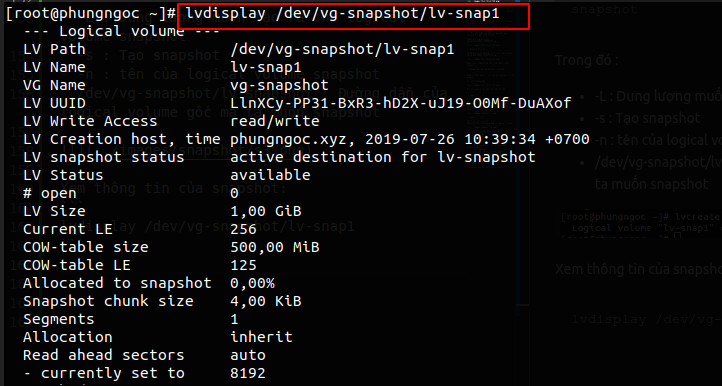  

Kiểm tra bằng lệnh lvs ta có thêm 1 LV lv-snap1 với cột data có % = 0.00

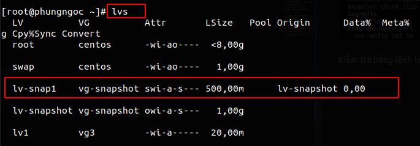  


<a name="22"></a> 

### 2. Tăng dung lượng của snapshot
Tăng thêm dung lượng của snapshot ta sẽ thực hiện:
```
lvextend -L +100M /dev/vg-snapshot/lv-snap1
```

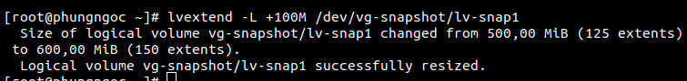

Mở rộng tự động

Vào file `/etc/lvm/lvm.conf` và chỉnh sửa

```
snapshot_autoextend_threshold = 70
snapshot_autoextend_percent = 20
```
Giải thích : Dòng 1: Khi dung lượng đạt tới 70% Dòng 2: Kích thước volume sẽ tăng 20%

<a name="23"></a>

###  3. Restore snapshot
Để restore Snapshot chúng ta phải un-mount file system
```
umount /root/demo
```
Check bằng lệnh df -h để kiểm tra đã un-mount thành công hay chưa.  
Ta dùng lệnh sau để restore snapshot :
```
lvconvert --merge /dev/vg-demo1/lv-demo1-snap
```
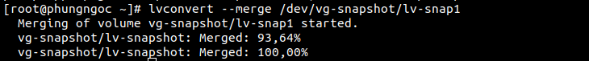


