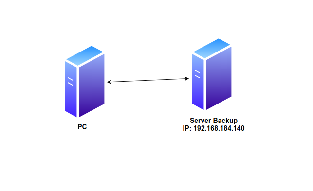

# Dùng Crontab chạy vgcfgbackup

# Mục lục

[1. Cron là gì?](#1)  
[2. Cấu trúc Crontab](#2)  
[3. Dùng Crontab chạy vgcfgbackup](#3)


<a name="1"></a>

## 1. Cron là gì? 
Cron là một tiến ích giúp chúng ta lập kế hoạch chạy những dòng lệnh trên server để thực hiện 1 hoặc nhiều công việc dựa trên thời gian được lập sẵn. Cron là một chương trình được chạy ngầm mãi một khi nó được khởi động lên.  

Cron được điều khiển bởi một tệp cấu hình có tên /etc/crontab chứa các lệnh shell khác nhau cần được chạy vào thời gian được lên lịch chính xác.   

Để mở trình soạn thảo crontab chỉnh sửa các công việc hoặc tạo công việc mới ta dùng lệnh:
```
crontab -e
```
`crontab -l`: hiển thị file crontab  
`crontab -r`: xóa file crontab  

<a name="2"></a>

## 2.Cấu trúc crontab

Mỗi dòng của tệp crontab chứa 6 trường:
```
*     *     *     *     *     command to be executed

–     –     –     –     –

|     |     |     |     |

|     |     |     |     +—– day of week (0 – 6) (Sunday=0)

|     |     |     +——- month (1 – 12)

|     |     +——— day of month (1 – 31)

|     +———– hour (0 – 23)

+————- min (0 – 59)
```  

Bảng dưới đây sẽ thể hiện chức năng của định dạng trên:

|Định dạng|	 Mô tả|	Giá trị cho phép|
|-----|-----|-----|
|MIN |Phút |0 đến 59|
|HOUR | Giờ| 0 đến 23|
|DOM  |Ngày trong tháng|  1 đến 31|
|MON | Tháng |1 đến 12|
|DOW |Ngày trong tuần|	0 đến 6|
|CMD |Command |Lệnh cần thực thi|

<a name="3"></a> 

## 3. Dùng Crontab chạy vgcfgbackup 

Mô hình:



PC chạy script để backup volume group và gửi sang directory bên server backup.Ta dùng crontab để lập kế hoạch backup dữ liệu.

### Cấu hình 

Ta cần tạo file backup.sh

```
#!/bin/bash

HOME=/root
LOGNAME=root
PATH=/usr/local/sbin:/usr/local/bin:/sbin:/bin:/usr/sbin:/usr/bin
LANG=en_US.UTF-8
SHELL=/bin/sh
PWD=/root

#Nhap mat khau may backup
rootpass=ngockem

NOW=`date '+%F_%H:%M:%S'`;
yum --enablerepo=epel -y install sshpass

vgcfgbackup -f /home/phungngoc/backup_file/vg_backup_$NOW vg-backup

file=$(ls -t /home/phungngoc/backup_file | head -1)

sshpass -p $rootpass scp -r /home/phungngoc/backup_file/$file root@192.168.184.140:/home/relayserver/backup_lvm

```
Ví dụ:

Câu lệnh dưới đây sẽ thực hiện việc tìm kiếm cho foo và thay thế bởi bar có trong trong test.txt
```
$ sed -e "s/foo/bar/g" test.txt
``` 
Trong câu lệnh trên:

- Tùy chọn -e dùng để thêm vào biểu thức thực thi bởi sed
- Biểu thức "s/foo/bar/g" là biểu thức regular expression dùng để thực hiện việc thay thế (subtitude) foo bởi bar và việc thay thế này được thực hiện cho tất cả các kết quả foo có trong test.txt
- File test.txt là tập tin chứa nội dung văn bản  

Sử dụng tùy chọn i trong biểu thức regular expression, nếu bạn muốn tìm kiếm và thay thế theo kiểu không phân biệt in hoa và in thường (nghĩa là cả foo, Foo, FoO... đều sẽ được thay thế bởi bar:
```
$ sed -i -e "s/foo/bar/g" test.txt
```
