# Mục lục
[1.Thư mục chứa database](#a)  
[2.Quản lý tài khoản và phân quyền](#b)  
[3.Thao tác với database](#c)  
[4.Thao tác với table](#d)  
[5.Thao tác với cột và hàng](#e)  
[6.Thao tác sao lưu và phục hồi](#f)  


# Các câu lệnh MySQL quan trọng 

Đăng nhập MySQL bạn dùng lệnh: 
```
mysql -u root -p
```

<a name="a"></a>

## 1. Thư mục chứa database

Trên CentOS, toàn bộ file raw database được lưu trong thư mục `/var/lib/mysql`

<a name="b"></a>

## 2. Quản lý tài khoản và phân quyền
### Tạo user mới

```
create user 'user-name'@'IP' identified by 'password';
```

Trong đó ta có:

- username : tên của user
- IP : máy có thể truy cập user này muốn tất cả các user đều đăng nhập được ta để %
- password : là pass để ta đăng nhập 

### Liệt kê các user đang có trong dịch vụ MySQL
 Ta dùng lệnh:
 ```
mysql>SELECT user, host FROM mysql.user;
```
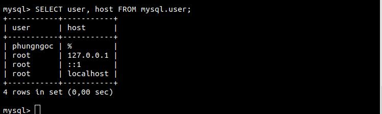

### Đổi tên tài khoản root (giúp bảo mật):
```
 mysql>UPDATE mysql.user SET user="username" WHERE user="root";
```
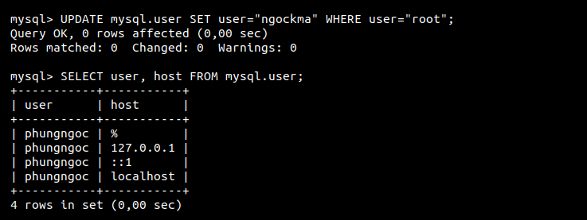

### Gán full quyền cho một user mới:
```
mysql> GRANT ALL PRIVILEGES ON *.* TO 'username'@'localhost' IDENTIFIED BY 'mypass' WITH GRANT OPTION;
```
Dấu * trong trường hợp này được chỉ đến database và bảng mà user này được quyền truy cập. Lệnh này cho phép người đọc, chỉnh sửa, thực hiện các nhiệm vụ trên database và table.


Khi bạn đã hoàn tất các quyền mà bạn thiết lập cho người dùng mới của mình, hãy chắc chắn rằng bạn đã reload lại các quyền của các user trong mysql.
```
FLUSH PRIVILEGES;
```
Sau đó ta đăng nhập với server bằng client
```
mysql -u user -p -h IPserver
```

### Phân quyền chi tiết cho một user mới:

|Key| |
| ----- | ----- |	
| ALL PRIVILEGES |	Như chúng ta đã thấy trước đây, điều này sẽ cho phép một người dùng MySQL truy cập vào một cơ sở dữ liệu được chỉ định (hoặc nếu không có cơ sở dữ liệu nào được chọn, qua hệ thống) |
| CREATE	| cho phép họ tạo các bảng hoặc cơ sở dữ liệu mới
| DROP | cho phép họ xóa các bảng hoặc cơ sở dữ liệu
| INSERT |	cho phép họ thêm các hàng từ các bảng
| DELETE |	cho phép họ xóa các hàng từ các bảng
| SELECT | cho phép họ sử dụng lệnh SELECT để đọc qua cơ sở dữ liệu
| UPDATE | cho phép họ cập nhật các hàng của bảng
| GRANT OPTION | cho phép họ cấp hoặc xoá các đặc quyền của người dùng khác |

```
mysql> GRANT SELECT, INSERT, UPDATE, DELETE, CREATE, DROP, INDEX, ALTER, CREATE TEMPORARY TABLES, LOCK TABLES ON mydatabase.* TO 'username'@'localhost' IDENTIFIED BY 'mypass';
``` 
### Gán full quyền cho một user mới trên một database nhất định:
```
GRANT ALL PRIVILEGES ON mydatabase.* TO 'username'@'localhost' IDENTIFIED BY 'mypass' WITH GRANT OPTION;
```
### Thay đổi mật khẩu user:
```
UPDATE mysql.user SET password=PASSWORD("newpass") WHERE User="username";
```
### Xóa user:
```
DELETE FROM mysql.user WHERE user="username";
```

### Xóa tất cả user mà không phải root
```
mysql> DELETE FROM mysql.user WHERE NOT (host="localhost" AND user="root");
```

### Reload user
```
FLUSH PRIVILEGES;
```

<a name="c"></a>

## 3. Thao tác với database
### Hiển thị toàn bộ databases:
```
SHOW DATABASES;
```
### Tạo database:
```
 CREATE DATABASE name_database;
```
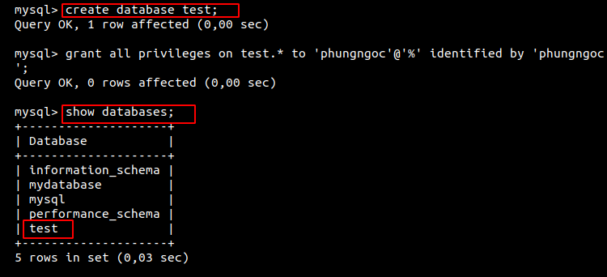 

### Sử dụng một database:
```
USE name_database;
```


### Xóa một database:
```
DROP DATABASE name_database;
```

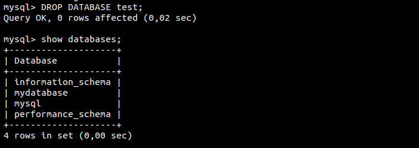

<a name="d"></a>

## 4. Thao tác với table

Tất cả các thao tác bên dưới bạn phải lựa chọn trước database bằng cách dùng lệnh:
```
 mysql> USE name_database;
```


Trong một trường thì có kiểu dữ liệu sẽ được phân ra thì một số kiểu của trường là:

- Kiểu số : int; float;...
- date time: yyyy-mm-dd : ngày tháng năm ; HH:MM:SS (giờ phút giây)
- Kiểu chuỗi: char; varchar
### Tạo bảng table
```
CREATE TABLE name_table(trường trong bảng)
```
Ví dụ để tạo một bảng có tên là sinhvien với các trường mssv, ho, ten, tuoi, diemthi trong cơ sở dữ liệu sinhvien:
```
CREATE TABLE sinhvien (
mssv INT NOT NULL AUTO_INCREMENT,
ho VARCHAR(255) NOT NULL,
ten VARCHAR(255) NOT NULL,
tuoi INT NOT NULL,
diemthi FLOAT(4,2) NOT NULL,
PRIMARY KEY (mssv)
);
```

### Hiển thị toàn bộ table:
```
mysql> SHOW TABLES;
```
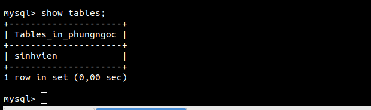

### Hiển thị dữ liệu của table:
```
mysql> SELECT * FROM tablename;
```


###  Đổi tên bảng
```
mysql> RENAME TABLE first TO second;
```
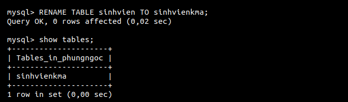 

### Xóa table:
```
mysql> DROP TABLE name_table;
```

<a name="e"></a>

## 5. Thao tác với cột và hàng

### Hiển thị các column trong table:
```
mysql> DESC mytable;
hoặc
mysql> SHOW COLUMNS FROM mytable;
```
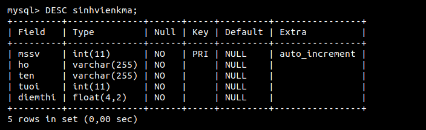

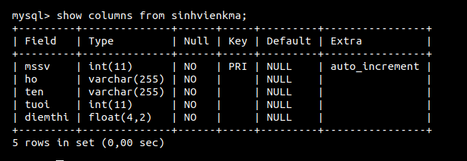

Giải thích đọc bảng

- filed : tên cột
- Type : Kiểu của trường
- NULL : có được để giá trị null không
- key : có là key chính hay không
- default : mặc định của cột là
### Đổi tên column:
```
alter table sinhvien change columnold columnnew (thuộc tính của trường);

```


### Thêm cột cho bảng
```
alter table tablename add column_name kieu_truong;
```


Để kiểm tra ta dùng lệnh :
```
desc tables;
```
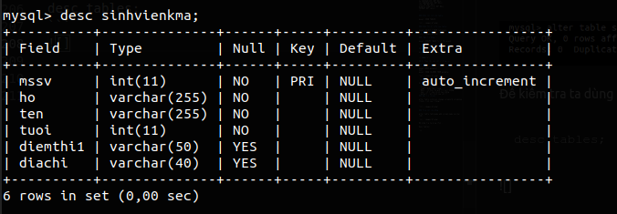

### Xóa cột trong bảng
```
alter table tablename drop column_name kieu_truong;
```
### Insert dữ liệu vào table: 

Lệnh INSERT INTO trong SQL được sử dụng để thêm các hàng dữ liệu mới vào một bảng trong Database.

Có hai dạng cú pháp cho lệnh INSERT INTO trong SQL như sau:

```
INSERT INTO TABLE_TEN (cot1, cot2, cot3,...cotN)]  
VALUES (giatri1, giatri2, giatri3,...giatriN);
```
```
INSERT INTO TABLE_TEN VALUES (giatri1,giatri2,giatri3,...giatriN);
```
Ví dụ :

Dưới đây sẽ tạo 1 bản ghi trong bảng SINHVIEN:
```
insert into sinhvienkma(mssv,ho,ten,tuoi,diemthi1,diadiem)
Values(1,'phung','ngoc',20,8,'hanoi');
```
Để kiểm tra ta dùng lệnh :  ` select * from sinhvienkma`

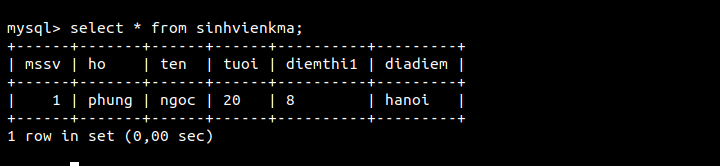

Tạo thêm một bản ghi trong bảng sinhvienkma sử dụng cú pháp thứ hai như sau:
```
INSERT INTO sinhvienkma
VALUES (2, 'dang','oanh',21,8, 'hanoi');
```
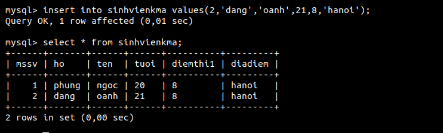

### Xóa dữ liệu trong table:
```
mysql> DELETE FROM mytable WHERE mycolumn="mydata";
```

<a name="f"></a>

## 6. Thao tác sao lưu và phục hồi

### Sao lưu (backup database)
Việc sao lưu (hay còn gọi là export hoặc backup)được sử dụng nhờ câu lênh mysqldump, câu lệnh này sẽ chuyển toàn bộ dữ liệu có trong database ra một file. Cú pháp câu lệnh này như sau:
```
mysqldump -u [username] -p [database] > [filename].sql
```
Trong đó:

- username: Là tên người dùng có quyền sao lưu cơ sở dữ liệu
- database: Là tên cơ sở dữ liệu cần backup
- filename: Là tên file dùng để lưu dữ liệu được sao lưu


### Chỉ sao lưu cấu trúc database:
```
mysqldump --no-data --databases databasename > structurebackup.sql
```
### Sao lưu một số table nhất định:
```
mysqldump --add-drop-table -u username -p databasename table_1 table_2 > databasebackup.sql
```
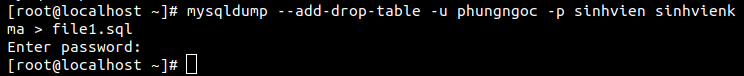

### Phục hồi dữ liệu 
Khôi phục toàn bộ database bằng lệnh:
```
mysql -u username -p < alldatabases.sql
```

