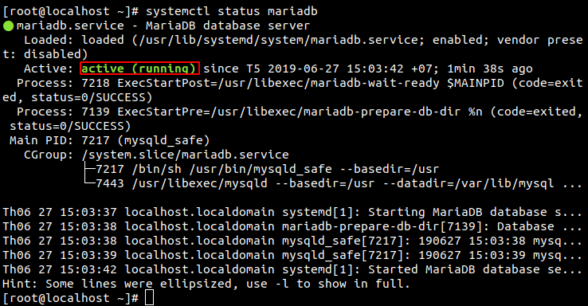
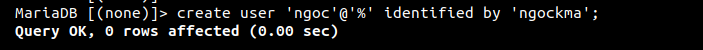
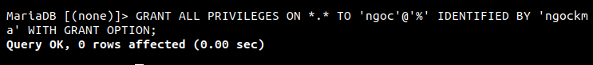
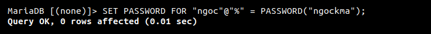

# Mục lục
[1.MariaDB là gì?](#a)  
[2.Cài đặt MariaDB như thế nào?](#b)

<a name="a"></a>

# MariaDB
## 1. MariaDB là gì?

MariaDB là một hệ thống quản lý cơ sở dữ liệu quan hệ mã nguồn mở (DBMS), một sự thay thế tương thích cho công nghệ cơ sở dữ liệu MySQL được sử dụng rộng rãi. Nó được tạo ra như một nhánh phần mềm của MySQL bởi các nhà phát triển.


<a name="b"></a>

## 2. Cài đặt MariaDB như thế nào?

### Thêm MariaDB Repository để cài đặt MariaDB bằng tiện ích YUM trên CentOS.
Tạo file  /etc/yum.repos.d/MariaDB.repo  với nội dung sau:

```
[mariadb]

name = MariaDB

baseurl = http://yum.mariadb.org/5.5/rhel6-x86

gpgkey=https://yum.mariadb.org/RPM-GPG-KEY-MariaDB

gpgcheck=1

```
### Cài đặt MariaDB :
```
yum  install MariaDB MariaDB-server
```
### Cấu hình để MariaDB tự khởi động cùng HĐH mỗi khi khởi động CentOS 7 lên.
```
sudo systemctl enable mariadb
```
Khởi động dịch vụ lên.
```
sudo systemctl start mariadb
```
Kiểm tra trạng thái của MariaDB trên CentOS 7
```
sudo systemctl status mariadb
```

### Sau khi cài đặt xong MariaDB, chúng ta tiến hành cài đặt bảo mật
```
sudo mysql_secure_installation
```
### Mở port Firewall trên CentOS 7 Minimal cho MariaDB.
```
firewall-cmd --add-port=3306/tcp
firewall-cmd --permanent --add-port=3306/tcp
```

### Tạo user cho MariaDB 
```
create user 'user-name'@'IP' identified by 'password';
```


### Thay đổi mật khẩu user :
```
SET PASSWORD FOR "$username"@"$hostname" = PASSWORD("$password");
```
### Gán full quyền cho một user mới:
```
mysql> GRANT ALL PRIVILEGES ON *.* TO 'username'@'localhost' IDENTIFIED BY 'mypass' WITH GRANT OPTION;
```


### Thay đổi mật khẩu cho user
```
SET PASSWORD FOR "$username"@"$hostname" = PASSWORD("$password");
```



