# Phân quyền user trong MySQL và Cài đặt MySQL Workbench
## Phân quyền user trong MySQL
Trước tiên, tạo user mới: 


Gán full quyền cho một user mới:
```
mysql> GRANT ALL PRIVILEGES ON *.* TO 'username'@'localhost' IDENTIFIED BY 'mypass' WITH GRANT OPTION;
```
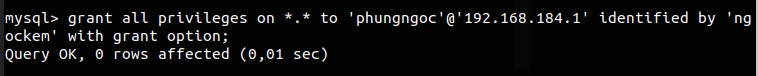

## Cài đặt và sử dụng MYSQL Workbench
MySQL Workbench là một công cụ đồ họa giàu tính năng được sử dụng để mô hình hóa dữ liệu, xây dựng các truy vấn SQL, quản lý máy chủ MySQL và hơn thế nữa. Hướng dẫn này sẽ chỉ cho bạn cách cài đặt Workbench bằng trình quản lý gói Ubuntu.  

### 1. Cài đặt MySQL Workbench bằng trình quản lý gói APT:
```
sudo apt install mysql-workbench
```

###  2. Chạy MySQL Workbench
Khởi chạy MySQL Workbench từ thiết bị đầu cuối:
```
mysql-workbench
```
MySQL Workbench hiển thị màn hình chào mừng này trong lần chạy đầu tiên, mở MySQL Workbench trên máy cục bộ của bạn và nhấp + để tạo kết nối mới: 

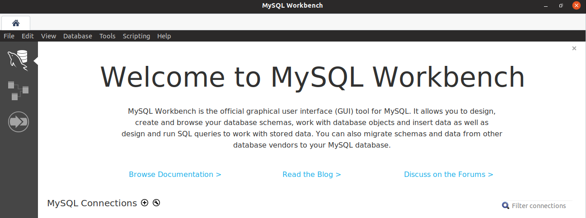 

### 3. Tạo một tên kết nối. 
Nhấp vào menu thả xuống Phương thức kết nối và chọn Standard TCP/IP over SSH. Hoàn thành thông tin đăng nhập cho người dùng SSH và MySQL:

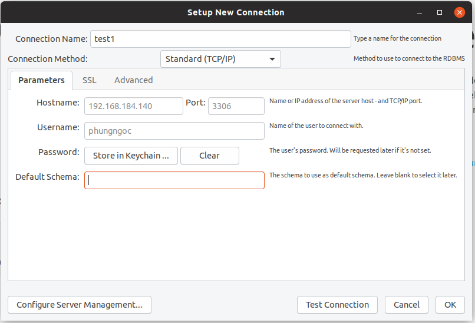  
Chọn OK.

Chú thích:  Cổng mặc định của máy chủ MySQL phải được bật 3306 với lệnh sau :
```
iptables -I INPUT -p tcp -m tcp --dport 3306 -j ACCEPT
```
### 4. Cửa sổ làm việc của MySQL Workbench xuất hiện như sau:

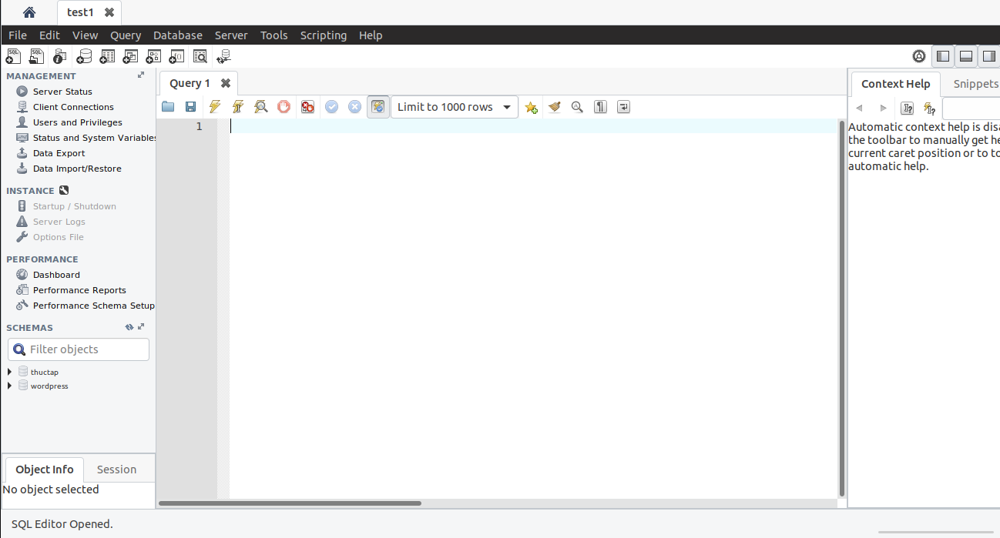 

### 5. Tạo mới một database

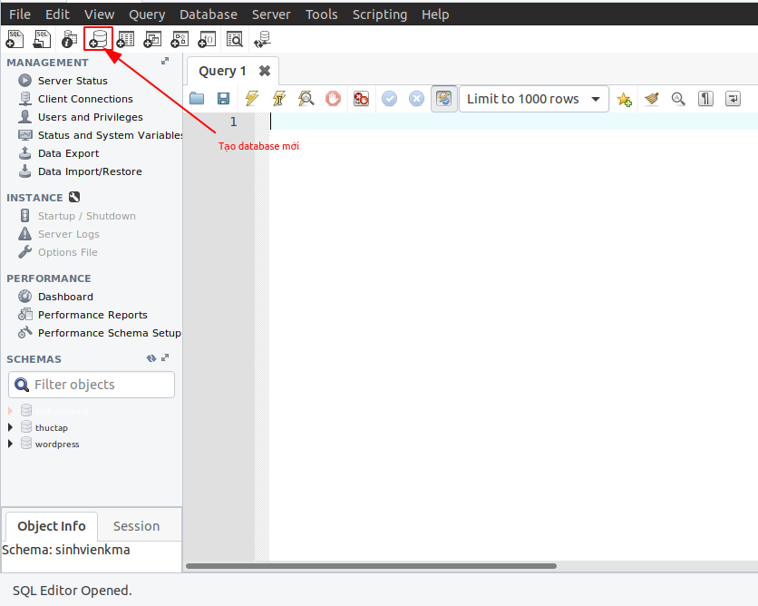 

Tại tab mới được sinh ra chúng ta sẽ điền vào các thông tin sau:

- Name: tên database
- Default Collation: Đây là kiểu chữ hiển thị ( nên đặt là utf8 – utf8_general_ci hoặc utf8 – utf8_unicode_ci để có thể hiển thị được tiếng việt )  

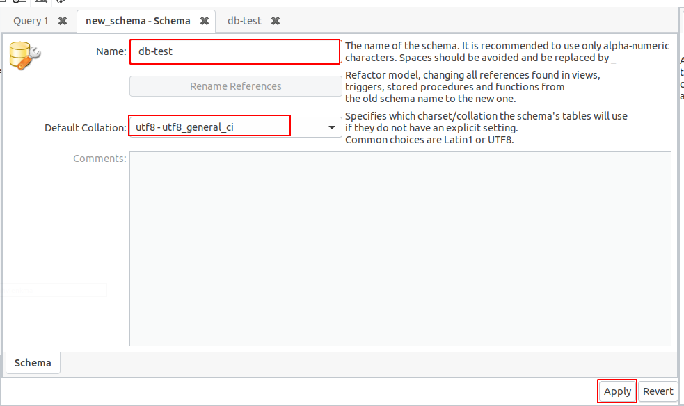

Sau khi điền xong click vào Apply.

Chúng ta đã tạo ra được 1 database thành công.

### 6. Quản lý table trong database
Sau khi tạo xong database chúng ta mở database ra sẽ có các tab bên trong: Table, Views, Stored Procedures và Functions. Chuột phải vào Table -> Create Table, sẽ có 1 tab tạo 1 table để điền thông tin:

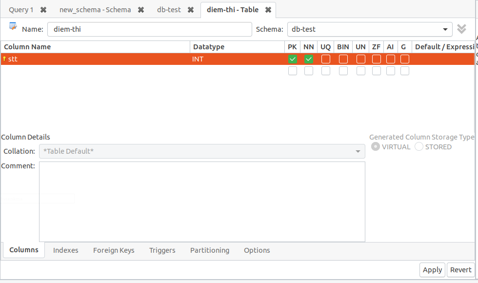

Chúng ta đang ở tab Columns:

- Name: tên table  
- Schema: tên database  
- Column Name: tên column trong table  
- Datatype: kiểu dữ liệu  
- PK, NN, UQ, BIN, UN, ZF, AI, Defaul: là các cờ  
  - PK: Primarey Key    
  - NN: Not Null  
  - UQ: Unique   
  - BIN: Binary
  - UN: Unsigned  
  - ZF: Zero-Filled  
  - AI: Auto Increment    

Sau khi điền xong click vào Apply để tạo ra table mới, thông báo sẽ hiển thị ra câu SQL khởi tạo table. Click vào Apply để thực thi câu lệnh:

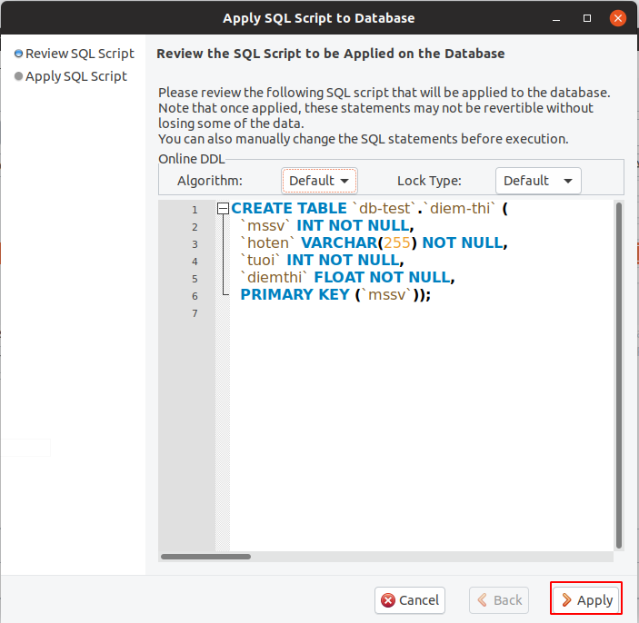  

### 7.Hiển thị các column trong table, insert dữ liệu vào table 
Chọn tables, click chuột phải vào diem-thi -> Slect Rows-Limit 1000 

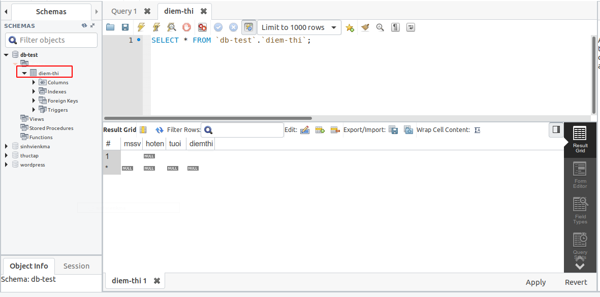
 
Ta insert dữ liệu vào trong bảng :

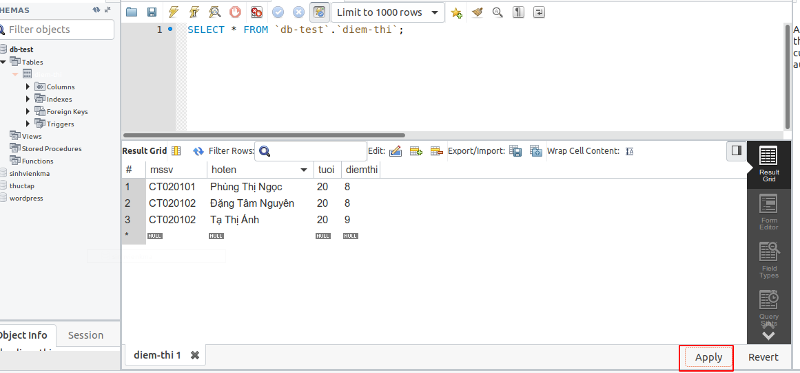 
Sau khi điền vào bảng xong chọn Apply để insert dữ liệu vào bảng:

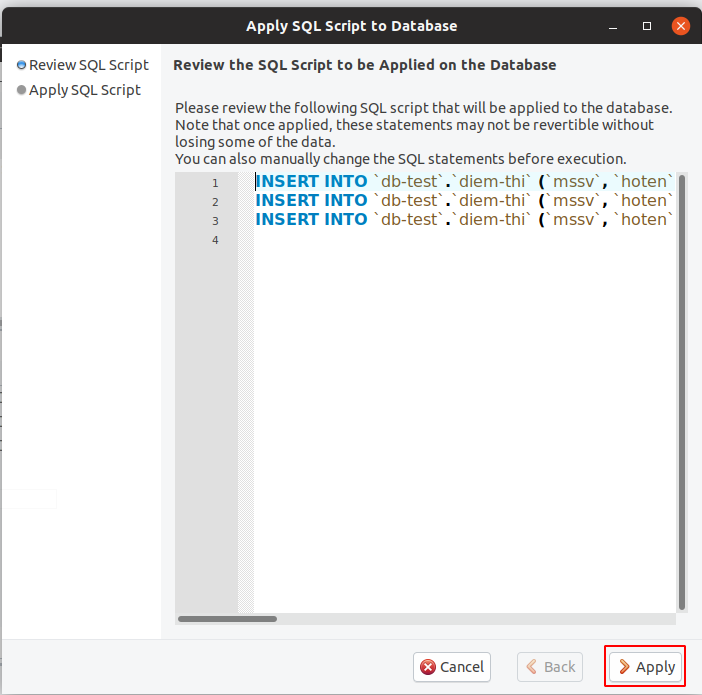  


