# Cách cài CentOS7 trên VMware

- Đầu tiên ta cần download file CentOS7
- Tiếp theo mở VMware :

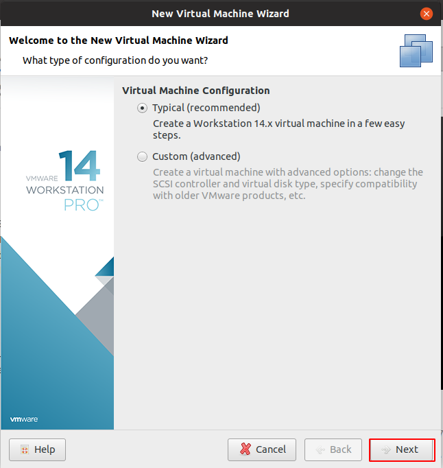

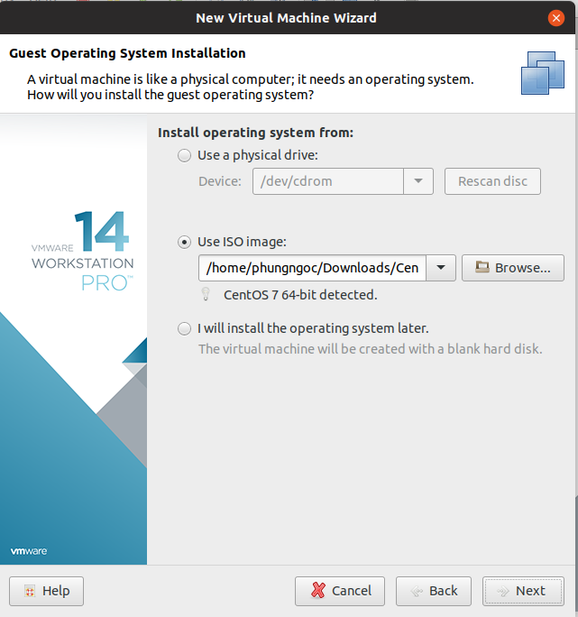

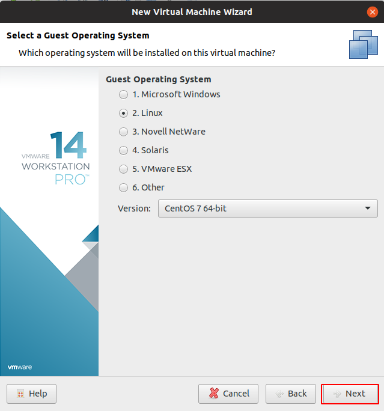

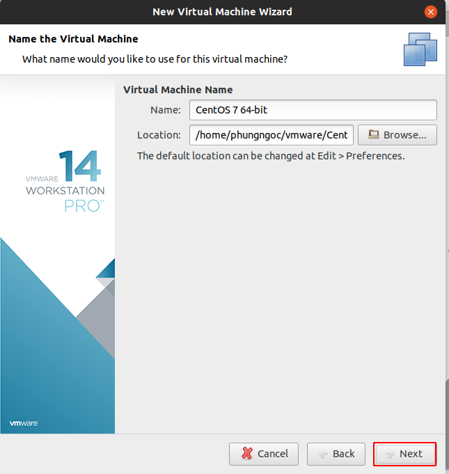

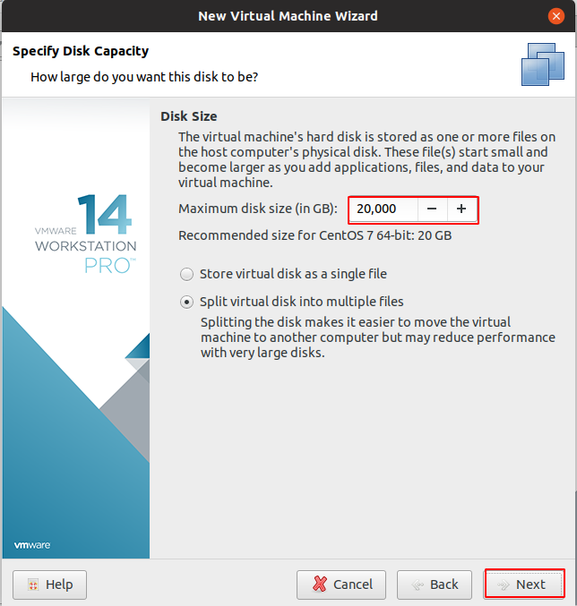

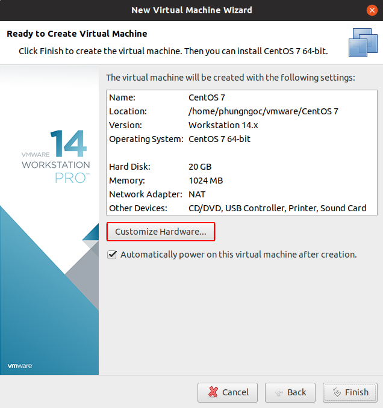

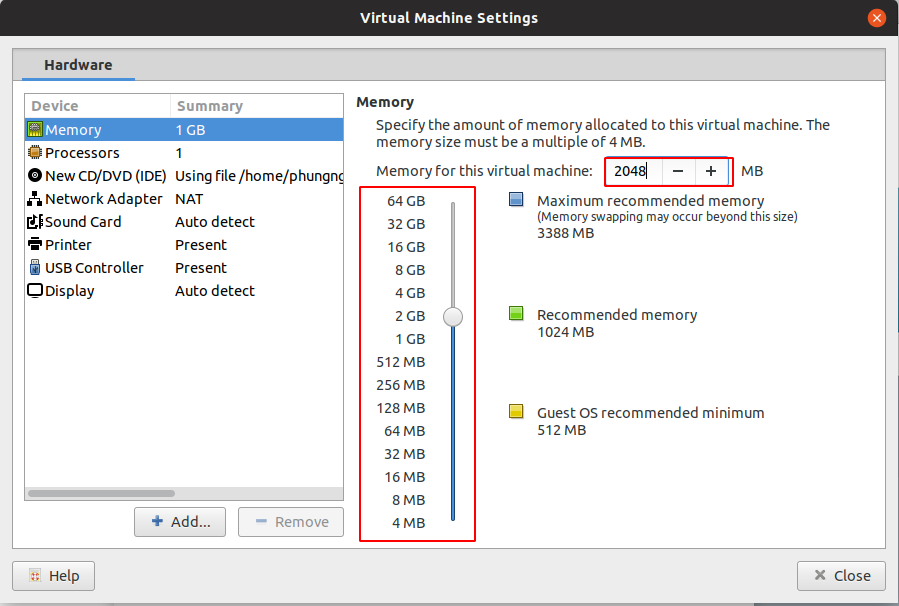

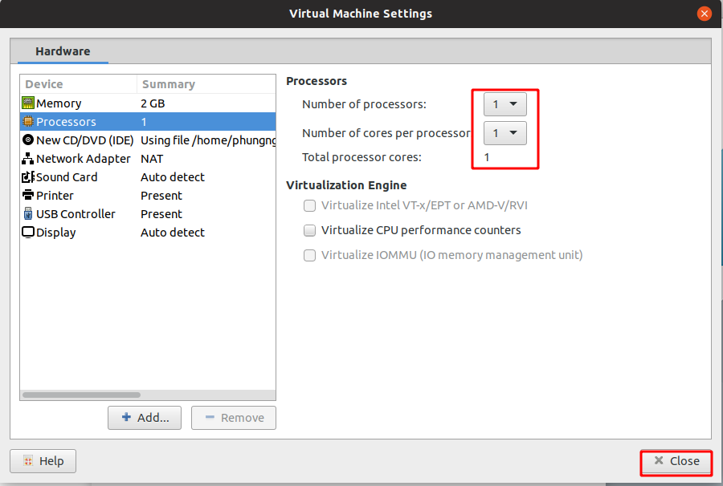

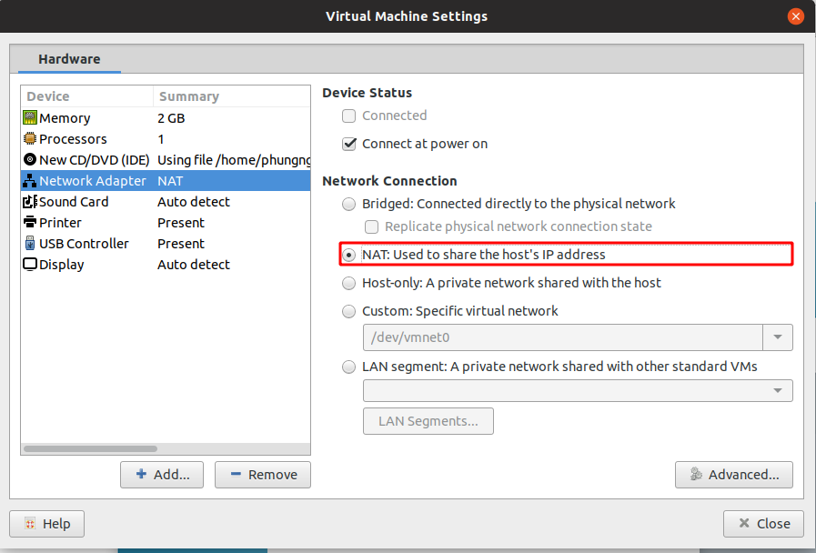

Ở đây có 3 cách chọn kiểu kết nối card mạng cho máy ảo là:
- Bridged : card trên máy ảo kết nối internet thông qua card mạng vật lí có chung lớp mạng với card.
- NAT (Network address translation) chỉ có thể giao tieeos với card NAT trên máy ảo khác, card NAT không thể giao tiếp với mạng vật lí. Nó thực hiện kĩ thuật NAT để kết nối ra ngoài.
- Host-only: máy ảo chỉ có thể giao tiếp với máy thật mà nó đang chạy chứ không truy cập ra ngoài mạng.

Khi đã thiết lập xong phàn cứng ta chọn Close để tiếp tục rồi Chọn Finish để bắt đầu cài đặt:

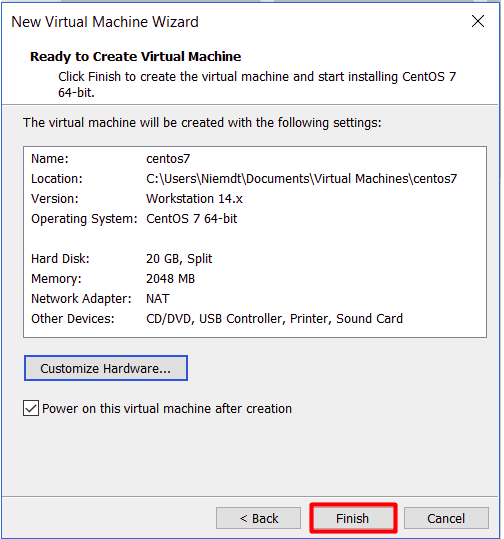

Đợi cài đặt rồi ,Chọn ngôn ngữ cho máy:

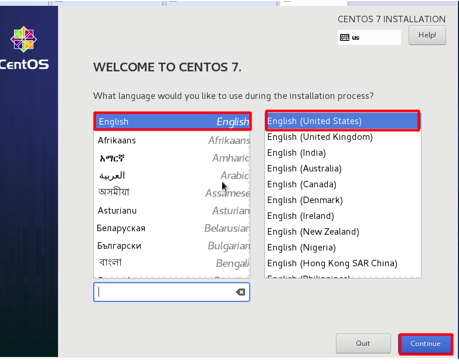

Chọn thành phố và cài ngày giờ. Chọn xong nhấn Done để qua bước tiếp theo

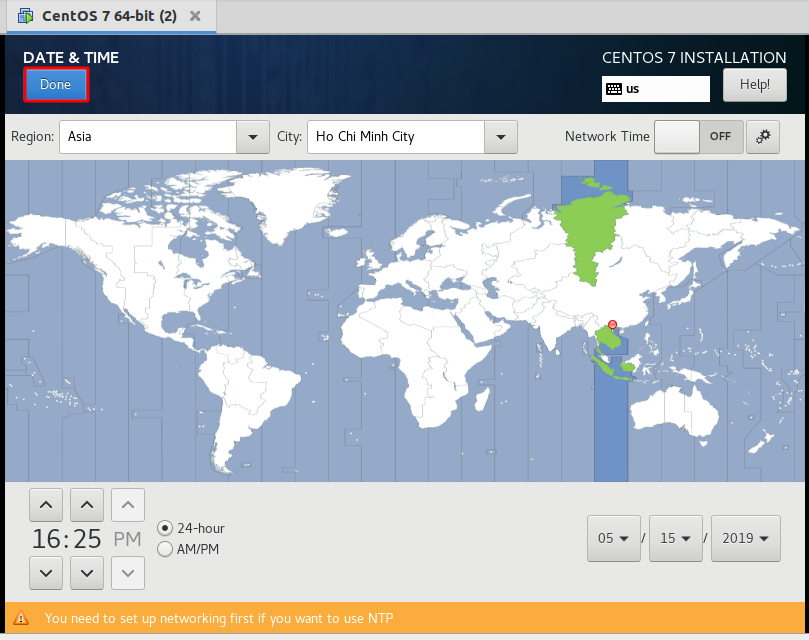

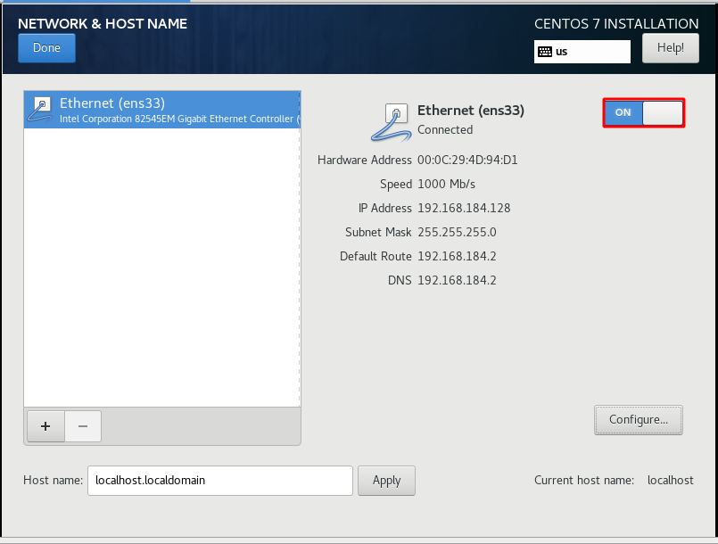

Đợi đến khi hiện lên Begin Install:

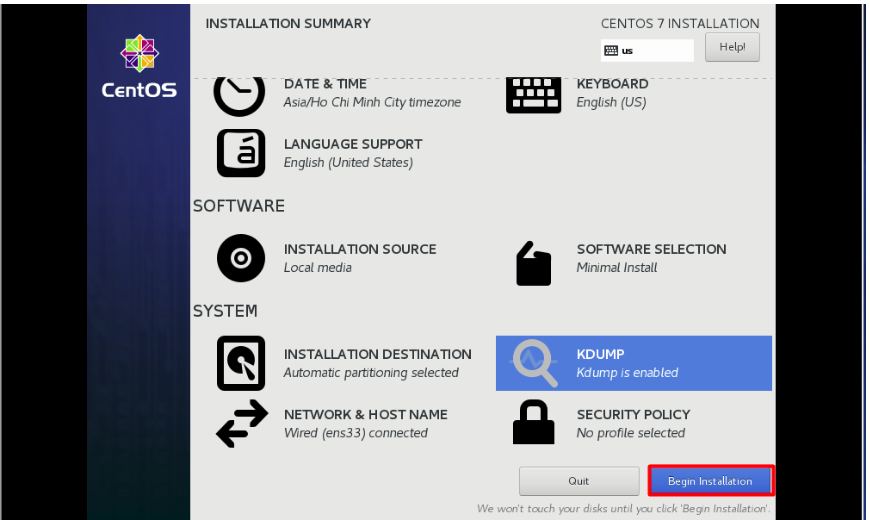

Chọn ROOT PASSWORD để đặt mật khẩu:

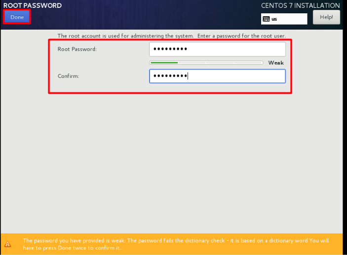

Nhấn Reboot để khởi động máy ảo,ta đã tạo thành công.
 
Chúc mọi người thành công!!

