# Cài đặt VMware trên ubuntu 
## B1:
 Mở Terminal gõ:  sudo apt-get install gcc build-essential -y

 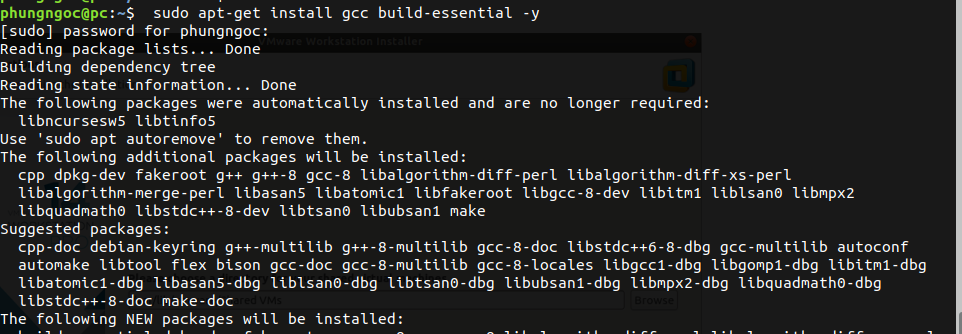

 ## B2: Tải phần mềm VMware Workstation 14 cho Ubuntu về máy
 ## B3: Truy cập đến nơi lưu phần mềm đã tải xuống ở bước 2 (Thư mục Download)
 - Thiết lập quyền thực thi trên file vừa tải về, trên Terminal gõ
chmod +x VMware-Workstation-Full-14.1.1-7528167.x86_64.bundle
- Cài đặt Vmware, trên Terminal gõ
sudo ./VMware-Workstation-Full-14.1.1-7528167.x86_64.bundle

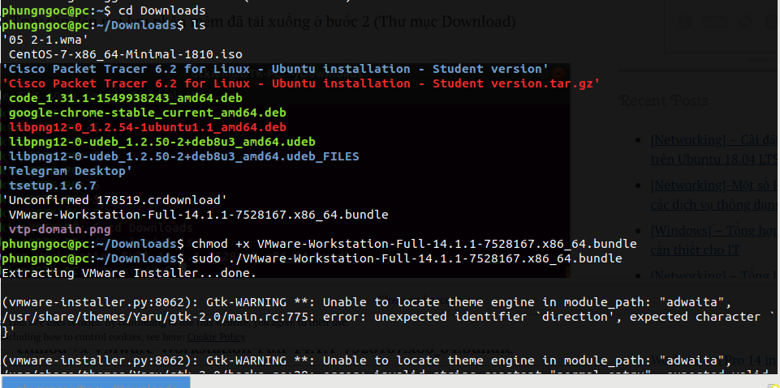

Bước tiếp theo cài đặt :

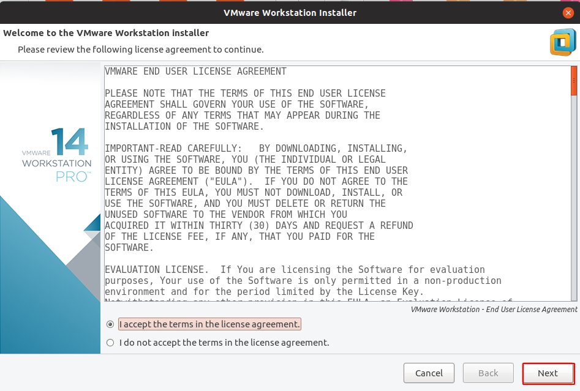

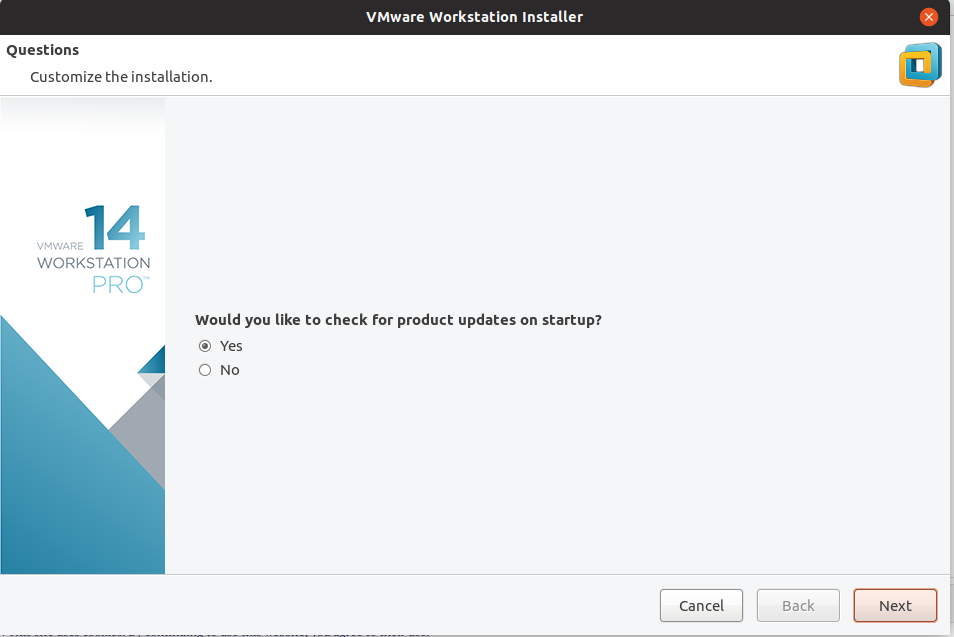

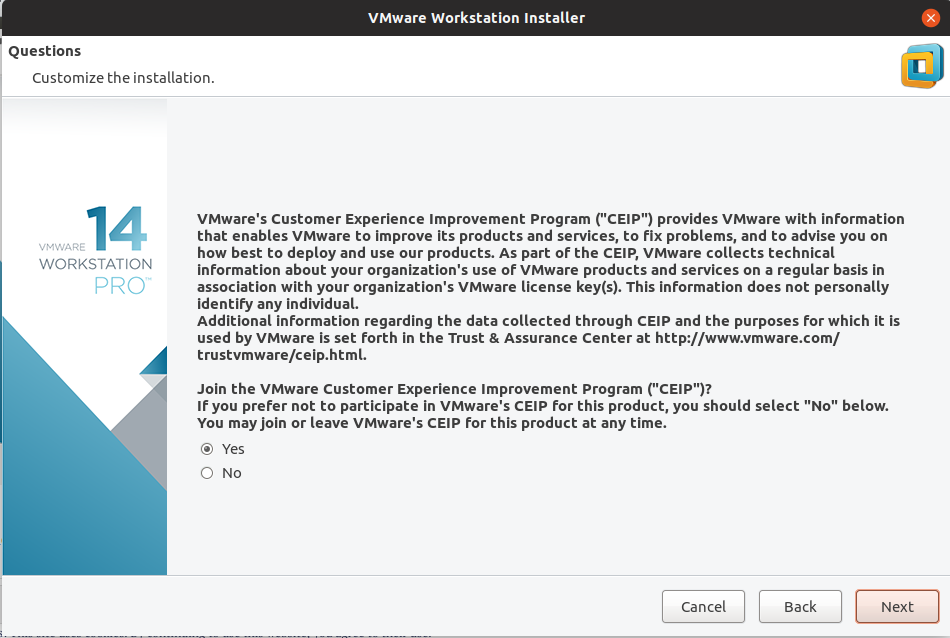

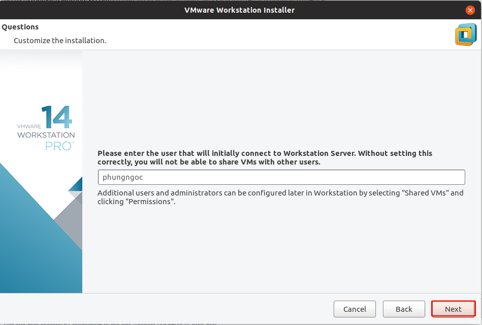  

Chọn nơi chứa phần mềm 

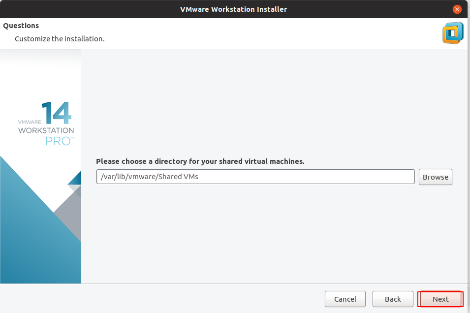  
 
 Port dùng để truy cập vào Workstation Sever

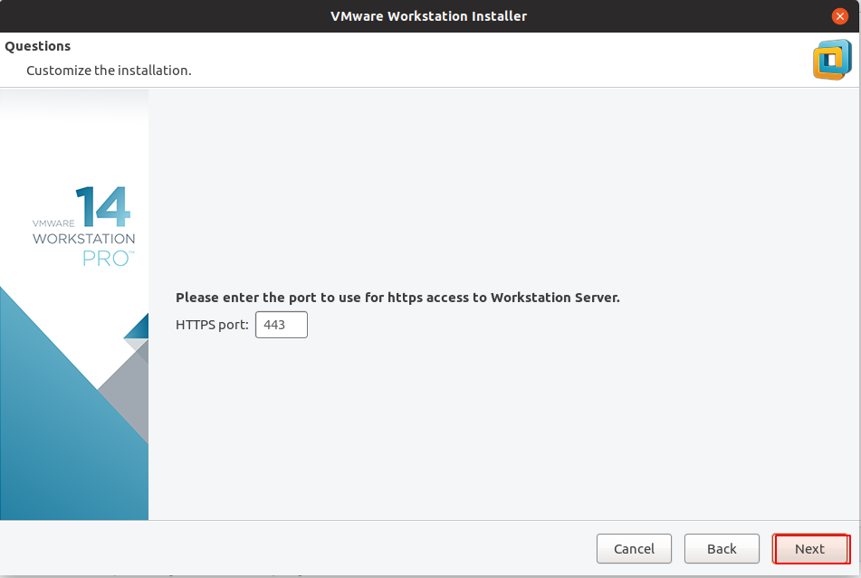

Điền 1 trong các Key sau

YZ35U-4PED5-M881Z-87WEV-NY2XA  
FC382-DFDDL-4801Q-KNYNT-YVAR6  
GA18K-DRXE3-488TZ-J4ZNX-PZAXA  
FF590-2DX83-M81LZ-XDM7E-MKUT4  
AF70K-DNWEQ-H8DPY-OXN7X-MCAUA

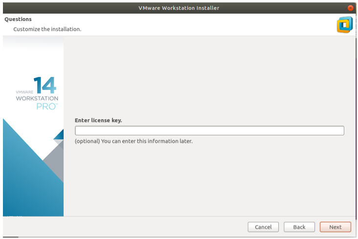

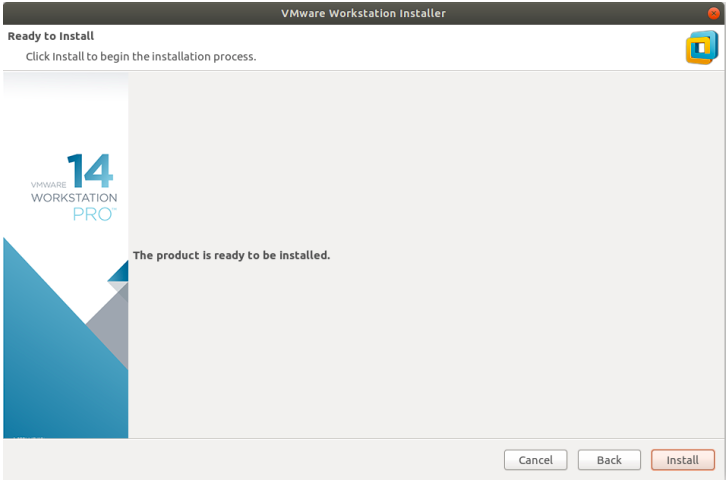

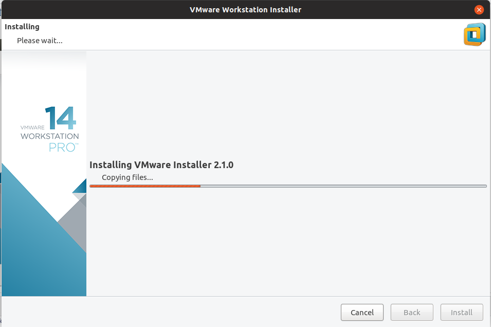

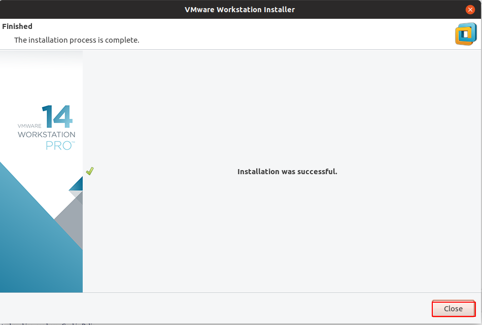

Giao diện phần mềm:

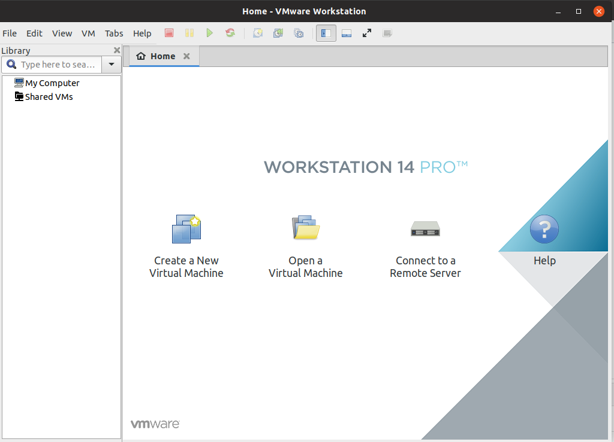

Chúc mọi người thành công!!
